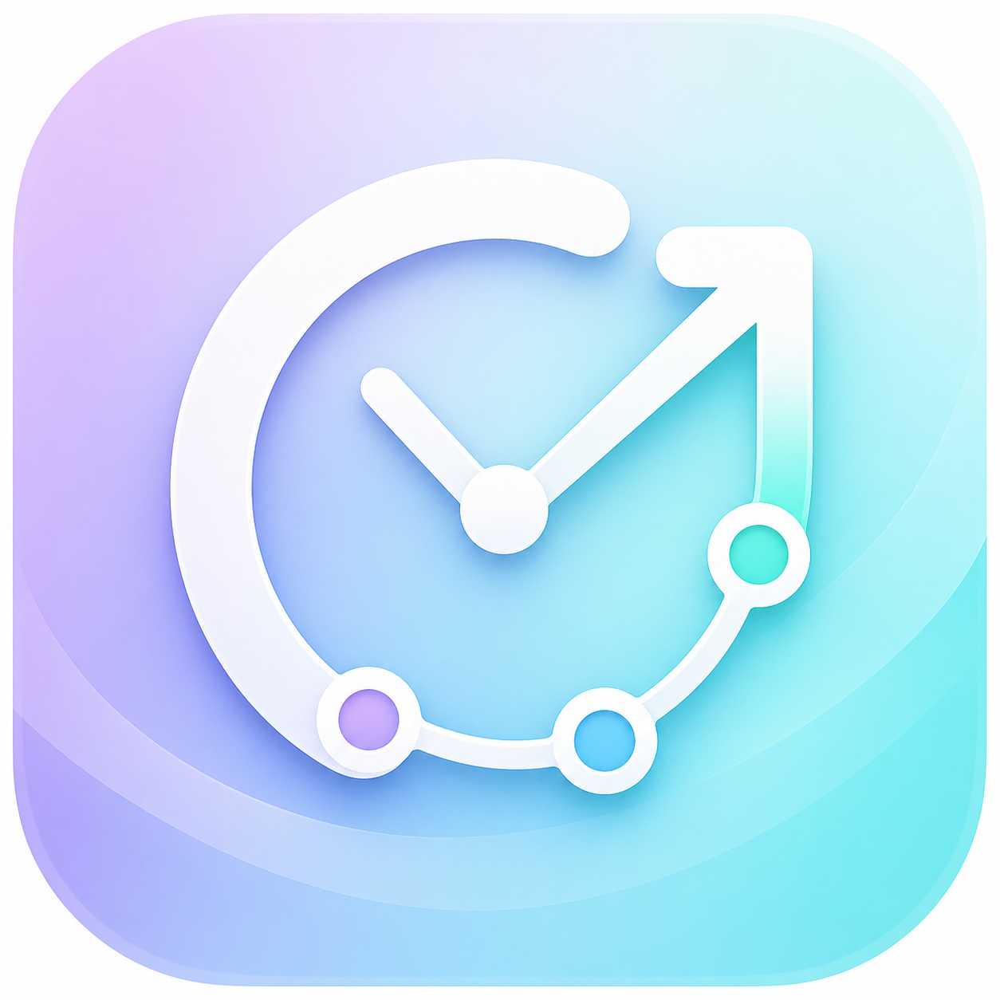
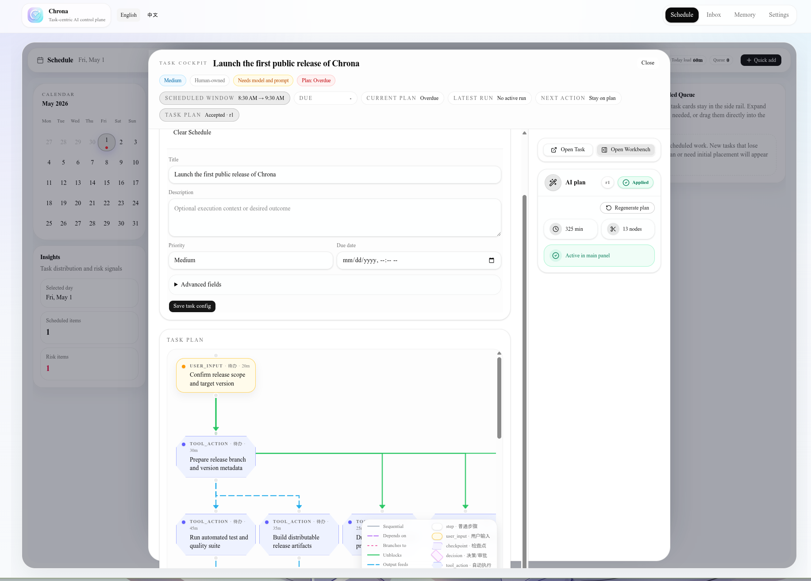
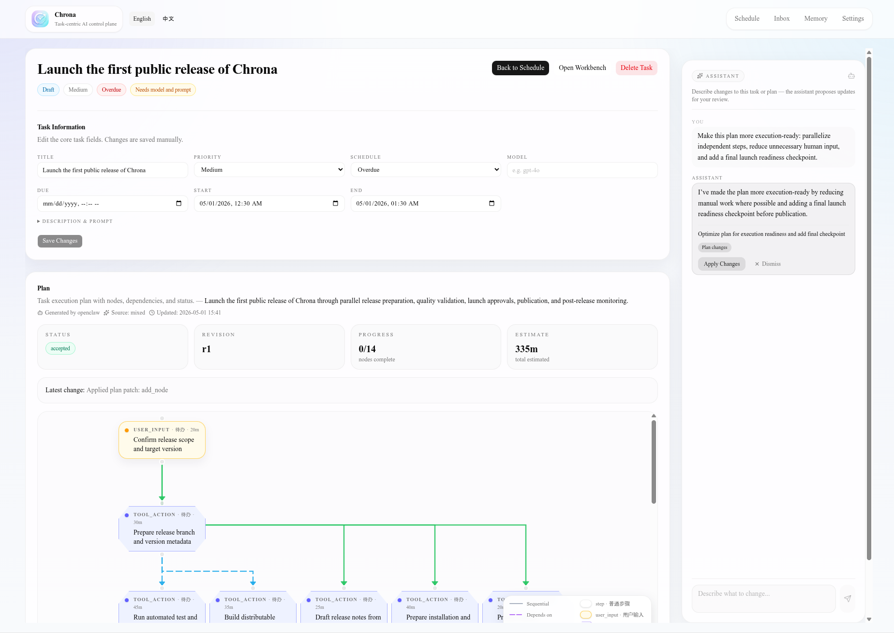

English | [中文](./README.zh.md)

<p align="center">
  
</p>

<p align="center">
  <h1 align="center">Chrona</h1>
  <p align="center"><strong>The control layer for AI-native work.</strong></p>
  <p align="center">
    From tasks to plans, from plans to schedules, and from schedules to agent execution across backends.
  </p>
</p>

<p align="center">
  <a href="#install">Install</a> ·
  <a href="#vision">Vision</a> ·
  <a href="#available-today">Available Today</a> ·
  <a href="#being-built">Being Built</a> ·
  <a href="#backend-ecosystem">Backend Ecosystem</a> ·
  <a href="#openclaw">OpenClaw</a>
</p>

<p align="center">
  
  
</p>

---

## Vision

AI is moving from answering questions to doing work.

But today, most tools are still fragmented:

- Todo apps record tasks, but do not understand how to complete them
- Calendars manage time, but do not understand what each task requires
- AI chats generate suggestions, but the output usually stays inside the
  conversation
- Agent runtimes can execute tasks, but lack personal task, plan, and schedule
  context

Chrona is built to connect these pieces.

```text
Task → Plan → Schedule → Execution
```

Chrona aims to become the control layer for AI-native work:

- You create a task
- Chrona generates a structured plan
- AI helps modify and refine that plan
- Chrona places the plan into your schedule
- At the right time, Chrona dispatches agents to execute the task
- If information is missing, Chrona pauses and asks you for input
- Once the missing context is provided, the task continues until completion

This is not another todo app.

Chrona is a system for continuously moving work forward.

---

## Current Status

Chrona has two layers:

```text
Chrona
├── Plan Layer       Available today
└── Execution Layer  Being built
```

### Plan Layer

The Plan Layer turns tasks into structured plans.

This is the core part of Chrona available today.

### Execution Layer

The Execution Layer makes plans actually run.

This is the next major stage of Chrona.

Chrona will analyze executable paths inside a plan, determine which steps can be
completed by AI, identify which steps require human input, and automatically
advance tasks when they are scheduled.

---

## Install

Download the binary for your platform from the latest release.

| Platform            | Binary                   |
| ------------------- | ------------------------ |
| macOS Apple Silicon | `chrona-darwin-arm64`    |
| macOS Intel         | `chrona-darwin-x64`      |
| Linux x64           | `chrona-linux-x64`       |
| Linux ARM64         | `chrona-linux-arm64`     |
| Windows x64         | `chrona-windows-x64.exe` |

macOS / Linux:

```bash
chmod +x chrona-darwin-arm64
./chrona-darwin-arm64 start
```

Windows:

```powershell
.\chrona-windows-x64.exe start
```

Then open:

```text
http://localhost:3101
```

> No global npm package, no manual frontend/backend startup. Download the binary
> for your platform and run it directly.

---

## Available Today

Chrona currently ships the Plan Layer.

You can use Chrona today to move from task to plan.

### Create Tasks

A task is the basic unit of work in Chrona.

It can be a concrete todo item or a rough goal.

For example:

```text
Rewrite the Chrona README so it clearly communicates the current product and future direction.
```

Chrona does not treat a task as a static checkbox.

A task is the entry point for generating, refining, and eventually executing a
plan.

### Generate Plans

Chrona can generate a structured plan from a task.

A rough task becomes a clear sequence of steps:

```text
1. Analyze the current README
2. Identify what Chrona already supports
3. Separate current capabilities from upcoming execution features
4. Rewrite the README hero section
5. Add install and backend configuration instructions
6. Review the document for clarity and overpromising
```

A plan turns a task from “something to do” into a path that can actually be
moved forward.

### Modify Plans with AI

After a plan is generated, you can keep refining it with AI.

For example:

```text
This plan feels too technical. Make it read more like a product introduction.
```

Or:

```text
Separate available features from features under development, but do not make the project sound too conservative.
```

Chrona updates the plan based on your feedback.

This makes the plan an editable work object, not a one-off AI response.

---

## Being Built

The next stage of Chrona is the Execution Layer.

This is where Chrona becomes a true control layer for AI-native work.

### Automatically Run Scheduled Tasks

Chrona will be able to start tasks based on your schedule.

For example:

```text
15:00 - 16:00 Rewrite Chrona README
```

When the scheduled time arrives, Chrona can enter the task context, load the
related plan, and prepare execution.

### Compute Executable Paths in a Plan

Chrona will analyze plan steps and determine which paths can be executed
automatically.

For example:

```text
1. Read the current README                    Can run automatically
2. Analyze issues in the current README        Can run automatically
3. Ask the user about product positioning      Requires human input
4. Rewrite the README based on positioning     Blocked by step 3
5. Check whether the README overpromises       Can run automatically
```

AI should not blindly execute the entire plan.

Chrona will reason about:

- Whether a step has enough context
- Whether user input is required
- Whether user confirmation is needed
- Whether the step depends on previous steps
- Whether a specific backend can complete the step

### Automatically Complete Steps Without Human Intervention

For paths that do not require human input, Chrona will advance the work
automatically.

Examples include:

- Reading files
- Summarizing code structure
- Analyzing documentation issues
- Drafting content
- Organizing candidate solutions
- Checking formatting
- Applying low-risk changes based on existing context

### Pause for Human Input

When required information is missing, Chrona should not make things up.

It should pause and clearly ask for what it needs.

For example:

```text
Need your input: Is the Chrona Execution Layer already able to run tasks automatically?
```

After the user provides the missing information, Chrona can continue the
remaining steps.

### Continue Unfinished Work

The problem with ordinary AI chat is that once the conversation ends, the work
often stops.

Chrona is designed for continuity.

When the user provides additional information, confirms an action, or adds new
context, Chrona can resume from the interruption point instead of starting over.

---

## Backend Ecosystem

Chrona should not be tied to a single model or agent runtime.

Its goal is to become the control layer above multiple AI execution backends.

### Currently Supported

Chrona currently supports:

| Backend           | Status    | Description                                         |
| ----------------- | --------- | --------------------------------------------------- |
| OpenAI-compatible | Supported | Works with OpenAI-compatible APIs                   |
| OpenClaw          | Supported | Connects Chrona to agent workflows through OpenClaw |

### Planned Support

Chrona plans to integrate with more AI coding and agent backends:

| Backend     | Status  | Goal                                         |
| ----------- | ------- | -------------------------------------------- |
| Claude Code | Planned | Connect to Claude Code workflows             |
| Codex       | Planned | Connect to Codex-style code execution        |
| opencode    | Planned | Connect to open-source coding agent runtimes |
| Hermes      | Planned | Connect to Hermes agent/backend capabilities |

Chrona’s long-term goal is not to become the UI for a single backend.

It is designed to become the unified task, plan, schedule, and execution control
layer above multiple backends.

You can think of Chrona as:

```text
              ┌──────────────┐
              │    Chrona    │
              │ Control Layer │
              └──────┬───────┘
                     │
     ┌───────────────┼────────────────┐
     │               │                │
OpenClaw      Claude Code          Codex
     │               │                │
  opencode        Hermes            ...
```

Different backends can execute different types of work.

Chrona manages:

- tasks
- plans
- schedules
- execution state
- human input
- continuation
- result tracking

---

## AI Backend Configuration

### OpenAI-compatible

Chrona can connect to OpenAI-compatible APIs.

This includes:

- OpenAI API
- Local or self-hosted OpenAI-compatible endpoints
- Other model services compatible with the OpenAI API format

Typical configuration:

```text
Base URL
API Key
Model
```

### OpenClaw

Chrona also supports OpenClaw as a backend.

OpenClaw is especially useful as an agent workflow backend and is an important
part of Chrona’s Execution Layer direction.

---

## OpenClaw

Before using OpenClaw with Chrona, make sure the OpenClaw Responses endpoint is
enabled.

Add the following to your OpenClaw configuration:

```json
{
  "gateway": {
    "http": {
      "endpoints": {
        "responses": {
          "enabled": true
        }
      }
    }
  }
}
```

Then open Chrona and go to:

```text
Settings → AI Clients
```

Add or enable the OpenClaw backend.

### Why Responses?

Chrona uses OpenClaw’s Responses capability to communicate with the backend.

If this endpoint is not enabled, Chrona may be able to connect to OpenClaw but
fail to use the related AI capabilities correctly.

### Future Assisted Setup

Chrona may provide automatic detection and assisted configuration in a future
release:

```bash
chrona openclaw doctor
chrona openclaw setup
```

Target experience:

```text
✓ OpenClaw binary found
✓ Gateway reachable
✗ Responses endpoint disabled

Run `chrona openclaw setup` to enable it.
```

`setup` can write the required configuration after user confirmation and back up
the original config file.

---

## Why Chrona?

AI tools are getting stronger, but workflows are still fragmented.

You may currently use:

- A todo app to record tasks
- A calendar to manage time
- An AI chat to discuss solutions
- A coding agent to execute code tasks
- A documentation system to record results

Chrona is built to connect these parts.

It is not another isolated AI tool.

It is a control system for AI-native workflows.

| Tool Type    | Main Capability                                                          | Limitation                                           |
| ------------ | ------------------------------------------------------------------------ | ---------------------------------------------------- |
| Todo App     | Records tasks                                                            | Does not understand task structure or generate plans |
| Calendar     | Manages time                                                             | Does not know how tasks should be completed          |
| AI Chat      | Generates suggestions                                                    | Hard to manage long-running task state               |
| Coding Agent | Executes code tasks                                                      | Lacks personal task, plan, and schedule context      |
| Chrona       | Unified control layer for tasks, plans, schedules, and backend execution | Execution Layer is being built progressively         |

---

## Roadmap

### Plan Layer

- [x] Create tasks
- [x] Generate plans
- [x] Modify plans with AI
- [x] OpenAI-compatible backend
- [x] OpenClaw backend

### Execution Layer

- [ ] Automatically start scheduled tasks
- [ ] Analyze executable paths in a plan
- [ ] Automatically execute steps that do not require human intervention
- [ ] Pause and request user input when information is missing
- [ ] Continue execution after user input is provided
- [ ] Visualize execution progress
- [ ] Write execution results back to tasks and plans

### Backend Ecosystem

- [x] OpenAI-compatible
- [x] OpenClaw
- [ ] Claude Code
- [ ] Codex
- [ ] opencode
- [ ] Hermes
- [ ] More agent runtimes

---

## Development

Run Chrona from source:

```bash
bun install
bun run dev
```

Build binaries:

```bash
bun run build:binaries
```

Project structure:

```text
apps/
  server/     API server
  web/        Web UI

packages/
  cli/        CLI tool
  common/     Shared utilities and AI feature surface
  contracts/  Shared DTOs, Zod schemas, API contracts
  db/         Database schema and migrations
  domain/     Pure business rules, state derivations
  providers/  AI provider adapters
  runtime/    Agent runtime integration

docs/
  architecture.md
  quick-start.md
```

---

## License

MIT
