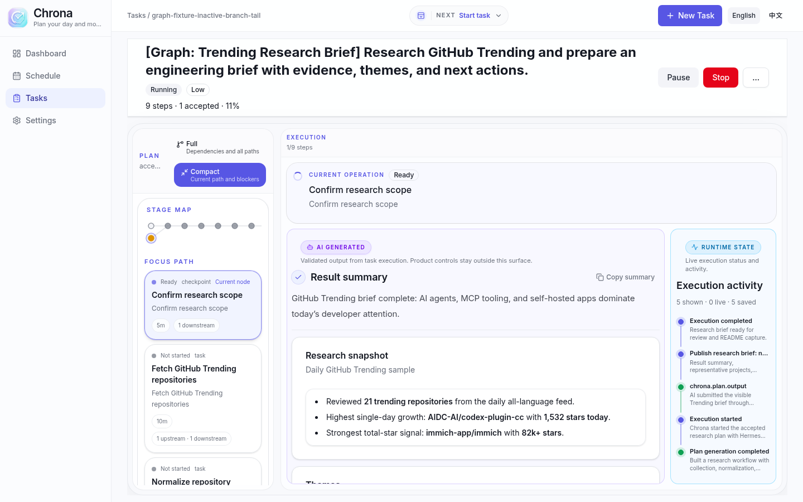
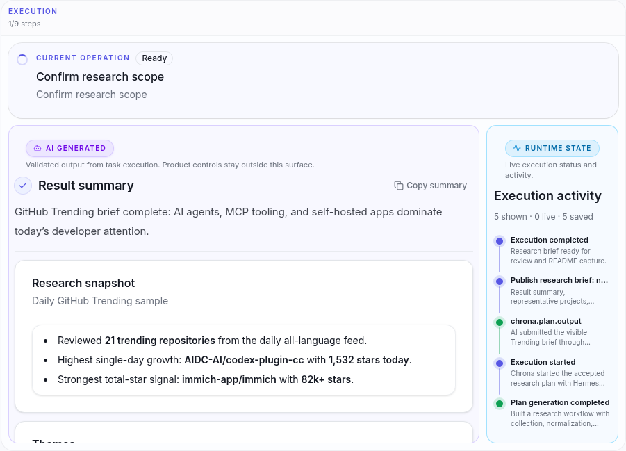

English | [中文](./README.zh.md)

<p align="center">
  
</p>

<h1 align="center">Chrona</h1>

<p align="center">
  <strong>Your to-do list, upgraded into AI-executable workflows.</strong>
</p>

<p align="center">
  Plan your work, schedule it, let AI help execute it, and inspect every step.
</p>

<p align="center">
  <a href="https://github.com/saya-ashen/Chrona/actions/workflows/ci.yml"></a>
  <a href="./LICENSE"></a>
  <a href="./package.json">= 1.3.11" src="https://img.shields.io/badge/bun-%3E%3D1.3.11-black" /></a>
</p>

<p align="center">
  <a href="#quick-start">Quick Start</a> ·
  <a href="#core-workflow">Workflow</a> ·
  <a href="#providers">Providers</a> ·
  <a href="#local-first-and-safety">Safety</a> ·
  <a href="#project-status">Status</a> ·
  <a href="./docs/en/quick-start.md">Full Guide</a> ·
  <a href="./docs/en/architecture.md">Architecture</a> ·
  <a href="./CONTRIBUTING.md">Contributing</a>
</p>
<p align="center">
  
  <br />
  <em>Decide what should happen, when it may run, and which boundaries must hold; Chrona plans, executes, pauses for decisions, and preserves the result.</em>
</p>

---

Chrona is a local AI work executor. You decide what should happen, when it may
run, and which boundaries must not be crossed. Chrona creates a reviewable plan,
runs it manually or on a schedule, pauses when your input or approval is needed,
and preserves evidence and results with the task.

Chrona connects four loops that usually live in separate tools:

```text
Task -> Plan -> Schedule -> Inspectable Execution
```

Use Chrona for:

- recurring research briefs and release preparation
- maintenance, follow-up tasks, and scheduled work that should move forward
- agent runs that need state, approvals, recovery, and persisted outputs

## Why Chrona

Calendars tell you what should happen. Task apps tell you what is pending. AI
chat can do work, but it usually loses schedule, state, and accountability.
Chrona combines those loops without pretending they are the same thing.

| If you need to...                           | Chrona gives you...                                                                       |
| ------------------------------------------- | ----------------------------------------------------------------------------------------- |
| Plan the day around real work               | tasks with priority, status, due dates, estimates, dependencies, and schedule metadata    |
| Turn a scheduled task into executable steps | AI-generated plan graphs that can be reviewed, patched, accepted, rerun, and traced       |
| Let due work move forward automatically     | schedule blocks, proposals, waiting states, task workspace approvals, and execution actions |
| Keep AI execution accountable               | scoped runtime refs, checkpoints, approvals, tool traces, failures, and persisted outputs |

## Quick Start

Chrona is Bun-only today. The source repository uses Bun as the runtime; npm
package installation is not currently supported for repository development.

### Download a release

Use this path if you want to run Chrona without cloning the repository.

1. Open the
   [latest GitHub release](https://github.com/saya-ashen/Chrona/releases/latest).
2. Download the archive for your platform:

| Platform            | Asset                        |
| ------------------- | ---------------------------- |
| Linux x64           | `chrona-linux-x64.tar.gz`    |
| Linux ARM64         | `chrona-linux-arm64.tar.gz`  |
| macOS Apple Silicon | `chrona-darwin-arm64.tar.gz` |
| Windows x64         | `chrona-windows-x64.tar.gz`  |

3. Extract the archive and start Chrona:

```bash
tar -xzf chrona-linux-x64.tar.gz
cd chrona-linux-x64
./chrona start
```

On Windows, run the packaged executable instead:

```powershell
tar -xzf chrona-windows-x64.tar.gz
cd chrona-windows-x64
.\Chrona.exe start
```

Open `http://localhost:3101` after the server starts.

### Run from source

Use this path if you want to develop Chrona or inspect the codebase.

```bash
git clone https://github.com/saya-ashen/Chrona.git
cd Chrona
bun install
bun run dev
```

Open `http://localhost:3101`. `bun run dev` starts the Bun/Hono API server and
the Vite web app.

## First Run

Explore Chrona without connecting a real provider:

1. Create tasks with enough context to act on later.
2. Build a schedule and inspect the Dashboard.
3. Open task workspaces to review plans, state, and outputs.

Enable AI execution when you are ready:

1. Go to `Settings -> AI Clients`, add the default OMP client, and run its configuration check. The check validates local SDK/model resolution only; the five-minute demo provider request is the proof of remote credentials and model access.
2. Bind only the feature slots shown for that provider. OMP supports planning and Goal review through one terminal-only read-only attempt; an uncertain interrupted start fails closed and needs an explicit new operation.
3. Generate a plan from the task workspace, review or edit the generated graph,
   then accept it.
4. Start execution manually from the task workspace, or let Chrona move
   scheduled work forward when auto-execution is configured.

See the [full quick start](./docs/en/quick-start.md) for data directories, AI
client details, and troubleshooting.

## Core Workflow

1. **Capture work** — create a task with priority, estimates, due dates,
   dependencies, and schedule metadata.
2. **Generate a plan** — turn rough context into a structured plan graph.
3. **Review before execution** — patch, accept, or rerun plans before they
   become executable task nodes.
4. **Run with state** — execute `task`, `checkpoint`, `condition`, and `wait`
   nodes manually, with AI assistance, or automatically when configured.
5. **Inspect and recover** — review approvals, tool activity, failures,
   blockers, persisted outputs, and next actions from the workspace.

<p align="center">
  
  <br />
  <em>Execution records stay attached to the task, including node state, tool activity, and output.</em>
</p>

## Providers

Chrona separates product workflow from execution providers. You configure
providers as AI clients, then bind those clients to Chrona features.

| Provider type | Status | Best for |
| --- | --- | --- |
| `omp` | Stable / Tier-1 | Default local SDK path for planning, Goal review, result finalization, execution, and dashboard briefs. Session history resumes where available; an uncertain terminal-only read-only start is never replayed automatically. |
| `claude_code` | Beta | CLI adapter; stable first-run conformance evidence is not yet complete |
| `codex` | Beta | ACP adapter; stable first-run conformance evidence is not yet complete |
| `hermes` | Experimental | Existing gateway adapter; setup and stable conformance remain incomplete |

Configure providers in `Settings -> AI Clients`, then bind the client only to
its displayed Chrona features. Planning/review accepts authoritative cross-process recovery or OMP's explicit terminal-only read-only single attempt; the latter fails closed instead of replaying an uncertain start.

For provider fields, defaults, and troubleshooting, use the
[full quick start](./docs/en/quick-start.md).

## Local-first and Safety

Chrona is designed to start local and explicit.

| Area | Default / behavior |
| --- | --- |
| Storage | SQLite. Source development defaults to `file:./prisma/dev.db`; packaged releases use the platform data directory unless overridden. |
| Network binding | `HOST` defaults to local-only `127.0.0.1`. |
| API auth | `API_KEY` is optional for local development; set it before exposing `/api/*` beyond localhost. |
| CORS | `ALLOWED_ORIGINS` can restrict browser origins when web and API are split. |
| Provider scope | AI workers receive scoped runtime refs and Chrona control tools instead of raw internal database IDs. |
| Automatic execution | Requires explicit provider/feature configuration and remains visible through task workspace state, approvals, blockers, and run records. |

## Features

- **Real schedules** — tasks carry priority, estimates, due dates,
  dependencies, and schedule metadata.
- **Editable plan graphs** — generated plans can be reviewed, patched, accepted,
  rerun, and materialized into typed graph nodes.
- **Graph-based execution** — `task`, `checkpoint`, `condition`, and `wait`
  nodes support manual, assisted, and automatic work.
- **Due-work recovery** — schedule views, AI insights, conflict suggestions,
  proposals, waiting runs, failed runs, cancelled runs, and approvals keep the
  next action visible.
- **Observable AI work** — provider runs receive safe runtime refs instead of
  internal database IDs. They report progress through Chrona tools such as
  `chrona_node_complete`, `chrona_condition_select`, `chrona_node_block`,
  `chrona_node_fail`, and `chrona_wait_complete`. Conversation history, tool
  traces, and persisted outputs stay attached to the task.

## Project Status

> [!WARNING]
> Chrona is alpha software: local-first, Bun-only, and under active development.

Chrona is usable for local development and product exploration, but it is not
stable software yet. Task, plan, schedule, execution, recovery, result review,
and AI-client flows work locally. Provider replay/resume, complete cross-run
result history, production authentication, and operational hardening remain
experimental or incomplete.

## Roadmap

This is a short maturity summary. See the full
[roadmap](./docs/en/roadmap.md) for the source of truth.

| Area | Availability | Maturity | Notes |
| --- | --- | --- | --- |
| Task foundation | Available | Usable | Task create/update/delete, completion/reopen, status, priority, labels, dependencies, parent/child relationships, and projections. |
| Schedule surfaces | Available | Usable, polishing | Timeline/task views, AI insights, conflicts, schedule proposals, task creation, and configuration surfaces. |
| Plan generation | Available | Experimental | Streaming AI plan generation, persistence, review/edit/accept flows, and materialization into graph nodes. |
| Execution runtime | Available | Experimental | Executable `task`, `checkpoint`, `condition`, and `wait` nodes with AI-visible refs and persisted state. |
| Review loops | Available | Experimental | Dashboard and task workspace surfaces for pending approvals, schedule proposals, waiting inputs, and failed/cancelled runs. |
| External calendars | Available | Early | Read-only calendar subscriptions, imported busy events, source management, refresh status, and schedule context. |
| Polish existing flows | In progress | Active | Make Dashboard, Schedule, Task Workspace, and execution records more reliable and easier to understand. |
| Reliable auto execution | In progress | Not stable | Start due scheduled work only when configured and safe, with clear recovery when execution blocks or fails. |
| More providers | In progress | Experimental | Add provider integrations while keeping provider boundaries explicit. |
| Multi-session execution | Planned | Not available | Add isolation, reuse, recovery, and diagnostics across multiple sessions. |
| Production readiness | Planned | Not ready | Authentication, backup/restore, deployment docs, migration safety, observability, and operational runbooks. |

## Architecture

Chrona is a Vite + Hono monorepo running on Bun with SQLite persistence.

```text
React SPA
  -> Hono API server
  -> Chrona engine
      -> task / plan / schedule / projection modules
      -> graph-runtime execution state
      -> Prisma + SQLite persistence
      -> AI clients and provider adapters
```

| Area                                 | Path                      |
| ------------------------------------ | ------------------------- |
| Web app                              | `apps/web/`               |
| API server                           | `apps/server/`            |
| CLI and binary entrypoints           | `packages/cli/`           |
| Shared schemas and runtime contracts | `packages/contracts/`     |
| Database layer                       | `packages/db/`            |
| Product engine                       | `packages/engine/`        |
| Plan graph runtime                   | `packages/graph-runtime/` |
| Provider adapters                    | `packages/providers/`     |

Read the [architecture guide](./docs/en/architecture.md),
[data model](./docs/en/data-model.md), and
[backend execution flow](./docs/en/backend-execution-flow.md) for deeper design
notes.

## Configuration

Copy `.env.example` if you want local overrides.

| Variable            | Purpose                                    | Default / note                                                                                              |
| ------------------- | ------------------------------------------ | ----------------------------------------------------------------------------------------------------------- |
| `DATABASE_URL`      | SQLite database URL                        | source default: `file:./prisma/dev.db`; packaged releases use the platform data directory unless overridden |
| `HOST`              | API server bind host                       | defaults to local-only `127.0.0.1`                                                                          |
| `PORT`              | API server port                            | `3101`                                                                                                      |
| `API_KEY`           | Optional bearer token for `/api/*` routes  | omit for local-only development                                                                             |
| `CHRONA_WEB_DIST`   | Built web app directory for static serving | `apps/web/dist`                                                                                             |
| `ALLOWED_ORIGINS`   | Comma-separated CORS allowlist             | omit for local development                                                                                  |
| `VITE_API_BASE_URL` | Frontend API base URL override             | useful when web and API are split                                                                           |

AI clients are configured in the web app under `Settings -> AI Clients`. See
[Providers](#providers) for supported provider types and Claude Code/Codex setup.

## FAQ

### Can I use Chrona without an AI provider?

Yes. You can create tasks, schedule work, inspect the dashboard, and use task
workspaces without an AI provider. Real AI plan generation and agent execution
require a configured AI client. Use OMP for the primary stable local planning and execution path; Claude Code and Codex remain Beta.

### Is Chrona production-ready?

No. Chrona is usable for local development and product exploration, but runtime
contracts, provider behavior, and auto-execution flows are still changing.

### Where does Chrona store data?

Source development defaults to `file:./prisma/dev.db`. Packaged releases use the
platform data directory unless `DATABASE_URL` overrides it.

### Does automatic execution run silently?

No. Automatic execution requires provider/feature configuration and remains
visible through task workspace state, approvals, blockers, activity, and run
records.

## Development

Chrona requires Bun `>=1.3.11` for repository development.

```bash
bun install
bun run dev              # full development stack
bun run typecheck        # TypeScript
bun run lint             # ESLint
bun run test             # Vitest
bun run test:bun         # Bun-native tests
bun run test:api         # API tests
bun run test:e2e         # Playwright E2E tests
```

Before larger changes, also run:

```bash
bun run check:ui-foundation
bun run check:boundaries
bun run analyze
```

See [CONTRIBUTING.md](./CONTRIBUTING.md) for setup, code style, boundary rules,
schema-first contract rules, and testing expectations.

## Documentation

| Topic                  | Document                                                               |
| ---------------------- | ---------------------------------------------------------------------- |
| Documentation index    | [docs/README.md](./docs/README.md)                                     |
| Quick start            | [English](./docs/en/quick-start.md) / [中文](./docs/zh/quick-start.md) |
| Architecture           | [docs/en/architecture.md](./docs/en/architecture.md)                         |
| API reference          | [docs/en/api-reference.md](./docs/en/api-reference.md)                       |
| Data model             | [docs/en/data-model.md](./docs/en/data-model.md)                             |
| Backend execution flow | [docs/en/backend-execution-flow.md](./docs/en/backend-execution-flow.md)     |
| Provider boundary      | [docs/en/provider-boundary.md](./docs/en/provider-boundary.md)               |
| Package boundaries     | [docs/en/package-boundaries.md](./docs/en/package-boundaries.md)             |
| Roadmap                | [English](./docs/en/roadmap.md) / [中文](./docs/zh/roadmap.md)         |
| Privacy and local data | [docs/en/privacy.md](./docs/en/privacy.md)                             |
| Security               | [SECURITY.md](./SECURITY.md)                                           |
| Code of Conduct        | [CODE_OF_CONDUCT.md](./CODE_OF_CONDUCT.md)                             |

## Contributing

Contributions are welcome. Start with [CONTRIBUTING.md](./CONTRIBUTING.md), run
the relevant checks, and keep behavior covered by tests when changing task,
schedule, execution, or navigation flows.

## License

MIT
