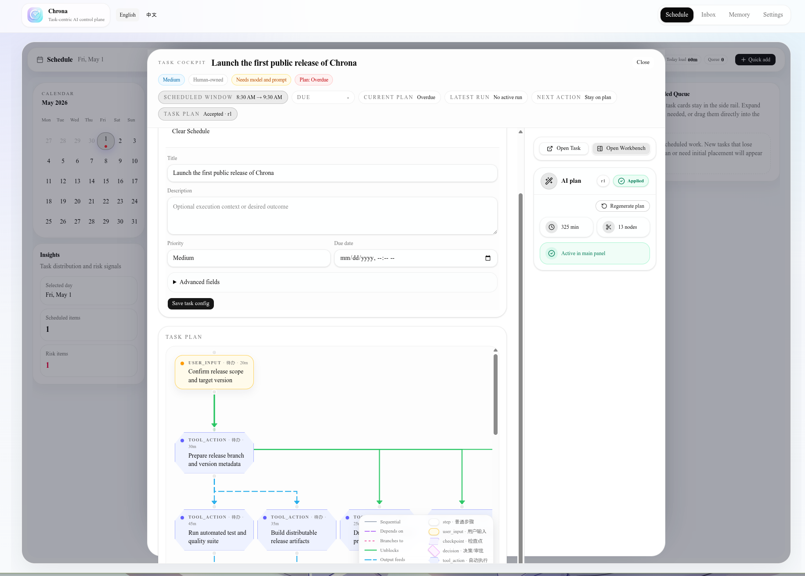
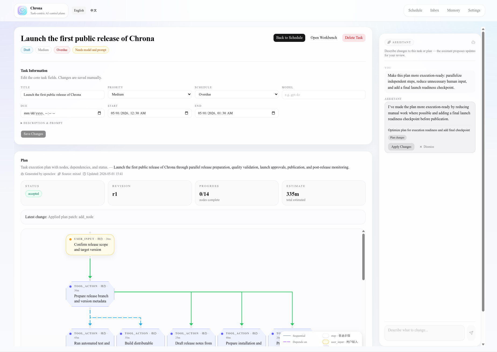

English | [中文](./README.zh.md)

<p align="center">
  
</p>

<p align="center">
  <h1 align="center">Chrona</h1>
  <p align="center"><strong>AI-native task control plane for planning, scheduling, and executing work.</strong></p>
  <p align="center">
    Chrona turns rough intent into structured tasks, plan graphs, schedule blocks, and observable AI execution.
  </p>
</p>

<p align="center">
  <a href="#quick-start">Quick Start</a> ·
  <a href="#what-chrona-is">Positioning</a> ·
  <a href="#core-features">Core Features</a> ·
  <a href="#architecture-overview">Architecture</a> ·
  <a href="#configuration">Configuration</a> ·
  <a href="#documentation">Docs</a>
</p>

<p align="center">
  
  
</p>

---

## What Chrona Is

Chrona is a local-first workbench for AI-native work. It connects four layers that are usually split across separate tools:

```text
Task → Plan → Schedule → Execution
```

Chrona is not just a todo list, calendar, or chat UI. It is a control plane that keeps work state explicit:

- tasks hold the user-facing unit of work, priority, status, tags, dependencies, parent/child relationships, schedule metadata, and results
- plans turn tasks into typed graph nodes that can be edited, accepted, and executed
- schedules place work into time blocks and surface conflicts or suggestions
- execution runs the graph through AI-visible refs, checkpoint/wait states, human approvals, tool traces, and persisted outputs

The product goal is simple: move work out of disposable AI chats and into a durable task, plan, schedule, and execution system that can pause, resume, and explain what happened.

## Quick Start

Chrona uses Bun and SQLite.

### Run from source

```bash
bun install
bun run dev
```

Then open the web app:

```text
http://localhost:3101
```

`bun run dev` starts the Bun/Hono API server and the Vite web app for local development. For server-only operation, use:

```bash
bun run server:start
```

### Binary / packaged builds

The repository also contains scripts for building standalone platform binaries:

```bash
bun run build:binaries
```

Release assets are expected to use these target names:

| Platform | Binary |
| --- | --- |
| macOS Apple Silicon | `chrona-darwin-arm64` |
| macOS Intel | `chrona-darwin-x64` |
| Linux x64 | `chrona-linux-x64` |
| Linux ARM64 | `chrona-linux-arm64` |
| Windows x64 | `chrona-windows-x64.exe` |

Example for macOS/Linux:

```bash
chmod +x chrona-linux-x64
./chrona-linux-x64 start
```

Use the binary matching your platform.

## Core Features

### Task management

Chrona supports task creation, update, completion, reopening, deletion, status, priority, tags, due dates, estimates, dependencies, parent/child tasks, schedule metadata, and result acceptance.

### AI plan generation and editing

A rough task can become a structured plan blueprint. Chrona materializes accepted plans into persisted task plan layers and graph nodes. Plans can be regenerated or patched instead of remaining one-off assistant text.

### Graph-based execution

Plan execution is modeled as a graph, not a plain checklist. Supported node types include:

- `task`
- `checkpoint`
- `condition`
- `wait`

Execution nodes can be manual, assisted, or automatic, and can be assigned to user, AI, or system executors.

### AI-visible node runtime

AI workers receive safe refs instead of internal database IDs. Node workers report progress with Chrona tools such as:

- `chrona.task.complete`
- `chrona.condition.select`
- `chrona.node.block`
- `chrona.node.fail`
- `chrona.wait.complete`

This lets Chrona own the real task, plan, graph, run, and node IDs while external agents only see scoped runtime refs.

### Work page

The Work page provides the live task workbench: latest result, plan graph, execution record, task information, right-side rail/inspector, conversation history, tool/activity traces, and a composer dock for continuing work.

### Task workspace

The task workspace supports task editing, AI plan generation, plan acceptance, execution overview, node details, and human review states.

### Schedule and inbox

Chrona includes a schedule page with timeline/task views, AI insights, conflict and automation suggestions, task creation, and schedule proposal handling. The inbox aggregates pending approvals, schedule proposals, waiting runs, failed runs, and cancelled runs.

### Memory console

The memory console exposes workspace/task memory entries so long-running work can keep useful context beyond a single chat session.

### Assistant surfaces

Chrona includes a global AI sidebar and page-aware assistant surfaces for task, schedule, and workbench flows.

### AI client management

AI clients are managed in the database and configured from `Settings → AI Clients`. Feature bindings decide which client powers capabilities such as suggestions, plan generation, chat, dispatch, node execution, condition evaluation, and checkpoint review.

## Architecture Overview

Chrona is a Bun + React monorepo.

```text
apps/
  web/        Vite + React 19 + React Router 7 SPA
  server/     Hono API server on Bun

packages/
  cli/        Chrona CLI and binary entrypoints
  contracts/  API schemas, AI feature specs, plan runtime types, SSE events, MCP tool schemas
  db/         Prisma 7 + SQLite database layer
  domain/     Pure business rules and projections
  engine/     Task, plan, execution, scheduling, page projection, and AI-client services
  graph-runtime/ Graph construction, resolution, transition commands, and execution state
  i18n/       Localized messages
  providers/  Provider foundation, Hermes provider, debug provider
  runtime-core/ Runtime abstractions
  shared/     Shared utilities

external-plugins/
  hermes/     Hermes external plugin integration
```

Runtime shape:

```text
Web UI
  ↓ /api/*
Hono server
  ↓
Chrona engine
  ├─ task / plan / schedule / projection modules
  ├─ graph-runtime execution state
  ├─ Prisma SQLite persistence
  └─ AI clients
       ├─ LLM clients for OpenAI-compatible model APIs
       └─ Hermes provider client for agent-style runs
```

Important API groups include:

- `/api/health`
- `/api/tasks` and `/api/tasks/:taskId`
- `/api/tasks/:taskId/plan`, `/plan/accept`, `/plan/generations`, `/plan/generations/active/events`, `/plan/generations/stop`, and plan patch operations
- `/api/tasks/:taskId/execution/current`
- `/api/tasks/:taskId/execution/actions`
- `/api/tasks/:taskId/execution/checkpoint/:checkpointId/actions`
- `/api/tasks/:taskId/schedule`
- `/api/schedule`, `/api/inbox`, `/api/memory`, `/api/work/:taskId`, `/api/work/:taskId/events`, `/api/work/:taskId/commands`
- `/api/workspaces`, `/api/workspaces/default`, `/api/workspaces/:workspaceId/overview`
- `/api/runtime/providers`
- `/api/ai/clients`, `/api/ai/clients/test`, `/api/ai/clients/:clientId`, `/api/ai/clients/:clientId/bindings`
- `/api/assistant-surface` and `/api/assistant-surface/actions`
- MCP endpoints for Chrona tool execution

## Configuration

### Environment variables

Copy `.env.example` if you want local overrides.

| Variable | Purpose | Default / note |
| --- | --- | --- |
| `DATABASE_URL` | SQLite database URL | development default: `file:./prisma/dev.db`; Docker production: `file:/data/chrona.db`; CLI binary: OS data dir `chrona.db` |
| `HOST` | API server bind host | defaults to local-only `127.0.0.1` |
| `PORT` | API server port | `3101` |
| `CHRONA_WEB_DIST` | Built web app directory for server/static mode | `apps/web/dist` |
| `ALLOWED_ORIGINS` | Comma-separated CORS allowlist | omit for permissive local development |
| `API_KEY` | Optional bearer token for all `/api/*` routes | if set, use `Authorization: Bearer <key>` |
| `CHRONA_UNSAFE_PUBLIC_BIND` | Explicit override required for unauthenticated public bind | set only when you understand the exposure |
| `VITE_API_BASE_URL` | Frontend API base URL override | useful when web and API are split |

### Database

Common database commands:

```bash
bun run db:generate
bun run db:seed
bun run db:push
bun run db:migrate
```

`bun run setup` runs Prisma client generation and seed data when schema or dependency changes require it. On NixOS, Prisma may require custom engine configuration or `PRISMA_ENGINES_CHECKSUM_IGNORE_MISSING=1` because upstream checksum files can be unavailable for the `linux-nixos` engine target.

Production SQLite data should live outside the application bundle. Docker uses `/data/chrona.db` and should mount `/data` as a persistent volume. Released CLI binaries create `chrona.db` under the platform data directory unless `DATABASE_URL` is set explicitly.

### AI clients

Configure AI clients in the web app at:

```text
Settings → AI Clients
```

Supported client types in the current codebase:

| Type | Use |
| --- | --- |
| `llm` | OpenAI-compatible model APIs; configure base URL, API key, model, and optional temperature |
| `hermes` | Hermes Agent provider gateway; configure base URL, optional API key, and timeout |
| `debug` | Local debug provider for development/test flows |

The Hermes provider client defaults to `http://127.0.0.1:8642` when no base URL is provided and talks to provider endpoints such as `/v1/capabilities`, `/v1/runs`, and `/v1/runs/{run_id}/events`.

## Development Commands

```bash
bun run dev              # development server stack
bun run dev:web          # Vite web dev server only
bun run server:start     # Bun/Hono server only
bun run typecheck        # TypeScript check
bun run lint             # ESLint
bun run test             # Vitest
bun run test:bun         # Bun tests
bun run test:api         # API tests
bun run test:e2e         # Playwright E2E tests
bun run check:ui-foundation
bun run check:boundaries
bun run analyze
```

## Documentation

Start here:

| Topic | Document |
| --- | --- |
| Documentation index | [docs/README.md](./docs/README.md) |
| Quick start | [docs/en/quick-start.md](./docs/en/quick-start.md) / [docs/zh/quick-start.md](./docs/zh/quick-start.md) |
| Architecture | [docs/architecture.md](./docs/architecture.md) |
| API reference | [docs/api-reference.md](./docs/api-reference.md) |
| Data model | [docs/data-model.md](./docs/data-model.md) |
| Backend execution flow | [docs/backend-execution-flow.md](./docs/backend-execution-flow.md) |
| Provider boundary | [docs/provider-boundary.md](./docs/provider-boundary.md) |
| Package boundaries | [docs/package-boundaries.md](./docs/package-boundaries.md) |
| Roadmap | [docs/en/roadmap.md](./docs/en/roadmap.md) / [docs/zh/roadmap.md](./docs/zh/roadmap.md) |

More entrypoints:

- [English docs](./docs/en/README.md)
- [中文文档](./docs/zh/README.md)
- [Engine package README](./packages/engine/README.md)
- [Graph runtime README](./packages/graph-runtime/README.md)
- [External plugins README](./external-plugins/README.md)
- [Hermes plugin README](./external-plugins/hermes/README.md)

## License

MIT
