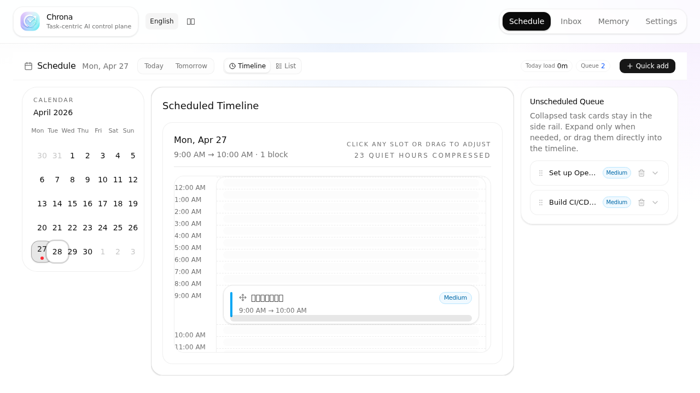
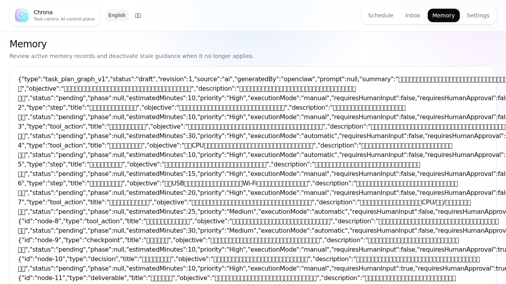
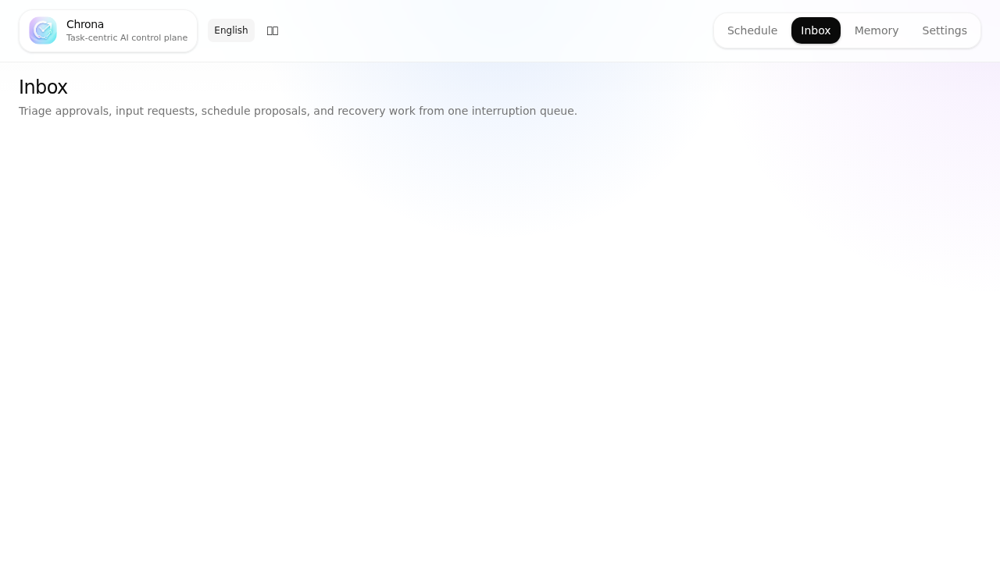
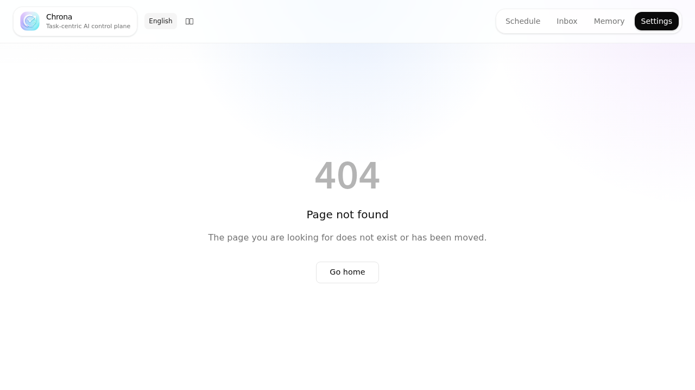

[English](./README.md) | [中文](./README.zh.md)

<p align="center">
  <h1 align="center">Chrona</h1>
  <p align="center">AI 原生任务控制面 — 将任务拆解、日程规划与 AI 代理执行连接成一个连续工作流。</p>
</p>

<p align="center">
  <a href="https://www.npmjs.com/package/@chrona-org/cli"></a>
  <a href="https://www.npmjs.com/package/@chrona-org/cli"></a>
  <a href="./LICENSE"></a>
  <a href="https://bun.sh/">= 1.3.11"></a>
</p>

---

Chrona 是一个 AI
原生任务控制面，用来把模糊的任务想法转化为可执行计划，并将计划连接到日程和 AI
代理运行。

你可以描述一项工作，让 Chrona
生成分步执行计划，在日历上安排时间，并在合适的时候运行 AI
代理辅助完成任务。Chrona 本地优先运行，基于 SQLite
存储，并通过提供商无关的适配层接入不同 AI 运行时，例如 OpenClaw、LLM
后端，以及未来的 Hermes / Opencode。

## Chrona 的核心差异

Chrona 不是一个普通的 Todo List，也不是一个孤立的 AI Chat
窗口。它关注两个核心问题：

1. AI 如何基于个人上下文生成真正可执行的计划；
2. 计划如何进一步连接到日程，并在合适的时候交给 AI 代理执行。

### 1. 基于个人上下文的 AI 计划生成

传统任务管理器要求用户手动拆解任务；普通 AI
对话通常只根据当前提示生成一次性清单。Chrona
的目标是生成更贴近个人工作方式的执行计划。

Chrona 可以结合任务描述、已有日程、最近工作上下文、历史任务、运行时
Skills、智能体记忆以及可用工具，生成带有步骤、依赖、检查点和人工介入点的计划图。这样生成的不是一份通用
checklist，而是一份更适合当前用户、当前项目和当前时间安排的执行计划。

### 2. 面向自动执行的任务系统

Chrona 的长期目标不是只提醒用户做什么，而是让计划能够被执行。

当任务被拆解并排入日程后，Chrona 可以将计划连接到 AI
代理运行。系统会区分哪些步骤可以安全自动执行，哪些步骤需要用户输入、确认或审批。未来，Chrona
将支持按照日程自动触发代理运行，优先完成无需人为干预的步骤，并只在真正需要判断、授权或补充信息时打断用户。

> 自动执行能力仍在开发中。当前 Chrona
> 更强调计划生成、排程驾驶舱、人工审核和代理运行监督。

## 当前能力

- **先建议、后确认** — AI
  不直接修改任务、计划或排程，而是生成提案，由用户审核后采纳。
- **AI 计划图生成** — 将任务拆解为步骤、依赖、检查点、用户输入和可执行节点。
- **排程驾驶舱** — 在日历视图中安排任务，查看冲突，并获得 AI 时间段建议。
- **代理运行监督** — 在任务中启动 AI
  代理运行，查看对话、工具调用、审批和执行状态。
- **提供商无关适配层** — 通过统一接口接入 LLM、OpenClaw，以及未来的 Hermes /
  Opencode。
- **本地优先** — 基于本地 SQLite 运行，低门槛启动，无需云服务。
- **事件溯源架构** — 任务生命周期由不可变事件记录，便于审计、回放和 AI
  上下文构建。

## 快速开始

```bash
npm install -g @chrona-org/cli    # 通过 npm 安装（内置 Bun 运行时）
chrona start                       # 在浏览器中打开 http://localhost:3101
```

首次启动会自动创建 SQLite 数据库和配置目录。在 **设置 > AI 客户端** 页面配置 AI
后端：

- **LLM** — 任意 OpenRouter 兼容的 API（OpenRouter、OpenAI 兼容代理均可）
- **OpenClaw** — 专用代理执行，通过 OpenClaw 网关桥接

更多后端（Hermes、Opencode）已在规划中。每个后端都封装在统一的
`RuntimeExecutionAdapter` 接口之下，切换提供商不会改变你的任务模型或工作流。

## 功能

### 排程驾驶舱

在日历中查看、拖拽和调整任务时间块。Chrona
可以检测排程冲突，并根据任务长度、上下文和历史习惯给出时间段建议。



### 带计划图的任务工作区

Chrona
将任务拆解为可编辑的计划图，包括步骤、依赖、检查点、用户输入、交付物和工具操作。AI
通过 SSE 流式生成计划，你可以在生效前审阅、编辑和采纳。

### 代理执行监督

在任务中启动 AI
代理运行，查看实时对话、工具调用、审批请求、运行中用户输入以及执行状态。Chrona
的目标是在保持用户控制的前提下，逐步提高可自动执行任务的比例。

### 持久化代理记忆

代理可以在多次运行中积累工作区范围内的知识，并在之后的计划生成和任务执行中复用这些上下文。记忆可查询、可作废，并跨会话持久化。



### 收件箱分流

中央仪表盘，集中展示待审批事项、AI 生成的排程提案和任务建议。



### 多后端 AI 与提供商适配器

Chrona 在架构层面设计为**提供商无关**。AI 运行时通过统一的
`RuntimeExecutionAdapter` 接口抽象——同一套任务模型和工作流适用于所有后端。

| 后端         | 类型                     | 状态      |
| ------------ | ------------------------ | --------- |
| **LLM**      | 任意 OpenRouter 兼容 API | ✅ 已发布 |
| **OpenClaw** | 专用代理执行网关         | ✅ 已发布 |
| **Hermes**   | 深度智能体/工具编排      | 📋 规划中 |
| **Opencode** | Opencode 代理运行时      | 📋 规划中 |

可配置多个 AI
客户端，将不同功能（建议、分解、冲突、时间段、对话）独立绑定到不同的后端——例如使用
OpenClaw 生成计划，同时将对话路由到 LLM 后端。



### CLI 客户端

完整的命令行界面，面向本地 API 服务器：

```bash
chrona task list                     # 列出任务
chrona task create --title "..."     # 创建任务
chrona run start <task-id>           # 启动代理运行
chrona schedule list                 # 列出已排期任务
chrona ai suggest --title "..."      # 获取 AI 任务建议
```

### 多语言

英文和中文界面，支持基于区域的路由和 `Accept-Language` 协商。

## 架构

Chrona 基于 SQLite 构建 CQRS +
事件溯源架构。命令写入规范事件并重建投影；查询读取物化视图。AI
功能遵循“先建议、后确认”模式，默认不直接变更用户数据。

| 层级       | 技术                                          |
| ---------- | --------------------------------------------- |
| 前端       | React 19, React Router 7 (SPA)，基于 Vite     |
| API 服务器 | Hono（同时提供 REST API 和静态 SPA）          |
| 数据库     | SQLite，基于 Prisma 7（Bun SQLite 适配器） |
| 运行时     | Bun（应用运行时）；Node.js（仅用于构建工具） |
| AI         | LLM 提供商 + OpenClaw 桥接                    |
| 语言       | TypeScript (strict)                           |

```text
                  客户端层
┌──────────────┐  ┌──────────┐  ┌───────────────┐
│ React SPA    │  │ CLI      │  │ OpenClaw      │
│ React Router │  │ chrona   │  │ 桥接          │
└──────┬───────┘  └────┬─────┘  └───────┬───────┘
       └───────────────┼────────────────┘
                       ▼
         ┌─────────────────────────┐
         │    Hono API 服务器      │
         │  /api/tasks  /api/ai    │
         │  /api/schedule ...      │
         └───────────┬─────────────┘
       ┌─────────────┼─────────────┐
       ▼             ▼             ▼
  ┌────────┐   ┌─────────┐   ┌──────────┐
  │  命令  │   │  查询   │   │  AI 层   │
  └───┬────┘   └────┬────┘   └──────────┘
      ▼             ▼
 ┌────────┐   ┌─────────────┐
 │  事件  │──▶│    投影     │
 │(不可变)│   │ (物化视图)  │
 └────────┘   └─────────────┘
      │
      ▼
 ┌─────────────┐
 │   SQLite    │
 └─────────────┘
```

完整文档：[架构](./docs/architecture.md) | [数据模型](./docs/data-model.md) |
[API 参考](./docs/api-reference.md)

## 对比

|                    | Chrona                                                | 任务管理器<br/>(Linear, Todoist) | AI 对话应用<br/>(ChatGPT, Claude) | 自主代理<br/>(AutoGPT, crewAI) |
| ------------------ | ----------------------------------------------------- | -------------------------------- | --------------------------------- | ------------------------------ |
| **任务拆解与规划** | AI 生成个性化计划图，利用智能体 Skills 和记忆，可编辑 | 手动清单/子任务                  | 临时性，无结构化计划              | 代理生成，用户控制力低         |
| **日历排程**       | 拖拽 + AI 时间段建议                                  | 有（但无 AI 集成）               | 无                                | 无                             |
| **自主执行**       | 计划中：按排程自动运行，并区分自动步骤与人工介入步骤  | 无                               | 无                                | 通常全自动，监督有限           |
| **AI 变更保护**    | 建议-确认（提案模式）                                 | 不适用                           | 仅直接回复                        | 直接操作，撤销能力有限         |
| **持久化代理记忆** | 作用域化、可查询、可作废                              | 无                               | 通常依赖单次对话上下文            | 通常临时或按运行               |
| **架构**           | CQRS + 事件溯源                                       | CRUD                             | 无状态                            | 各异                           |
| **部署方式**       | 自托管，本地 SQLite                                   | 云 SaaS                          | 云 SaaS / API                     | 通常云或 Docker                |
| **开源**           | MIT                                                   | 私有                             | 私有                              | 多数开源                       |
| **供应商锁定**     | 提供商无关适配器；自由切换后端                        | 不适用                           | 锁定于供应商                      | 通常绑定单一框架               |

## 路线图

| 阶段                                     | 重点                                                                                                     |
| ---------------------------------------- | -------------------------------------------------------------------------------------------------------- |
| **一 — 排程驾驶舱** _(当前)_             | 智能任务创建、AI 计划生成、排程 UI 作为日常驾驶舱                                                        |
| **二 — 计划感知的自动执行** _(下一阶段)_ | 按排程自动触发代理、计划进度实时跟踪、计划自动更新；系统区分自动执行步骤与需要人工输入、确认或审批的步骤 |
| **三 — 多运行时**                        | 跨 LLM、OpenClaw、Hermes 和 Opencode 后端的统一工作流                                                    |

完整路线图：[English](./docs/en/roadmap.md) | [中文](./docs/zh/roadmap.md)

## 项目结构

```text
apps/
  web/          — Vite React SPA
  server/       — Hono API 服务器 + 静态 SPA
packages/
  cli/          — Chrona CLI 入口 (npm)
  common/
    cli/        — CLI 命令 (task, run, schedule, ai)
    ai-features/— AI 功能层
  contracts/    — 共享 DTO、Zod schema、API 契约
  db/           — Prisma 引导、仓库层
  domain/       — 纯业务规则
  runtime/      — CQRS：命令、查询、投影、事件
  providers/
    openclaw/   — OpenClaw 桥接与集成
    hermes/     — Hermes 提供商（规划中）
    opencode/   — Opencode 提供商（规划中）
```

## 文档

| 文档                                                                  | 描述                |
| --------------------------------------------------------------------- | ------------------- |
| [Quick Start (EN)](./docs/en/quick-start.md)                          | English quick start |
| [快速开始（中文）](./docs/zh/quick-start.md)                          | 中文快速开始        |
| [架构](./docs/architecture.md)                                        | 系统设计与数据流    |
| [数据模型](./docs/data-model.md)                                      | 数据库 schema 参考  |
| [API 参考](./docs/api-reference.md)                                   | REST API 接口       |
| [Roadmap (EN)](./docs/en/roadmap.md) / [路线图](./docs/zh/roadmap.md) | 产品路线图          |

## 参与贡献

详见 [CONTRIBUTING.md](./CONTRIBUTING.md)。开发使用 Bun；npm
构建产物为编译打包文件。

## 许可证

MIT
