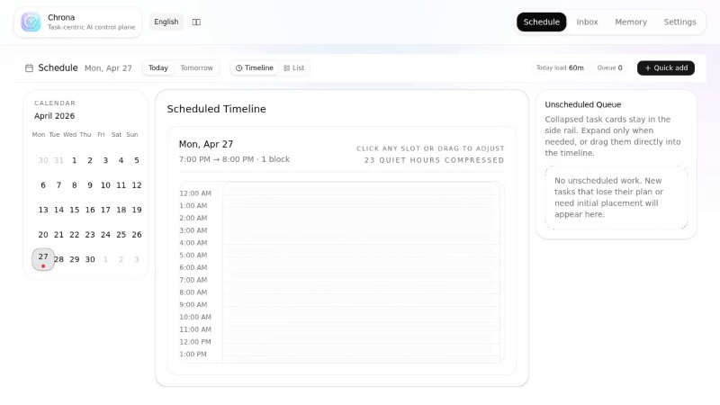
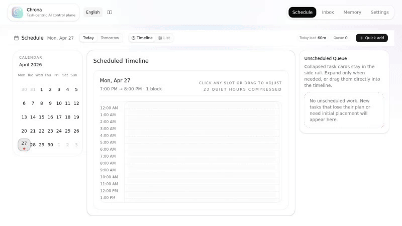
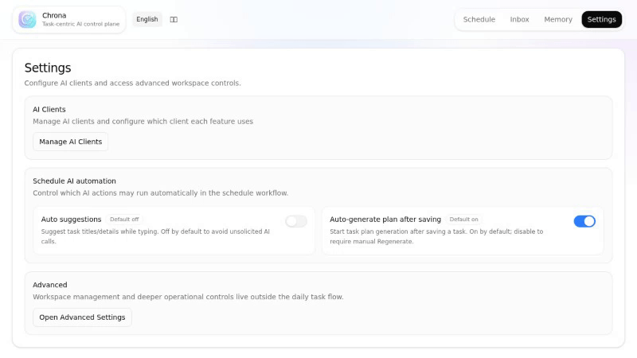

[English](./README.md) | [中文](./README.zh.md)

# Chrona

AI 原生任务控制面 — 通过 AI 代理规划、调度和执行工作。

## 安装

```bash
npm install -g @chrona-org/cli
```

环境要求：**Node.js >= 20**。

## 快速开始

```bash
chrona start
```

在浏览器中打开 `http://localhost:3101`。首次启动会自动创建 SQLite
数据库和配置文件，无需手动设置。

在 Web 应用的 **设置 > AI 客户端** 页面配置 AI 后端。支持两种后端类型：

- **LLM** — 任意 OpenRouter 兼容的 API（OpenRouter、OpenAI 兼容代理均可）
- **OpenClaw** — OpenClaw Gateway 桥接，用于代理执行

## CLI

同一个 `chrona` 二进制文件也提供针对本地 API 服务器的命令行客户端：

```
chrona task list                     列出默认工作区的任务
chrona task create --title "..."    创建任务
chrona task show <id>               查看任务详情
chrona run start <task-id>          启动代理运行
chrona schedule list                列出计划任务
chrona ai suggest --title "..."     获取 AI 任务建议
```

添加 `--base-url` 可指向其他服务器。

## 功能

- **日程驾驶舱** — 日历视图，支持拖拽时间块、冲突检测和 AI 时间段建议
- **任务工作区** — 可编辑的规划图（节点、边、依赖关系），支持 AI
  规划生成与流式输出
- **代理执行** — 在任务上运行 AI 代理，包含实时对话、工具调用、审批和输入提示
- **持久记忆** — 代理在工作区范围内积累和查询知识
- **收件箱分流** — 待审批、日程提案和 AI 建议
- **多语言** — 英文和中文界面

## 演示



*日历视图，包含时间线、任务块、拖拽排程和待排队列。*



*AI 生成的任务规划图，包含步骤类型、依赖关系、工时估算和重新生成。*



*配置 AI 客户端（LLM + OpenClaw）、自动排程开关和高级工作区控制。*

## 架构

基于 SQLite 的 CQRS + 事件溯源。命令写入规范事件并重建投影；查询读取物化视图。AI
功能遵循"先建议、后确认"模式 — 不直接变更。

| 层级       | 技术                                      |
| ---------- | ----------------------------------------- |
| 前端       | React 19, React Router 7 (SPA)，基于 Vite |
| API 服务器 | Hono（同时提供 API 和静态 SPA）           |
| 数据库     | SQLite，基于 Prisma 7                     |
| 运行时     | Node.js (npm) / Bun (开发)                |
| AI         | LLM 提供商 + OpenClaw 桥接                |

完整架构文档：[docs/architecture.md](./docs/architecture.md)

## 文档

| 文档                                                                  | 描述                |
| --------------------------------------------------------------------- | ------------------- |
| [Quick Start (EN)](./docs/en/quick-start.md)                          | English quick start |
| [快速开始（中文）](./docs/zh/quick-start.md)                          | 中文快速开始        |
| [架构](./docs/architecture.md)                                        | 系统设计与数据流    |
| [数据模型](./docs/data-model.md)                                      | 数据库 schema 参考  |
| [API 参考](./docs/api-reference.md)                                   | REST API 接口       |
| [Roadmap (EN)](./docs/en/roadmap.md) / [路线图](./docs/zh/roadmap.md) | 产品路线图          |

## 项目结构

```
apps/
  web/          — Vite React SPA
  server/       — Hono API 服务器 + 静态 SPA
packages/
  cli/          — Chrona CLI 入口 (npm)
  common/
    cli/        — CLI 命令 (task, run, schedule, ai)
    ai-features/— AI 功能层
  contracts/    — 共享 DTO、Zod schema、API 契约
  db/           — Prisma 引导、仓库层
  domain/       — 纯业务规则
  runtime/      — CQRS：命令、查询、投影、事件
  providers/
    openclaw/   — OpenClaw 桥接与集成
    hermes/     — Hermes 提供商（规划中）
```

## 参与贡献

详见 [CONTRIBUTING.md](./CONTRIBUTING.md)。开发使用 Bun；npm
构建产物为编译打包文件。

## 许可证

MIT
