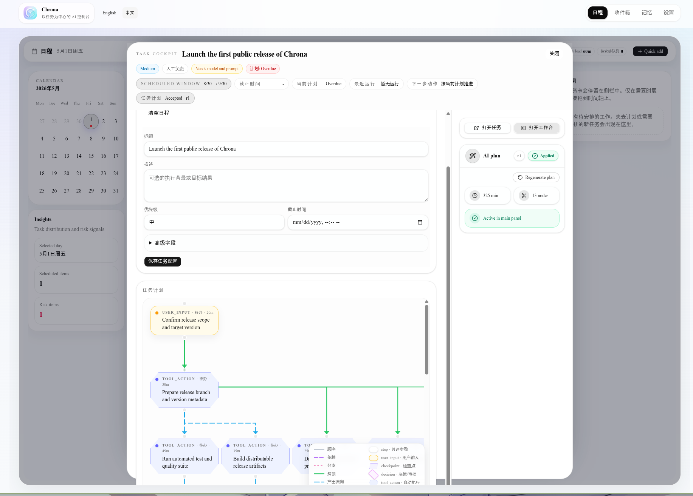
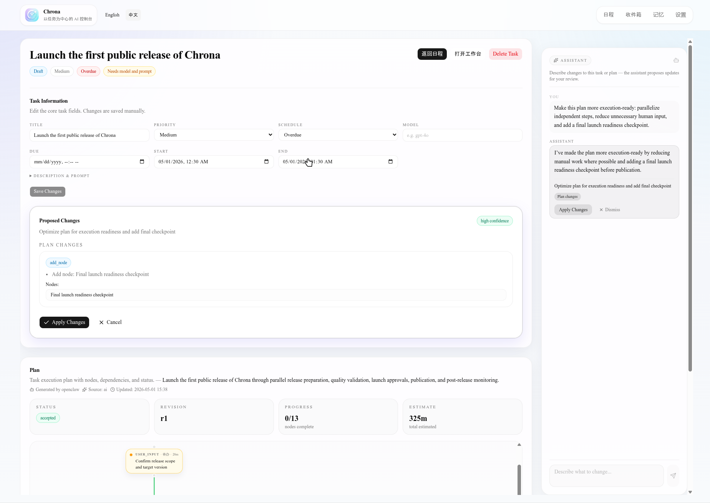

[English](./README.md) | 中文

<p align="center">
  
</p>

<p align="center">
  <h1 align="center">Chrona</h1>
  <p align="center"><strong>AI 原生工作的控制层。</strong></p>
  <p align="center">
    从任务到计划，从计划到日程，从日程到跨后端智能体执行。
  </p>
</p>

<p align="center">
  <a href="#安装">安装</a> ·
  <a href="#愿景">愿景</a> ·
  <a href="#当前可用">当前可用</a> ·
  <a href="#正在构建">正在构建</a> ·
  <a href="#后端生态">后端生态</a> ·
  <a href="#openclaw">OpenClaw</a>
</p>

<p align="center">
  
  
</p>

---

## 愿景

AI 正在从“回答问题”走向“执行工作”。

但今天的大多数工具仍然是分裂的：

- Todo App 负责记录任务，但不知道任务如何完成
- Calendar 负责安排时间，但不知道任务需要什么步骤
- AI Chat 可以生成建议，但建议通常停留在对话里
- Agent Runtime 可以执行任务，但缺少个人任务、计划和日程上下文

Chrona 想连接这些部分。

```text
Task → Plan → Schedule → Execution
```

Chrona 的目标是成为 AI 原生工作的控制层：

- 你创建任务
- Chrona 生成计划
- AI 帮你修改和优化计划
- Chrona 把计划放入日程
- 到了合适的时间，Chrona 调度智能体执行任务
- 如果任务缺少信息，Chrona 暂停并请求你补充
- 补充完成后，任务继续执行，直到完成

这不是一个普通 Todo App。

Chrona 要做的是一个可以持续推进工作的系统。

---

## 当前状态

Chrona 分为两层能力：

```text
Chrona
├── Plan Layer       已可用
└── Execution Layer  正在构建
```

### Plan Layer

Plan Layer 负责把任务变成结构化计划。

这是 Chrona 当前已经可用的核心能力。

### Execution Layer

Execution Layer 负责让计划真正被执行。

这是 Chrona 正在构建的下一阶段能力。

Chrona 会从计划中分析可执行路径，判断哪些步骤可以由 AI
自动完成，哪些步骤需要人类补充信息，并在任务被安排到日程后自动推进执行。

---

## 安装

从最新 Release 下载对应平台的二进制文件即可运行。

| 平台                | 文件                     |
| ------------------- | ------------------------ |
| macOS Apple Silicon | `chrona-darwin-arm64`    |
| macOS Intel         | `chrona-darwin-x64`      |
| Linux x64           | `chrona-linux-x64`       |
| Linux ARM64         | `chrona-linux-arm64`     |
| Windows x64         | `chrona-windows-x64.exe` |

macOS / Linux：

```bash
chmod +x chrona-darwin-arm64
./chrona-darwin-arm64 start
```

Windows：

```powershell
.\chrona-windows-x64.exe start
```

然后打开：

```text
http://localhost:3101
```

> 不需要全局安装 npm
> 包，也不需要手动启动前端或后端服务。下载对应平台的二进制文件后即可运行。

---

## 当前可用

Chrona 当前已经完成 Plan Layer。

你现在可以用 Chrona 完成从 task 到 plan 的工作流。

### 创建 Task

Task 是 Chrona 中最基础的工作单元。

它可以是一件明确的待办事项，也可以是一个模糊目标。

例如：

```text
重写 Chrona README，让它更准确地表达当前能力和未来方向。
```

Chrona 不把 task 当成一个静态
checkbox，而是把它作为后续生成计划、调整计划和执行任务的入口。

### 生成 Plan

Chrona 可以基于 task 生成结构化 plan。

一个模糊任务会被拆解成清晰步骤：

```text
1. 分析当前 README 的问题
2. 明确 Chrona 当前已经完成的能力
3. 梳理正在开发中的执行能力
4. 重写 README 顶部介绍
5. 补充安装和后端配置说明
6. 检查文档是否准确表达产品路线
```

Plan 让任务不再只是“要做的事”，而是变成“可以推进的路径”。

### AI 修改 Plan

生成 plan 后，你可以继续用 AI 修改它。

例如：

```text
这个计划太偏技术了，帮我改得更像产品介绍。
```

或者：

```text
把已经完成的功能和开发中的功能分开，但不要写得太保守。
```

Chrona 会根据你的反馈继续调整 plan。

这让 plan 成为一个可以反复迭代的工作对象，而不是一次性 AI 输出。

---

## 正在构建

Chrona 的下一阶段是 Execution Layer。

这是 Chrona 真正变成“AI 原生工作控制层”的关键。

### 自动运行日程中的 Task

未来，Chrona 会根据日程自动启动 task。

例如：

```text
15:00 - 16:00 重写 Chrona README
```

到了对应时间，Chrona 可以自动进入该任务上下文，加载相关 plan，并准备执行。

### 自动计算 Plan 的可执行路径

Chrona 会分析 plan 中的步骤，判断哪些路径可以自动执行。

例如：

```text
1. 读取当前 README                    可自动执行
2. 分析当前 README 的问题              可自动执行
3. 询问用户产品定位                    需要人类输入
4. 根据定位重写 README                 等待第 3 步完成
5. 检查 README 是否过度承诺             可自动执行
```

AI 不应该盲目执行整个计划。

Chrona 会尝试判断：

- 当前步骤是否有足够上下文
- 是否需要用户提供信息
- 是否需要用户确认
- 是否依赖其他步骤完成
- 是否可以交给某个后端自动完成

### 自动完成无需人工干预的步骤

对于不需要人类参与的路径，Chrona 会自动推进。

例如：

- 阅读文件
- 总结代码结构
- 分析文档问题
- 生成草稿
- 整理候选方案
- 检查格式
- 根据已有上下文完成低风险修改

### 等待人类补充信息

如果任务缺少必要信息，Chrona 不应该编造答案。

它应该暂停，并明确告诉用户需要什么。

例如：

```text
需要你补充：Chrona 的 Execution Layer 当前是否已经支持自动执行？
```

用户补充信息后，Chrona 可以继续执行剩余步骤。

### 继续未完成任务

普通 AI Chat 的问题是：一次对话结束，工作也就断了。

Chrona 的目标是让任务可以持续推进。

当用户补充信息、确认操作或提供新上下文后，Chrona
可以从中断点继续执行，而不是重新开始整个任务。

---

## 后端生态

Chrona 不应该绑定到单一模型或单一 agent runtime。

它的目标是成为多个 AI 执行后端之上的控制层。

### 当前支持

Chrona 当前支持：

| 后端              | 状态   | 说明                                  |
| ----------------- | ------ | ------------------------------------- |
| OpenAI-compatible | 已支持 | 支持 OpenAI 兼容接口                  |
| OpenClaw          | 已支持 | 支持通过 OpenClaw 接入 agent workflow |

### 计划支持

Chrona 后续计划接入更多 AI coding / agent 后端：

| 后端        | 状态     | 目标                           |
| ----------- | -------- | ------------------------------ |
| Claude Code | 计划支持 | 接入 Claude Code 工作流        |
| Codex       | 计划支持 | 接入 Codex 风格的代码执行能力  |
| opencode    | 计划支持 | 接入开源 coding agent runtime  |
| Hermes      | 计划支持 | 接入 Hermes agent/backend 能力 |

Chrona 的长期目标不是成为某一个后端的
UI，而是成为多个后端之上的统一任务、计划、日程和执行控制层。

你可以把 Chrona 理解为：

```text
              ┌──────────────┐
              │    Chrona    │
              │ Control Layer │
              └──────┬───────┘
                     │
     ┌───────────────┼────────────────┐
     │               │                │
OpenClaw      Claude Code          Codex
     │               │                │
  opencode        Hermes            ...
```

不同后端负责执行不同类型的任务。

Chrona 负责管理：

- task
- plan
- schedule
- execution state
- human input
- continuation
- result tracking

---

## AI 后端配置

### OpenAI-compatible

Chrona 可以连接 OpenAI 兼容接口。

适用于：

- OpenAI API
- 本地或自托管 OpenAI-compatible endpoint
- 其他兼容 OpenAI API 格式的模型服务

通常需要配置：

```text
Base URL
API Key
Model
```

### OpenClaw

Chrona 也支持 OpenClaw 作为后端。

OpenClaw 更适合作为 agent workflow 后端，也是 Chrona Execution Layer
的重要组成部分。

---

## OpenClaw

使用 OpenClaw 前，需要确保 OpenClaw 的 Responses endpoint 已开启。

请在 OpenClaw 配置中加入：

```json
{
  "gateway": {
    "http": {
      "endpoints": {
        "responses": {
          "enabled": true
        }
      }
    }
  }
}
```

然后在 Chrona 中进入：

```text
Settings → AI Clients
```

添加或启用 OpenClaw 后端。

### 为什么需要开启 Responses？

Chrona 需要通过 OpenClaw 的 Responses 能力与后端交互。

如果没有开启该 endpoint，Chrona 可能可以连接到 OpenClaw，但无法正常使用相关 AI
能力。

### 后续自动配置

后续 Chrona 可以提供自动检测和辅助配置：

```bash
chrona openclaw doctor
chrona openclaw setup
```

理想体验：

```text
✓ OpenClaw binary found
✓ Gateway reachable
✗ Responses endpoint disabled

Run `chrona openclaw setup` to enable it.
```

`setup` 可以在用户确认后自动写入配置，并备份原配置文件。

---

## 为什么需要 Chrona？

AI 工具正在快速变强，但工作流本身还很破碎。

你可能会同时使用：

- 一个 Todo App 记录任务
- 一个 Calendar 安排时间
- 一个 AI Chat 讨论方案
- 一个 coding agent 执行代码任务
- 一个文档系统记录结果

Chrona 想把这些连接起来。

不是再做一个 isolated AI tool，而是建立一个面向 AI 工作流的控制系统。

| 工具类型     | 主要能力                               | 局限                           |
| ------------ | -------------------------------------- | ------------------------------ |
| Todo App     | 记录任务                               | 不理解任务结构，也不会生成计划 |
| Calendar     | 安排时间                               | 不知道任务如何完成             |
| AI Chat      | 生成建议                               | 难以持续管理任务状态           |
| Coding Agent | 执行代码任务                           | 缺少个人任务、计划和日程上下文 |
| Chrona       | 任务、计划、日程、后端执行的统一控制层 | 正在逐步构建 Execution Layer   |

---

## Roadmap

### Plan Layer

- [x] 创建 task
- [x] 生成 plan
- [x] AI 修改 plan
- [x] OpenAI-compatible 后端
- [x] OpenClaw 后端

### Execution Layer

- [ ] 日程中的 task 自动启动
- [ ] 自动分析 plan 的可执行路径
- [ ] 自动执行不需要人工干预的步骤
- [ ] 在缺少信息时暂停并请求用户补充
- [ ] 用户补充信息后继续执行
- [ ] 执行过程可视化
- [ ] 执行结果回写到 task / plan

### Backend Ecosystem

- [x] OpenAI-compatible
- [x] OpenClaw
- [ ] Claude Code
- [ ] Codex
- [ ] opencode
- [ ] Hermes
- [ ] 更多 agent runtime

---

## 开发

如果你想从源码运行 Chrona：

```bash
bun install
bun run dev
```

构建二进制：

```bash
bun run build:binaries
```

项目结构：

```text
apps/
  server/     API server
  web/        Web UI

packages/
  cli/        CLI tool
  common/     Shared utilities and AI feature surface
  contracts/  Shared DTOs, Zod schemas, API contracts
  db/         Database schema and migrations
  domain/     Pure business rules, state derivations
  providers/  AI provider adapters
  runtime/    Agent runtime integration

docs/
  architecture.md
  quick-start.md
```

---

## License

MIT
