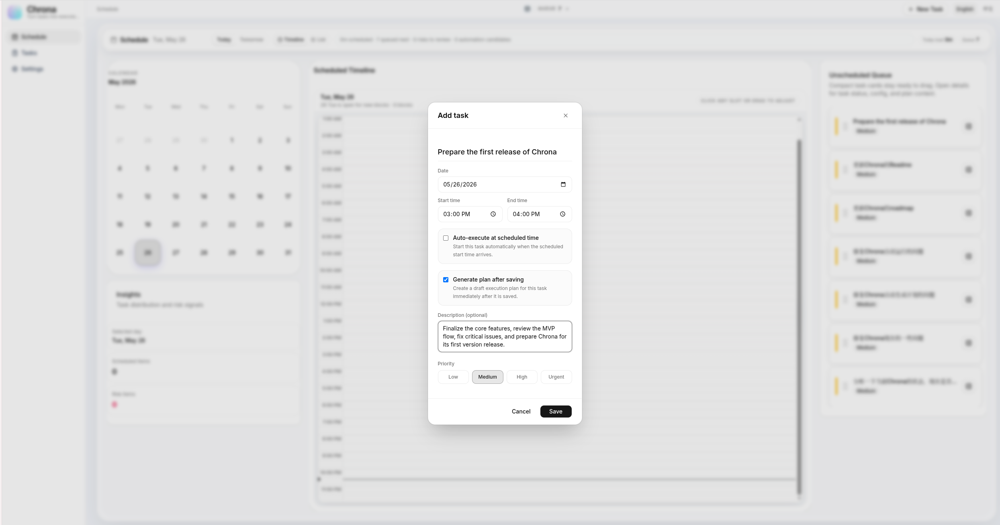
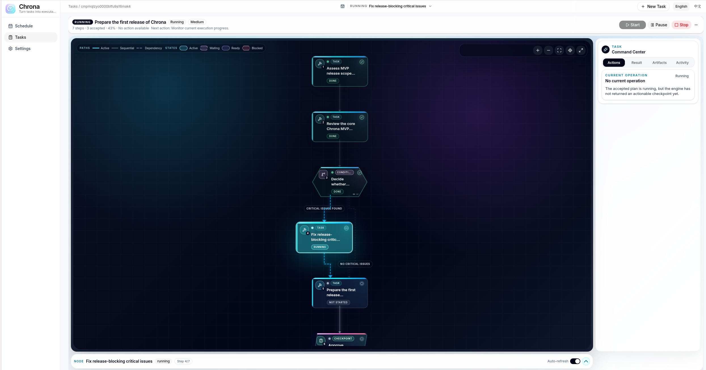
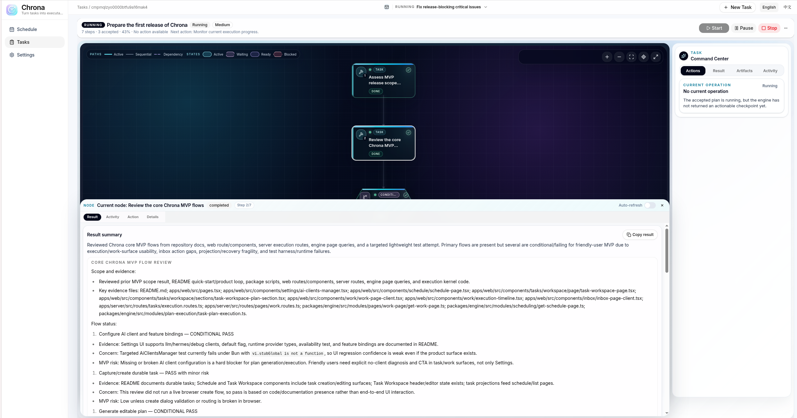

[English](./README.md) | 中文

<p align="center">
  
</p>

<h1 align="center">Chrona</h1>

<p align="center">
  <strong>一个 local-first 日程软件，用 AI 规划工作，并自动完成日程上的任务。</strong>
</p>

<p align="center">
  <a href="https://github.com/saya-ashen/Chrona/actions/workflows/ci.yml"></a>
  <a href="./LICENSE"></a>
  <a href="./package.json">= 1.3.11" src="https://img.shields.io/badge/bun-%3E%3D1.3.11-black" /></a>
</p>

<p align="center">
  <a href="#快速开始">快速开始</a> ·
  <a href="#项目状态">状态</a> ·
  <a href="#路线图">路线图</a> ·
  <a href="./docs/zh/quick-start.md">完整指南</a> ·
  <a href="./docs/architecture.md">架构</a> ·
  <a href="./CONTRIBUTING.md">贡献</a>
</p>

> [!WARNING]
> Chrona 正在快速迭代中。当前项目是 Bun-only，API 和 runtime contracts 仍可能变化，主要产品方向是 schedule-first：围绕日程规划工作，并自动执行到期任务。

<p align="center">
  
  
</p>

---

Chrona 是一个 local-first 的 AI 辅助日程软件。它的主要目标是把工作放到日程上，在合适的时候让 AI 执行日程任务，并保留可检查的执行结果，而不是把过程埋在聊天记录里。

Chrona 把通常分散在不同工具中的四层能力连接起来：

```text
Task -> Plan -> Schedule -> Auto Execution
```

你可以用 Chrona 捕获工作、生成可编辑计划、放入日程、手动或自动执行，并在之后回看发生过什么。

## 项目状态

Chrona 当前可用于本地开发和产品探索，但还不是稳定软件。当前代码库已经具备任务、计划、日程、执行、Inbox 和 AI-client 流程；接下来的重点是让“日程到自动执行”的闭环可靠到可以日常使用。

## 为什么需要 Chrona

日历告诉你应该发生什么，任务软件告诉你还有什么没做，AI chat 可以做事但通常丢失日程、状态和责任链。Chrona 把这些循环合在一起：

| 如果你需要... | Chrona 提供... |
| --- | --- |
| 围绕真实工作安排一天 | 带优先级、状态、截止时间、估时、依赖和日程信息的任务 |
| 把日程任务变成可执行步骤 | 可审查、可 patch、可接受、可重新执行的 AI 计划图 |
| 让到期工作自动推进 | 日程块、提案、等待状态、Inbox 审批和执行动作 |
| 让 AI 执行可追责 | 作用域受限的 runtime refs、checkpoint、审批、工具轨迹、失败和持久化输出 |

## 快速开始

Chrona 目前是 Bun-only 项目。仓库开发和生产 server 都使用 Bun 作为运行时；当前不支持 npm package 安装。

### 从源码运行

如果你想开发 Chrona 或查看代码，选择这条路径。

```bash
git clone https://github.com/saya-ashen/Chrona.git
cd Chrona
bun install
bun run dev
```

打开 `http://localhost:3101`。`bun run dev` 会启动 Bun/Hono API server 和 Vite Web 应用。

### 使用 Docker 运行

如果你想启动容器化的本地 server，选择这条路径。

```bash
docker build -t chrona .
docker run --rm -p 3101:3101 -v chrona-data:/data chrona
```

容器会把 SQLite 数据保存到 `/data/chrona.db`。如果需要跨重启保持稳定认证，请显式设置 `API_KEY`。

## 首次运行

1. 打开 `http://localhost:3101`。
2. 进入 `Settings -> AI Clients`。
3. 添加 `llm`、`hermes` 或 `debug` client。
4. 将 client 绑定到 `generate_plan`、`suggest`、`chat`、`dispatch_task` 等功能。
5. 创建任务，放入日程，生成计划，审查并接受计划，然后从任务工作区或 Work 页面开始执行。

数据目录、AI client 细节和排障说明见[完整快速开始](./docs/zh/quick-start.md)。

## 你可以做什么

### 构建真实日程

创建带优先级、估时、截止时间、依赖和日程信息的任务，让日历成为下一步工作的来源。

### 生成可编辑计划

把粗略任务变成结构化计划蓝图。已接受的计划会变成持久化 task plan layer 和 graph node，而不是一次性的 assistant 文本。

### 执行图结构工作

用 `task`、`checkpoint`、`condition`、`wait` 节点运行计划图。节点可以是 manual、assisted 或 automatic，也可以分配给 user、AI 或 system executor。

### 推进日程上的工作

使用 schedule views、AI insights、冲突建议、日程提案、waiting runs、failed runs、cancelled runs 和 inbox approvals，把到期工作推向执行。

### 保持 AI 执行可观测

AI worker 只接收安全的 runtime refs，不直接接触内部数据库 ID。它们通过 `chrona.task.complete`、`chrona.condition.select`、`chrona.node.block`、`chrona.node.fail`、`chrona.wait.complete` 等 Chrona 命令汇报进度。

<p align="center">
  
</p>

### 带着上下文恢复工作

通过 Work 页面、任务工作区、memory console、assistant surfaces、conversation history、tool traces 和持久化输出理解并继续长周期工作。

## 路线图

这里是项目路线图摘要。完整内容以[路线图](./docs/zh/roadmap.md)为准。

| 状态 | 领域 | 范围 |
| --- | --- | --- |
| 已完成 | 任务基础 | 创建、更新、删除、完成/重开、状态、优先级、标签、依赖、父子任务和任务投影。 |
| 已完成 | 日程界面 | 时间线/任务视图、AI insights、冲突、日程提案、任务创建和配置界面。 |
| 已完成 | 计划生成 | 流式 AI 计划生成、计划持久化、审查/编辑/接受流程，以及 materialize 为图节点。 |
| 已完成 | 执行 runtime | 可执行的 `task`、`checkpoint`、`condition`、`wait` 节点，AI-visible refs 和持久化执行状态。 |
| 已完成 | 审查闭环 | Inbox 中的 pending approvals、日程提案、等待输入、失败/取消 run 入口。 |
| 接下来 | 完善现有流程 | 让 Work、Schedule、Inbox、Task Workspace 和执行记录更可靠、更容易理解。 |
| 接下来 | 可靠自动执行 | 仅在配置允许且安全时启动到期日程任务，并在执行阻塞或失败时提供清晰恢复路径。 |
| 接下来 | 更多 provider | 在保持 provider boundary 清晰的前提下，接入更多执行/provider 集成。 |
| 接下来 | 多 session 执行 | 让任务执行在需要时使用多个 session，并明确隔离、复用、恢复和诊断行为。 |
| 接下来 | 外部日历 | 接入外部日历软件，让 Chrona 与已有日历系统协调日程任务。 |
| 后续 | 生产就绪 | 改进认证、备份恢复、部署文档、迁移安全、可观测性和运维 runbooks。 |

## 架构

Chrona 是运行在 Bun 上的 Vite + Hono monorepo，使用 SQLite 持久化。

```text
React SPA
  -> Hono API server
  -> Chrona engine
      -> task / plan / schedule / projection modules
      -> graph-runtime execution state
      -> Prisma + SQLite persistence
      -> AI clients and provider adapters
```

| 区域 | 路径 |
| --- | --- |
| Web app | `apps/web/` |
| API server | `apps/server/` |
| CLI 和 binary entrypoints | `packages/cli/` |
| 共享 schema 和 runtime contracts | `packages/contracts/` |
| 数据库层 | `packages/db/` |
| 产品引擎 | `packages/engine/` |
| 计划图 runtime | `packages/graph-runtime/` |
| Provider adapters | `packages/providers/` |

更多设计说明见[架构指南](./docs/architecture.md)、[数据模型](./docs/data-model.md)和[后端执行流程](./docs/backend-execution-flow.md)。

## 配置

如果需要本地覆盖配置，复制 `.env.example`。

| 变量 | 用途 | 默认值 / 说明 |
| --- | --- | --- |
| `DATABASE_URL` | SQLite database URL | 源码默认：`file:./prisma/dev.db`；Docker：`file:/data/chrona.db` |
| `HOST` | API server bind host | 默认只绑定本机 `127.0.0.1` |
| `PORT` | API server port | `3101` |
| `API_KEY` | `/api/*` routes 的可选 bearer token | Docker 未设置时会自动生成 |
| `CHRONA_WEB_DIST` | 静态服务使用的 Web build 目录 | `apps/web/dist` |
| `ALLOWED_ORIGINS` | 逗号分隔的 CORS allowlist | 本地开发可省略 |
| `VITE_API_BASE_URL` | 前端 API base URL override | Web 和 API 分离部署时使用 |

AI clients 在 Web 应用的 `Settings -> AI Clients` 配置。当前支持 `llm`、`hermes`、`debug`：`llm` 用于 OpenAI/OpenRouter 兼容 API，`hermes` 用于 Hermes-backed agent execution，`debug` 用于本地开发和测试流程。

## 开发

仓库开发需要 Bun `>=1.3.11`。

```bash
bun install
bun run dev              # 完整开发栈
bun run typecheck        # TypeScript
bun run lint             # ESLint
bun run test             # Vitest
bun run test:bun         # Bun-native tests
bun run test:api         # API tests
bun run test:e2e         # Playwright E2E tests
```

较大变更前，也建议运行：

```bash
bun run check:ui-foundation
bun run check:boundaries
bun run analyze
```

开发环境、代码风格、边界规则、schema-first contract 规则和测试要求见 [CONTRIBUTING.md](./CONTRIBUTING.md)。

## 文档

| 主题 | 文档 |
| --- | --- |
| 文档索引 | [docs/README.md](./docs/README.md) |
| 快速开始 | [English](./docs/en/quick-start.md) / [中文](./docs/zh/quick-start.md) |
| 架构 | [docs/architecture.md](./docs/architecture.md) |
| API reference | [docs/api-reference.md](./docs/api-reference.md) |
| 数据模型 | [docs/data-model.md](./docs/data-model.md) |
| 后端执行流程 | [docs/backend-execution-flow.md](./docs/backend-execution-flow.md) |
| Provider boundary | [docs/provider-boundary.md](./docs/provider-boundary.md) |
| Package boundaries | [docs/package-boundaries.md](./docs/package-boundaries.md) |
| 路线图 | [English](./docs/en/roadmap.md) / [中文](./docs/zh/roadmap.md) |

## 贡献

欢迎贡献。请从 [CONTRIBUTING.md](./CONTRIBUTING.md) 开始，运行相关检查；修改任务、日程、执行或导航流程时，请用测试覆盖行为。

## License

MIT
