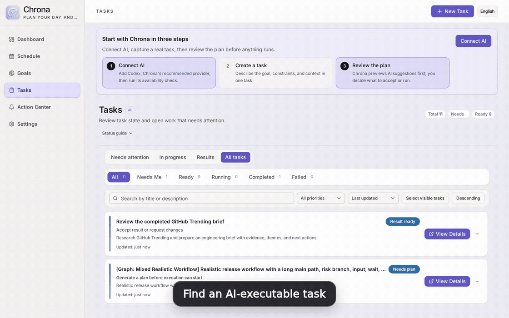
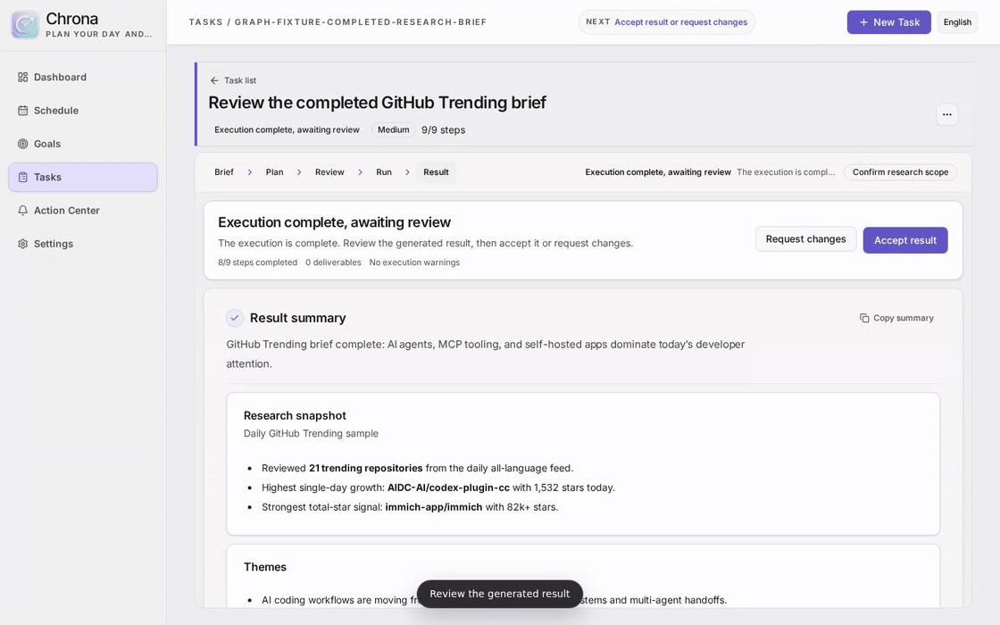

[English](./README.md) | 中文

<p align="center">
  
</p>

<h1 align="center">Chrona</h1>

<p align="center">
  <strong>把待办事项变成 AI 可以协助推进的工作流。</strong>
</p>

<p align="center">
  规划工作，安排时间，让 AI 协助执行，全程可追踪。
</p>

<p align="center">
  <a href="https://github.com/saya-ashen/Chrona/actions/workflows/ci.yml"></a>
  <a href="./LICENSE"></a>
  <a href="./package.json">= 1.3.11" src="https://img.shields.io/badge/bun-%3E%3D1.3.11-black" /></a>
</p>

<p align="center">
  <a href="#快速开始">快速开始</a> ·
  <a href="#核心工作流">工作流</a> ·
  <a href="#providers">Providers</a> ·
  <a href="#local-first-与安全模型">安全</a> ·
  <a href="#项目状态">状态</a> ·
  <a href="./docs/zh/quick-start.md">完整指南</a> ·
  <a href="./docs/en/architecture.md">架构</a> ·
  <a href="./CONTRIBUTING.md">贡献</a>
</p>
<p align="center">
  
  <br />
  <em>查找可由 AI 执行的任务，沿计划图查看进度，并检查可追溯的执行记录。</em>
</p>

---

Chrona 是一个 local-first 的 AI 任务管理器，用来处理那些不该只停留在提醒里的工作。你可以创建任务、安排日程、审查 AI 生成的计划，再手动或自动执行；每个 checkpoint、审批、失败、工具动作和输出都会留下记录。

Chrona 把原本分散在不同工具里的四个环节串起来：

```text
Task -> Plan -> Schedule -> Inspectable Execution
```

适合用 Chrona 处理：

- 周期性调研简报、发布准备
- 维护和跟进任务，以及需要持续推进的日程工作
- 需要状态、审批、恢复和持久化输出的 agent run

## 为什么需要 Chrona

日历提醒你什么时候该做事。任务软件记录还有什么没做。AI
能帮你做事，但很容易丢掉日程、状态和责任链。Chrona
把这些环节接起来，同时保留它们各自的边界。

| 如果你想...            | Chrona 可以...                                                       |
| ---------------------- | -------------------------------------------------------------------- |
| 围绕真实工作安排一天   | 用带优先级、状态、截止时间、估时、依赖和日程信息的任务组织工作       |
| 把日程任务拆成执行步骤 | 生成可审查、可修改、可接受、可重跑、可追踪的 AI 计划图               |
| 让到期任务继续推进     | 通过日程块、提案、等待状态、任务工作区审批和执行动作推动下一步       |
| 让 AI 执行有记录可查   | 保留 runtime refs、checkpoint、审批、工具轨迹、失败和输出            |

## 快速开始

Chrona 目前只支持 Bun。源码仓库使用 Bun 运行；开发时暂不支持通过 npm
安装依赖。

### 下载发行版

如果只想先把 Chrona 跑起来，不需要克隆仓库：

1. 打开[最新 GitHub Release](https://github.com/saya-ashen/Chrona/releases/latest)。
2. 下载对应平台的压缩包：

| 平台                | 文件                         |
| ------------------- | ---------------------------- |
| Linux x64           | `chrona-linux-x64.tar.gz`    |
| Linux ARM64         | `chrona-linux-arm64.tar.gz`  |
| macOS Apple Silicon | `chrona-darwin-arm64.tar.gz` |
| Windows x64         | `chrona-windows-x64.tar.gz`  |

3. 解压并启动 Chrona：

```bash
tar -xzf chrona-linux-x64.tar.gz
cd chrona-linux-x64
./chrona start
```

Windows 使用打包的可执行文件：

```powershell
tar -xzf chrona-windows-x64.tar.gz
cd chrona-windows-x64
.\Chrona.exe start
```

服务启动后打开 `http://localhost:3101`。

### 从源码运行

如果想开发 Chrona 或查看源码：

```bash
git clone https://github.com/saya-ashen/Chrona.git
cd Chrona
bun install
bun run dev
```

打开 `http://localhost:3101`。`bun run dev` 会启动 Bun/Hono API server 和 Vite
Web 应用。

## 首次运行

即使不连接真实 provider，也可以先探索 Chrona：

1. 创建包含足够上下文的任务，方便之后继续推进。
2. 安排日程，查看 Dashboard。
3. 打开任务工作区，查看计划、状态和输出。

准备接入 AI 执行时：

1. 进入 `Settings -> AI Clients`，添加 `Claude Code` 或 `Codex` client。
2. 绑定 `task.plan`、`task.execution`、`dashboard.brief` 等功能。
3. 在任务工作区生成计划，审查或编辑图结构，然后接受计划。
4. 从任务工作区手动启动执行；配置自动执行后，也可以让 Chrona 推进到期任务。

数据目录、AI client 细节和排障说明见[完整快速开始](./docs/zh/quick-start.md)。

## 核心工作流

1. **记录工作** — 创建带优先级、估时、截止时间、依赖和日程信息的任务。
2. **生成计划** — 把粗略上下文整理成结构化计划图。
3. **执行前审查** — 计划变成可执行节点前，先修改、接受或重新生成。
4. **带状态运行** — 手动、AI 辅助，或在配置后自动执行
   `task`、`checkpoint`、`condition`、`wait` 节点。
5. **检查和恢复** — 从工作区查看审批、工具活动、失败、阻塞、持久化输出和下一步动作。

<p align="center">
  
  <br />
  <em>检查结果中的证据和建议，确认后将验收记录保留在任务中。</em>
</p>

## Providers

Chrona 将产品工作流和执行 provider 分开。先把 provider 配置为 AI
client，再把 client 绑定到 Chrona 功能。

| Provider 类型 | 状态 | 适合 |
| --- | --- | --- |
| `claude_code` | 主要支持 | Claude Code 计划生成和本地任务执行 |
| `codex` | 主要支持 | Codex 计划生成和本地任务执行 |
| `hermes` | 待更新 | 已有 Hermes gateway 的本地或远程 agent 执行 |

在 `Settings -> AI Clients` 中配置 provider，然后绑定到
`task.plan`、`task.execution`、`dashboard.brief` 等 Chrona 功能。

Provider 字段、默认值和排障说明见[完整快速开始](./docs/zh/quick-start.md)。

## Local-first 与安全模型

Chrona 默认从本机运行和显式配置开始。

| 项目           | 默认行为                                                                                   |
| -------------- | ------------------------------------------------------------------------------------------ |
| 存储           | SQLite。源码开发默认 `file:./prisma/dev.db`；发行版默认使用平台数据目录，除非显式覆盖。    |
| 网络绑定       | `HOST` 默认只绑定本机 `127.0.0.1`。                                                        |
| API auth       | 本地开发可以不设置 `API_KEY`；如果把 `/api/*` 暴露到 localhost 之外，应先设置。            |
| CORS           | 前后端分开部署时，可用 `ALLOWED_ORIGINS` 限制浏览器来源。                                  |
| Provider scope | AI worker 只会收到作用域受限的 runtime refs 和 Chrona control tools，不直接接触数据库 ID。 |
| 自动执行       | 必须显式配置 provider/feature；状态、审批、阻塞和 run records 都会在任务工作区中可见。     |

## 功能

- **真正的日程** — 任务带优先级、估时、截止时间、依赖和日程元数据。
- **可编辑计划图** — 生成的计划可审查、可修改、可接受、可重新执行，并转换为类型化图节点。
- **图结构执行** — `task`、`checkpoint`、`condition`、`wait` 节点支持手动、AI 辅助和自动执行。
- **到期任务恢复** — 日程视图、AI 洞察、冲突建议、日程提案、等待/失败/取消的
  run 和审批入口，让下一步动作保持可见。
- **可观测 AI 工作** — Provider run 只接收安全的 runtime refs，不直接接触内部数据库 ID。它们通过
  `chrona_node_complete`、`chrona_condition_select`、`chrona_node_block`、`chrona_node_fail`、`chrona_wait_complete`
  等工具汇报进度。对话历史、工具轨迹和持久化输出都会留在任务上下文里。

## 项目状态

> [!WARNING]
> Chrona 仍处于 alpha 阶段：local-first、Bun-only，并且在快速迭代。

Chrona 目前适合本地开发和产品探索，还不是稳定软件。代码库已包含任务、计划、日程、执行、Dashboard、Settings、外部日历和
AI-client 流程；下一步重点是让“日程到自动执行”的闭环可靠到可以日常使用。

## 路线图

这里是成熟度摘要。完整内容以[路线图](./docs/zh/roadmap.md)为准。

| 领域            | 可用性 | 成熟度       | 备注                                                                                  |
| --------------- | ------ | ------------ | ------------------------------------------------------------------------------------- |
| 任务基础        | 已可用 | 可用         | 创建、更新、删除、完成/重开、状态、优先级、标签、依赖、父子任务和投影。               |
| 日程界面        | 已可用 | 可用，打磨中 | Timeline/task views、AI 洞察、冲突、日程提案、任务创建和配置界面。                    |
| 计划生成        | 已可用 | 实验性       | 流式 AI 计划生成、持久化、审查/编辑/接受流程，以及转换为图节点。                      |
| 执行运行时      | 已可用 | 实验性       | 可执行的 `task`、`checkpoint`、`condition`、`wait` 节点，AI-visible refs 和持久化状态。 |
| 审查闭环        | 已可用 | 实验性       | Dashboard 和任务工作区里的待审批、日程提案、等待输入、失败/取消 run 入口。            |
| 外部日历        | 已可用 | 早期         | 只读日历订阅、忙碌事件导入、来源管理、刷新状态和日程上下文。                          |
| 完善现有流程    | 进行中 | 活跃         | 让 Dashboard、Schedule、Task Workspace 和执行记录更可靠、更容易理解。                 |
| 可靠自动执行    | 进行中 | 尚不稳定     | 仅在配置允许且安全时启动到期任务，并在执行阻塞或失败时提供清晰恢复路径。              |
| 更多 provider   | 进行中 | 实验性       | 在保持 provider 边界清晰的前提下接入更多执行/provider 集成。                          |
| 多会话执行      | 已计划 | 尚不可用     | 增加多会话的隔离、复用、恢复和诊断能力。                                              |
| 生产可用性      | 已计划 | 未就绪       | 认证、备份/恢复、部署文档、迁移安全、可观测性和运维手册。                             |

## 架构

Chrona 是运行在 Bun 上的 Vite + Hono 单仓库项目，使用 SQLite 持久化。

```text
React SPA
  -> Hono API server
  -> Chrona engine
      -> task / plan / schedule / projection modules
      -> graph-runtime execution state
      -> Prisma + SQLite persistence
      -> AI clients and provider adapters
```

| 领域                  | 路径                      |
| --------------------- | ------------------------- |
| Web 应用              | `apps/web/`               |
| API server            | `apps/server/`            |
| CLI 和二进制入口      | `packages/cli/`           |
| 共享 schema 和合约    | `packages/contracts/`     |
| 数据库层              | `packages/db/`            |
| 产品引擎              | `packages/engine/`        |
| 计划图运行时          | `packages/graph-runtime/` |
| Provider adapters     | `packages/providers/`     |

更多设计说明见[架构指南（英文）](./docs/en/architecture.md)、[数据模型（英文）](./docs/en/data-model.md)和[后端执行流程（英文）](./docs/en/backend-execution-flow.md)。

## 配置

如需本地覆盖配置，复制 `.env.example`。

| 变量                | 用途                         | 默认 / 说明                                                                |
| ------------------- | ---------------------------- | -------------------------------------------------------------------------- |
| `DATABASE_URL`      | SQLite 数据库 URL            | 源码默认：`file:./prisma/dev.db`；发行版默认使用平台数据目录，除非显式覆盖 |
| `HOST`              | API server 监听地址          | 默认本机 `127.0.0.1`                                                       |
| `PORT`              | API server 端口              | `3101`                                                                     |
| `API_KEY`           | `/api/*` 路由的可选 bearer token | 本地开发可省略                                                             |
| `CHRONA_WEB_DIST`   | 构建后的 Web 静态目录        | `apps/web/dist`                                                            |
| `ALLOWED_ORIGINS`   | 逗号分隔的 CORS 允许来源     | 本地开发可省略                                                             |
| `VITE_API_BASE_URL` | 前端 API base URL 覆盖       | Web 和 API 分离时使用                                                      |

AI client 在 Web 应用的 `Settings -> AI Clients` 中配置。Provider 类型和 Claude Code/Codex
配置方式见 [Providers](#providers)。

## FAQ

### 不配置 AI provider 可以使用 Chrona 吗？

可以。即使没有 AI provider，也可以创建任务、安排日程、查看 Dashboard、使用任务工作区。真实的 AI 计划生成和 agent 执行需要配置 AI client。主要本地 agent 执行路径是 Claude Code 和 Codex。

### Chrona 生产可用了吗？

还没有。Chrona 目前适合本地开发和产品探索，但 runtime contracts、provider 行为和 auto-execution 流程仍在变化。

### Chrona 数据存在哪里？

源码开发默认 `file:./prisma/dev.db`。发行版默认使用平台数据目录，除非通过 `DATABASE_URL` 显式覆盖。

### 自动执行会静默运行吗？

不会。自动执行必须显式配置 provider/feature，任务工作区会持续展示状态、审批、阻塞、activity 和 run records。

## 开发

仓库开发需要 Bun `>=1.3.11`。

```bash
bun install
bun run dev              # 完整开发栈
bun run typecheck        # TypeScript
bun run lint             # ESLint
bun run test             # Vitest
bun run test:bun         # Bun-native tests
bun run test:api         # API tests
bun run test:e2e         # Playwright E2E tests
```

做较大变更前，也建议运行：

```bash
bun run check:ui-foundation
bun run check:boundaries
bun run analyze
```

开发环境、代码风格、边界规则、schema-first contract 规则和测试要求见
[CONTRIBUTING.md](./CONTRIBUTING.md)。

## 文档

| 主题               | 文档                                                                     |
| ------------------ | ------------------------------------------------------------------------ |
| 文档索引           | [docs/README.md](./docs/README.md)                                       |
| 快速开始           | [English](./docs/en/quick-start.md) / [中文](./docs/zh/quick-start.md)   |
| 架构               | [docs/en/architecture.md](./docs/en/architecture.md)                     |
| API reference      | [docs/en/api-reference.md](./docs/en/api-reference.md)                   |
| 数据模型           | [docs/en/data-model.md](./docs/en/data-model.md)                         |
| 后端执行流程       | [docs/en/backend-execution-flow.md](./docs/en/backend-execution-flow.md) |
| Provider boundary  | [docs/en/provider-boundary.md](./docs/en/provider-boundary.md)           |
| Package boundaries | [docs/en/package-boundaries.md](./docs/en/package-boundaries.md)         |
| 路线图             | [English](./docs/en/roadmap.md) / [中文](./docs/zh/roadmap.md)           |
| Security           | [SECURITY.md](./SECURITY.md)                                             |
| Code of Conduct    | [CODE_OF_CONDUCT.md](./CODE_OF_CONDUCT.md)                               |

## 贡献

欢迎贡献。请从 [CONTRIBUTING.md](./CONTRIBUTING.md) 开始，运行相关检查；修改任务、日程、执行或导航流程时，请用测试覆盖行为。

## License

MIT
