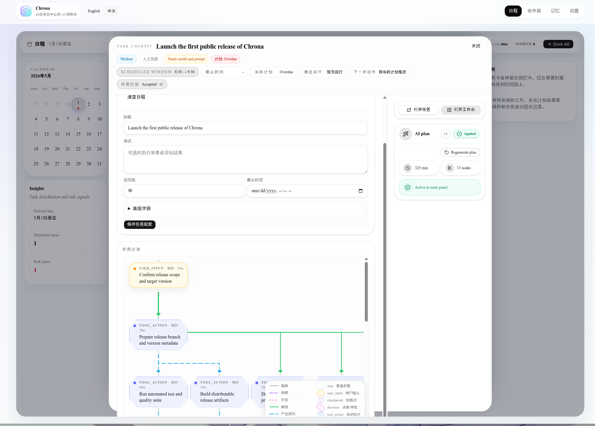
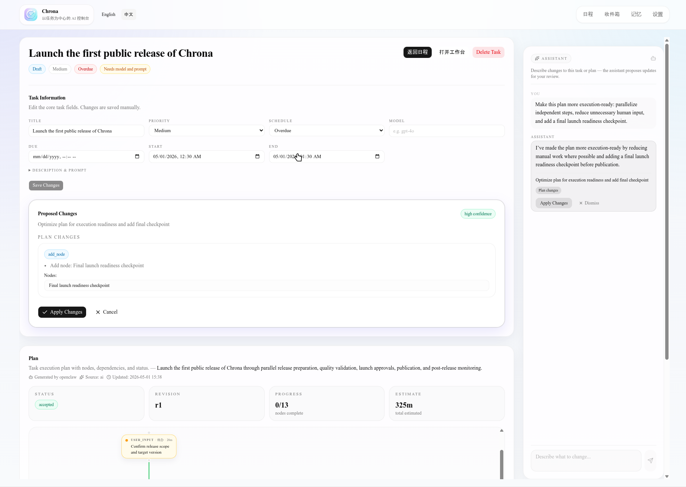

[English](./README.md) | 中文

<p align="center">
  
</p>

<p align="center">
  <h1 align="center">Chrona</h1>
  <p align="center"><strong>面向 AI 原生工作的任务控制层：规划、日程与执行。</strong></p>
  <p align="center">
    Chrona 把粗略意图变成结构化任务、计划图、日程块和可观测的 AI 执行过程。
  </p>
</p>

<p align="center">
  <a href="#快速开始">快速开始</a> ·
  <a href="#项目定位">项目定位</a> ·
  <a href="#核心功能">核心功能</a> ·
  <a href="#架构概览">架构概览</a> ·
  <a href="#配置说明">配置说明</a> ·
  <a href="#文档导航">文档导航</a>
</p>

<p align="center">
  
  
</p>

---

## 项目定位

Chrona 是一个 local-first 的 AI 原生工作台。它把通常分散在不同工具里的四层能力连接起来：

```text
Task → Plan → Schedule → Execution
```

Chrona 不只是 todo list、calendar 或 chat UI。它是一个让工作状态保持显式的控制层：

- task 保存面向用户的工作单元、优先级、状态、标签、依赖、父子任务、日程信息和结果
- plan 把任务变成可编辑、可接受、可执行的类型化图节点
- schedule 把工作放入时间块，并暴露冲突和建议
- execution 通过 AI-visible refs、checkpoint/wait 状态、人类审批、工具轨迹和持久化输出运行计划图

Chrona 的目标很直接：把工作从一次性 AI 对话里移出来，放进一个可以暂停、恢复、解释执行过程的任务、计划、日程和执行系统。

## 快速开始

Chrona 使用 Bun 和 SQLite。

### 从源码运行

```bash
bun install
bun run dev
```

然后打开 Web 应用：

```text
http://localhost:3101
```

`bun run dev` 会启动 Bun/Hono API server 和 Vite Web 应用，用于本地开发。只启动服务端时使用：

```bash
bun run server:start
```

### 二进制 / 打包构建

仓库中也包含构建各平台独立二进制的脚本：

```bash
bun run build:binaries
```

Release 资产预期使用这些目标名称：

| 平台 | 二进制文件 |
| --- | --- |
| macOS Apple Silicon | `chrona-darwin-arm64` |
| macOS Intel | `chrona-darwin-x64` |
| Linux x64 | `chrona-linux-x64` |
| Linux ARM64 | `chrona-linux-arm64` |
| Windows x64 | `chrona-windows-x64.exe` |

macOS/Linux 示例：

```bash
chmod +x chrona-linux-x64
./chrona-linux-x64 start
```

请使用与你的平台匹配的二进制文件。

## 核心功能

### 任务管理

Chrona 支持任务创建、更新、完成、重开、删除、状态、优先级、标签、截止时间、估时、依赖、父子任务、日程信息和结果确认。

### AI 计划生成与编辑

粗略任务可以变成结构化 plan blueprint。Chrona 会把接受后的计划 materialize 成持久化的 TaskPlanLayer 和图节点。计划可以重新生成或打补丁，而不是停留在一次性 assistant 文本里。

### 图计划执行

计划执行被建模为图，而不是普通 checklist。当前支持的节点类型包括：

- `task`
- `checkpoint`
- `condition`
- `wait`

执行节点可以是 manual、assist 或 auto，也可以分配给 user、AI 或 system executor。

### AI-visible 节点运行时

AI worker 拿到的是安全 ref，而不是内部数据库 ID。节点 worker 使用 Chrona tools 上报结果，例如：

- `chrona.task.complete`
- `chrona.condition.select`
- `chrona.node.block`
- `chrona.node.fail`
- `chrona.wait.complete`

这样 Chrona 继续拥有真实的 task、plan、graph、run 和 node ID，外部 agent 只看到受限的运行时 ref。

### Work 页面

Work 页面是实时任务工作台：最新结果、计划图、执行记录、任务信息、右侧 rail/inspector、对话历史、工具/活动轨迹，以及用于继续推进工作的 composer dock。

### Task workspace

Task workspace 支持任务编辑、AI 计划生成、计划接受、执行概览、节点详情和人工审阅状态。

### Schedule 和 Inbox

Chrona 包含 schedule 页面，提供时间线/任务视图、AI insights、冲突和自动化建议、任务创建、日程提案处理。Inbox 聚合 pending approvals、schedule proposals、等待中的 run、失败 run 和取消 run。

### Memory console

Memory console 展示 workspace/task memory entries，让长期任务在单次对话之外保留有用上下文。

### Assistant surfaces

Chrona 提供 global AI sidebar 和面向 task、schedule、workbench 流程的页面感知 assistant surface。

### AI client 管理

AI client 存在数据库中，并通过 `Settings → AI Clients` 配置。Feature binding 决定 suggest、generate_plan、chat、dispatch、node execution、condition evaluation、checkpoint review 等能力使用哪个 client。

## 架构概览

Chrona 是 Bun + React monorepo。

```text
apps/
  web/        Vite + React 19 + React Router 7 SPA
  server/     Bun 上的 Hono API server

packages/
  cli/        Chrona CLI 和二进制入口
  contracts/  API schema、AI feature spec、plan runtime type、SSE event、MCP tool schema
  db/         Prisma 7 + SQLite 数据库层
  domain/     纯业务规则和 projection
  engine/     task、plan、execution、scheduling、page projection、AI-client services
  graph-runtime/ 图构建、resolve、transition command 和 execution state
  i18n/       本地化消息
  providers/  provider foundation、Hermes provider、debug provider
  runtime-core/ Runtime 抽象
  shared/     共享工具

external-plugins/
  hermes/     Hermes 外部插件集成
```

运行时形态：

```text
Web UI
  ↓ /api/*
Hono server
  ↓
Chrona engine
  ├─ task / plan / schedule / projection modules
  ├─ graph-runtime execution state
  ├─ Prisma SQLite persistence
  └─ AI clients
       ├─ 用于 OpenAI-compatible model API 的 LLM clients
       └─ 用于 agent-style runs 的 Hermes provider client
```

重要 API 分组包括：

- `/api/health`
- `/api/tasks` 和 `/api/tasks/:taskId`
- `/api/tasks/:taskId/plan`、`/plan/accept`、`/plan/generations`、`/plan/generations/active/events`、`/plan/generations/stop` 和 plan patch operations
- `/api/tasks/:taskId/execution/current`
- `/api/tasks/:taskId/execution/actions`
- `/api/tasks/:taskId/execution/checkpoint/:checkpointId/actions`
- `/api/tasks/:taskId/schedule`
- `/api/schedule`、`/api/inbox`、`/api/memory`、`/api/work/:taskId`、`/api/work/:taskId/events`、`/api/work/:taskId/commands`
- `/api/workspaces`、`/api/workspaces/default`、`/api/workspaces/:workspaceId/overview`
- `/api/runtime/providers`
- `/api/ai/clients`、`/api/ai/clients/test`、`/api/ai/clients/:clientId`、`/api/ai/clients/:clientId/bindings`
- `/api/assistant-surface` 和 `/api/assistant-surface/actions`
- 用于 Chrona tool execution 的 MCP endpoints

## 配置说明

### 环境变量

如需本地覆盖配置，可以复制 `.env.example`。

| 变量 | 用途 | 默认值 / 说明 |
| --- | --- | --- |
| `DATABASE_URL` | SQLite database URL | 开发默认：`file:./prisma/dev.db`；Docker 生产：`file:/data/chrona.db`；CLI binary：系统数据目录下的 `chrona.db` |
| `HOST` | API server 绑定地址 | 默认 local-only `127.0.0.1` |
| `PORT` | API server 端口 | `3101` |
| `CHRONA_WEB_DIST` | server/static 模式下的前端构建目录 | `apps/web/dist` |
| `ALLOWED_ORIGINS` | 逗号分隔的 CORS allowlist | 省略时适合本地开发 |
| `API_KEY` | 可选的 `/api/*` bearer token | 设置后请求需带 `Authorization: Bearer <key>` |
| `CHRONA_UNSAFE_PUBLIC_BIND` | 未认证公开绑定的显式确认开关 | 仅在理解暴露风险时设置 |
| `VITE_API_BASE_URL` | 前端 API base URL 覆盖 | Web 与 API 拆分时有用 |

### 数据库

常用数据库命令：

```bash
bun run db:generate
bun run db:seed
bun run db:push
bun run db:migrate
```

`bun run setup` 会在 schema 或依赖变化需要时运行 Prisma client generation 和 seed data。在 NixOS 上，Prisma 可能需要自定义 engine 配置或设置 `PRISMA_ENGINES_CHECKSUM_IGNORE_MISSING=1`，因为上游可能缺少 `linux-nixos` engine target 的 checksum 文件。

生产 SQLite 数据应位于应用包外部。Docker 使用 `/data/chrona.db`，部署时应把 `/data` 挂载为持久化 volume。正式 CLI binary 默认在平台数据目录创建 `chrona.db`，除非显式设置 `DATABASE_URL`。

### AI clients

在 Web 应用中进入以下位置配置 AI clients：

```text
Settings → AI Clients
```

当前代码支持的 client types：

| 类型 | 用途 |
| --- | --- |
| `llm` | OpenAI-compatible model APIs；配置 base URL、API key、model 和可选 temperature |
| `hermes` | Hermes Agent provider gateway；配置 base URL、可选 API key 和 timeout |
| `debug` | 开发/测试流程使用的本地 debug provider |

如果未配置 base URL，Hermes provider client 默认使用 `http://127.0.0.1:8642`，并访问 `/v1/capabilities`、`/v1/runs`、`/v1/runs/{run_id}/events` 等 provider endpoints。

## 开发命令

```bash
bun run dev              # development server stack
bun run dev:web          # 只启动 Vite web dev server
bun run server:start     # 只启动 Bun/Hono server
bun run typecheck        # TypeScript check
bun run lint             # ESLint
bun run test             # Vitest
bun run test:bun         # Bun tests
bun run test:api         # API tests
bun run test:e2e         # Playwright E2E tests
bun run check:ui-foundation
bun run check:boundaries
bun run analyze
```

## 文档导航

建议从这里开始：

| 主题 | 文档 |
| --- | --- |
| 文档索引 | [docs/README.md](./docs/README.md) |
| 快速开始 | [docs/en/quick-start.md](./docs/en/quick-start.md) / [docs/zh/quick-start.md](./docs/zh/quick-start.md) |
| 架构 | [docs/architecture.md](./docs/architecture.md) |
| API 参考 | [docs/api-reference.md](./docs/api-reference.md) |
| 数据模型 | [docs/data-model.md](./docs/data-model.md) |
| 后端执行流程 | [docs/backend-execution-flow.md](./docs/backend-execution-flow.md) |
| Provider boundary | [docs/provider-boundary.md](./docs/provider-boundary.md) |
| Package boundaries | [docs/package-boundaries.md](./docs/package-boundaries.md) |
| Roadmap | [docs/en/roadmap.md](./docs/en/roadmap.md) / [docs/zh/roadmap.md](./docs/zh/roadmap.md) |

更多入口：

- [English docs](./docs/en/README.md)
- [中文文档](./docs/zh/README.md)
- [Engine package README](./packages/engine/README.md)
- [Graph runtime README](./packages/graph-runtime/README.md)
- [External plugins README](./external-plugins/README.md)
- [Hermes plugin README](./external-plugins/hermes/README.md)

## License

MIT
