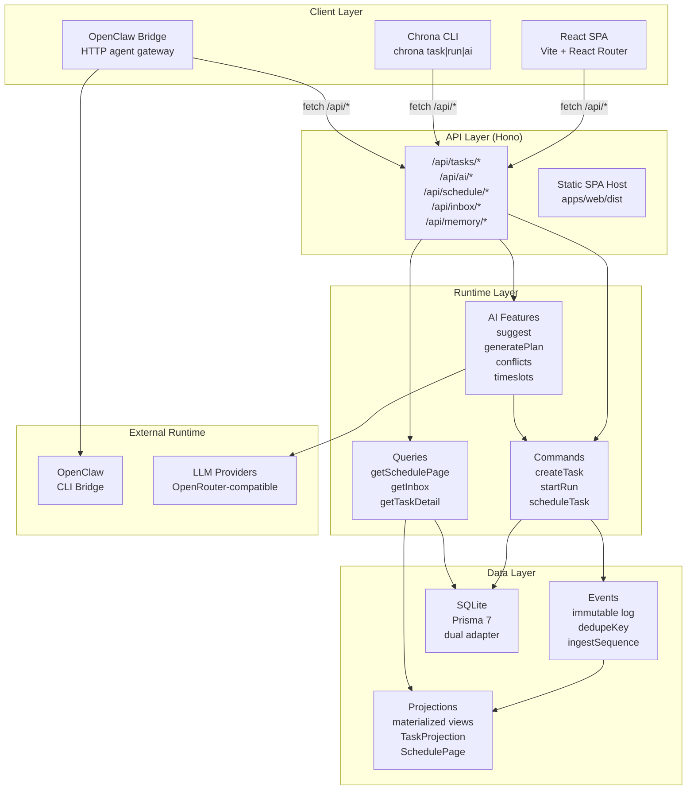
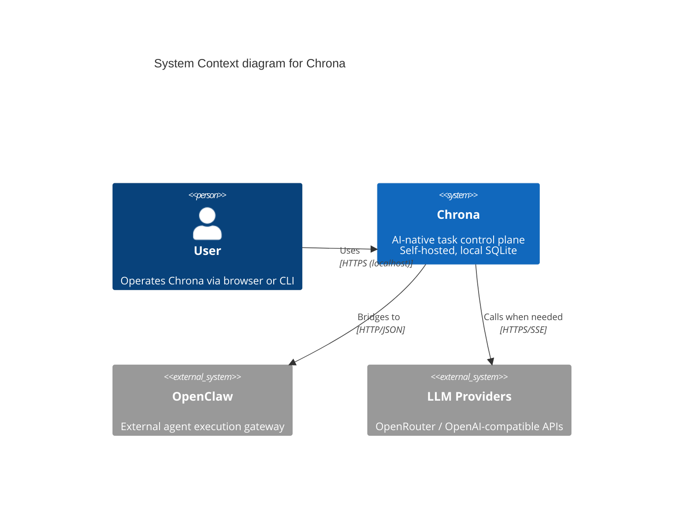
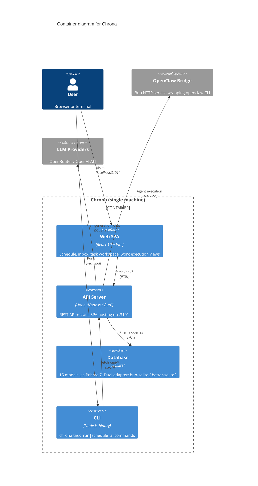
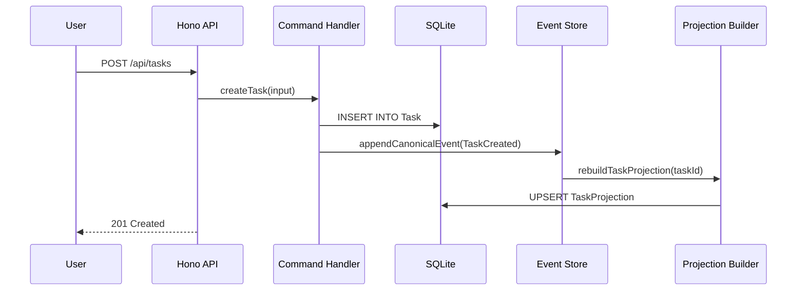
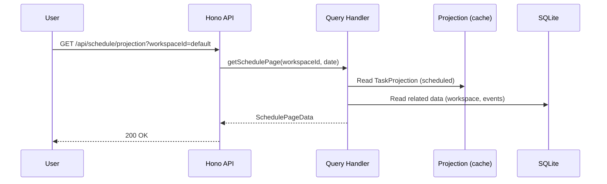
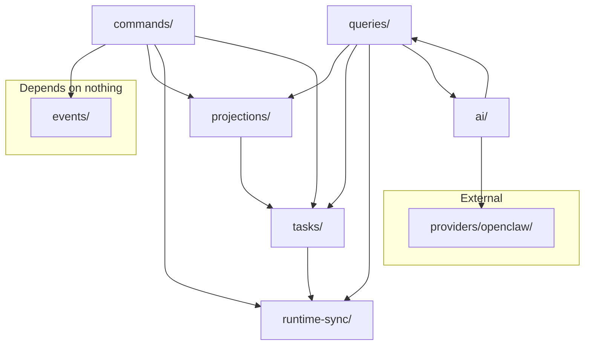
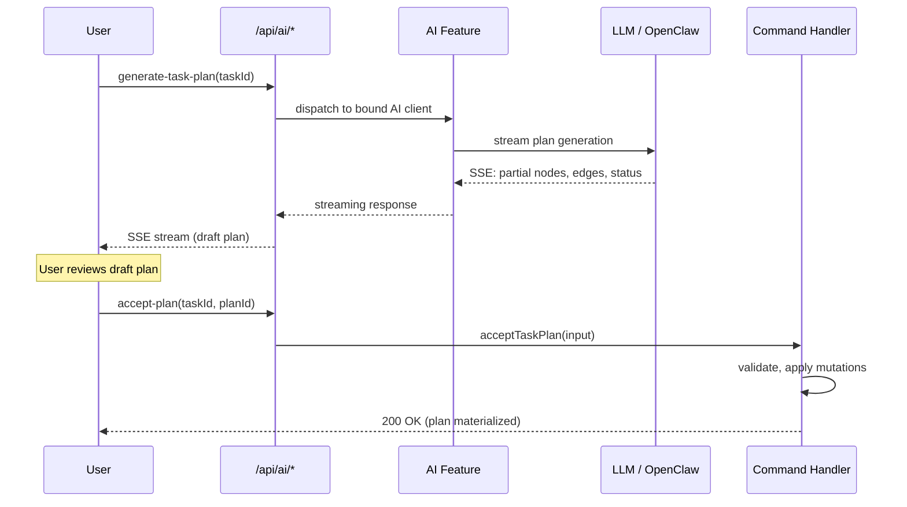

# System Architecture

> **Pattern:** CQRS + Event Sourcing over SQLite
> **Language:** TypeScript (strict)
> **Runtime:** Node.js >= 20 / Bun

---

## Table of Contents

1. [Architecture at a Glance](#architecture-at-a-glance)
2. [Why CQRS + Event Sourcing](#why-cqrs--event-sourcing)
3. [C4: System Context](#c4-system-context)
4. [C4: Container Diagram](#c4-container-diagram)
5. [Data Flow](#data-flow)
6. [Module Dependency Map](#module-dependency-map)
7. [Suggest-Confirm AI Pattern](#suggest-confirm-ai-pattern)
8. [Server Modes](#server-modes)
9. [Architecture Decision Records](#architecture-decision-records-adrs)
10. [Performance & Scale Characteristics](#performance--scale-characteristics)

---

## Architecture at a Glance

Chrona separates **commands** (writes) from **queries** (reads), using an append-only event log as the canonical source of truth. Materialized **projections** are rebuilt from events for efficient querying. AI features follow a **suggest-confirm** pattern — they produce proposals, never direct mutations.



---

## Why CQRS + Event Sourcing

| Benefit | What it means for Chrona |
|---------|--------------------------|
| **Complete audit trail** | Every task lifecycle event is immutable and replayable — trace exactly what happened and when |
| **Read/write separation** | Query projections are optimized for UI rendering; command logic is optimized for consistency |
| **Rebuildable state** | Projections can be rebuilt from events at any time — no drift between write and read models |
| **AI-friendly** | Event streams are naturally suited for AI agent consumption — agents reason over structured event history |
| **Workflow transparency** | Multi-step processes (plan generation, agent execution, approvals) remain observable throughout |

---

## C4: System Context



---

## C4: Container Diagram



---

## Data Flow

### Write Path

Every state mutation flows through the same pipeline:



**Example: Creating a task**

```
POST /api/tasks
  → createTask({ title: "Analyze data", priority: "High" })
    → prisma.task.create({ ... })
    → appendCanonicalEvent({
        eventType: "TaskCreated",
        workspaceId: "default",
        taskId: "cm_abc123",
        actorType: "human",
        payload: { title, priority }
      })
    → rebuildTaskProjection("cm_abc123")
      → prisma.taskProjection.upsert({ displayState: "Draft", ... })
```

### Read Path

All queries go through the same pipeline:



**Example: Loading the schedule page**

```
GET /schedule
  → getSchedulePage(workspaceId, selectedDay)
    → Read TaskProjection rows (filtered by scheduleStatus)
    → Compute focus zones (high-priority task clusters)
    → Compute automation candidates (Ready tasks with accepted plans)
    → Run analyzeConflicts() (deterministic rule engine)
    → Aggregate planning summary
    → Return SchedulePageData { scheduled, unscheduled, atRisk, conflicts, ... }
```

---

## Module Dependency Map



**Rules:**
- `events/` — bottom layer, no dependencies
- `commands/` → `events/`, `projections/`, `runtime-sync/`, `tasks/`
- `queries/` → `projections/`, `tasks/`, `runtime-sync/`, `ai/`
- `tasks/` → `runtime-sync/` only (for config specs)
- `projections/` → `tasks/` only (state derivation)
- `ai/` → `queries/` (plugins need to read data)

---

## Suggest-Confirm AI Pattern

Chrona's core safety mechanism: **AI never writes directly to the data layer.**



**Every AI feature follows this flow:**

1. **Request** — user triggers AI action
2. **Stream** — AI generates a proposal (plan, timeslot, suggestion)
3. **Review** — user inspects the proposal
4. **Confirm** — user accepts → command handler executes the actual mutation

This ensures: no silent data corruption, full auditability, and user remains the final authority.

**Features with rule-engine fallback:**

| Feature | AI Path | Fallback (no LLM needed) |
|---------|---------|---------------------------|
| Conflict detection | LLM analysis | Deterministic time-overlap check |
| Timeslot suggestion | LLM recommendation | Rule-based gap detection |
| Auto-complete | LLM streaming | Keyword matching against existing tasks |
| Task decomposition | LLM plan generation | Template-based breakdown |

Core functionality never requires an LLM to be available.

---

## Server Modes

| Mode | Frontend | Backend | Command |
|------|----------|---------|---------|
| **Development** | Vite dev server (HMR) on `:3100` | Hono API on `:3101` | `bun run dev` |
| **Production (Bun)** | Built SPA served by Hono | Hono on `:3101` | `bun run server:start:bun` |
| **Production (npm)** | Built SPA served by Hono | Hono on `:3101` | `chrona start` |

In production mode, a single Hono server hosts both the static SPA (`apps/web/dist/`) and all API routes on the same port.

---

## Architecture Decision Records (ADRs)

### ADR-1: SQLite over PostgreSQL

**Date:** 2024 · **Status:** Accepted

**Context:** Choose the database for a self-hosted, single-user control plane.

**Decision:** SQLite.

**Rationale:**
- Zero operational overhead — single file, no separate service
- Prisma 7 provides type-safe ORM with SQLite adapter
- Sufficient for personal/small-team task volumes
- Simplifies the `npm install -g` distribution model

**Trade-off:** Lacks concurrent writer support. Acceptable because Chrona is a single-user local app with serial command processing.

### ADR-2: Pragmatic Event Sourcing (not pure ES)

**Date:** 2024 · **Status:** Accepted

**Context:** Full event sourcing (replaying _all_ events to build _all_ state) is complex to implement and debug.

**Decision:** Hybrid approach — commands write to both business tables (Task, Run, etc.) and the Event table simultaneously. Projections are rebuilt on event triggers but can also be recomputed from business tables if needed.

**Rationale:**
- Direct business table writes give immediate consistency for simple CRUD
- Event log provides audit trail and AI-consumable history
- Projection tables provide optimized UI reads without replaying full event streams
- If events and business tables diverge, projections are the reconcilable surface

### ADR-3: Dual AI Engine (rule engine + LLM)

**Date:** 2024 · **Status:** Accepted

**Context:** How to ensure core product functionality works even without an LLM configured.

**Decision:** Every AI feature has a deterministic rule-engine implementation. LLM integration is an enhancement, not a requirement.

**Rationale:**
- Users should get basic value before configuring an LLM
- Conflict detection and timeslot suggestion work with pure date math
- Product remains useful at zero AI cost
- LLM adds semantic understanding where the rule engine can't (e.g., "this task sounds like a bug fix, schedule it earlier")

### ADR-4: Provider Adapter Pattern

**Date:** 2025 · **Status:** Accepted

**Context:** Support multiple AI runtimes (OpenClaw, Hermes, Opencode, bare LLM) without changing the product model.

**Decision:** Define `RuntimeExecutionAdapter` in `packages/common/runtime-core/` as the canonical interface. Each provider (openclaw, hermes) implements it.

**Rationale:**
- Decouples provider-specific code from the runtime module
- Tasks, schedules, and plans remain provider-agnostic
- Enables A/B testing and gradual migration between runtimes

---

## Performance & Scale Characteristics

| Dimension | Characteristic |
|-----------|---------------|
| **Target scale** | 1-10 workspaces, 100-1000 tasks per workspace |
| **Database** | SQLite with WAL mode (concurrent reads) |
| **Read path** | Projections pre-computed; single SELECT for most page loads |
| **Write path** | Serial commands via CQRS pattern; typical latency < 50ms |
| **AI operations** | Asynchronous via SSE streaming; non-blocking to API |
| **Agent execution** | Delegated to external runtimes (OpenClaw bridge); Chrona polls for sync |
| **Scheduler** | Configurable polling interval (`AUTO_START_SCHEDULER_INTERVAL_MS`); lightweight DB scan |

---

## Directory Structure

```
apps/
  web/                          — Vite React SPA
    src/
      router.tsx                — React Router routes (locale-prefixed)
      pages.tsx                 — Page component bindings
      components/               — UI components (schedule, work, inbox, memory, tasks, ui)
      i18n/                     — Locale config and message bundles (en.json, zh.json)
      styles/                   — Global styles (Tailwind v4)
  server/                       — Hono API server + static SPA host
    src/
      app.ts                    — Hono app composition (CORS, locale redirect, middleware)
      routes/api.ts             — API route handlers (40+ endpoints)
      index.ts                  — Node.js entry
      index.bun.ts              — Bun entry
      static/spa.ts             — SPA static file middleware

packages/
  cli/                          — npm entry point (@chrona-org/cli)
  common/
    cli/                        — CLI commands (task, run, schedule, ai)
    ai-features/                — Shared AI feature surface (generatePlan, suggest, conflicts)
    runtime-core/               — RuntimeExecutionAdapter interface
  contracts/                    — Shared DTOs, Zod schemas, API contracts
  db/                           — Prisma bootstrap, repository layer, generated client
  domain/                       — Pure business rules, state derivations (no IO)
  runtime/
    src/modules/
      commands/                 — Command handlers (write path, 30+ handlers)
      queries/                  — Query handlers (read path, 9 page queries)
      projections/              — Projection rebuilders
      events/                   — Canonical event store interface
      tasks/                    — Task domain logic
      task-execution/           — Session & execution registry
      runtime-sync/             — Runtime sync & freshness management
      scheduler/                — Auto-start scheduled runs
      ai/                       — AI feature handlers
      workspaces/               — Workspace logic
  providers/
    openclaw/                   — OpenClaw bridge (standalone Bun service) + integration (adapter)
    hermes/                     — Hermes provider (planned)
    opencode/                   — Opencode provider (planned)
```
