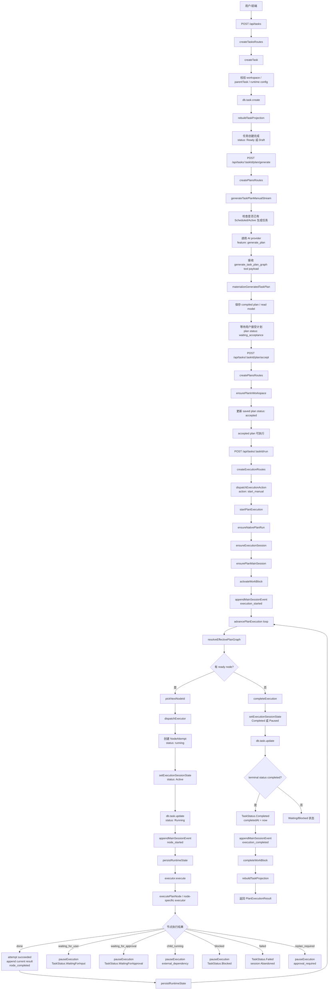
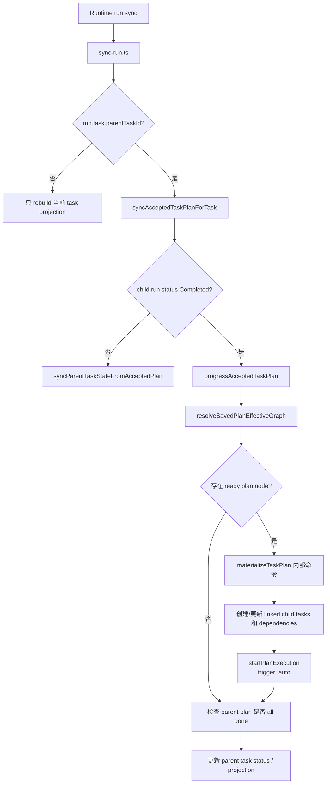
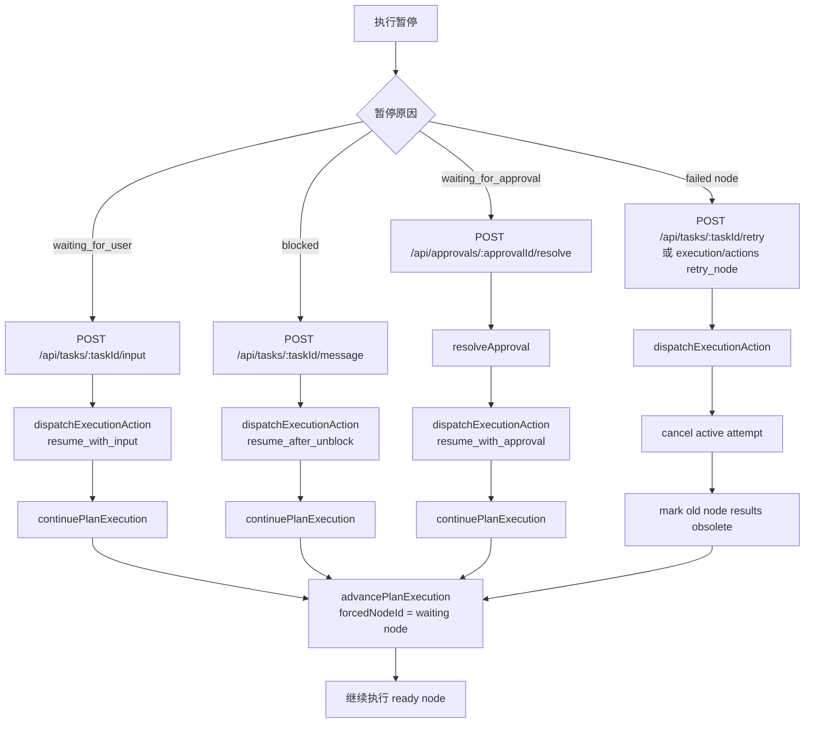

# Backend Execution Flow

本文档描述 Chrona 后端从用户创建任务到计划执行完成的主流程。当前实现以 Hono route 作为 HTTP 入口，业务逻辑主要落在 `packages/engine/src/modules/*`，执行编排由 `packages/engine/src/modules/plan-execution/plan-runner.ts` 驱动。

当前 `apps/server/src/routes/plans.routes.ts` 暴露的 plan 路由只有：

- `GET /api/tasks/:taskId/plan/state`
- `POST /api/tasks/:taskId/plan/accept`
- `POST /api/tasks/:taskId/plan/generate/stop`
- `POST /api/tasks/:taskId/plan/generate`
- `POST /api/tasks/:taskId/plan`

`/plan/materialize` 和 `/plan/mutations` 不是当前公开后端主流程的一部分。`materializeTaskPlan()` 仍是内部命令，会由 `progressAcceptedTaskPlan()` 在 accepted plan 自动推进 child tasks 时调用；它不应画成用户 HTTP 主链路。

## End-to-End Flow



## Internal Child Task Progression

Accepted parent plans can also progress through an internal synchronization path after child runtime runs complete. This is not a public `/plan/materialize` route.



## Pause And Resume Flow



## Text Diagram

```text
用户创建任务
  |
  v
POST /api/tasks
  |
  v
createTasksRoutes -> createTask
  |
  +-- 校验 workspace / parent task / runtime config
  +-- db.task.create
  +-- rebuildTaskProjection
  |
  v
Task: Ready 或 Draft
  |
  v
POST /api/tasks/:taskId/plan/generate
  |
  v
generateTaskPlanManualStream
  |
  +-- 调 AI provider: generate_plan
  +-- 接收 generate_task_plan_graph
  +-- materializeGeneratedTaskPlan
  +-- 保存 compiled plan / read model
  |
  v
Plan: waiting_acceptance
  |
  v
POST /api/tasks/:taskId/plan/accept
  |
  v
Plan: accepted
  |
  v
POST /api/tasks/:taskId/run
  |
  v
dispatchExecutionAction(start_manual)
  |
  v
startPlanExecution
  |
  +-- ensureNativePlanRun
  +-- ensureExecutionSession
  +-- ensurePlanMainSession
  +-- activateWorkBlock
  +-- event: execution_started
  |
  v
advancePlanExecution loop
  |
  +-- resolveEffectivePlanGraph
  +-- pickNextNodeId
  +-- dispatchExecutor
  +-- create NodeAttempt(running)
  +-- task.status = Running
  +-- event: node_started
  +-- persistRuntimeState
  |
  v
executor.execute / executePlanNode
  |
  +-- done: 写 node result，event node_completed，继续 loop
  +-- waiting_for_user: pauseExecution，TaskStatus.WaitingForInput
  +-- waiting_for_approval: pauseExecution，TaskStatus.WaitingForApproval
  +-- child_running: pauseExecution，等待 child task/session
  +-- blocked: pauseExecution，TaskStatus.Blocked
  +-- failed: TaskStatus.Failed，session Abandoned
  +-- replan_required: pauseExecution，等待审批/改计划
  |
  v
无 ready node
  |
  v
completeExecution
  |
  +-- setExecutionSessionState Completed/Paused
  +-- 如果 completed: task.status = Completed, completedAt = now
  +-- event: execution_completed
  +-- completeWorkBlock
  +-- rebuildTaskProjection
  |
  v
返回 PlanExecutionResult
```

## Source Map

| Area | File | Role |
|------|------|------|
| Task routes | `apps/server/src/routes/tasks.routes.ts` | `POST /tasks` creates tasks and validates task payloads. |
| Plan routes | `apps/server/src/routes/plans.routes.ts` | Current public plan endpoints: state, generate, generate stop, accept, and high-level patch via `POST /tasks/:taskId/plan`. |
| Execution routes | `apps/server/src/routes/execution.routes.ts` | Run, retry, input, message, done, reopen, result accept, follow-up, and approval resolve endpoints. |
| Task command | `packages/engine/src/modules/commands/create-task.ts` | Validates runtime settings, creates `Task`, rebuilds projection. |
| Plan generation | `packages/engine/src/modules/commands/generate-task-plan-manual-stream.ts` | Streams AI plan generation and persists generated plans. |
| Internal plan materialization | `packages/engine/src/modules/commands/materialize-task-plan.ts` | Internal command used by `progressAcceptedTaskPlan()` to convert accepted plan nodes into child tasks and dependencies. Not exposed as a current public route. |
| Parent plan progression | `packages/engine/src/modules/commands/progress-accepted-task-plan.ts` | Syncs accepted parent plans after child run completion, materializes ready child tasks internally, and starts child execution with `trigger: "auto"`. |
| Runtime sync | `packages/engine/src/modules/runtime-sync/sync-run.ts` | Synchronizes provider run status and triggers parent accepted-plan progression when child runs complete. |
| Plan execution | `packages/engine/src/modules/plan-execution/plan-runner.ts` | Owns `dispatchExecutionAction`, `startPlanExecution`, `continuePlanExecution`, `advancePlanExecution`, and `completeExecution`. |
| Node execution | `packages/engine/src/modules/plan-execution/node-executor.ts` | Executes one effective plan node through runtime or child-session logic. |

## Execution Status Outcomes

| Node result | Backend effect |
|-------------|----------------|
| `done` | Attempt succeeds, current node result is appended, `node_completed` event is written, loop continues. |
| `waiting_for_user` | Runtime state persists and task pauses as `WaitingForInput`. Resume via `POST /api/tasks/:taskId/input`. |
| `waiting_for_approval` | Runtime state persists and task pauses as `WaitingForApproval`. Resume through approval resolution. |
| `child_running` | Task pauses on external dependency while child session/run continues. |
| `blocked` | Task pauses as `Blocked` with `blockReason`. Resume via message/unblock action. |
| `failed` | Task becomes `Failed`; execution session is abandoned. |
| `replan_required` | Task pauses for approval/review with replan context. |
