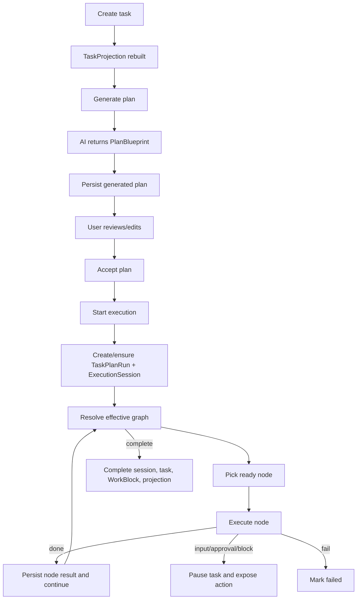

# Backend Execution Flow

This document traces the current backend path from task creation to plan execution. The HTTP entrypoint is `apps/server/src/routes/**`; application logic lives primarily in `packages/engine/src/modules/**`; graph mechanics live in `packages/graph-runtime`.

## Route map for execution-related work

| Area | Endpoint |
| --- | --- |
| Task CRUD | `GET/POST /api/tasks`, `GET/PATCH/DELETE /api/tasks/:taskId` |
| Plan state | `GET /api/tasks/:taskId/plan` |
| Plan generation | `POST /api/tasks/:taskId/plan/generations` |
| Active generation | `GET /api/tasks/:taskId/plan/generations/active` |
| Active generation SSE | `GET /api/tasks/:taskId/plan/generations/active/events` |
| Stop generation | `POST /api/tasks/:taskId/plan/generations/stop` |
| Accept plan | `POST /api/tasks/:taskId/plan/accept` |
| Patch plan | `POST /api/tasks/:taskId/plan` |
| Current execution | `GET /api/tasks/:taskId/execution/current` |
| Execution action SSE | `POST /api/tasks/:taskId/execution/actions` |
| Checkpoint action SSE | `POST /api/tasks/:taskId/execution/checkpoint/:checkpointId/actions` |
| Work projection | `GET /api/work/:taskId` |
| Work command | `POST /api/work/:taskId/commands` |
| Work events | `GET /api/work/:taskId/events` |
| MCP tools | `POST /api/mcp` |

## End-to-end flow

## Task creation

`POST /api/tasks` validates the request against supported execution runtimes, creates the `Task`, and rebuilds the `TaskProjection`. A task can be ready for manual planning/execution, scheduled, or nested under a parent task.

Source anchors:

- `apps/server/src/routes/tasks/crud.routes.ts`
- `packages/engine/src/modules/tasks/create-task.ts`
- `packages/engine/src/modules/projections/rebuild-task-projection.ts`

## Plan generation

`POST /api/tasks/:taskId/plan/generations` starts a generation session. When called with `Accept: text/event-stream`, the route streams progress events:

- `status`
- `tool_call`
- `partial`
- `result`
- `error`
- `cancelled`
- `done`
- `heartbeat`

The generation module calls the configured AI client for the `generate_plan` feature and persists the resulting plan graph.

Source anchors:

- `apps/server/src/routes/tasks/plan.routes.ts`
- `packages/engine/src/modules/plans/generate-task-plan-manual-stream.ts`
- `packages/engine/src/modules/ai/features/generate-plan.ts`
- `packages/contracts/src/ai.ts`

## Plan review, patch, and acceptance

Users can inspect the generated plan, apply patch operations through `POST /api/tasks/:taskId/plan`, and accept the plan through `POST /api/tasks/:taskId/plan/accept`. Acceptance makes the plan executable and prepares it for plan-run state.

## Execution actions

`POST /api/tasks/:taskId/execution/actions` dispatches an execution action and streams graph/runtime progress over SSE.

Common actions:

- `start_manual`
- `resume_with_input`
- `resume_with_approval`
- `retry_node`
- `resume_after_unblock`
- `complete_manual_node`
- `fail_current_node`
- `cancel_session`

The engine owns idempotency, session state, graph advancement, node attempts, runtime dispatch, pause/resume behavior, and task status transitions.

Source anchors:

- `apps/server/src/routes/tasks/execution.routes.ts`
- `packages/engine/src/modules/plan-execution/facade/task-plan-execution.facade.ts`
- `packages/engine/src/modules/plan-execution/runtime/node-executor-registry.ts`
- `packages/engine/src/modules/plan-execution/runtime/graph-runtime-callbacks.ts`

## Node outcomes

| Outcome | Backend effect |
| --- | --- |
| `done` | Persist node result, mark attempt complete, append graph event, continue to next ready node |
| `waiting_for_user` | Pause as `WaitingForInput`; expose input action |
| `waiting_for_approval` | Pause as `WaitingForApproval`; expose approval action |
| `child_running` | Pause while child run/session continues |
| `blocked` | Pause as `Blocked` with recovery form/reason |
| `failed` | Mark task/session failed unless retry action is later submitted |
| `replan_required` | Pause for plan review or approval |

## Context segments

Provider sessions are not the same as Chrona execution sessions. Chrona should use context segments as the default long-task provider-session boundary: related plan nodes share one provider task session, then Chrona writes a structured segment summary and switches to the next segment session.

This avoids two failure modes:

- One provider session for the whole task makes Chrona depend on opaque provider-side context compression and risks context pollution across unrelated nodes.
- One provider session per node loses useful short-term working context between tightly related nodes.

`WorkBlock` should remain the scheduling/time container. A `WorkBlock` can contain one or more context segments. Segment policy belongs in `packages/engine`, while providers only create, resume, or virtualize native sessions.

## Checkpoint actions

`POST /api/tasks/:taskId/execution/checkpoint/:checkpointId/actions` maps checkpoint-level actions onto execution continuation actions. It supports input submission, result approval/rejection, replan decisions, retry, unblock, manual completion/skip, fail, and cancel.

## Work page command flow

The Work page uses asynchronous commands:

1. `POST /api/work/:taskId/commands` validates and accepts the command.
2. The server publishes a command accepted event.
3. The server dispatches the corresponding plan/execution/checkpoint operation.
4. Runtime and graph events update task workspace events.
5. The browser listens through `GET /api/work/:taskId/events` and refreshes projection state.

Supported command categories include plan generation, plan acceptance, execution actions, and checkpoint actions.

## MCP result submission flow

External agents use `POST /api/mcp` tools. Chrona injects hidden context such as session ID, task ID, expected revision, and idempotency key. Public tool inputs expose only the AI-safe payload, including node/branch refs where needed.

Important rule: agents must not invent backend IDs. They should call read tools only when state is missing or stale, and submit final node outcomes with the appropriate Chrona tool.

## Completion

When no ready nodes remain, the runner completes or pauses the execution session, updates the task status, completes the WorkBlock when applicable, appends execution events, and rebuilds projections. Work, Schedule, and Inbox then reflect the updated state.
