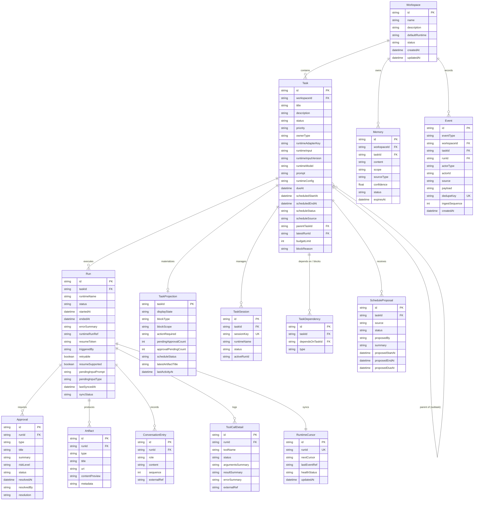
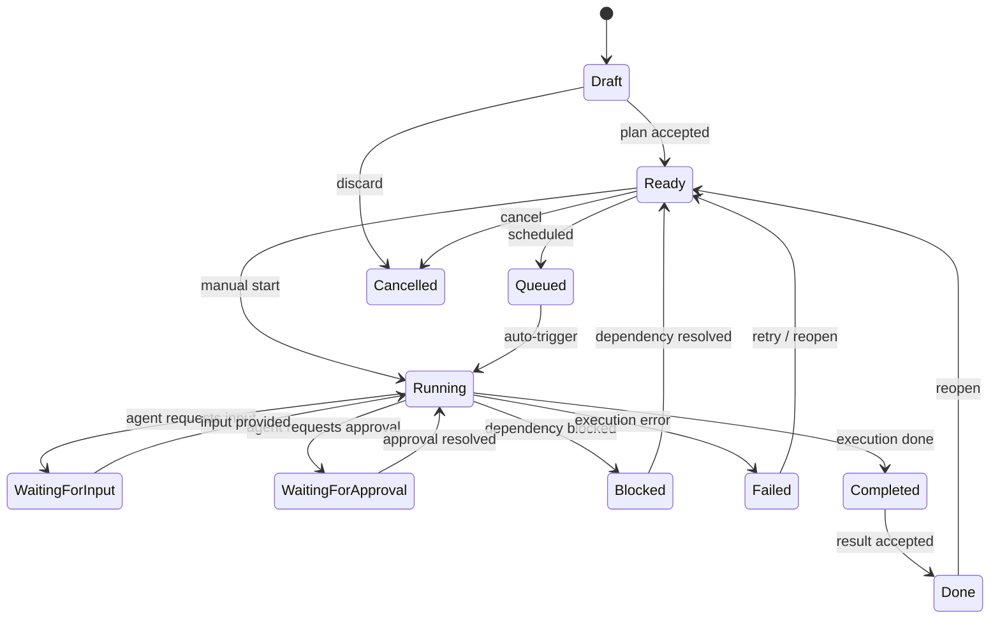
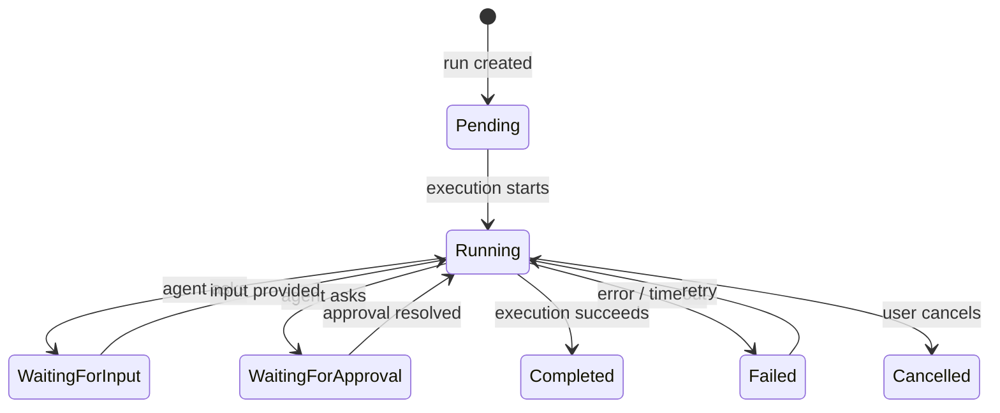
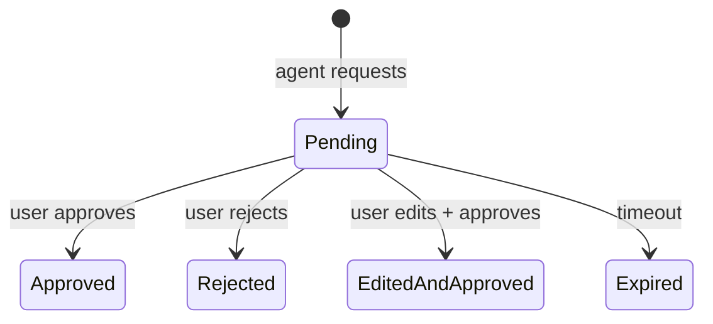

# Data Model

> **Database:** SQLite via Prisma 7
> **Models:** 15
> **Enums:** 10+
> **Migration:** auto-run on first `chrona start`

---

## Table of Contents

1. [Entity Relationship Diagram](#entity-relationship-diagram)
2. [Domain Aggregates](#domain-aggregates)
3. [State Machines](#state-machines)
4. [Index Strategy](#index-strategy)
5. [Enum Reference](#enum-reference)

---

## Entity Relationship Diagram



---

## Domain Aggregates

### 1. Workspace Aggregate

```
Workspace (root)
  ├── Task[]
  │     ├── Run[]
  │     │     ├── Approval[]
  │     │     ├── Artifact[]
  │     │     ├── ConversationEntry[]
  │     │     ├── ToolCallDetail[]
  │     │     └── RuntimeCursor (1:1)
  │     ├── TaskSession[]
  │     ├── TaskDependency[]
  │     ├── ScheduleProposal[]
  │     ├── TaskProjection (1:1)
  │     └── Task[] (subtasks, recursive)
  ├── Memory[]
  └── Event[]
```

- **Workspace** is the top-level isolation boundary
- **Task** is the core work unit, containing all execution data
- **Run** models a single agent execution episode
- **TaskProjection** is a denormalized materialized view optimized for list/schedule rendering
- **Event** is the immutable audit log, cross-cutting all aggregates

### 2. Task Lifecycle Fields

Tasks carry three categories of fields:

| Category | Fields | Purpose |
|----------|--------|---------|
| **Identity** | title, description, priority, ownerType | What the task is |
| **Runtime** | runtimeAdapterKey, runtimeModel, prompt, runtimeConfig | How to execute it |
| **Schedule** | scheduledStartAt, scheduledEndAt, dueAt, scheduleStatus, scheduleSource | When to execute it |

This separation enables tasks that have a schedule but no runtime config (planning phase) and tasks with a runtime config but no schedule (manual execution).

### 3. Task Plan Graph (stored externally)

Task plans are stored as graph objects outside the relational model:

```typescript
interface TaskPlanGraph {
  id: string
  taskId: string
  status: "draft" | "accepted" | "archived"
  summary: string | null
  nodes: TaskPlanNode[]
  edges: TaskPlanEdge[]
  createdAt: Date
  updatedAt: Date
  generatedBy?: string  // AI client ID
}

interface TaskPlanNode {
  id: string
  type: "step" | "checkpoint" | "decision" | "user_input" | "deliverable" | "tool_action"
  title: string
  objective: string | null
  status: "pending" | "in_progress" | "completed" | "blocked" | "skipped"
  executionMode: "auto" | "manual" | "hybrid"
  estimatedMinutes: number | null
  actualMinutes: number | null
  order: number
  metadata: Record<string, unknown> | null
}

interface TaskPlanEdge {
  id: string
  fromNodeId: string
  toNodeId: string
  type: "sequential" | "parallel" | "conditional" | "feedback" | "dependency"
  label: string | null
}
```

The plan graph is mutable by users (via patch operations) and by AI (via suggest-confirm proposals).

---

## State Machines

### Task Status Lifecycle



12 statuses. The display-state projection further refines these into UI-friendly labels (e.g., `AttentionNeeded` when pending approvals exist).

### Run Status Lifecycle



### Approval Status Lifecycle



### Schedule Status Map

| Status | Condition |
|--------|-----------|
| `Unscheduled` | No time block assigned |
| `Scheduled` | Has future scheduledStartAt / scheduledEndAt |
| `InProgress` | Currently within the scheduled window |
| `AtRisk` | Scheduled start approaching, plan not accepted |
| `Overdue` | Past dueAt without completion |
| `Interrupted` | Scheduled window passed, not completed |
| `Completed` | Task completed within or after schedule |

---

## Index Strategy

| Table | Index | Purpose |
|-------|-------|---------|
| Task | `[workspaceId, status]` | Filter tasks by workspace + status (list views) |
| Task | `[workspaceId, priority]` | Sort by priority within workspace |
| Task | `[workspaceId, scheduleStatus]` | Schedule page — filter by schedule state |
| TaskProjection | `taskId` (PK) | Lookup by task (1:1) |
| TaskDependency | `UNIQUE [taskId, dependsOnTaskId]` | Guarantee no duplicate dependencies |
| TaskSession | `sessionKey` (unique) | Lookup sessions by external key |
| Run | `runtimeRunRef` (unique) | Lookup runs by runtime-side reference |
| Run | `[taskId, status]` | Find active/pending runs for a task |
| Event | `dedupeKey` (unique) | Ensure exactly-once event writing |
| Event | `[workspaceId, createdAt]` | Time-ordered event streams per workspace |
| RuntimeCursor | `runId` (unique) | 1:1 sync state per run |
| Memory | `[workspaceId, status, scope]` | Query active memories by scope |

---

## Enum Reference

### TaskStatus

| Value | Description |
|-------|-------------|
| `Draft` | Initial state, no plan accepted |
| `Ready` | Plan accepted, ready to schedule/run |
| `Queued` | Scheduled and waiting for auto-start |
| `Running` | Agent currently executing |
| `WaitingForInput` | Agent paused, waiting for user input |
| `WaitingForApproval` | Agent paused, waiting for user approval |
| `Blocked` | Blocked by uncompleted dependency |
| `Failed` | Execution failed with error |
| `Completed` | Execution finished |
| `Done` | Result accepted, task closed |
| `Cancelled` | Task discarded |
| `Scheduled` | (legacy, mapped to Queued) |

### TaskPriority

`Low` | `Medium` | `High` | `Urgent`

### RunStatus

`Pending` | `Running` | `WaitingForInput` | `WaitingForApproval` | `Failed` | `Completed` | `Cancelled`

### ApprovalStatus

`Pending` → `Approved` | `Rejected` | `EditedAndApproved` | `Expired`

### MemoryStatus

`Active` | `Inactive` | `Conflicted` | `Expired`

### MemoryScope

`user` — global user-level knowledge · `workspace` — workspace-scoped · `project` — project-scoped (future) · `task` — per-task

### MemorySourceType

`user_input` — manually entered · `agent_inferred` — deduced by AI · `imported` — external source · `system_rule` — fixed rules

### ArtifactType

`file` | `patch` | `summary` | `report` | `terminal_output` | `url`

### TaskDependencyType

`blocks` — predecessor must complete first · `relates_to` — informational link · `child_of` — parent-child hierarchy

### ScheduleSource

`human` | `ai` | `system`

### OwnerType

`human` | `agent`
