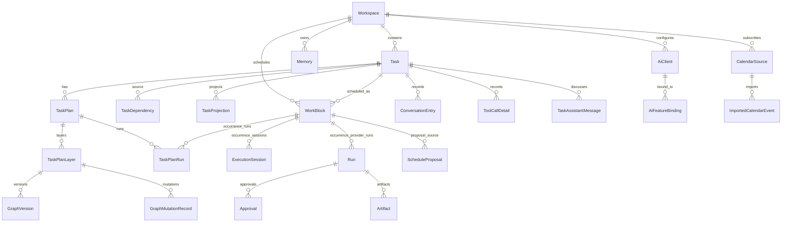

# Data Model

Chrona persists task, schedule, execution, memory, and AI-client state in SQLite through Prisma 7.

Schema source: `prisma/schema.prisma`.

Current schema inventory:

- Models: 36
- Enums: 24

## Main aggregates

| Aggregate | Key models | Purpose |
| --- | --- | --- |
| Workspace | `Workspace` | Scope for tasks, memory, schedule, calendar sources, and configuration. |
| Task | `Task`, `TaskDependency`, `TaskProjection`, `TaskSession`, `TaskTimelineItem` | Core work item, relationships, projection-backed read shape, scoped work sessions, and timeline rows. |
| Plan | `TaskPlan`, `TaskPlanLayer`, `GraphVersion`, `GraphMutationRecord`, `ReconciliationEvent`, `TaskPlanNodeAttempt`, `TaskPlanTerminalAction` | Generated/accepted executable graph plan, node-attempt history, terminal actions, and graph-change history. |
| Execution | `TaskPlanRun`, `Run`, `ExecutionSession`, `RuntimeCursor`, `Approval`, `Artifact`, `TaskPlanProviderRun`, `TaskPlanProviderApproval`, `RunToken` | Plan/run/session state, runtime cursoring, provider continuity, approvals, tokens, and outputs. |
| Schedule | `WorkBlock`, `ScheduleProposal`, `SchedulerLease`, `SchedulerEvent` | Time blocks, schedule suggestions, automation leasing, and scheduler events. |
| External calendar | `CalendarSource`, `ImportedCalendarEvent` | Read-only calendar subscriptions, sync status, imported busy events, and calendar-backed schedule context. |
| Conversation/tool history | `ConversationEntry`, `ToolCallDetail`, `ToolInvocation`, `TaskAssistantMessage`, `RawEventLog` | User/assistant conversation, runtime tool-call detail, invocation records, and raw event audit data. |
| Memory | `Memory` | Workspace/task memory entries shown in Memory Console. |
| AI configuration | `AiClient`, `AiFeatureBinding` | Database-backed AI clients and feature-to-client bindings. |
| Event log | `Event` | Durable event records used by projections/integration flows. |

## Entity relationship overview

```mermaid
erDiagram
  Workspace ||--o{ Task : contains
  Workspace ||--o{ Memory : owns
  Workspace ||--o{ AiClient : configures
  Workspace ||--o{ WorkBlock : schedules

  Task ||--o{ TaskDependency : source
  Task ||--o{ TaskProjection : projects
  Task ||--o{ TaskPlan : has
  Task ||--o{ WorkBlock : scheduled_as
  Task ||--o{ ConversationEntry : records
  Task ||--o{ ToolCallDetail : records
  Task ||--o{ TaskAssistantMessage : discusses

  TaskPlan ||--o{ TaskPlanLayer : layers
  TaskPlan ||--o{ TaskPlanRun : runs
  TaskPlanLayer ||--o{ GraphVersion : versions
  TaskPlanLayer ||--o{ GraphMutationRecord : mutations

  WorkBlock ||--o{ TaskPlanRun : occurrence_runs
  WorkBlock ||--o{ ExecutionSession : occurrence_sessions
  WorkBlock ||--o{ Run : occurrence_provider_runs
  Run ||--o{ Approval : approvals
  Run ||--o{ Artifact : artifacts

  AiClient ||--o{ AiFeatureBinding : bound_to
  WorkBlock ||--o{ ScheduleProposal : proposal_source
  Workspace ||--o{ CalendarSource : subscribes
  CalendarSource ||--o{ ImportedCalendarEvent : imports
```

## Task state

Important enums:

- `TaskStatus`
- `TaskPriority`
- `TaskDependencyType`

Tasks are the canonical work records. `TaskProjection` stores read-optimized task state used by app surfaces after create/update/lifecycle/result changes.

`TaskStatus.Completed` and `TaskStatus.Done` are both terminal, but they are not interchangeable today:

- `Completed` means Chrona/runtime execution reached a completed state, including imported calendar tasks auto-completed by sync policy.
- `Done` means the user explicitly accepted or closed the task outcome after completion; derivation keeps `Done` stable and does not downgrade it to runtime-derived `Completed`.

New code should use `Completed` for runtime/import completion and reserve `Done` for explicit user closure until the enum is consolidated.

Typical lifecycle actions:

- create
- update
- complete
- reopen
- delete
- attach result
- schedule through work blocks
- generate/accept/execute plan

## Plan and graph state

Important models:

- `TaskPlan`
- `TaskPlanLayer`
- `GraphVersion`
- `GraphMutationRecord`
- `ReconciliationEvent`

Important enum:

- `TaskPlanStatus`
- `GraphMutationStatus`

A generated plan blueprint becomes executable only after acceptance/materialization. Layers hold graph snapshots and execution context. Graph mutation/reconciliation records support plan evolution and traceability.

## Execution state

Important models:

- `TaskPlanRun`
- `Run`
- `ExecutionSession`
- `RuntimeCursor`
- `Approval`
- `Artifact`

Important enums:

- `RunStatus`
- `ExecutionSessionStatus`
- `ApprovalStatus`
- `ArtifactType`

Execution records distinguish Chrona plan-run state from external runtime/provider runs. `ExecutionSession` is the server-side scope for AI-visible refs. `RuntimeCursor` tracks provider stream/progress cursoring. Approvals and artifacts store intervention and output records.

Execution is occurrence-scoped. A recurring `Task` shares one row across many
`WorkBlock` occurrences, so `TaskPlanRun`, `ExecutionSession`, and `Run` each
carry a `workBlockId` that pins them to a single occurrence. `Run` also stores
`errorSummary`, the authoritative provider failure cause surfaced to the read
model. The projection committer (`rebuildTaskProjection`) scopes its
runs/sessions/approvals to the occurrence that most recently executed, so a
failed or cancelled occurrence never contaminates a sibling occurrence. See
`docs/backend-execution-flow.md` → "Task state authority".

## Schedule state

Important models:

- `WorkBlock`
- `ScheduleProposal`
- `SchedulerLease`
- `SchedulerEvent`

Important enums:

- `ScheduleStatus`
- `ScheduleSource`
- `ScheduleProposalStatus`
- `WorkBlockStatus`
- `WorkBlockTrigger`

Schedule state supports user-created and AI-suggested time blocks, proposal decision workflows, scheduler automation leasing, and due-work startup.

## External calendar state

Important models:

- `CalendarSource`
- `ImportedCalendarEvent`

Important enums:

- `CalendarSourceLifecycleState`
- `CalendarEventStatus`
- `CalendarSyncState`
- `CalendarSyncPolicy`
- `CalendarAutomationPolicy`

External calendars are read-only subscription sources. Source URLs stay server-side; browser responses use redacted labels. Imported events become read-only busy blocks for schedule/planning context and can drive auto-plan/auto-complete behavior according to source sync and automation policies.

## Conversation, tool, and assistant state

Important models:

- `ConversationEntry`
- `ToolCallDetail`
- `ToolInvocation`
- `TaskAssistantMessage`
- `RawEventLog`
- `TaskTimelineItem`

These records back Work page conversation/execution context, assistant surfaces, runtime/tool-call inspection, raw provider/runtime event audits, and task timeline projections.

## Memory state

Important model:

- `Memory`

Important enums:

- `MemoryScope`
- `MemorySourceType`
- `MemoryStatus`

Memory entries are scoped to workspace/task context and exposed through Memory Console and AI context-building flows.

## AI client configuration

Important models:

- `AiClient`
- `AiFeatureBinding`

Chrona stores AI client configuration in the database and binds clients to feature slots. `packages/engine/src/modules/ai` loads clients directly from this configuration; provider selection is not hard-coded in routes.

## Workspace and task-kind state

Important enums:

- `WorkspaceStatus`
- `TaskKind`

Workspaces can be lifecycle-gated independently from task state. `TaskKind` distinguishes native Chrona tasks from imported/synthetic task records that exist to project external schedule context.

## Operational notes

- Prisma client generation: `bun run db:generate`
- Seed local data: `bun run db:seed`
- Push schema in development: `bun run db:push`
- Create development migration: `bun run db:migrate`

Do not edit generated Prisma client files. Update `prisma/schema.prisma`, then regenerate.
