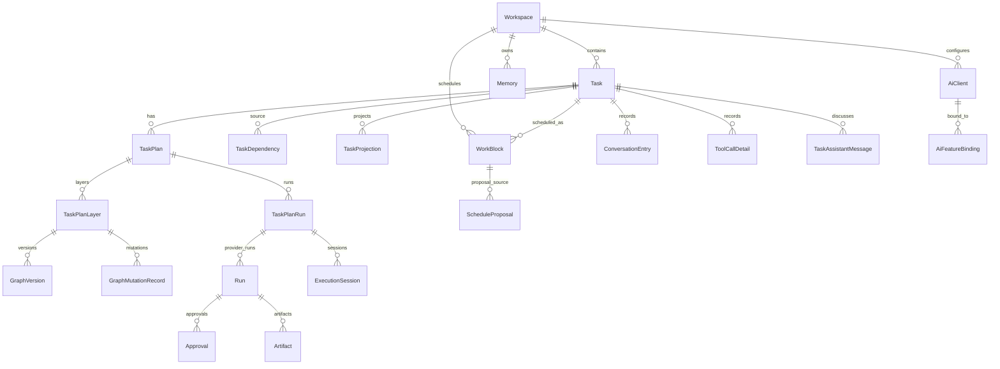

# Data Model

Chrona persists task, schedule, execution, memory, and AI-client state in SQLite through Prisma 7.

Schema source: `prisma/schema.prisma`.

Current schema inventory:

- Models: 27
- Enums: 18

## Main aggregates

| Aggregate | Key models | Purpose |
| --- | --- | --- |
| Workspace | `Workspace` | Scope for tasks, memory, schedule, and configuration. |
| Task | `Task`, `TaskDependency`, `TaskProjection` | Core work item, relationships, and projection-backed read shape. |
| Plan | `TaskPlan`, `TaskPlanLayer`, `GraphVersion`, `GraphMutationRecord`, `ReconciliationEvent` | Generated/accepted executable graph plan and graph-change history. |
| Execution | `TaskPlanRun`, `Run`, `ExecutionSession`, `RuntimeCursor`, `Approval`, `Artifact` | Plan/run/session state, runtime cursoring, approvals, and outputs. |
| Schedule | `WorkBlock`, `ScheduleProposal`, `SchedulerLease`, `SchedulerEvent` | Time blocks, schedule suggestions, automation leasing, and scheduler events. |
| Conversation/tool history | `ConversationEntry`, `ToolCallDetail`, `TaskAssistantMessage` | User/assistant conversation and runtime tool-call detail. |
| Memory | `Memory` | Workspace/task memory entries shown in Memory Console. |
| AI configuration | `AiClient`, `AiFeatureBinding` | Database-backed AI clients and feature-to-client bindings. |
| Event log | `Event` | Durable event records used by projections/integration flows. |

## Entity relationship overview

```mermaid
erDiagram
  Workspace ||--o{ Task : contains
  Workspace ||--o{ Memory : owns
  Workspace ||--o{ AiClient : configures
  Workspace ||--o{ WorkBlock : schedules

  Task ||--o{ TaskDependency : source
  Task ||--o{ TaskProjection : projects
  Task ||--o{ TaskPlan : has
  Task ||--o{ WorkBlock : scheduled_as
  Task ||--o{ ConversationEntry : records
  Task ||--o{ ToolCallDetail : records
  Task ||--o{ TaskAssistantMessage : discusses

  TaskPlan ||--o{ TaskPlanLayer : layers
  TaskPlan ||--o{ TaskPlanRun : runs
  TaskPlanLayer ||--o{ GraphVersion : versions
  TaskPlanLayer ||--o{ GraphMutationRecord : mutations

  TaskPlanRun ||--o{ Run : provider_runs
  TaskPlanRun ||--o{ ExecutionSession : sessions
  Run ||--o{ Approval : approvals
  Run ||--o{ Artifact : artifacts

  AiClient ||--o{ AiFeatureBinding : bound_to
  WorkBlock ||--o{ ScheduleProposal : proposal_source
```

## Task state

Important enums:

- `TaskStatus`
- `TaskPriority`
- `TaskDependencyType`

Tasks are the canonical work records. `TaskProjection` stores read-optimized task state used by app surfaces after create/update/lifecycle/result changes.

Typical lifecycle actions:

- create
- update
- complete
- reopen
- delete
- attach result
- schedule through work blocks
- generate/accept/execute plan

## Plan and graph state

Important models:

- `TaskPlan`
- `TaskPlanLayer`
- `GraphVersion`
- `GraphMutationRecord`
- `ReconciliationEvent`

Important enum:

- `TaskPlanStatus`
- `GraphMutationStatus`

A generated plan blueprint becomes executable only after acceptance/materialization. Layers hold graph snapshots and execution context. Graph mutation/reconciliation records support plan evolution and traceability.

## Execution state

Important models:

- `TaskPlanRun`
- `Run`
- `ExecutionSession`
- `RuntimeCursor`
- `Approval`
- `Artifact`

Important enums:

- `RunStatus`
- `ExecutionSessionStatus`
- `ApprovalStatus`
- `ArtifactType`

Execution records distinguish Chrona plan-run state from external runtime/provider runs. `ExecutionSession` is the server-side scope for AI-visible refs. `RuntimeCursor` tracks provider stream/progress cursoring. Approvals and artifacts store intervention and output records.

## Schedule state

Important models:

- `WorkBlock`
- `ScheduleProposal`
- `SchedulerLease`
- `SchedulerEvent`

Important enums:

- `ScheduleStatus`
- `ScheduleSource`
- `ScheduleProposalStatus`
- `WorkBlockStatus`
- `WorkBlockTrigger`

Schedule state supports user-created and AI-suggested time blocks, proposal decision workflows, scheduler automation leasing, and due-work startup.

## Conversation, tool, and assistant state

Important models:

- `ConversationEntry`
- `ToolCallDetail`
- `TaskAssistantMessage`

These records back Work page conversation/execution context, assistant surfaces, and runtime/tool-call inspection.

## Memory state

Important model:

- `Memory`

Important enums:

- `MemoryScope`
- `MemorySourceType`
- `MemoryStatus`

Memory entries are scoped to workspace/task context and exposed through Memory Console and AI context-building flows.

## AI client configuration

Important models:

- `AiClient`
- `AiFeatureBinding`

Chrona stores AI client configuration in the database and binds clients to feature slots. `packages/engine/src/modules/ai` loads clients directly from this configuration; provider selection is not hard-coded in routes.

## Operational notes

- Prisma client generation: `bun run db:generate`
- Seed local data: `bun run db:seed`
- Push schema in development: `bun run db:push`
- Create development migration: `bun run db:migrate`

Do not edit generated Prisma client files. Update `prisma/schema.prisma`, then regenerate.
