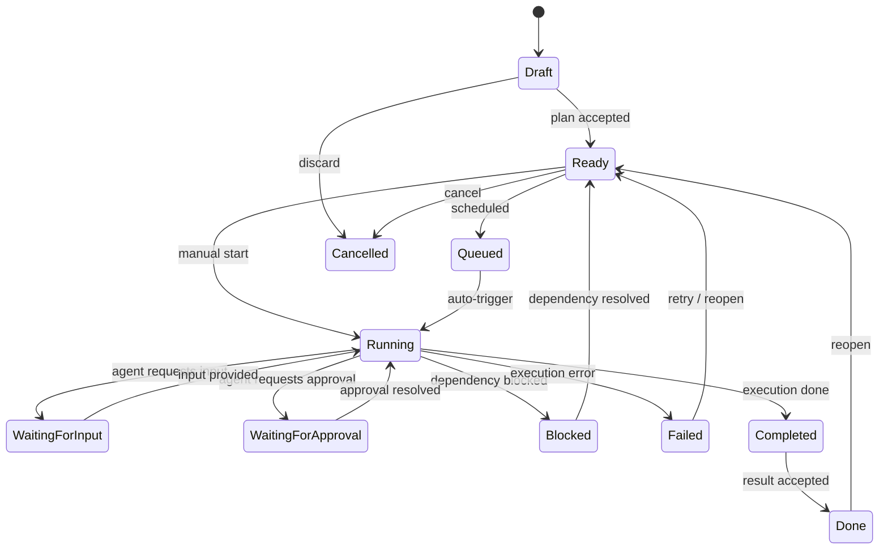
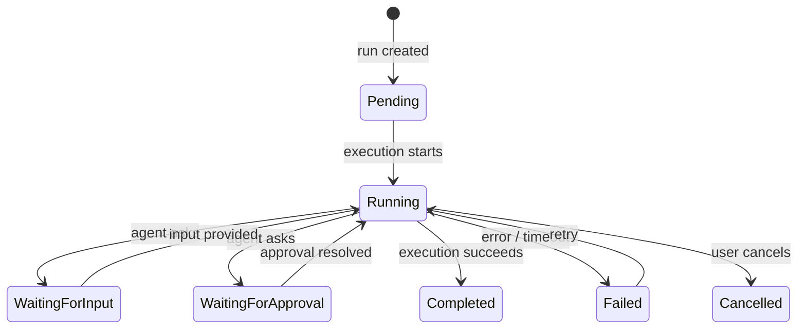
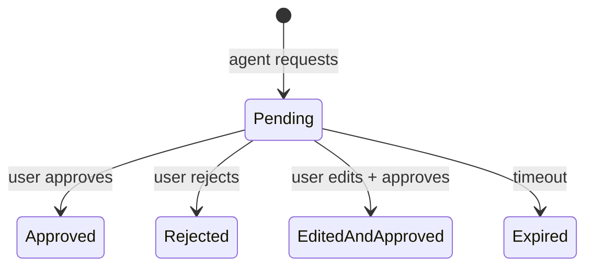

# Data Model

> **Database:** SQLite via Prisma 7
> **Models:** 22
> **Enums:** 10+
> **Migration:** auto-run on first `chrona start`

---

## Table of Contents

1. [Entity Relationship Diagram](#entity-relationship-diagram)
2. [Domain Aggregates](#domain-aggregates)
3. [State Machines](#state-machines)
4. [Index Strategy](#index-strategy)
5. [Enum Reference](#enum-reference)

---

## Entity Relationship Diagram


```mermaid
erDiagram
    Workspace ||--o{ Task : contains
    Workspace ||--o{ Memory : owns
    Workspace ||--o{ Event : records
    Workspace ||--o{ AiClient : configures
    Task ||--o{ Run : executes
    Task ||--o| TaskProjection : materializes
    Task ||--o{ TaskSession : manages
    Task ||--o{ TaskDependency : "depends on / blocks"
    Task ||--o{ ScheduleProposal : receives
    Task ||--o{ Task : "parent of (subtask)"
    Task ||--o{ TaskPlan : plans
    Task ||--o{ WorkBlock : organizes
    Task ||--o{ ExecutionSession : "orchestrates (plan runs)"
    TaskPlan ||--o{ TaskPlanRun : executes
    TaskPlan ||--o{ TaskPlanLayer : layers
    Run ||--o{ Approval : requires
    Run ||--o{ Artifact : produces
    Run ||--o{ ConversationEntry : records
    Run ||--o{ ToolCallDetail : logs
    Run ||--|| RuntimeCursor : syncs
    AiClient ||--o{ AiFeatureBinding : binds

    Workspace {
        string id PK
        string name
        string description
        string defaultRuntime
        string status
        datetime createdAt
        datetime updatedAt
    }

    Task {
        string id PK
        string workspaceId FK
        string title
        string description
        string status
        string priority
        string executionRuntime
        json executionConfig
        string parentTaskId FK
        datetime dueAt
        json blockReason
        string defaultSessionId
        string latestRunId FK
        datetime completedAt
        datetime createdAt
        datetime updatedAt
    }

    Run {
        string id PK
        string taskId FK
        string runtimeName
        string status
        datetime startedAt
        datetime endedAt
        string errorSummary
        string runtimeRunRef
        string resumeToken
        string triggeredBy
        boolean retryable
        boolean resumeSupported
        string pendingInputPrompt
        string pendingInputType
        datetime lastSyncedAt
        string syncStatus
    }

    Approval {
        string id PK
        string runId FK
        string type
        string title
        string summary
        string riskLevel
        string status
        datetime resolvedAt
        string resolvedBy
        string resolution
    }

    Artifact {
        string id PK
        string runId FK
        string type
        string title
        string uri
        string contentPreview
        string metadata
    }

    ConversationEntry {
        string id PK
        string runId FK
        string role
        string content
        int sequence
        string externalRef
    }

    ToolCallDetail {
        string id PK
        string runId FK
        string toolName
        string status
        string argumentsSummary
        string resultSummary
        string errorSummary
        string externalRef
    }

    TaskProjection {
        string taskId PK
        string displayState
        string blockType
        string blockScope
        string actionRequired
        int pendingApprovalCount
        int approvalPendingCount
        string scheduleStatus
        string latestArtifactTitle
        datetime lastActivityAt
    }

    TaskSession {
        string id PK
        string taskId FK
        string sessionKey UK
        string runtimeName
        string status
        string activeRunId
    }

    TaskDependency {
        string id PK
        string taskId FK
        string dependsOnTaskId FK
        string type
    }

    ScheduleProposal {
        string id PK
        string taskId FK
        string source
        string status
        string proposedBy
        string summary
        datetime proposedStartAt
        datetime proposedEndAt
        datetime proposedDueAt
    }

    Memory {
        string id PK
        string workspaceId FK
        string taskId FK
        string content
        string scope
        string sourceType
        float confidence
        string status
        datetime expiresAt
    }

    Event {
        string id PK
        string eventType
        string workspaceId FK
        string taskId FK
        string runId FK
        string actorType
        string actorId
        string source
        string payload
        string dedupeKey UK
        int ingestSequence
        datetime createdAt
    }

    RuntimeCursor {
        string id PK
        string runId UK
        string nextCursor
        string lastEventRef
        string healthStatus
        datetime updatedAt
    }

    TaskPlan {
        string id PK
        string taskId FK
        string status
        string summary
        json nodes
        json edges
        string generatedBy
        datetime createdAt
        datetime updatedAt
    }

    TaskPlanRun {
        string id PK
        string taskId FK
        string taskPlanId FK
        string status
        json effectiveGraph
        json nodeStates
        datetime createdAt
        datetime updatedAt
    }

    TaskPlanLayer {
        string id PK
        string taskPlanId FK
        string name
        int priority
        json addedNodeIds
        datetime createdAt
    }

    WorkBlock {
        string id PK
        string taskId FK
        string status
        string sessionKey UK
        string promptText
        datetime startedAt
        datetime endedAt
    }

    ExecutionSession {
        string id PK
        string taskId FK
        string taskPlanRunId FK
        string status
        string sessionKey UK
        datetime startedAt
        datetime updatedAt
    }

    AiClient {
        string id PK
        string workspaceId FK
        string name
        string type
        json config
        boolean isDefault
        boolean enabled
        datetime createdAt
        datetime updatedAt
    }

    AiFeatureBinding {
        string id PK
        string clientId FK
        string feature
        datetime createdAt
    }
```

---

## Domain Aggregates

### 1. Workspace Aggregate

```
Workspace (root)
  ├── AiClient[]
  │     └── AiFeatureBinding[]
  ├── Task[]
  │     ├── Run[]
  │     │     ├── Approval[]
  │     │     ├── Artifact[]
  │     │     ├── ConversationEntry[]
  │     │     ├── ToolCallDetail[]
  │     │     └── RuntimeCursor (1:1)
  │     ├── TaskSession[]
  │     ├── TaskDependency[]
  │     ├── ScheduleProposal[]
  │     ├── TaskProjection (1:1)
  │     ├── TaskPlan[]
  │     │     ├── TaskPlanRun[]
  │     │     └── TaskPlanLayer[]
  │     ├── WorkBlock[]
  │     ├── ExecutionSession[]
  │     └── Task[] (subtasks, recursive)
  ├── Memory[]
  └── Event[]
```

- **Workspace** is the top-level isolation boundary
- **Task** is the core work unit, containing all execution data
- **Run** models a single agent execution episode
- **TaskProjection** is a denormalized materialized view optimized for list/schedule rendering
- **Event** is the immutable audit log, cross-cutting all aggregates

### 2. Task Lifecycle Fields

Tasks carry three categories of fields:

| Category | Fields | Purpose |
|----------|--------|---------|
| **Identity** | title, description, priority | What the task is |
| **Runtime** | executionRuntime, executionConfig | How to execute it |
| **Schedule** | dueAt | When to complete by |

This separation enables tasks that have a schedule but no runtime config (planning phase) and tasks with a runtime config but no schedule (manual execution).

### 3. Task Plan (graph-structured)

Task plans are structured as directed graphs:

**PlanBlueprint** (AI-generated plan, Zod schema from `@chrona/contracts`):
```typescript
interface PlanBlueprint {
  nodes: PlanNode[]    // task | checkpoint | condition | wait
  edges: PlanEdge[]    // directed edges between nodes
}

interface PlanNode {
  id: string
  type: "task" | "checkpoint" | "condition" | "wait"
  title: string
  objective?: string
  estimatedMinutes?: number
  metadata?: Record<string, unknown>
}

interface PlanEdge {
  id: string
  fromNodeId: string
  toNodeId: string
  label?: string
}
```

**EditablePlan** (user-editable version):
```typescript
interface EditablePlan {
  taskId: string
  planId: string
  version: number
  status: "draft" | "accepted" | "archived"
  nodes: EditablePlanNode[]
  edges: EditablePlanEdge[]
  createdAt: Date
  updatedAt: Date
}

interface EditablePlanNode {
  id: string
  type: "task" | "checkpoint" | "condition" | "wait"
  title: string
  objective?: string
  status: "pending" | "in_progress" | "completed" | "blocked" | "skipped"
  estimatedMinutes?: number
  actualMinutes?: number
  order: number
  metadata?: Record<string, unknown>
}

interface EditablePlanEdge {
  id: string
  fromNodeId: string
  toNodeId: string
  label?: string
}
```

**Database models:**
- **TaskPlan** — persisted plan graph (JSON nodes, JSON edges)
- **TaskPlanRun** — one execution run through a plan (effectiveGraph, nodeStates)
- **TaskPlanLayer** — hierarchical overlay for plan organization

Plans are mutable via `POST /api/tasks/:taskId/plan` patch operations (add/delete/update nodes, update dependencies).

---

## State Machines

### Task Status Lifecycle


```mermaid
stateDiagram-v2
    [*] --> Draft
    Draft --> Ready : plan accepted
    Ready --> Queued : scheduled
    Ready --> Running : manual start
    Queued --> Running : auto-trigger
    Running --> WaitingForInput : agent requests input
    Running --> WaitingForApproval : agent requests approval
    Running --> Blocked : dependency blocked
    WaitingForInput --> Running : input provided
    WaitingForApproval --> Running : approval resolved
    Blocked --> Ready : dependency resolved
    Running --> Failed : execution error
    Running --> Completed : execution done
    Completed --> Done : result accepted
    Failed --> Ready : retry / reopen
    Done --> Ready : reopen
    Draft --> Cancelled : discard
    Ready --> Cancelled : cancel
```

12 statuses. The display-state projection further refines these into UI-friendly labels (e.g., `AttentionNeeded` when pending approvals exist).

### Run Status Lifecycle


```mermaid
stateDiagram-v2
    [*] --> Pending : run created
    Pending --> Running : execution starts
    Running --> WaitingForInput : agent asks
    Running --> WaitingForApproval : agent asks
    WaitingForInput --> Running : input provided
    WaitingForApproval --> Running : approval resolved
    Running --> Completed : execution succeeds
    Running --> Failed : error / timeout
    Running --> Cancelled : user cancels
    Failed --> Running : retry
```

### Approval Status Lifecycle


```mermaid
stateDiagram-v2
    [*] --> Pending : agent requests
    Pending --> Approved : user approves
    Pending --> Rejected : user rejects
    Pending --> EditedAndApproved : user edits + approves
    Pending --> Expired : timeout
```

### Schedule Status Map

Task scheduling is managed via the task schedule API (PUT/DELETE /api/tasks/:taskId/schedule) and ScheduleProposal records. The schedule status is computed externally rather than stored as a field on the Task model.

---

## Index Strategy

| Table | Index | Purpose |
|-------|-------|---------|
| Task | `[workspaceId, status]` | Filter tasks by workspace + status (list views) |
| Task | `[workspaceId, priority]` | Sort by priority within workspace |
| TaskProjection | `taskId` (PK) | Lookup by task (1:1) |
| TaskDependency | `UNIQUE [taskId, dependsOnTaskId]` | Guarantee no duplicate dependencies |
| TaskSession | `sessionKey` (unique) | Lookup sessions by external key |
| Run | `runtimeRunRef` (unique) | Lookup runs by runtime-side reference |
| Run | `[taskId, status]` | Find active/pending runs for a task |
| Event | `dedupeKey` (unique) | Ensure exactly-once event writing |
| Event | `[workspaceId, createdAt]` | Time-ordered event streams per workspace |
| RuntimeCursor | `runId` (unique) | 1:1 sync state per run |
| Memory | `[workspaceId, status, scope]` | Query active memories by scope |

---

## Enum Reference

### TaskStatus

| Value | Description |
|-------|-------------|
| `Draft` | Initial state, no plan accepted |
| `Ready` | Plan accepted, ready to schedule/run |
| `Queued` | Scheduled and waiting for auto-start |
| `Running` | Agent currently executing |
| `WaitingForInput` | Agent paused, waiting for user input |
| `WaitingForApproval` | Agent paused, waiting for user approval |
| `Blocked` | Blocked by uncompleted dependency |
| `Failed` | Execution failed with error |
| `Completed` | Execution finished |
| `Done` | Result accepted, task closed |
| `Cancelled` | Task discarded |
| `Scheduled` | (legacy, mapped to Queued) |

### TaskPriority

`Low` | `Medium` | `High` | `Urgent`

### RunStatus

`Pending` | `Running` | `WaitingForInput` | `WaitingForApproval` | `Failed` | `Completed` | `Cancelled`

### ApprovalStatus

`Pending` → `Approved` | `Rejected` | `EditedAndApproved` | `Expired`

### MemoryStatus

`Active` | `Inactive` | `Conflicted` | `Expired`

### MemoryScope

`user` — global user-level knowledge · `workspace` — workspace-scoped · `project` — project-scoped (future) · `task` — per-task

### MemorySourceType

`user_input` — manually entered · `agent_inferred` — deduced by AI · `imported` — external source · `system_rule` — fixed rules

### ArtifactType

`file` | `patch` | `summary` | `report` | `terminal_output` | `url`

### TaskDependencyType

`blocks` — predecessor must complete first · `relates_to` — informational link · `child_of` — parent-child hierarchy

### ScheduleSource

`human` | `ai` | `system`

### OwnerType

`human` | `agent`
