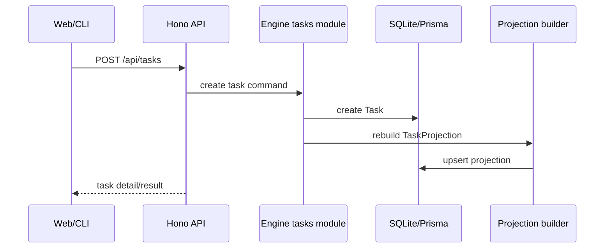
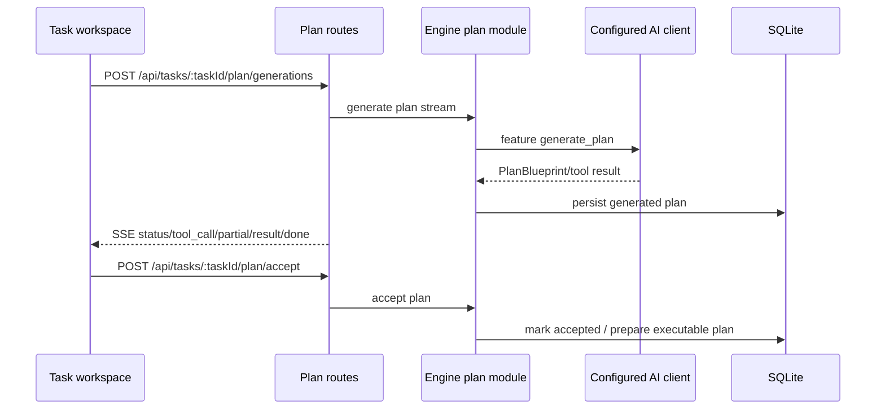
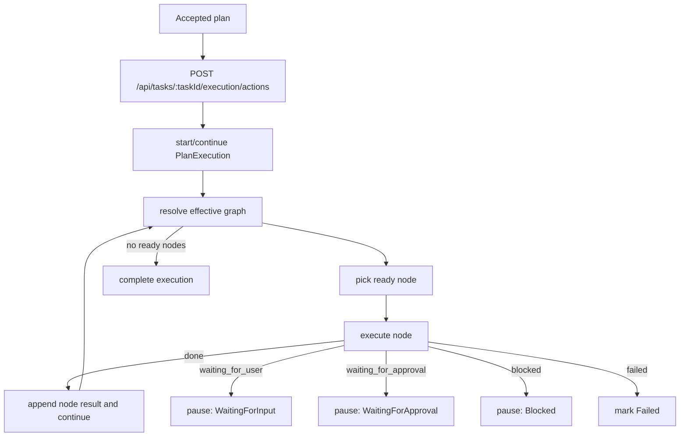

# System Architecture

Chrona is a Bun/TypeScript monorepo for local-first AI task planning, scheduling, execution, and observation.

## Runtime overview

```mermaid
flowchart TB
  User[User] --> Web[apps/web React SPA]
  User --> CLI[packages/cli]
  Agent[External agent / Hermes] --> MCP[/api/mcp]

  Web --> API[apps/server Hono API]
  MCP --> API
  CLI --> Integrations[packages/integrations/*]
  API --> Integrations

  API --> Engine[packages/engine]
  Engine --> Contracts[packages/contracts]
  Engine --> Graph[packages/graph-runtime]
  Engine --> DB[(SQLite via Prisma)]
  Engine --> Providers[packages/providers/*]
  Integrations --> HermesLocal[Local Hermes CLI/config/plugin]
  Providers --> Hermes[Hermes / runtime gateway]

  Engine --> Projections[Task/Schedule/Work/Action Center projections]
  Projections --> DB
```

## Main layers

| Layer            | Path                      | Responsibility                                                                                                           |
| ---------------- | ------------------------- | ------------------------------------------------------------------------------------------------------------------------ |
| Web composition  | `apps/web`                | Browser bootstrap, router, app shell, shared browser infrastructure, and composition of feature public entrypoints     |
| Server transport | `apps/server`             | HTTP routing, validation glue, SSE streaming, auth/bind safety, static app serving, and composition of server entrypoints |
| Features         | `features/*`              | Vertical product slices; each exposes its supported browser/server/contract surface through `index.ts`                  |
| Engine           | `packages/engine`         | Application use cases: tasks, plans, execution, scheduling, projections, AI clients                                      |
| Domain           | `packages/domain`         | Pure, IO-free business rules and state/status derivation                                                                 |
| Contracts        | `packages/contracts`      | Shared schemas and DTOs for API, AI features, plan runtime, SSE, and MCP tools                                           |
| Graph runtime    | `packages/graph-runtime`  | Plan graph build, resolve, transition, and command primitives                                                            |
| Providers        | `packages/providers/*`    | Protocol adapters for configured external runtime backends                                                               |
| UI protocol      | `packages/ui-protocol`    | Declarative UI document schema + builders (json-render) shared by server and web                                         |
| Integrations     | `packages/integrations/*` | User-approved local/remote setup, diagnosis, external plugin install, and restart helpers                                |
| Database         | `packages/db` + `prisma`  | Prisma 7 + SQLite bootstrap, repositories, schema, migrations, seed                                                      |
| Runtime core     | `packages/runtime-core`   | Backend-agnostic runtime support types/utilities shared by engine/providers                                              |
| i18n             | `packages/i18n`           | Shared localization messages and helpers                                                                                 |
| Shared browser/transport | `shared/http`, `shared/ui` | Generic browser/HTTP infrastructure and UI primitives; never product workflow logic                                  |
| CLI              | `packages/cli`            | Packaged entry point for starting Chrona                                                                                 |
| External plugins | `external-plugins/hermes` | Hermes Agent integration and Chrona MCP tool exposure                                                                    |

See [Package Boundaries](./package-boundaries.md) for the authoritative
per-package "put here / don't put here" rules, dependency direction, and enforcement.

### Feature slices

Product ownership lives in root `features/`, not in `apps/web/src/components` or
`apps/server` internals. The active slices are `dashboard`, `action-center`,
`task-management`, `task-workspace`, `schedule`, `plan-generation`,
`execution-monitoring`, `ai-clients`, `assistant-surface`, `external-calendar`,
and `mcp-control-plane`. A feature's public API is its `index.ts`; apps compose
those public entrypoints, while sibling features do not reach into another
feature's internals.

## Product surfaces

### Task workspace

The task workspace is the planning and editing surface. It supports task detail editing, AI plan generation, generated-plan review, plan acceptance, and execution overview.

### Task workspace execution

Task execution now lives inside the task workspace. Runtime commands use `/api/work/:taskId/commands` and live updates use `/api/work/:taskId/events`; there is no separate Work page route.

### Schedule page

The schedule page shows task/time-block projections, conflicts, suggestions, and scheduling operations. Schedule proposals can be accepted/rejected and due work can become executable WorkBlocks.

### Long-horizon Goal foundation

Chrona now ships the Phase 3 Goal aggregate and fixed product workspace. A
`Goal` contains bounded tasks, validated user-confirmed success criteria,
explicit lifecycle actions, accepted-result summaries, and provenance-preserving
read-only `GoalAsset` references. Goal list and detail routes are `/goals` and
`/goals/:goalId`; a Goal never owns a provider session or execution plan.

The remaining target separates activation and calendar placement:
`TaskTrigger` definitions will produce idempotent `TriggerDelivery` facts and
isolated `TaskOccurrence` instances; a `WorkBlock` will remain an optional time
container. Those trigger and neutral-occurrence phases are not shipped.
Lifecycle invariants, security boundaries, and phased migration remain
authoritative in [Long-Horizon Goals and Triggers](./long-horizon-goals-and-triggers.md).

### Action Center projection

Action Center aggregates current, actionable attention items: approvals,
schedule proposals, waiting inputs, failed runs, cancelled runs, and automation
blocks that require operator review. It is not a scheduler audit log. Normal
steady states such as waiting for a configured start time and idempotency guards
such as an already-active run remain in Schedule/Activity and MUST NOT create
Action Center items. Repeated scheduler blocks are represented by the latest
item for the same task, occurrence, and reason. Its HTTP wire path remains
`/api/inbox` for API stability.

### Settings / AI Clients

AI clients and feature bindings are database-backed. The old fallback-chain style is replaced by explicit configured clients and feature bindings.

Hermes setup uses the integrations layer. Settings can diagnose local or remote Hermes clients, auto-configure a local Hermes gateway after explicit user action, and show manual instructions for remote gateways. Provider runtime code stays responsible for Hermes protocol calls; integration code owns local plugin/config/env/restart side effects.

## Core workflows

### Task creation



### Plan generation and acceptance



### Plan execution



Execution nodes can be `task`, `checkpoint`, `condition`, or `wait`. Runtime events and graph events are streamed to the UI and persisted into task/work projections.

## Integration model

### HTTP API

The public HTTP API is grouped by tasks, plans, execution, schedule, pages, workspaces, runtime providers, AI clients, assistant surface, and MCP. See [API Reference](./api-reference.md).

### MCP / agent tools

Chrona exposes MCP tools that operate on the active execution session. Agents receive AI-visible node refs and branch refs and submit outcomes through tool calls. This prevents agents from depending on private backend node IDs.

### Provider boundary

Provider packages adapt external protocols. They may know provider sessions, responses, transport quirks, streaming formats, tool calls, and approvals. They must not own Chrona business semantics such as task lifecycle, plan progression, retries, or projection state. Those decisions stay in `packages/engine`.

## Data and projection model

Chrona stores canonical goal, task, plan, run, session, work block, AI client,
and event data in SQLite. UI pages read from query-optimized projections and
page-specific read models. Goal projection keeps lifecycle, activity, and
attention separate; task execution and plan generation produce event streams
that are visible to users and usable for rebuilding state.

The remaining accepted target adds trigger definition/delivery and neutral
task-occurrence aggregates. Until those migration phases ship, current
WorkBlock/manual-task execution remains authoritative. See
[Long-Horizon Goals and Triggers](./long-horizon-goals-and-triggers.md).

## Development entrypoints

| Need                | Command                                                                                                                                            |
| ------------------- | -------------------------------------------------------------------------------------------------------------------------------------------------- |
| Install deps        | `bun install`                                                                                                                                      |
| Initial local setup | `bun run setup` (run after schema/dependency changes; NixOS may require Prisma engine configuration or `PRISMA_ENGINES_CHECKSUM_IGNORE_MISSING=1`) |
| Full dev mode       | `bun run dev`                                                                                                                                      |
| Server only         | `bun run server:start`                                                                                                                             |
| Web dev only        | `bun run dev:web`                                                                                                                                  |
| Typecheck           | `bun run typecheck`                                                                                                                                |
| Lint                | `bun run lint`                                                                                                                                     |
| Tests               | `bun run test`, `bun run test:bun`, `bun run test:api`                                                                                             |

## Architecture rules

1. Routes stay thin: parse/validate HTTP and call engine use cases.
2. Engine owns application decisions and orchestration.
3. Contracts own shared schemas and cross-layer DTOs.
4. Providers own protocol adaptation, not task semantics.
5. Graph runtime owns graph mechanics, not product workflows.
6. UI reads projections and submits commands; it should not reconstruct backend state from raw logs.
7. Agents must use public MCP tool contracts and AI-visible refs.
