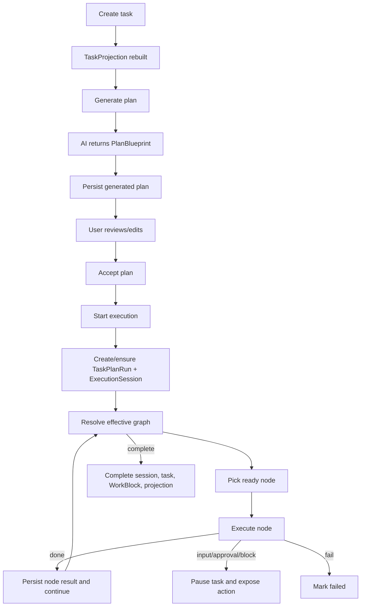

# Backend Execution Flow

This document traces the current backend path from task creation to plan execution. The HTTP entrypoint is `apps/server/src/routes/**`; application logic lives primarily in `packages/engine/src/modules/**`; graph mechanics live in `packages/graph-runtime`.

## Route map for execution-related work

| Area | Endpoint |
| --- | --- |
| Task CRUD | `GET/POST /api/tasks`, `GET/PATCH/DELETE /api/tasks/:taskId` |
| Plan state | `GET /api/tasks/:taskId/plan` |
| Plan generation | `POST /api/tasks/:taskId/plan/generations` |
| Active generation | `GET /api/tasks/:taskId/plan/generations/active` |
| Active generation SSE | `GET /api/tasks/:taskId/plan/generations/active/events` |
| Stop generation | `POST /api/tasks/:taskId/plan/generations/stop` |
| Accept plan | `POST /api/tasks/:taskId/plan/accept` |
| Patch plan | `POST /api/tasks/:taskId/plan` |
| Current execution | `GET /api/tasks/:taskId/execution/current` |
| Execution action SSE | `POST /api/tasks/:taskId/execution/actions` |
| Checkpoint action SSE | `POST /api/tasks/:taskId/execution/checkpoint/:checkpointId/actions` |
| Task workspace command | `POST /api/work/:taskId/commands` |
| Task workspace events | `GET /api/work/:taskId/events` |
| MCP tools | `POST /api/mcp` |
| Goal query/lifecycle | `GET/POST /api/goals`, `GET/PATCH /api/goals/:goalId`, `POST /api/goals/:goalId/actions` |
| Accepted-result promotion | `POST /api/tasks/:taskId/actions/promote-to-goal` |

## End-to-end flow

## Goal boundary

A Goal is durable outcome state above the execution flow. Goal create/update and
explicit lifecycle actions do not start a Provider, Plan, Run, or
ExecutionSession. Bounded linked Tasks continue through the flow below.
Accepted-result promotion is one database transaction: validate the accepted
Run and selected Artifact ownership, create the Goal, associate `Task.goalId`,
create read-only GoalAsset references, and record an idempotent promotion Event.
Failure rolls the whole operation back; source result and Artifact rows remain
unchanged.

## Task creation

`POST /api/tasks` validates the request against supported execution runtimes, creates the `Task`, and rebuilds the `TaskProjection`. A task can be ready for manual planning/execution, scheduled, or nested under a parent task.

Source anchors:

- `apps/server/src/routes/tasks/crud.routes.ts`
- `packages/engine/src/modules/tasks/create-task.ts`
- `packages/engine/src/modules/projections/rebuild-task-projection.ts`

## Plan generation

`POST /api/tasks/:taskId/plan/generations` starts a generation session. When called with `Accept: text/event-stream`, the route streams progress events:

- `status`
- `tool_call`
- `partial`
- `result`
- `error`
- `cancelled`
- `done`
- `heartbeat`

The generation module calls the configured AI client for the `generate_plan` feature and persists the resulting plan graph.

Source anchors:

- `apps/server/src/routes/tasks/plan.routes.ts`
- `packages/engine/src/modules/plans/generate-task-plan-manual-stream.ts`
- `packages/engine/src/modules/ai/features/generate-plan.ts`
- `packages/contracts/src/ai.ts`

## Plan review, patch, and acceptance

Users can inspect the generated plan, apply patch operations through `POST /api/tasks/:taskId/plan`, and accept the plan through `POST /api/tasks/:taskId/plan/accept`. Acceptance makes the plan executable and prepares it for plan-run state.

## Execution actions

`POST /api/tasks/:taskId/execution/actions` dispatches an execution action and streams graph/runtime progress over SSE.

Common actions:

- `start_manual`
- `resume_with_input`
- `resume_with_approval`
- `retry_node`
- `resume_after_unblock`
- `complete_manual_node`
- `fail_current_node`
- `cancel_session`

The engine owns idempotency, session state, graph advancement, node attempts, runtime dispatch, pause/resume behavior, and task status transitions.

Source anchors:

- `apps/server/src/routes/tasks/execution.routes.ts`
- `packages/engine/src/modules/plan-execution/facade/task-plan-execution.facade.ts`
- `packages/engine/src/modules/plan-execution/runtime/node-executor-registry.ts`
- `packages/engine/src/modules/plan-execution/runtime/graph-runtime-callbacks.ts`

## Node outcomes

Node outcomes never write `Task.status`/`blockReason` directly. The runner
persists *facts* — the node result/attempt, the `ExecutionSession` state, and
(for provider work) the `Run` status + `errorSummary` — then calls the single
state committer (see [Task state authority](#task-state-authority)). The table
below describes the facts each outcome persists and the task state they derive
to.

| Outcome | Persisted fact → derived task state |
| --- | --- |
| `done` | Node result + attempt complete; session stays `Active` or transitions `Completed` → `Running`/`Completed` |
| `waiting_for_user` | Session `Paused`, `pauseReason=user_input` → `WaitingForInput` + input action |
| `waiting_for_approval` | Session `Paused`, `pauseReason=approval` → `WaitingForApproval` + approval action |
| `child_running` | Session `Active` while child run/session continues → `Running` |
| `blocked` | Session `Paused`, pause reason carries node id/reason → `Blocked` with recovery form |
| `failed` | `Run.status=Failed` + `errorSummary`; session `Paused` → `Blocked` (`run_failed`) carrying the real error + node id |
| `replan_required` | Session `Paused`, `pauseReason=replan_required` → `WaitingForApproval` (replan) |

## Context segments

Provider sessions are not the same as Chrona execution sessions. Chrona should use context segments as the default long-task provider-session boundary: related plan nodes share one provider task session, then Chrona writes a structured segment summary and switches to the next segment session.

This avoids two failure modes:

- One provider session for the whole task makes Chrona depend on opaque provider-side context compression and risks context pollution across unrelated nodes.
- One provider session per node loses useful short-term working context between tightly related nodes.

`WorkBlock` should remain the scheduling/time container. A `WorkBlock` can contain one or more context segments. Segment policy belongs in `packages/engine`, while providers only create, resume, or virtualize native sessions.

## Checkpoint actions

`POST /api/tasks/:taskId/execution/checkpoint/:checkpointId/actions` maps checkpoint-level actions onto execution continuation actions. It supports input submission, result approval/rejection, replan decisions, retry, unblock, manual completion/skip, fail, and cancel.

## Task workspace command flow

The task workspace uses asynchronous commands:

1. `POST /api/work/:taskId/commands` validates and accepts the command.
2. The server publishes a command accepted event.
3. The server dispatches the corresponding plan/execution/checkpoint operation.
4. Runtime and graph events update task workspace events.
5. The browser listens through `GET /api/work/:taskId/events` and refreshes projection state.

Supported command categories include plan generation, plan acceptance, execution actions, and checkpoint actions.

## MCP result submission flow

External agents use `POST /api/mcp` tools. Chrona injects hidden context such as session ID, task ID, expected revision, and idempotency key. Public tool inputs expose only the AI-safe payload, including node/branch refs where needed.

Important rule: agents must not invent backend IDs. They should call read tools only when state is missing or stale, and submit final node outcomes with the appropriate Chrona tool.

## Accepted-result continuation

Accepting a result freezes the task's accepted Run, result spec, artifacts, plan, and execution state, but the provider conversation can continue for result questions. `GET /api/tasks/:taskId/result/follow-up` restores persisted continuation history and reports whether the accepted Run's provider session is available.

`POST /api/tasks/:taskId/result/follow-up` supports two intents:

- `ask` resumes the accepted Run's provider conversation with mutation and execution tools disabled. Chrona records the answer, context source, provider session ref, and reported cache usage. A missing source session falls back to a bounded accepted-result context and server-owned history.
- `create_task` creates a linked Draft child task. The default `handoff_compact` strategy compacts the accepted Run's provider conversation and seeds a new independent provider session with that handoff; `fresh_with_result` starts clean and carries only the bounded accepted result and artifact references.

Every request carries a UUID `requestId`; `(taskId, requestId)` is unique so browser retries do not duplicate answers or child tasks. Continuations are scoped to the canonical `task.result_accepted` event's `accepted_run_id`, not merely the task's latest completed Run.

## Generated file references and controlled reads

Task nodes that create files receive a node-scoped output directory under Chrona's data directory: `generated-files/<task-ref>/<plan-ref>/<node-ref>`. The runtime input exposes this directory as `context.run.generatedFiles`; result artifacts should reference the returned file path instead of embedding large contents in the terminal payload.

Result previews follow two paths:

- Files inside the node-scoped generated-files root are previewed directly after canonical-path and symlink containment checks.
- Other local files are never read implicitly. The result surface first requests metadata, shows the canonical path and size, and requires an explicit one-time approval before the server reads a bounded preview.

The access grant is task-bound, path-bound, short-lived, single-use, and kept in process memory. Requests reject directories, device files, sockets, unsafe special files, missing files, and files above the configured size limit. Preview reads remain bounded after approval.

## Completion

When no ready nodes remain, the runner transitions the `ExecutionSession` to
`Completed`, records `Task.completedAt`, completes the active `Run`s and the
`WorkBlock`, appends execution events, then rebuilds the projection. The
committer derives the `Completed` task status from the completed session/run —
the runner never writes the status itself. Work, Schedule, and Action Center then
reflect the updated state.

These are current single-task semantics. A known design gap remains for
recurring series: completing one occurrence must not permanently complete the
series or stop future expansion. The accepted migration separates task
definition lifecycle from occurrence execution state; see
[Long-Horizon Goals and Triggers](./long-horizon-goals-and-triggers.md).

## Task state authority

`Task.status`, `Task.blockReason`, and the read-optimized `TaskProjection` have
a **single writer**: `rebuildTaskProjection`
(`packages/engine/src/modules/projections/rebuild-task-projection.ts`). Every
other code path — execution finalize, node-active marking, plan
generation/acceptance, scheduling, lifecycle — persists only durable *facts*
(run status, `errorSummary`, session state, plan rows, work blocks) and then
calls the committer. No other path writes task status or block reason.

The committer derives state through one pure reducer, `deriveTaskState`
(`packages/domain/src/task/derive-task-state.ts`). The reducer maps facts to a
task status + a block reason that carries the real cause:

- A failed `Run` surfaces its `errorSummary` as `blockReason.detail` and the
  paused node as `blockReason.nodeId` — never a hard-coded "Retry Run" with no
  cause.
- A `Completed`/`Abandoned` `ExecutionSession` is the authoritative record of a
  finished/cancelled run and derives `Completed`/`Cancelled` even when no `Run`
  row exists.

### Occurrence scoping

A recurring task shares one `Task` row across many `WorkBlock` occurrences, so
execution facts are occurrence-scoped: `Run`, `ExecutionSession`, `TaskPlan`,
and `TaskPlanRun` all carry a `workBlockId`. The committer scopes its
runs/sessions/approvals to the occurrence that most recently executed (the
latest `ExecutionSession` in any state, falling back to the latest plan's work
block before any run exists). A failed or cancelled occurrence therefore never
bleeds its state onto a sibling occurrence — a fresh occurrence with a
just-generated plan is unaffected by an earlier occurrence's provider failure.

`WorkBlock` is the current occurrence identity because all shipped automatic
activation is schedule-based. The accepted target replaces this coupling with
a neutral `TaskOccurrence`, with WorkBlock retained as an optional calendar
container. Until that migration ships, `workBlockId` remains the authoritative
scope and must not be mixed with hypothetical `occurrenceId` behavior.

### Projection refresh invariant

Any write that changes execution or plan reality MUST end by rebuilding the
projection so Work/Schedule/Action Center reflect it without waiting for the next
execution tick. This includes plan draft persistence
(`materializeGeneratedTaskPlan`) and plan acceptance (`TaskPlanning.accept`),
not only execution actions. `publishTaskWorkspaceUpdatedEvent` only notifies
SSE listeners; it is never a substitute for `rebuildTaskProjection`.