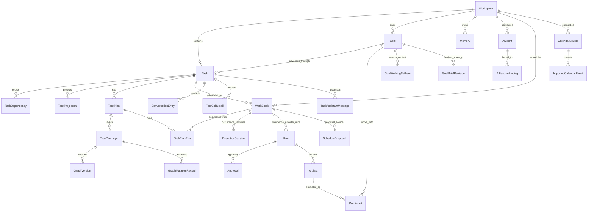

# Data Model

Chrona persists goal, task, schedule, execution, memory, and AI-client state in SQLite through Prisma 7.

Schema source: `prisma/schema.prisma`.

Current schema inventory:

- Models: see `prisma/schema.prisma` as the authoritative current inventory.
- Enums: see `prisma/schema.prisma` as the authoritative current inventory.

## Main aggregates

| Aggregate | Key models | Purpose |
| --- | --- | --- |
| Workspace | `Workspace` | Scope for tasks, memory, schedule, calendar sources, and configuration. |
| Goal | `Goal`, `GoalAsset`, `GoalAssetVersion`, `GoalAssetDraft`, `GoalInboxCandidate`, `GoalFormSubmission`, `GoalAssetJob`, `GoalWorkingSetItem`, `GoalBriefRevision` | Durable outcome lifecycle, versioned Workbench assets, result intake, form submissions, export jobs, operating context, explicit bounded-task inputs, and immutable artifact provenance. |
| Task | `Task`, `TaskDependency`, `TaskProjection`, `TaskSession`, `TaskTimelineItem` | Core work item, relationships, projection-backed read shape, scoped work sessions, and timeline rows. |
| Plan | `TaskPlan`, `TaskPlanLayer`, `GraphVersion`, `GraphMutationRecord`, `ReconciliationEvent`, `TaskPlanNodeAttempt`, `TaskPlanTerminalAction` | Generated/accepted executable graph plan, node-attempt history, terminal actions, and graph-change history. |
| Execution | `TaskPlanRun`, `Run`, `ExecutionSession`, `RuntimeCursor`, `Approval`, `Artifact`, `TaskPlanProviderRun`, `TaskPlanProviderApproval`, `RunToken` | Plan/run/session state, runtime cursoring, provider continuity, approvals, tokens, and outputs. |
| Schedule/activation | `TaskTrigger`, `TriggerDelivery`, `TaskOccurrence`, `WorkBlock`, `ScheduleProposal`, `SchedulerLease`, `SchedulerEvent` | Versioned activation definitions and deliveries, neutral execution occurrences, optional time placement, schedule suggestions, and scheduler automation. |
| External calendar | `CalendarSource`, `ImportedCalendarEvent` | Read-only calendar subscriptions, sync status, imported busy events, and calendar-backed schedule context. |
| Conversation/tool history | `ConversationEntry`, `ToolCallDetail`, `ToolInvocation`, `TaskAssistantMessage`, `TaskResultContinuation`, `RawEventLog` | User/assistant conversation, accepted-result continuation and idempotency state, runtime tool-call detail, invocation records, and raw event audit data. |
| Memory | `Memory` | Workspace/task memory entries used by internal projections and AI context-building flows. |
| AI configuration | `AiClient`, `AiFeatureBinding` | Database-backed AI clients and feature-to-client bindings. |
| Event log | `Event` | Durable event records used by projections/integration flows. |

## Entity relationship overview

## Goal foundation and remaining target

The current schema ships `Goal`, optional `Task.goalId`, read-only `GoalAsset`,
`GoalWorkingSetItem`, `GoalBriefRevision`, and immutable `Task.goalContext`.
Goal lifecycle is `Draft | Active | Paused | Achieved | Stopped`. Achievement
requires explicit user confirmation and persists note, actor identity,
timestamp, and Goal-owned evidence Artifact IDs in
`Goal.achievementConfirmation`; a canonical `goal.achieved` event provides the
audit record. `GoalAsset` records source and current Artifact references without
mutating source execution evidence. Accepted Task results remain immutable and
separate from these Goal-scoped references.

`Goal.operationalBrief` stores the current intended outcome, current focus,
strategy, and constraints. Every save appends `GoalBriefRevision` with actor and
time. `GoalWorkingSetItem` stores an ordered explicit selection of whole Goal
objects plus a display/audit snapshot; canonical lifecycle remains on the
source object. When a bounded Goal Task is created, its selected Working Set,
current Operational Brief, capture time, and expected outcome are frozen into
`Task.goalContext`. Plan generation consumes this immutable source context;
later Goal edits do not rewrite existing Task input.

The shipped model includes closed-union `TaskTrigger`, idempotent
`TriggerDelivery`, and neutral `TaskOccurrence`. Schedule and bounded internal
event adapters materialize occurrence authority; webhook ingress remains
unshipped. The complete invariants and adapter security boundary are specified
in [Long-Horizon Goals and Triggers](./long-horizon-goals-and-triggers.md).

Goal Workbench persistence uses `GoalAsset` identity plus immutable
`GoalAssetVersion`, mutable `GoalAssetDraft`, reviewable `GoalInboxCandidate`,
version-bound `GoalFormSubmission`, and export/thumbnail `GoalAssetJob` records.
Accepted source Results and Artifacts remain immutable; restoring an old version
always appends a new formal version.

## Task state

Important enums:

- `TaskStatus`
- `TaskPriority`
- `TaskDependencyType`

Tasks are the canonical work records. `TaskProjection` stores read-optimized task state used by app surfaces after create/update/lifecycle/result changes.

`TaskStatus.Completed` and `TaskStatus.Done` are both terminal, but they are not interchangeable today:

- `Completed` means Chrona/runtime execution reached a completed state, including imported calendar tasks auto-completed by sync policy.
- `Done` means the user explicitly accepted or closed the task outcome after completion; derivation keeps `Done` stable and does not downgrade it to runtime-derived `Completed`.

New code should use `Completed` for runtime/import completion and reserve `Done` for explicit user closure until the enum is consolidated.

Typical lifecycle actions:

- create
- update
- complete
- reopen
- delete
- attach result
- schedule through work blocks
- generate/accept/execute plan

## Plan and graph state

Important models:

- `TaskPlan`
- `TaskPlanLayer`
- `GraphVersion`
- `GraphMutationRecord`
- `ReconciliationEvent`

Important enum:

- `TaskPlanStatus`
- `GraphMutationStatus`

A generated plan blueprint becomes executable only after acceptance/materialization. Layers hold graph snapshots and execution context. Graph mutation/reconciliation records support plan evolution and traceability.

## Execution state

Important models:

- `TaskPlanRun`
- `Run`
- `ExecutionSession`
- `RuntimeCursor`
- `Approval`
- `Artifact`

Important enums:

- `RunStatus`
- `ExecutionSessionStatus`
- `ApprovalStatus`
- `ArtifactType`

Execution records distinguish Chrona plan-run state from external runtime/provider runs. `ExecutionSession` is the server-side scope for AI-visible refs. `RuntimeCursor` tracks provider stream/progress cursoring. Approvals and artifacts store intervention and output records.

Execution is occurrence-scoped. `TaskOccurrence` is the durable execution
identity; `WorkBlock` is optional calendar placement. `TaskPlan`, `TaskPlanRun`,
`ExecutionSession`, `Run`, and `Artifact` carry `occurrenceId` so a failure,
wait, result, or late event from one occurrence cannot contaminate a sibling.
Legacy `workBlockId` remains for schedule placement and scoped compatibility.
The projection committer (`rebuildTaskProjection`) scopes its
runs/sessions/approvals to the focused occurrence, so a failed or cancelled
occurrence never contaminates a sibling occurrence. See
[Backend Execution Flow](./backend-execution-flow.md) → "Task state authority".

## Schedule state

Important models:

- `WorkBlock`
- `ScheduleProposal`
- `SchedulerLease`
- `SchedulerEvent`

Important enums:

- `ScheduleStatus`
- `ScheduleSource`
- `ScheduleProposalStatus`
- `WorkBlockStatus`
- `WorkBlockTrigger`

Schedule state supports user-created and AI-suggested time blocks, proposal decision workflows, scheduler automation leasing, and due-work startup.

`TaskTrigger` is the versioned activation definition. Shipped kinds are
schedule, bounded internal event, and authenticated email. `TriggerDelivery`
owns replay-safe delivery facts; `TaskOccurrence` is the resulting durable
execution scope. `WorkBlockTrigger` records only optional calendar-placement
provenance. Webhook remains rejected until its complete security contract ships.

## External calendar state

Important models:

- `CalendarSource`
- `ImportedCalendarEvent`

Important enums:

- `CalendarSourceLifecycleState`
- `CalendarEventStatus`
- `CalendarSyncState`
- `CalendarSyncPolicy`
- `CalendarAutomationPolicy`

External calendars are read-only subscription sources. Source URLs stay server-side; browser responses use redacted labels. Imported events become read-only busy blocks for schedule/planning context and can drive auto-plan/auto-complete behavior according to source sync and automation policies.

## Conversation, tool, and assistant state

Important models:

- `ConversationEntry`
- `ToolCallDetail`
- `ToolInvocation`
- `TaskAssistantMessage`
- `RawEventLog`
- `TaskTimelineItem`

These records back task workspace conversation/execution context, assistant surfaces, runtime/tool-call inspection, raw provider/runtime event audits, and task timeline projections.

## Memory state

Important model:

- `Memory`

Important enums:

- `MemoryScope`
- `MemorySourceType`
- `MemoryStatus`

Memory entries are scoped to workspace/task context and used by internal projections and AI context-building flows. Memory is not a current primary navigation surface.

## AI client configuration

Important models:

- `AiClient`
- `AiFeatureBinding`

Chrona stores AI client configuration in the database and binds clients to feature slots. `packages/engine/src/modules/ai` loads clients directly from this configuration; provider selection is not hard-coded in routes.

## Workspace and task-kind state

Important current enums:

- `WorkspaceStatus`
- `TaskKind`

Workspaces can be lifecycle-gated independently from task state. Current
`TaskKind` distinguishes `single` and `recurring`; recurrence is represented by
task RRULE/anchor fields and expanded into WorkBlocks. This is a current-schema
description, not the final abstraction: the accepted target separates
`single` versus `series` execution mode from schedule trigger definitions.
See [Long-Horizon Goals and Triggers](./long-horizon-goals-and-triggers.md).

## Operational notes

- Prisma client generation: `bun run db:generate`.
- Seed local data: `bun run db:seed`.
- Seed retained Goal acceptance evidence: `bun run db:seed:goal-acceptance`.
- Schema source: `prisma/schema.prisma`; migration SQL lives under
  `prisma/migrations` and is applied by `packages/db/src/sqlite-migrations.ts`.
- Chrona keeps one mutable release-line migration for the current unreleased
  release. Before the first public release, that migration is
  `prisma/migrations/0001_initial`; after a public release, the first schema
  change starts one new release-oriented migration folder for the next release.
- Do not create a migration folder for every schema edit. Accumulate subsequent
  unreleased schema changes in the current release-line migration and keep it
  aligned with `prisma/schema.prisma`.
- After a public release ships, migrations in that release are immutable. Do not
  edit, rename, delete, or squash them; start the next release-line migration
  from the shipped release state.
- Release migration verification must cover both fresh SQLite creation and
  upgrade from the previous released database snapshot.

Do not edit generated Prisma client files. Update `prisma/schema.prisma`, then regenerate.
