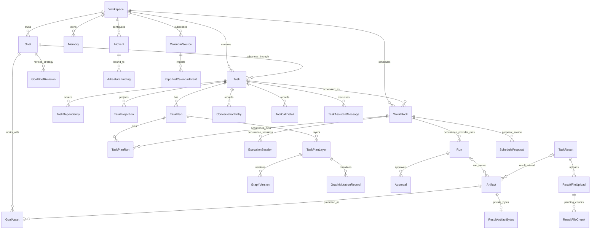

# Data Model

Chrona persists goal, task, schedule, execution, memory, and AI-client state in SQLite through Prisma 7.

Schema source: `prisma/schema.prisma`.

## Target evolution: work-owned results

The [Product Architecture](../zh/product-architecture.md) requires results and
version-bound review to exist independently of managed execution. B1–B3 provide
that storage, shared application foundation, external intake routes, uploads,
and deterministic review UI. The separately implemented work-record slice adds
manual-work continuity and is deployed on the authorized instance with separate opt-in writes.

| Current coupling | Required target property |
| --- | --- |
| Canonical result container in `TaskPlanRun.planRun.mutableGraph.planOutput` | Stable work-owned result identity/version that does not require a plan run |
| NodeResult aggregation and Run-owned Artifact provenance | One semantic result/artifact model accepting manual, external, or managed origins; genuine Run/node links retained when present |
| Acceptance event scoped to a completed Run | Review bound to the exact result version, with compatible reads of historical acceptance |
| Goal Inbox and formal GoalAsset versions | Reuse the existing promotion/review concepts; no parallel external asset lifecycle |

The work-owned result models described below reuse Task identity and preserve
occurrence isolation. The managed-result adapter and Goal asset reuse remain
later implementation work. Do not
create fake Run/ExecutionSession rows, make all ownership fields nullable without
replacement invariants, or copy a second external-results database.

Before persistence changes: specify identity and scope constraints, source
attribution, version/concurrency rules, artifact ownership, historical result
and acceptance mapping, migration/rollback, and fresh-install/upgrade tests.
Keep shipped migration checksums and existing data compatibility intact.

## Current schema inventory

- Models: see `prisma/schema.prisma` as the authoritative current inventory.
- Enums: see `prisma/schema.prisma` as the authoritative current inventory.

## Main aggregates

| Aggregate | Key models | Purpose |
| --- | --- | --- |
| Workspace | `Workspace` | Scope for tasks, memory, schedule, calendar sources, and configuration. |
| Goal | `Goal`, `GoalAsset`, `GoalAssetVersion`, `GoalAssetDraft`, `GoalInboxCandidate`, `GoalFormSubmission`, `GoalAssetJob`, `GoalBriefRevision` | Durable outcome lifecycle, versioned Workbench assets, result intake, form submissions, export jobs, automatic accepted-result context, and immutable artifact provenance. |
| Task | `Task`, `TaskDependency`, `TaskProjection`, `TaskSession`, `TaskTimelineItem` | Core work item, relationships, projection-backed read shape, scoped work sessions, and timeline rows. |
| Work records (opt-in, Web/MCP) | `WorkRecord`, `WorkSource`, `WorkEntry`, `WorkCommand` | One optional extension per manual Task; stable source links, independent attributed signals, append-only progress/change history, CAS and durable command receipts. No parallel Task or Run. |
| Work results (B1–B3, Web/MCP) | `TaskResult`, `TaskResultVersion`, `TaskResultReview`, `ResultCommand`, `ResultVersionArtifact`, `ResultFileUpload`, `ResultFileChunk`, `ResultArtifactBytes` | Source-independent identity, immutable semantic versions, exact-version review, durable receipts and scoped artifact bindings. |
| Work-page input (opt-in, local implementation) | `WorkPageInput`, `WorkPageCommand`, `TaskResult.inputRevision` | Append-only notes and exact-result-version form answers; separate input CAS/replay receipts. Authored definitions stay in existing result content. |
| Content library (opt-in, local implementation) | `LibraryState`, `LibraryGroup`, `LibraryFolder`, `LibraryAssignment`, `LibraryCommand` | Workspace classification revision; one folder per Task/group, multiple groups per Task; protected manual choices, immutable actor-bound receipts. No content copies. |
| Plan | `TaskPlan`, `TaskPlanLayer`, `GraphVersion`, `GraphMutationRecord`, `ReconciliationEvent`, `TaskPlanNodeAttempt`, `TaskPlanTerminalAction` | Generated/accepted executable graph plan, node-attempt history, terminal actions, and graph-change history. |
| Execution | `TaskPlanRun`, `Run`, `ExecutionSession`, `RuntimeCursor`, `Approval`, `Artifact`, `TaskPlanProviderRun`, `TaskPlanProviderApproval`, `RunToken` | Plan/run/session state, runtime cursoring, provider continuity, approvals, tokens, and outputs. |
| Schedule/activation | `TaskTrigger`, `TriggerDelivery`, `TaskOccurrence`, `WorkBlock`, `ScheduleProposal`, `SchedulerLease`, `SchedulerEvent` | Versioned activation definitions and deliveries, neutral execution occurrences, optional time placement, schedule suggestions, and scheduler automation. |
| External calendar | `CalendarSource`, `ImportedCalendarEvent` | Read-only calendar subscriptions, sync status, imported busy events, and calendar-backed schedule context. |
| Conversation/tool history | `ConversationEntry`, `ToolCallDetail`, `ToolInvocation`, `TaskAssistantMessage`, `TaskResultContinuation`, `RawEventLog` | User/assistant conversation, accepted-result continuation and idempotency state, runtime tool-call detail, invocation records, and raw event audit data. |
| Memory | `Memory` | Workspace/task memory entries used by internal projections and AI context-building flows. |
| AI configuration | `AiClient`, `AiFeatureBinding` | Database-backed AI clients and feature-to-client bindings. |
| Event log | `Event` | Durable event records used by projections/integration flows. |

Work-record identity, native calendar adoption constraints, source/report trust,
quotas and compatible migration behavior are specified in [Work records](./work-records.md).
Meeting cancellation does not change Task status, and reports do not grant authority.

## Entity relationship overview

```mermaid
erDiagram
  Workspace ||--o{ Task : contains
  Workspace ||--o{ Goal : owns
  Goal ||--o{ Task : advances_through
  Goal ||--o{ GoalAsset : works_with
  Goal ||--o{ GoalBriefRevision : revises_strategy
  Artifact ||--o{ GoalAsset : promoted_as
  Workspace ||--o{ Memory : owns
  Workspace ||--o{ AiClient : configures
  Workspace ||--o{ WorkBlock : schedules

  Task ||--o{ TaskDependency : source
  Task ||--o{ TaskProjection : projects
  Task ||--o{ TaskPlan : has
  Task ||--o{ WorkBlock : scheduled_as
  Task ||--o{ ConversationEntry : records
  Task ||--o{ ToolCallDetail : records
  Task ||--o{ TaskAssistantMessage : discusses

  TaskPlan ||--o{ TaskPlanLayer : layers
  TaskPlan ||--o{ TaskPlanRun : runs
  TaskPlanLayer ||--o{ GraphVersion : versions
  TaskPlanLayer ||--o{ GraphMutationRecord : mutations

  WorkBlock ||--o{ TaskPlanRun : occurrence_runs
  WorkBlock ||--o{ ExecutionSession : occurrence_sessions
  WorkBlock ||--o{ Run : occurrence_provider_runs
  Run ||--o{ Approval : approvals
  Run |o--o{ Artifact : run_owned
  TaskResult |o--o{ Artifact : result_owned
  Artifact ||--o| ResultArtifactBytes : private_bytes
  TaskResult ||--o{ ResultFileUpload : uploads
  ResultFileUpload ||--o{ ResultFileChunk : pending_chunks

  AiClient ||--o{ AiFeatureBinding : bound_to
  WorkBlock ||--o{ ScheduleProposal : proposal_source
  Workspace ||--o{ CalendarSource : subscribes
  CalendarSource ||--o{ ImportedCalendarEvent : imports
```

## Goal foundation and remaining target

The current schema ships `Goal`, optional `Task.goalId`, read-only `GoalAsset`,
`GoalBriefRevision`, and immutable `Task.goalContext`.
Goal lifecycle is `Draft | Active | Paused | Achieved | Stopped`. Achievement
requires explicit user confirmation and persists note, actor identity,
timestamp, and Goal-owned evidence Artifact IDs in
`Goal.achievementConfirmation`; a canonical `goal.achieved` event provides the
audit record. `GoalAsset` records source and current Artifact references without
mutating source execution evidence. Accepted Task results remain immutable and
separate from these Goal-scoped references.

`Goal.configRevision` is a persisted monotonic edit token, starting at 1. A SQLite
trigger increments it for changes to title, description, brief, criteria,
lifecycle, review time, achievement confirmation or workspace, covering every
canonical writer and A→B→A even when timestamps match. Management note-only writes
increment it explicitly. MCP exposes `editRevision: goal-config-v1:N`; the older
snapshot `revision` remains observational. A management edit atomically stores
content, an agent-attributed brief revision when changed, `goal.management_updated`
audit and command receipt. Notes are not formal evidence. Revised criterion
meaning resets confirmation/evidence rather than inheriting proof of old meaning.
The registered release-line amendment upgrades existing Goals without changing
content or lifecycle; released migrations are unchanged.

`Goal.operationalBrief` stores the current intended outcome, current focus,
strategy, and constraints. Every save appends `GoalBriefRevision` with actor and
time. When any Goal-linked Task is created, Chrona automatically freezes the
current Operational Brief, capture time, expected outcome, and a compact
catalog of then-accepted Goal results into `Task.goalContext`. Plan generation
consumes this immutable source context; later Goal edits and newly accepted
results do not rewrite existing Task input. Planning and execution sessions can
retrieve full accepted results on demand through a bounded, Task-scoped,
read-only MCP operation.

The shipped model includes closed-union `TaskTrigger`, idempotent
`TriggerDelivery`, and neutral `TaskOccurrence`. Schedule and bounded internal
event adapters materialize occurrence authority; webhook ingress remains
unshipped. The complete invariants and adapter security boundary are specified
in [Long-Horizon Goals and Triggers](./long-horizon-goals-and-triggers.md).

Goal Workbench persistence uses `GoalAsset` identity plus immutable
`GoalAssetVersion`, mutable `GoalAssetDraft`, reviewable `GoalInboxCandidate`,
version-bound `GoalFormSubmission`, and export/thumbnail `GoalAssetJob` records.
Accepted source Results and Artifacts remain immutable; restoring an old version
always appends a new formal version.

## Task state

Important enums:

- `TaskStatus`
- `TaskPriority`
- `TaskDependencyType`

Tasks are the canonical work records. `TaskProjection` stores read-optimized task state used by app surfaces after create/update/lifecycle/result changes.

`TaskStatus.Completed` and `TaskStatus.Done` are both terminal, but they are not interchangeable today:

- `Completed` means Chrona/runtime execution reached a completed state, including imported calendar tasks auto-completed by sync policy.
- `Done` means the user explicitly accepted or closed the task outcome after completion; derivation keeps `Done` stable and does not downgrade it to runtime-derived `Completed`.

New code should use `Completed` for runtime/import completion and reserve `Done` for explicit user closure until the enum is consolidated.

Typical lifecycle actions:

- create
- update
- complete
- reopen
- delete
- attach result
- schedule through work blocks
- generate/accept/execute plan

## Plan and graph state

Important models:

- `TaskPlan`
- `TaskPlanLayer`
- `GraphVersion`
- `GraphMutationRecord`
- `ReconciliationEvent`

Important enum:

- `TaskPlanStatus`
- `GraphMutationStatus`

A generated plan blueprint becomes executable only after acceptance/materialization. Layers hold graph snapshots and execution context. Graph mutation/reconciliation records support plan evolution and traceability.

## Execution state

Important models:

- `TaskPlanRun`
- `Run`
- `ExecutionSession`
- `RuntimeCursor`
- `Approval`
- `Artifact`

Important enums:

- `RunStatus`
- `ExecutionSessionStatus`
- `ApprovalStatus`
- `ArtifactType`

Execution records distinguish Chrona plan-run state from external runtime/provider runs. `ExecutionSession` is the server-side scope for AI-visible refs. `RuntimeCursor` tracks provider stream/progress cursoring. Approvals and artifacts store intervention and output records.

Execution is occurrence-scoped. `TaskOccurrence` is the durable execution
identity; `WorkBlock` is optional calendar placement. `TaskPlan`, `TaskPlanRun`,
`ExecutionSession`, `Run`, and `Artifact` carry `occurrenceId` so a failure,
wait, result, or late event from one occurrence cannot contaminate a sibling.
Legacy `workBlockId` remains for schedule placement and scoped compatibility.
The projection committer (`rebuildTaskProjection`) scopes its
runs/sessions/approvals to the focused occurrence, so a failed or cancelled
occurrence never contaminates a sibling occurrence. See
[Backend Execution Flow](./backend-execution-flow.md) → "Task state authority".

### Work-page definitions and owner input

`TaskResultVersion.content.page` optionally contains the restricted versioned
content tree, inline data and form definitions. `WorkPageInput` belongs to that
same result: note UUIDs persist across versions, while answers bind exact
versionId/formKey. Edits append; they do not alter result snapshots. Independent
`inputRevision` and `WorkPageCommand` give input CAS and actor-bound idempotency.
The DB rejects cross-scope/rewritten history, and events omit note/answer bodies.
See [work-page authority, quotas and migration](./work-pages.md). This slice is
local, not deployed, and does not merge with GoalFormSubmission or legacy Runs.

### Grouped content classification (local implementation)

`LibraryAssignment` is keyed by `(taskId, groupId)` and points to an optional
folder in that group. Missing/null folder is unclassified; a protected null row
preserves a manual decision against later Agent changes. Folder removal uses
`SET NULL`, group removal deletes only its classifications, and all views reuse
the existing Task/results/page. `LibraryState` provides workspace CAS;
`LibraryCommand` retains the actual paths/new folders and actor-bound replay
receipt. SQL scope guards reject cross-group/workspace links. The library does
not change Task status, results, acceptance, calendar placement or execution.
See [contracts, permissions and limits](./content-library.md).

### Work-owned results (B1 foundation)

`TaskResult` is unique by `(taskId, scopeKey)`, where scopeKey is `task` or
`occurrence:<id>`. SQLite validates workspace/task/occurrence consistency.
Composite foreign keys keep head, accepted, parent and review/command version
references inside the same result. `editRevision` advances for both publication
and review; the application token `result-v1:<resultId>:<revision>` also binds
identity, preventing a sibling result's revision from authorizing a write.

`TaskResultVersion` stores bounded semantic content, its deterministic hash,
server publication time, trusted source kind/actor key, and explicitly
source-reported label/work ID/time. Versions are append-only. B1 application
principals can be human or external; the managed storage kind is reserved for
the later genuine-execution adapter, not caller-supplied provenance.

`TaskResultReview` binds an accept/request-changes/reject fact to the current
head and a unique result revision. History orders by that revision, not by
wall-clock or random ID ties. Acceptance changes only the accepted-version
pointer, not Task, Run or Goal state. Publishing a new version preserves an older accepted pointer;
subsequent feedback does not erase prior acceptance facts. `ResultCommand`
persists a bounded receipt and payload hash with unique
`(workspaceId, actorKey, operation, requestId)` identity. All writes, current
authorization checks, CAS, bindings, receipts and `result.version_published` /
`result.version_reviewed` audit events share one transaction. These topics do
not dispatch the managed `task.result.accepted` trigger.

`ResultVersionArtifact` binds a version's declared semantic key/role to an
existing authorized Artifact. Its identity/URI/type/metadata fingerprint detects
later source-row changes. Links are sealed when the version becomes head.
Actual bytes must be verified by a trusted local adapter; missing adapters fail
closed. B2b adds explicit `ownerKind=run|result` with exactly one real owner:
nullable `runId` or `resultId`, enforced by SQLite triggers. Result-owned artifacts
and `ResultArtifactBytes` are immutable and cascade from the owning TaskResult.
`ResultFileUpload` stores actor-scoped request identity, size/hash, progress,
expiry and terminal receipt; `ResultFileChunk` stores contiguous immutable chunks.
Finish commits the artifact, verified BLOB and receipt in one transaction, then
removes chunks. There is no arbitrary disk-path/URL ingestion or fake Run.
Download requires a version binding and fresh file hash validation. Legacy Run
fingerprints and AF identifiers remain unchanged; old readers filter Run owners.
See [file limits and cleanup policy](./work-results.md#private-file-protocol).

Use `createTaskResultsService` from `@chrona/engine`; see the
[B1 implementation contract](../zh/work-results-phase-a.md#10-b1已实现的存储与共享用例)
for foundation composition requirements; [current entries](./work-results.md)
cover authenticated Web/MCP, explicit scopes and deterministic UI. Explicit task deletion removes the owning
result aggregates before deleting existing Run artifacts; individual versions,
reviews and receipts cannot be edited or deleted independently.

### Canonical managed result state

`TaskPlanRun.planRun.mutableGraph.planOutput` is the persisted result container. Its name remains tied to the existing JSON envelope, but its contents are canonical result state rather than a mutable page:

- `manifest`: deterministic `ResultManifest` aggregated from current immutable `NodeResult` records.
- `finalizedResult`: the validated final Spec plus the exact Manifest revision used to produce it.
- `finalization`: `Pending`, `Running`, `Ready`, or `Failed`, including attempt and failure metadata.
- `revision`, `updatedAt`, and `updatedByNodeId`: canonical result-change metadata.

Run-owned `Artifact` rows hold file identity, generated URI, checksum, size, MIME, preview, source node, and deliverable key. AI-visible structures refer to these rows only through deterministic opaque `AF...` references. Host preview/download fields are materialized at read time and are never persisted in finalized Specs.

Result review is stored as a canonical `task.result_accepted` Event scoped to a completed Run. It does not change Task execution status. Goal Workbench candidates copy a read-only finalized result and opaque artifact references into an auditable pending Inbox item; only candidate resolution creates a formal immutable `GoalAssetVersion`.

## Schedule state

Important models:

- `WorkBlock`
- `ScheduleProposal`
- `SchedulerLease`
- `SchedulerEvent`

Important enums:

- `ScheduleStatus`
- `ScheduleSource`
- `ScheduleProposalStatus`
- `WorkBlockStatus`
- `WorkBlockTrigger`

Schedule state supports user-created and AI-suggested time blocks, proposal decision workflows, scheduler automation leasing, and due-work startup.

`TaskTrigger` is the versioned activation definition. Shipped kinds are
schedule, bounded internal event, and authenticated email. `TriggerDelivery`
owns replay-safe delivery facts; `TaskOccurrence` is the resulting durable
execution scope. `WorkBlockTrigger` records only optional calendar-placement
provenance. Webhook remains rejected until its complete security contract ships.

## External calendar state

Important models:

- `CalendarSource`
- `ImportedCalendarEvent`

Important enums:

- `CalendarSourceLifecycleState`
- `CalendarEventStatus`
- `CalendarSyncState`
- `CalendarSyncPolicy`
- `CalendarAutomationPolicy`

External calendars are read-only subscription sources. Source URLs stay server-side; browser responses use redacted labels. Imported events become read-only busy blocks for schedule/planning context and can drive auto-plan/auto-complete behavior according to source sync and automation policies.

## Conversation, tool, and assistant state

Important models:

- `ConversationEntry`
- `ToolCallDetail`
- `ToolInvocation`
- `TaskAssistantMessage`
- `RawEventLog`
- `TaskTimelineItem`

These records back task workspace conversation/execution context, assistant surfaces, runtime/tool-call inspection, raw provider/runtime event audits, and task timeline projections.

## Memory state

Important model:

- `Memory`

Important enums:

- `MemoryScope`
- `MemorySourceType`
- `MemoryStatus`

Memory entries are scoped to workspace/task context and used by internal projections and AI context-building flows. Memory is not a current primary navigation surface.

## AI client configuration

Important models:

- `AiClient`
- `AiFeatureBinding`

Chrona stores AI client configuration in the database and binds clients to feature slots. `packages/engine/src/modules/ai` loads clients directly from this configuration; provider selection is not hard-coded in routes. Manual task-form review is persisted as an `AiFeatureRun` with subject type `task_node_attempt`; its operation id is the durable node-attempt id, so refresh/recovery reuses the completed review. The final validated form itself remains in existing plan/node-result JSON and requires no database schema change.

## Workspace and task-kind state

Important current enums:

- `WorkspaceStatus`
- `TaskKind`

Workspaces can be lifecycle-gated independently from task state. Current
`TaskKind` distinguishes `single` and `recurring`; recurrence is represented by
task RRULE/anchor fields and expanded into WorkBlocks. This is a current-schema
description, not the final abstraction: the accepted target separates
`single` versus `series` execution mode from schedule trigger definitions.
See [Long-Horizon Goals and Triggers](./long-horizon-goals-and-triggers.md).

## Operational notes

- Prisma client generation: `bun run db:generate`.
- Seed local data: `bun run db:seed`.
- Seed retained Goal acceptance evidence: `bun run db:seed:goal-acceptance`.
- Schema source: `prisma/schema.prisma`; migration SQL lives under
  `prisma/migrations` and is applied by `packages/db/src/sqlite-migrations.ts`.
- Chrona keeps one mutable release-line migration for the current unreleased
  release. Before the first public release, that migration is
  `prisma/migrations/0001_initial`; after a public release, the first schema
  change starts one new release-oriented migration folder for the next release.
- Do not create a migration folder for every schema edit. Accumulate subsequent
  unreleased schema changes in the current release-line migration and keep it
  aligned with `prisma/schema.prisma`.
- If an earlier checksum of that mutable migration has already been applied to
  an unreleased development database, add a checksum-keyed SQL amendment inside
  the same migration folder and register its source schema fingerprint in
  `release-metadata.json`. Startup applies it only to that exact known source,
  verifies the final release-line fingerprint, and updates migration history in
  the same transaction.
- After a public release ships, migrations in that release are immutable. Do not
  edit, rename, delete, or squash them; start the next release-line migration
  from the shipped release state.
- Release migration verification must cover both fresh SQLite creation and
  upgrade from the previous released database snapshot.

Do not edit generated Prisma client files. Update `prisma/schema.prisma`, then regenerate.
