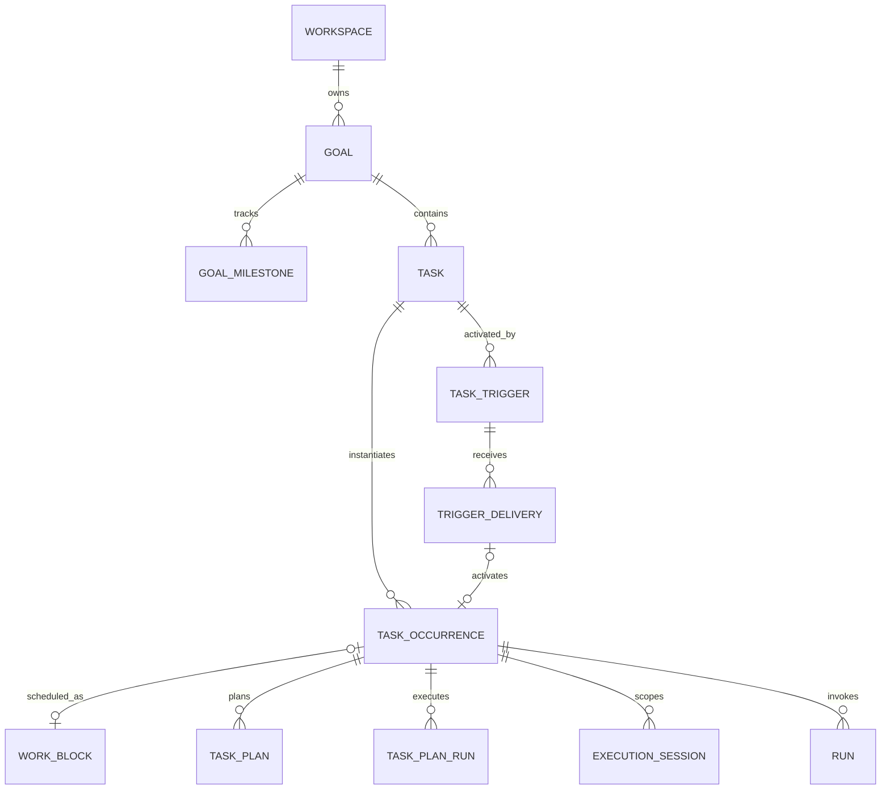
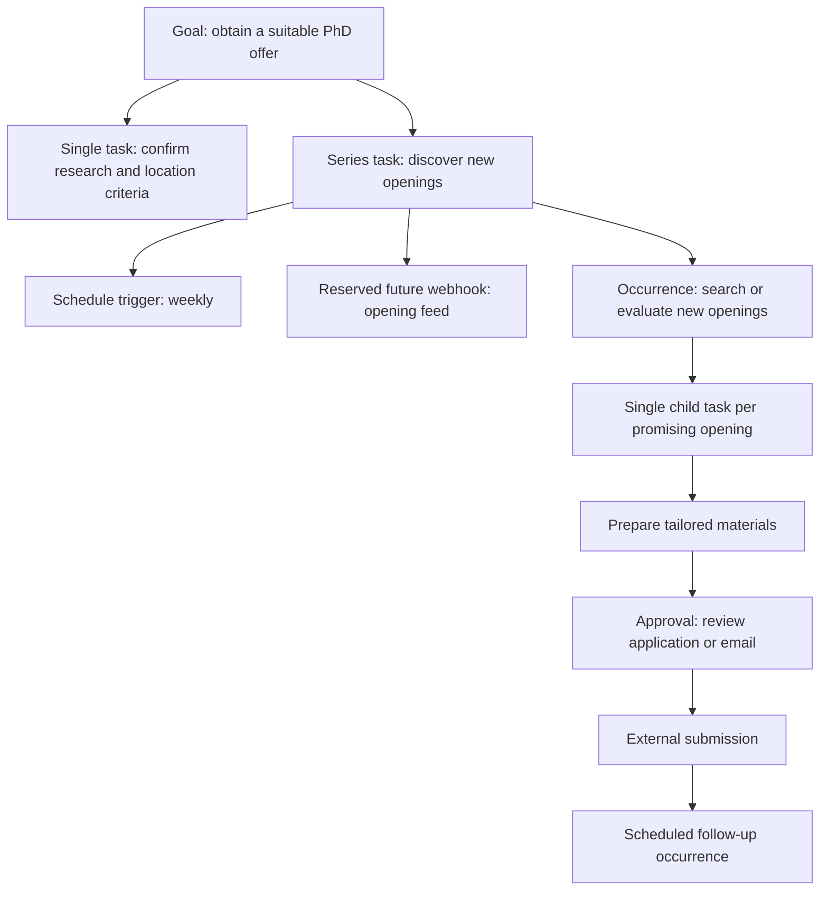

# Long-Horizon Goals, Triggers, and Task Occurrences

Status: accepted target design; not yet implemented.

This document is the canonical design for long-horizon work and extensible task
activation in Chrona. It defines the target model and migration boundaries. The
current implementation remains described in [Data Model](./data-model.md) and
[Backend Execution Flow](./backend-execution-flow.md) until each phase ships.

## 1. Problem

Chrona currently models two task kinds:

- `single`: one task progresses through one bounded workflow to a result;
- `recurring`: an RRULE expands one task into scheduled `WorkBlock`
  occurrences.

That is enough for a one-time deliverable and for repeating substantially the
same work on a clock. It is not enough for a long-horizon outcome such as
"obtain a suitable PhD offer":

- the outcome may take months;
- the strategy changes as external facts change;
- repeated discovery produces heterogeneous follow-up work;
- several applications may progress concurrently;
- waits can last days or weeks without a live AI process;
- external side effects such as sending email require isolated approval and
  retry boundaries;
- completion of one search or application must not complete the overall
  outcome.

The current recurrence model also couples three independent concerns:

1. whether a task may have more than one execution occurrence;
2. whether occurrences are produced by a schedule;
3. whether an occurrence is represented by a calendar `WorkBlock`.

This coupling prevents clean support for non-time sources such as webhooks or
internal events.

## 2. Decisions

The target architecture uses these separate concepts:

| Concept | Responsibility |
| --- | --- |
| `Goal` | A durable outcome that may require many changing tasks over time. |
| `GoalMilestone` | An optional stage or measurable intermediate outcome within a goal. |
| `Task` | A bounded unit of work and its reusable execution configuration. |
| `TaskTrigger` | A persisted rule that may produce task occurrences. Schedule is one trigger kind. |
| `TriggerDelivery` | One durable, idempotent observation that a trigger condition occurred. |
| `TaskOccurrence` | One isolated instance of a task becoming eligible for work. |
| `WorkBlock` | Optional calendar placement for an occurrence; it remains a time container. |
| Automation policy | Whether and when Chrona plans or executes an occurrence after it exists. |
| Plan/run/session | Execution facts scoped to one occurrence. |

Normative decisions:

1. Long-horizon work is modeled as a `Goal`, not a third
   `TaskKind.long_running`.
2. A goal is advanced by bounded tasks. It never owns a provider session or a
   continuously running execution.
3. A repeated task and a scheduled task are not synonyms. Repeatability is a
   task property; schedule is a trigger kind.
4. A trigger creates or materializes an occurrence. It does not mutate plan
   nodes or call a provider directly.
5. Automation policy is independent of trigger kind.
6. `TaskOccurrence` is the execution scope. `WorkBlock` is optional and must
   not be fabricated for webhook or internal-event activations.
7. Trigger definitions and trigger deliveries are separate durable facts.
8. Manual execution is a built-in activation source, not a persisted empty
   trigger definition.
9. Existing `ExecutionTrigger` remains command provenance. Existing
   `WorkBlockTrigger` remains WorkBlock provenance. Neither becomes the trigger
   definition catalog.
10. Webhook support is reserved by contracts and boundaries only. No webhook
    endpoint, dormant schema row, or unvalidated JSON configuration is added
    until the feature is implemented end to end.

## 3. Aggregate model



A task may exist without a goal. A goal may contain one-time and repeatable
tasks. A task may have zero or more persisted triggers and may still be started
manually.

### 3.1 Goal

Target shape:

```ts
type GoalStatus = "Draft" | "Active" | "Paused" | "Achieved" | "Stopped";

type Goal = {
  id: string;
  workspaceId: string;
  title: string;
  description: string | null;
  successCriteria: GoalSuccessCriterion[];
  status: GoalStatus;
  nextReviewAt: string | null;
  createdAt: string;
  updatedAt: string;
  achievedAt: string | null;
  stoppedAt: string | null;
};
```

Goal invariants:

- `Active` means the outcome is still being pursued. It does not mean an AI
  process is running.
- `Paused` prevents automatic goal review and automatic creation of new goal
  tasks. It does not rewrite immutable task/run history.
- `Achieved` requires explicit user acceptance or a product-defined success
  criterion confirmed by the user. Completion of a child task alone cannot
  achieve the goal.
- `Stopped` means the user no longer intends to pursue the outcome. It is not a
  failure state.
- `Needs attention`, `work active`, and `review due` are derived presentation
  facets, not competing lifecycle states.
- A goal does not own a Plan, Run, ExecutionSession, or provider session.

`GoalSuccessCriterion` must be a validated product contract. Free-text criteria
may be supported, but executable automatic criteria require an explicit typed
kind and deterministic evaluator.

### 3.2 Goal milestones

Milestones express intermediate outcomes such as "base application materials
ready" or "first five high-fit applications submitted".

Target lifecycle:

```ts
type GoalMilestoneStatus = "Planned" | "Active" | "Achieved" | "Skipped";
```

Milestones do not execute. Tasks and accepted results provide their evidence.
The first Goal release may omit persisted milestones and show task groups
instead; it must not emulate milestones with fake executable parent tasks.

### 3.3 Task definition and repeatability

The target task property is execution mode:

```ts
type TaskExecutionMode = "single" | "series";
```

- `single` accepts one effective occurrence. Once that occurrence reaches its
  accepted terminal result, later automatic deliveries are ignored.
- `series` may create many isolated occurrences until the series is paused or
  ended.

The current `TaskKind = single | recurring` is a legacy coupling. During
migration, `recurring` maps to `series` plus a schedule trigger. New code must
not assume that every future series uses RRULE.

Definition lifecycle and occurrence execution state are separate:

```ts
type TaskDefinitionStatus =
  | "Draft"
  | "Active"
  | "Paused"
  | "Completed"
  | "Stopped";
```

For a `single` task, completion of its accepted occurrence may complete the
task definition. For a `series`, completion of one occurrence must not complete
the task definition. A series completes only through an explicit end condition
or user action. User-facing running/waiting/failed state is derived from the
focused occurrence rather than persisted as the series lifecycle.

Existing `parentTaskId` and `TaskDependency` continue to express bounded task
hierarchy and `blocks` / `relates_to` / `child_of` relationships. They do not
replace Goal ownership or Goal success state.

## 4. Trigger model

### 4.1 Trigger definition

Target contract:

```ts
type TaskTriggerDefinition =
  | ScheduleTriggerDefinition
  | WebhookTriggerDefinition
  | EventTriggerDefinition;

type TaskTriggerState = "Enabled" | "Paused" | "Retired";

type TaskTrigger = {
  id: string;
  workspaceId: string;
  taskId: string;
  state: TaskTriggerState;
  definition: TaskTriggerDefinition;
  version: number;
  createdAt: string;
  updatedAt: string;
};
```

Persistence may store `kind` as a string and `config` as JSON so adding an
adapter does not require a database enum migration. The contracts package must
still validate the pair through a closed discriminated union for every shipped
kind. Unknown kinds are rejected, not treated as inert configurations.

A task may have multiple triggers. Pausing or retiring a trigger affects future
deliveries only; it never deletes occurrences or execution history.

### 4.2 Schedule trigger

```ts
type ScheduleTriggerDefinition = {
  kind: "schedule";
  config:
    | {
        mode: "once";
        fireAt: string;
        timezone: string;
        durationMs?: number;
      }
    | {
        mode: "recurring";
        rrule: string;
        anchorStartAt: string;
        timezone: string;
        durationMs?: number;
        windowUntil?: string;
      };
};
```

Rules:

- recurrence expansion may materialize occurrences ahead of their eligibility
  time;
- the schedule occurrence key is derived deterministically from the trigger
  version and occurrence start;
- a scheduled occurrence may own a `WorkBlock` with the same time window;
- timezone is explicit; RRULE evaluation must not depend on server local time;
- editing a schedule trigger increments its version and reconciles only future,
  unstarted occurrences;
- started or terminal occurrences remain immutable history;
- cancellation of a future WorkBlock cancels or suppresses the corresponding
  occurrence according to an explicit command, never by deleting facts.

Existing recurrence fields remain authoritative until the schedule-trigger
migration phase. There must be no permanent dual writer between legacy fields
and `TaskTrigger`.

### 4.3 Reserved webhook trigger

Webhook is a future kind, not part of the first implementation:

```ts
type WebhookTriggerDefinition = {
  kind: "webhook";
  config: {
    endpointRef: string;
    credentialRef: string;
    eventType?: string;
    payloadSchema?: unknown;
    filter?: TriggerFilter;
  };
};
```

This shape reserves these boundaries:

- `endpointRef` identifies a server-owned endpoint; it is not the secret;
- `credentialRef` points to server-side secret storage;
- filters use a bounded declarative language, never arbitrary JavaScript;
- payload schema and filter evaluation happen before occurrence creation;
- only normalized, bounded, redacted input may enter an occurrence or AI
  context;
- provider-specific event names remain adapter details unless promoted into a
  documented product event contract.

No placeholder webhook route or database configuration is created before
signature verification, replay protection, idempotency, rate limiting,
redaction, secret rotation, and audit behavior can ship together.

### 4.4 Reserved internal event trigger

```ts
type EventTriggerDefinition = {
  kind: "event";
  config: {
    topic: string;
    filter?: TriggerFilter;
  };
};
```

Potential product topics include `task.result.accepted`, `goal.review_due`, and
`integration.event.received`. Topics are versioned product contracts. Raw
provider/runtime events are not automatically eligible topics.

An event trigger consumes committed domain facts after their originating
transaction. It must not create recursive activation loops; loop prevention
uses causation IDs, maximum activation depth, and per-trigger idempotency.

### 4.5 Manual activation

Manual start remains available without a `TaskTrigger` row:

```ts
type TaskActivationSource =
  | { kind: "manual"; actor: ExecutionActor }
  | { kind: "trigger"; triggerId: string; deliveryId: string }
  | { kind: "system"; reason: string };
```

A manual activation still creates a `TaskOccurrence`, giving manual and
automatic work identical execution isolation and history.

## 5. Trigger delivery

A definition is configuration. A delivery is one observed signal.

```ts
type TriggerDeliveryStatus =
  | "Received"
  | "Accepted"
  | "Ignored"
  | "Duplicate"
  | "Failed";

type TriggerDelivery = {
  id: string;
  workspaceId: string;
  triggerId: string;
  deliveryKey: string;
  status: TriggerDeliveryStatus;
  receivedAt: string;
  processedAt: string | null;
  payloadDigest: string | null;
  normalizedInput: unknown | null;
  occurrenceId: string | null;
  ignoreReason: string | null;
  errorCode: string | null;
};
```

Required constraint:

```text
unique(triggerId, deliveryKey)
```

Delivery processing is at-least-once at the adapter boundary and effectively
once at occurrence creation. A retry returns the existing delivery outcome; it
must not create a second occurrence.

Raw webhook bodies and authentication headers are not persisted by default.
If a future integration requires retained evidence, it needs a separate,
bounded, encrypted/redacted retention policy and must never expose secrets to
browser responses, logs, tests, json-render output, or AI context.

## 6. Task occurrence

Target shape:

```ts
type TaskOccurrenceStatus =
  | "Scheduled"
  | "Ready"
  | "Running"
  | "WaitingForInput"
  | "WaitingForApproval"
  | "Blocked"
  | "Failed"
  | "Completed"
  | "Cancelled"
  | "Ignored";

type TaskOccurrence = {
  id: string;
  workspaceId: string;
  taskId: string;
  triggerId: string | null;
  deliveryId: string | null;
  occurrenceKey: string;
  source: TaskActivationSource;
  status: TaskOccurrenceStatus;
  eligibleAt: string;
  materializedAt: string;
  startedAt: string | null;
  completedAt: string | null;
  normalizedInput: unknown | null;
  workBlockId: string | null;
};
```

Occurrence invariants:

- one accepted `TriggerDelivery` creates at most one occurrence;
- one occurrence belongs to exactly one task;
- trigger-derived occurrences record the trigger version used to evaluate them;
- schedule occurrences may be materialized before `eligibleAt`;
- webhook and internal-event occurrences are normally eligible immediately;
- Plan, TaskPlanRun, ExecutionSession, Run, Approval, Artifact, and result
  selection must resolve through `occurrenceId`;
- terminal occurrence facts are immutable except for explicit result acceptance
  metadata;
- retry creates a new attempt/run within the same occurrence;
- restart-from-beginning creates a new execution epoch within the same
  occurrence;
- a genuinely new signal creates a new occurrence;
- an occurrence cannot be simultaneously running and waiting/terminal in the
  same authoritative state machine.

### 6.1 WorkBlock relationship

`WorkBlock` remains the scheduling and calendar container:

- it has start/end times, schedule status, conflicts, and schedule provenance;
- it may point to one occurrence;
- it is optional for unscheduled/manual/webhook/event occurrences;
- execution must not create a fake fixed-duration WorkBlock merely to satisfy a
  foreign key;
- Schedule reads WorkBlocks; Task Workspace reads the selected occurrence and
  may show its WorkBlock when present.

During migration, current `workBlockId` scoping remains supported until every
execution fact has `occurrenceId` and projections have cut over.

## 7. Automation policy

Trigger kind answers "why did this occurrence exist?" Automation policy answers
"what may Chrona do after it exists?"

Target policy:

```ts
type AutomationStepPolicy = {
  mode: "manual" | "automatic";
  offsetMs: number;
};

type TaskAutomationPolicy = {
  plan: AutomationStepPolicy;
  execute: AutomationStepPolicy;
};
```

`offsetMs` is relative to `TaskOccurrence.eligibleAt`. A schedule occurrence may
plan before its scheduled start. An immediate webhook occurrence normally uses
zero. Product presets such as `before_30m` remain UI conveniences mapped to this
contract.

Rules:

- auto-plan and auto-execute remain separate permissions;
- a trigger adapter cannot override task automation policy;
- automatic execution still observes plan acceptance, provider capability,
  approvals, and side-effect policy;
- ordinary not-due and already-active conditions remain steady-state scheduler
  facts, not Action Center failures;
- every automation action carries occurrence ID, causation ID, actor, origin,
  and idempotency key.

## 8. State derivation

Chrona must not collapse definition lifecycle, occurrence execution state, and
attention into one persisted status.

### Goal projection

```text
lifecycle: Draft | Active | Paused | Achieved | Stopped
activity: idle | work_active | review_due
attention: none | needs_input | blocked | failed
```

The UI chooses one primary label by a pure state table while retaining activity
and attention as metadata. `Active` and `Needs attention` must not appear as two
competing lifecycle states.

### Task projection

A task projection derives:

1. definition lifecycle;
2. focused occurrence (active, otherwise actionable, otherwise latest);
3. focused occurrence execution state;
4. next future occurrence;
5. next action.

A terminal occurrence completes a `single` task when its result is accepted. A
terminal occurrence does not complete an active `series` task.

### Trigger projection

Trigger configuration state is only `Enabled`, `Paused`, or `Retired`.
Delivery failures and latest activation state are derived diagnostics. One bad
delivery must not silently retire a trigger or fail its task series.

All derivation belongs in pure helpers under the domain/model layers. Pages and
React components must consume the same derived state source.

## 9. Goal review

Long-horizon progress is episodic, not a continuously running provider session.
A Goal review:

1. reads committed goal criteria, recent accepted task results, artifacts,
   deadlines, and blockers;
2. identifies changes since the previous review;
3. proposes creation, cancellation, reprioritization, or rescheduling of bounded
   tasks;
4. requires review before mutating the goal plan or creating side-effecting
   work;
5. persists its conclusions as Chrona facts;
6. ends its provider session like any bounded task.

A review cadence should initially be implemented as a normal goal-owned series
task with a schedule trigger. Goal must not gain a second private scheduler.
Event-driven reviews can later use the same trigger architecture.

## 10. Example: PhD search and application



Completion rules:

- one search occurrence completing does not complete the discovery series;
- one rejected opening does not fail the goal;
- one submitted application does not achieve the goal;
- sending email/application is isolated behind approval and idempotency;
- the goal becomes `Achieved` only when the success criterion is explicitly
  confirmed;
- the goal becomes `Stopped` when the user ends the search without achievement.

## 11. API and command boundary

Target APIs are resource-oriented; exact routes ship only with their feature:

```text
POST   /api/goals
GET    /api/goals/:goalId
PATCH  /api/goals/:goalId
POST   /api/goals/:goalId/actions

POST   /api/tasks/:taskId/triggers
PATCH  /api/tasks/:taskId/triggers/:triggerId
POST   /api/tasks/:taskId/triggers/:triggerId/actions
GET    /api/tasks/:taskId/occurrences
GET    /api/tasks/:taskId/occurrences/:occurrenceId
```

Goal actions are explicit (`pause`, `resume`, `achieve`, `stop`, `review`).
Trigger actions are explicit (`pause`, `resume`, `retire`). Execution commands
continue through the task/work command boundary but include `occurrenceId` in
command context.

Future external webhook ingress is an integration endpoint, not a generic task
mutation endpoint. It resolves an opaque endpoint reference server-side and
cannot accept Chrona task, plan, node, or workspace IDs from the payload as
authority.

## 12. Security and trust boundaries

Before any external trigger ships, it must provide:

- an unguessable endpoint reference;
- signature/secret verification before parsing untrusted fields into product
  input;
- request timestamp and replay-window validation;
- bounded body size and accepted content types;
- workspace and trigger ownership validation;
- per-endpoint rate limiting;
- secret rotation, revocation, and disabled-trigger behavior;
- delivery deduplication;
- closed payload schema validation and declarative filtering;
- redacted audit records;
- causation and occurrence IDs on resulting actions.

AI-authored output may summarize normalized trigger input but cannot define
credentials, permission decisions, execution lifecycle rules, or product
authority controls. Webhook payloads never bypass checkpoints or approval
requirements.

## 13. Package ownership

Target placement follows current package boundaries:

| Concern | Owner |
| --- | --- |
| Goal/trigger/occurrence schemas and DTOs | `packages/contracts` |
| Pure lifecycle, eligibility, and projection reducers | `packages/domain` |
| Goal commands, trigger evaluation orchestration, delivery processing, occurrence creation | `packages/engine` |
| RRULE/calendar and future external-system adapters | `packages/integrations/*` |
| Prisma models/repositories/migrations | `packages/db` + `prisma` |
| Thin HTTP validation/composition | `apps/server` |
| Goal workspace and task-trigger configuration UI | `features/*`, composed by `apps/web` |
| Provider execution | `packages/providers/*` after an occurrence is authorized |

Providers must not decide whether a trigger is valid, create occurrences, or
change Goal lifecycle.

## 14. Migration plan

Schema changes follow the release-line migration policy in `AGENTS.md` and
[Data Model](./data-model.md). Each phase must have one authoritative writer;
permanent dual-write compatibility is prohibited.

### Phase 0 — design reservation

- adopt this document as the target architecture;
- keep current APIs and schema unchanged;
- stop expanding legacy enums as if they were trigger catalogs;
- do not add webhook placeholders.

### Phase 1 — correct recurring-series semantics

- distinguish series lifecycle from occurrence execution state in domain
  derivation;
- ensure one completed WorkBlock does not complete or stop recurrence expansion;
- expose selected occurrence and series state separately in Schedule and Task
  Workspace;
- add table-driven state tests and recurrence-horizon tests.

### Phase 2 — introduce `TaskOccurrence`

- create occurrences for existing WorkBlocks and for unscheduled manual work;
- backfill and add `occurrenceId` to plan/run/session/artifact authority paths;
- migrate projections to occurrence scoping;
- retain `workBlockId` only as the optional schedule relationship;
- verify late run completions cannot mutate a different occurrence.

### Phase 3 — introduce Goal

- add Goal CRUD/lifecycle and optional task `goalId`;
- build a minimal Goal workspace showing criteria, active/actionable tasks,
  latest accepted results, and next review;
- reuse bounded tasks for review and follow-up work;
- add milestones only when the Goal UI needs persisted intermediate outcomes.

### Phase 4 — introduce schedule `TaskTrigger`

- materialize current one-time and RRULE schedule configuration as validated
  schedule triggers;
- version trigger edits and reconcile only future unstarted occurrences;
- cut recurrence expansion over to trigger-owned occurrence creation;
- remove legacy recurrence columns and permanent mapping code after all callers
  migrate;
- keep automation policy independent.

### Phase 5 — add the first non-time adapter

Implement `TriggerDelivery` and one real adapter end to end. If webhook is the
first adapter, signature verification, secret storage, replay protection,
idempotency, rate limits, payload validation, audit redaction, UI configuration,
and operational tests ship together. Only then add `webhook` to the shipped
contract union.

## 15. Verification requirements

Every implementation phase must prove its observable contract.

### Domain tests

- single versus series completion precedence;
- Goal lifecycle and derived attention/activity facets;
- trigger state versus delivery failure separation;
- occurrence state mutual exclusion and terminal stability;
- focused-occurrence selection and next-action derivation.

### Persistence/runtime tests

- unique delivery key prevents duplicate occurrence creation under concurrency;
- schedule re-expansion is idempotent;
- trigger edit does not rewrite started/terminal occurrences;
- Run/Session/Plan failure cannot contaminate a sibling occurrence;
- retry stays in one occurrence; new signal creates a new occurrence;
- late provider completion from an old execution epoch cannot mutate a restarted
  occurrence;
- series continues after a completed occurrence until paused/ended.

### Security tests for external triggers

- bad/missing signature rejection;
- expired timestamp and replay rejection;
- oversized/unsupported request rejection;
- disabled/retired trigger rejection;
- cross-workspace isolation;
- secret and raw payload redaction;
- payload cannot select private Chrona IDs or bypass approval.

### Product/E2E tests

- Goal shows stable lifecycle, active work, attention, and one primary next
  action;
- Schedule occurrence and webhook occurrence render without inventing a
  WorkBlock;
- multiple occurrences remain independently inspectable;
- mobile views have no horizontal overflow;
- paused Goal/trigger behavior is visible and reversible;
- external side-effect work always stops at its approval boundary.

## 16. Non-goals

This architecture does not make Chrona:

- a continuously running autonomous agent;
- a generic event-stream processing platform;
- a full project/portfolio management suite;
- an email client or applicant tracking system;
- a store for arbitrary webhook payloads;
- a provider-session persistence layer;
- a system where AI-authored UI or incoming events own permissions or runtime
  state.

The purpose is narrower: preserve a long-lived outcome while safely creating,
scheduling, executing, reviewing, and recovering bounded work occurrences.
