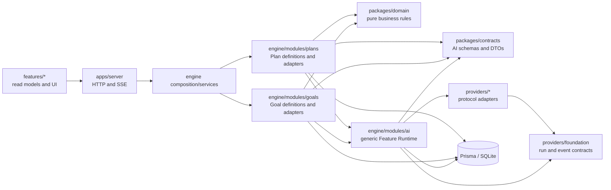
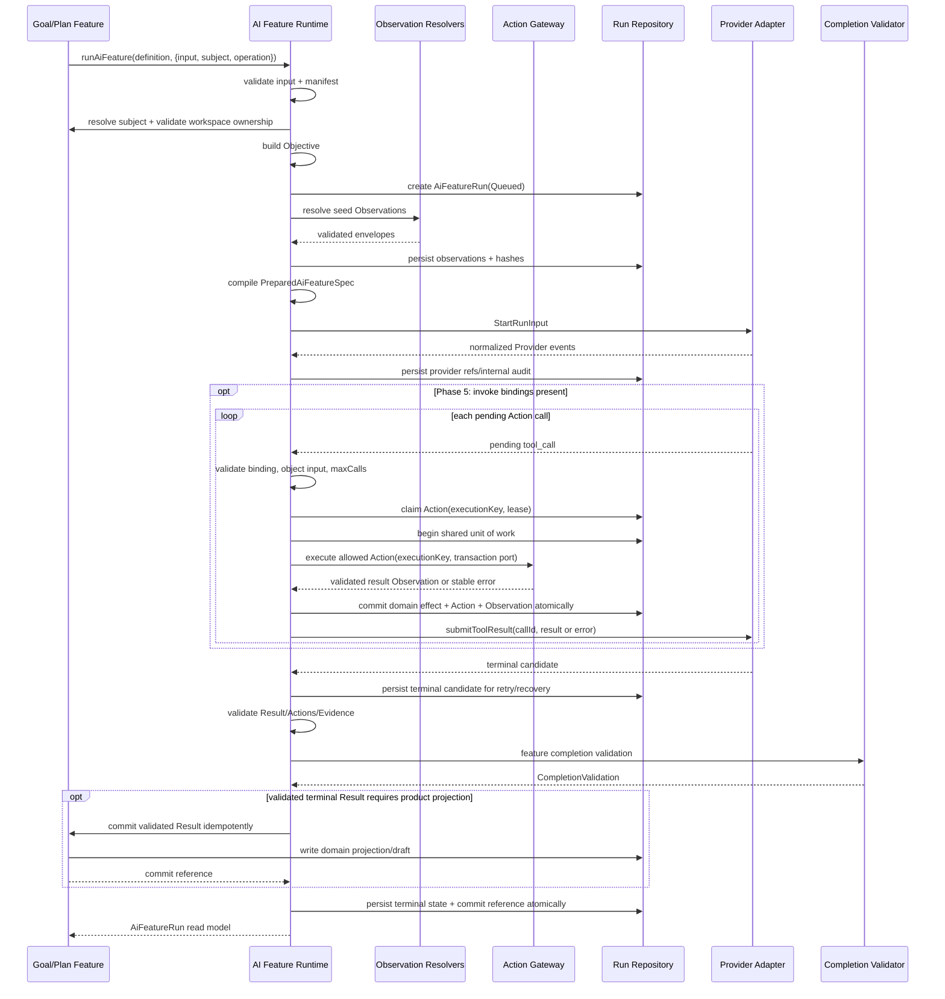

# Chrona AI Feature Runtime 架构与实施规范

状态：Proposed。本文描述目标架构和增量实施路径；当前代码仍以 `PreparedAiFeatureSpec`、Feature-specific Engine 流程和 Provider request 为主，本文所述通用 Runtime 尚未实现。

## 1. 目的

Chrona 的 AI 能力不应只是一组 prompt 或 Provider 调用。每个 AI Feature 必须显式定义：

1. AI 本次运行的 Objective；
2. AI 可以观察哪些稳定的领域 Observation；
3. AI 可以在运行中 invoke 哪些 Action；
4. AI 只能在结果中 propose 哪些 Action；
5. AI 必须返回什么结构化 Result 和 Artifact 引用；
6. 什么条件满足后，Chrona 才把本次运行视为完成。

统一模型为：

```text
AI Feature Run =
  Objective
  + Observation Space
  + Action Space
  + Result Contract
  + Completion Condition
```

本文回答两个问题：

- 这套能力在当前 monorepo 中应放在哪里；
- 如何从现有实现逐步迁移，而不把 Goal Review、Task Plan 或 Provider 重写成第二套系统。

## 2. 架构决策

### 2.1 所有权

这套系统的语义所有者是 `packages/engine`。

- `packages/contracts` 只拥有可序列化 schema、DTO 和引用类型；
- `packages/engine/src/modules/ai` 拥有通用 Feature Runtime、编译、运行状态和结果校验框架；
- `packages/engine/src/modules/goals`、`plans`、`tasks` 等模块拥有具体 Feature、Observation 和 Action 的领域含义；
- `packages/domain` 只拥有与 AI 无关的纯业务规则；
- `packages/providers/foundation` 只拥有 Provider-neutral 的运行输入、事件、能力和会话合同；
- `packages/providers/*` 只负责具体协议转换；
- `apps/server` 继续只做 HTTP/SSE 边界；
- `features/*` 只渲染领域 read model 并提交显式命令。

这与当前包边界一致：Engine 负责 application decisions and orchestration，Provider 负责 protocol adaptation，Contracts 保持 schema/type focused。

### 2.2 当前不新增 package

第一阶段不创建 `@chrona/ai-core`。

原因不是模型不重要，而是目前通用运行行为只有一个真实消费者：`@chrona/engine`。立即拆包会让 `contracts`、`engine/modules/ai` 和新包同时争夺模型所有权，也会在 Goal Review 与 Task Plan 尚未共同验证抽象时制造迁移成本。

先把它建设为 Engine 内部的逻辑 AI Kernel。只有满足以下任一条件时，才提取 `packages/ai-core`：

- Engine 之外出现第二个真实运行时消费者；
- 独立 worker、CLI runtime 或 SDK 需要直接运行 Feature；
- registry validation、run reducer 和 Provider-neutral compiler 已完全不依赖 Prisma、Goal、Task 和具体 Provider；
- Chrona 明确准备把该模型作为独立库发布。

即使未来拆包，具体 Goal/Task Feature 仍不得进入 `ai-core`。

### 2.3 不设计 IAM

本文不定义身份认证、授权、审批策略或 IAM。Action 是否可 invoke/propose 是 Feature 的语义合同，不是用户权限模型。

已有 capability session、run token、MCP scope 和 approval 机制可以继续保护实际调用边界，但它们不决定 Feature 的 Observation、Action 或 Completion 语义。

### 2.4 为什么不放进其他现有包

| 候选位置 | 不作为总所有者的原因 |
| --- | --- |
| `packages/providers/foundation` | 只应描述 Provider run/session/event/capability；放入 Goal/Task Feature 语义会让协议层决定产品工作流。 |
| `packages/runtime-core` | 当前职责是 Engine 与 Provider 共享的 backend-agnostic runtime primitive；Observation resolver、Action adapter 和 completion 都是 Chrona application behavior。 |
| `packages/domain` | 只能承载无 IO 的纯业务规则；Feature runner、Provider dispatch、DB snapshot 和 proposal persistence 都不属于纯领域层。 |
| `packages/contracts` | 适合 schema/type，不适合 resolver、executor、registry state、Provider selection 或事务。 |
| 新 `packages/ai-core` | 当前没有第二个真实运行时消费者；先在 Engine 内验证稳定的纯核心，再按第 2.2 节条件提取。 |

## 3. 当前实现与可复用基础

### 3.1 `PreparedAiFeatureSpec` 是编译产物，不是 Feature 定义

当前 `packages/contracts/src/ai-feature-specs.ts` 定义：

```ts
export type PreparedAiFeatureSpec = {
  feature: StructuredAiFeature;
  instructions: string;
  inputText?: string;
  structuredOutputSchema?: AiFeatureStructuredOutputSchema;
  terminalToolName?: string;
};
```

它已经适合表达 Provider 请求所需的 instructions、input、structured output 和 terminal tool，但不能表达：

- Observation 的类型、版本、来源与 hash；
- Action 是 invoke 还是 propose；
- Action 执行后返回什么 Observation；
- Result 中 Artifact、Evidence 和 Proposed Action 的区别；
- `needs_input` 与 `cannot_complete`；
- 结构合法之外的 Feature completion。

因此保留它，并把它定位为：

```text
AiFeatureDefinition
       ↓ Engine compile
PreparedAiFeatureSpec
       ↓ Provider request adapter
StartRunInput
```

在所有 Feature 迁移完成前，不重命名或移动该类型，以避免同时扰动计划执行和各 Provider。迁移完成后可以考虑将其重命名为 `PreparedProviderFeatureSpec`。

### 3.2 Provider foundation 已经提供正确的低层边界

`packages/providers/foundation/src/contracts/provider.ts` 已有：

- `ProviderRunInput`；
- `StartRunInput`；
- `ProviderRunEvent`；
- `ProviderRunSnapshot`；
- `AgentProviderClient`；
- streaming、session、recovery、approval 和 capability 合同。

这些合同应继续存在。新的 AI Feature Runtime 只把 Feature 编译为这些低层输入，不让 Provider 认识 `goal.review`、Goal guidance 或 Task Plan 的业务语义。

当前 `supportsToolCalls` 只说明 Provider 能产生工具事件，并不说明 Engine 能注入动态工具、接收 pending call 再回传结果。invoke Action 上线前，需要增加更精确的可选 capability；参见第 10.3 节。

### 3.3 Goal Review 已有值得保留的数据治理

`packages/engine/src/modules/goals/goal-review-proposals.ts` 和 Prisma 模型已经具备：

- frozen input snapshot；
- `inputSnapshotHash`；
- item-level evidence refs；
- dependency snapshot/hash；
- item-level accept/reject/convert/ignore/stale；
- generation 与 apply 分离；
- transaction 和 idempotency key；
- Provider/Model/run provenance。

这些能力不应被通用 Runtime 替换。目标是让 Goal Review 成为通用 Result 和 Proposed Action 的领域投影：

```text
AiRunResult.proposedActions
          ↓ Goal Review projector
GoalReviewProposalItem[]
          ↓ explicit user apply
Goal / Task domain use cases
```

### 3.4 Agent Tools 提供实现模式，不直接充当 Action Registry

`packages/engine/src/modules/agent-tools` 已实现：

- tool name/schema registry；
- active run/node scope 检查；
- idempotency；
- stale-state handling；
- audit 与 raw event 关联；
- 调用既有 Engine use case。

通用 AI Action 应复用这些设计原则和底层 use case，但不应直接复用整个 Agent Tool registry。现有 Agent Tool 的 contract 与 task execution session、MCP 和 node lifecycle 绑定；AI Feature Action 的作用域可以是 Goal、Task、Workspace 或纯读取操作。

### 3.5 Public AI progress 可以继续使用

现有 `aiRunProgressEventSchema` 和 `startAiRunProgress` 可作为公共进度投影。公开事件只允许：

- phase；
- 安全的 tool/action display name；
- 有长度限制且不包含 Provider 原始内容的错误摘要。

不得公开：

- reasoning；
- prompt、objective 原文或完整 Observation；
- 生成中间文本或最终 Result；
- tool input/result；
- raw Provider event；
- token、secret、内部路径或未脱敏标识。

## 4. 目标依赖方向



图中的箭头表示“消费者依赖目标”。关键约束：

- `modules/ai` 是现有 dependency-cruiser 定义的 sink capability module；它不得 import `modules/goals`、`plans`、`tasks`；
- Goal/Plan 模块通过 `modules/ai/index.ts` 调用通用 Runtime；
- 具体 FeatureDefinition 作为参数传入 Runtime；
- 若未来需要全局 catalog，由 `packages/engine/src/engine.ts` 组合，不在 `modules/ai` 内反向 import 领域模块；
- Provider adapter 不 import Engine FeatureDefinition。

## 5. 目标目录

### 5.1 Contracts

新增：

```text
packages/contracts/src/ai-feature-runtime/
  identifiers.ts
  objective.schema.ts
  manifest.schema.ts
  observation.schema.ts
  action.schema.ts
  result.schema.ts
  run.schema.ts
  index.ts
```

并增加稳定子路径导出：

```json
{
  "exports": {
    "./ai-feature-runtime": "./src/ai-feature-runtime/index.ts"
  }
}
```

根 `@chrona/contracts` 可以 re-export API 需要的 DTO；Engine 内部优先使用窄子路径。

保留现有：

```text
packages/contracts/src/ai-feature-specs.ts
packages/contracts/src/ai-feature-types.ts
packages/contracts/src/ai.ts
```

它们在迁移期继续服务旧 Feature 和 Provider request compilation。

### 5.2 通用 Engine Runtime

新增：

```text
packages/engine/src/modules/ai/feature-runtime/
  define-feature.ts
  identifiers.ts
  feature-runner.ts
  feature-compiler.ts
  observation-registry.ts
  action-registry.ts
  result-validator.ts
  completion-validator.ts
  run-repository.ts
  provider-capabilities.ts
  public-progress.ts
```

所有外部 Engine 模块必须从：

```text
packages/engine/src/modules/ai/index.ts
```

导入，避免违反 `engine-sink-modules-via-barrel`。

现有 `providers.ts` 在迁移期保持 facade。其 client resolution、request building、run dispatch 和 response parsing 可以随后拆为内部文件，但不得要求调用方 deep-import。

### 5.3 Goal Review

新增：

```text
packages/engine/src/modules/goals/ai/
  goal-review.feature.ts
  goal-review-objective.ts
  goal-review-observations.ts
  goal-review-actions.ts
  goal-review-completion.ts
  goal-review-projection.ts
```

演进现有：

```text
packages/engine/src/modules/goals/goal-review-proposals.ts
packages/engine/src/modules/goals/goals-review.ts
packages/engine/src/modules/goals/goal-task-context.ts
```

边界为：

- `goal-review.feature.ts` 组合定义，不直接写数据库；
- Observation resolver 可以读 DB，但只返回版本化领域 view；
- Action adapter 调用既有 Goal/Task use case；
- projection 把通用 proposed action 变成 `GoalReviewProposalItem`；
- proposal apply 继续负责显式应用、stale 检查和事务。

### 5.4 Task Plan

新增：

```text
packages/engine/src/modules/plans/ai/
  task-plan-generate.feature.ts
  task-plan-objective.ts
  task-plan-observations.ts
  task-plan-completion.ts
```

演进现有：

```text
packages/engine/src/modules/ai/features/generate-plan.ts
packages/engine/src/modules/plans/generate-task-plan-manual-stream.ts
packages/contracts/src/ai-feature-specs.ts
```

`generate_plan` 的 Feature binding key 暂时不改。目标 manifest ID 使用 `task.plan.generate`，由 compatibility alias 映射到现有 binding，避免要求用户重新配置 AI client。

## 6. 核心 Contract

以下是目标形状。最终代码使用 Zod schema 作为运行时真源，并由 `z.infer` 生成 TypeScript 类型。

### 6.1 标识和版本

ID 与版本分开存储，不把版本解析逻辑散落在字符串里：

```ts
type AiContractRef = {
  id: string;       // e.g. "goal.overview"
  version: number;  // e.g. 1
};
```

用于日志、tool 名称或 UI 时可以格式化为 `goal.overview.v1`。Feature binding 仍以稳定 Feature ID 选择 client，manifest version 不要求新建 binding。

ID 规则：

- 使用稳定的领域语言；
- 不包含 Provider 名；
- 不包含表名或 Prisma 字段名；
- 不以 UI 页面名称定义；
- 版本只在 schema 或语义不兼容时递增。

### 6.2 Objective

```ts
type AiObjective = {
  statement: string;
  expectedOutcome: string;
  successCriteria: string[];
  constraints: string[];
};
```

Objective 是本次 run 的具体目标，不是系统 prompt。FeatureDefinition 根据已校验 input 构造 Objective，并把它随 run 持久化。Provider instructions 是 Objective、Feature 规则和运行合同的编译结果。

### 6.3 Manifest

```ts
type ArtifactBinding = {
  artifactType: AiContractRef;
  provenancePolicy: AiContractRef;
  maxItems?: number;
  requireContentHash: boolean;
};

type AiFeatureManifest = {
  schemaVersion: 1;
  feature: AiContractRef;
  description: string;
  input: AiContractRef;
  observations: ObservationBinding[];
  actions: ActionBinding[];
  artifacts: ArtifactBinding[];
  output: AiContractRef;
  completion: AiContractRef;
  supportedTerminalStatuses: Array<
    "completed" | "needs_input" | "cannot_complete"
  >;
};
```

Manifest 可序列化、可验证、无函数。它适合测试、诊断和 catalog 展示，但不直接暴露给 Provider 或浏览器。

### 6.4 Observation

```ts
type ObservationBinding = {
  observation: AiContractRef;
  delivery:
    | { kind: "seed" }
    | { kind: "on_demand"; viaAction: AiContractRef }
    | { kind: "action_result"; fromAction: AiContractRef };
  required: boolean;
  maxItems?: number;
  maxBytes?: number;
};

type AiObservationEnvelope<Data = unknown> = {
  observationId: string;
  type: AiContractRef;
  key: string;
  revision: string;
  observedAt: string;
  canonicalizerId: string;
  hashAlgorithm: "sha256";
  contentHash: string;
  data: Data;
};
```

Observation 是稳定领域 view，不是数据库 row。Resolver 必须：

- 只查询 Feature 声明的范围；
- 输出 Zod 校验后的 payload；
- 生成稳定 key、revision 与 content hash；
- 遵守 item/byte limit；
- 使用 AI-visible ref，不要求模型持有后端内部 ID；
- 不把 prompt、secret、raw event 或无界文件内容放入 payload。

`seed` 在 Provider run 前解析并冻结；`on_demand` 只能通过对应 invoke Action 获取；`action_result` 由 Action 执行结果产生。

### 6.5 Action

```ts
type ActionBinding = {
  action: AiContractRef;
  mode: "invoke" | "propose";
  maxCalls?: number;
  executionSemantics?:
    | "shared_transaction"
    | "domain_idempotent"
    | "read_only"
    | "idempotent_external";
};

type ProposedAction = {
  proposalId: string;
  action: AiContractRef;
  input: Record<string, unknown>;
  rationale: string;
  evidence: EvidenceReference[];
};
```

语义：

- `invoke`：AI 在 run 中调用；Engine 校验 input、执行 Action、持久化调用并返回新的 Observation；
- `propose`：该 Action 不作为运行工具暴露，只允许出现在 terminal Result 中；后续由 Feature-specific UI/use case 显式处理；
- `invoke` binding 必须声明 `executionSemantics`，`propose` 禁止携带它；Runtime 启动前校验 gateway 能兑现对应的 transaction/idempotency/outcome-lookup contract。改变副作用或恢复语义必须升级 Action version，不能只改实现。

Action 使用领域命令语言，不暴露持久化 patch。例如使用：

```text
goal.guidance.update.v1
  immediatePriority
  approachSteps
  constraints
```

而不是让模型直接 patch：

```text
Goal.operationalBrief.currentFocus
Goal.operationalBrief.strategy
```

ActionDefinition 在 Engine 内包含 input/output schema 和 executor。无论调用来自 AI invoke、proposal apply 还是普通用户命令，最终都必须进入同一领域 use case。

### 6.6 Evidence

```ts
type EvidenceReference = {
  observationId: string;
  path?: string;       // JSON Pointer into the frozen Observation
  quoteHash?: string;
};
```

Evidence 只能引用本次 run 已持久化的 Observation。Completion validator 必须拒绝：

- 不存在的 `observationId`；
- 越界 path；
- 引用未向本 Feature 暴露的数据；
- 由模型自由编造的 Task/Artifact/Result ID。

领域投影可以把 EvidenceReference 转换为 Goal Review 当前使用的 evidence ref，但通用 Runtime 的真源仍是 Observation。

### 6.7 Result

```ts
type ProducedArtifactReference = {
  artifactRef: string;
  artifactType: AiContractRef;
  title: string;
  mediaType?: string;
  contentHash?: string;
};

type UserQuestion = {
  questionId: string;
  prompt: string;
  answerSchema: Record<string, unknown>;
  reason: string;
};

type AiRunResult<Output = unknown> =
  | {
      status: "completed";
      output: Output;
      artifacts: ProducedArtifactReference[];
      proposedActions: ProposedAction[];
      evidence: EvidenceReference[];
    }
  | {
      status: "needs_input";
      questions: UserQuestion[];
      partialOutput?: unknown;
    }
  | {
      status: "cannot_complete";
      reason: { code: string; message: string };
      missingObservations: AiContractRef[];
      partialOutput?: unknown;
    };
```

三种 terminal result 与运行失败不同：

- `completed`：模型声称已交付，且通过 completion validator；
- `needs_input`：需要用户补充 Feature 允许的问题；
- `cannot_complete`：已知 Observation 不足或目标在声明范围内无法完成；
- Provider timeout、协议错误、无效 JSON、无效 Evidence 或 completion 失败属于 run `Failed`，不能伪装成 `cannot_complete`。

`needs_input`/`cannot_complete` 虽不运行 completed-output completion rules，仍必须通过 terminal validator 后才能投影：question ID 唯一且数量/文本有界，`answerSchema` 根为 object 并限于 UI 支持的 JSON Schema 子集，问题属于 Feature 声明的信息范围；cannot-complete reason code 属于 Feature allowlist，missing Observation 必须对应 Manifest binding；partial output 如存在须通过独立 schema。两分支都不能夹带 Proposed Action/Artifact，校验失败一律是 `Failed`。

Artifact、Result 和 Proposed Action 必须分开：

- Result 是 Feature 的结论；
- Artifact 是稳定 deliverable 引用；
- Proposed Action 是候选领域状态变化。

第一阶段只允许 `ProducedArtifactReference` 指向由现有 Task Run/Artifact 流程创建的 Artifact，不新增第二个 Artifact 存储。未来若需要非 Task 所有的 Artifact，应单独完成 Artifact ownership 中立化设计。

### 6.8 Completion

```ts
type CompletionValidation = {
  valid: boolean;
  validator: AiContractRef;
  issues: Array<{
    code: string;
    path?: string;
    message: string;
  }>;
};
```

结构化输出 schema 合法只是第一层。一个 run 只有同时满足以下条件才可进入 `Completed`：

1. terminal envelope 合法；
2. Feature output schema 合法；
3. Artifact ref 命中 Manifest allowlist，且通过类型、归属与 hash 校验；
4. proposed action 在 manifest allowlist 中，且 input schema 合法；
5. Evidence 指向本次 run 的 Observation；
6. Feature-specific completion validator 通过。

第一阶段 `artifactRef` 只能解析到现有 Artifact row。Runtime 必须确认 `workspaceId` 与 run 相同、stored artifact type 与 binding/返回 ref 相同、Feature-specific `provenancePolicy` 允许该 Artifact 的 Task/Run 与当前 subject/Observation 关系，并在 binding 要求时精确匹配 `contentHash`；title/mediaType 使用存储值或校验后一致值，不能信任模型改写。cross-workspace、cross-subject、unobserved Task/Run、type mismatch、hash mismatch 或已删除 ref 都使 terminal candidate 失败。Artifact 解析器只读取 frozen/identified provenance，不在 completion 中查询无关“最新状态”。

`validatePreparedFeaturePayload` 中的 feature switch 在迁移期保留。每个 Feature 迁移后，改由 definition 的 output schema 和 completion validator 负责；全部迁移后再删除 switch。

## 7. Engine-only Definition

可序列化 Manifest 与可执行 Definition 分离：

```ts
type AiFeatureSubject = {
  type: string;
  id: string;
  revision?: string;
};

type AiFeatureOperation = {
  kind: string;
  operationId: string;
};

type AiFeatureDefinition<Input, Output> = {
  manifest: AiFeatureManifest;
  inputSchema: z.ZodType<Input>;
  outputSchema: z.ZodType<Output>;
  subjectSchema: z.ZodType<AiFeatureSubject>;
  resolveAndValidateSubject(
    context: AiSubjectContext<Input>,
  ): Promise<AiFeatureSubject>;

  buildObjective(input: Input): AiObjective;
  buildInstructions(context: AiFeatureCompilationContext<Input>): string;

  observations: AiObservationDefinition[];
  actions: AiActionDefinition[];
  artifacts: AiArtifactResolverDefinition[];

  commitResult?(
    context: AiResultCommitContext<Input, Output>,
  ): Promise<AiResultCommitReference>;

  validateCompletion(
    context: AiCompletionContext<Input, Output>,
  ): CompletionValidation;
};
```

`defineAiFeature()` 在启动或测试时验证：

- 所有 ID/version 唯一；
- binding 引用的 Observation/Action definition 存在；
- Artifact binding 引用的 resolver/provenance policy 存在，且类型/version 唯一；
- on-demand Observation 的 `viaAction` 存在且 mode 为 `invoke`；
- action-result Observation 与 Action output 一致；
- invoke binding 声明的 execution semantics 与 Action gateway capability 一致；
- `propose` Action 不被编译为 Provider tool；
- completion/output contract 版本匹配；
- Feature alias 不循环、不冲突。

通用 Runtime 不通过字符串 switch 理解 Goal/Task。调用方式为：

```ts
runAiFeature({
  definition: goalReviewFeature,
  input,
  subject,
  operationId,
});
```

Goal 模块可以 import `runAiFeature`，但 AI sink module 不 import Goal 模块。

每个 run 都有 subject；workspace-wide Feature 使用 `{ type: "workspace", id: workspaceId }`。通用多态 subject 无法由 Prisma 表达跨表 FK，因此这是强制 repository invariant：Runtime 创建 run 前调用具体 Feature 的 `resolveAndValidateSubject`，确认 subject 存在、属于同一 workspace，并取得稳定 revision/hash；只有返回的 subject 才能持久化。subject 后续删除不级联删除审计 run，read model 将其标为 unavailable；Feature adapter 不得仅信任调用方传入的裸 `subjectType`/`subjectId`。

## 8. Run 生命周期与持久化

### 8.1 状态

```text
Queued
  → PreparingObservations
  → StartingProvider
  → Running
  → Validating
  → CommittingResult
  → Completed | NeedsInput | CannotComplete | Failed | Cancelled
```

`PreparingObservations` 失败时 Provider 尚未启动。`Validating` 表示已有 terminal candidate，但尚未满足 Chrona completion。任何经校验的 terminal Result，只要该 Feature 需要产品投影，就进入 `CommittingResult`：例如 Task Plan `completed` 保存 draft，Goal Review 的 `completed`/`needs_input`/`cannot_complete` 分别更新 proposal/items、questions 或原因。committer 成功后 run 才进入对应 terminal 状态；没有 committer 的分支可直接终结。

#### 并发 claim 与崩溃恢复

- 创建 run 使用 `workspaceId + featureId + subjectType + subjectId + operationKind + operationId` 唯一约束；冲突方先校验 subject、operation kind 和 canonical command `inputHash`，完全一致才读取已有 run，否则返回稳定 `idempotency_conflict`，绝不能返回另一 Goal/proposal 的 run；
- worker 通过 `status + stateVersion` compare-and-swap claim `Queued` 或 lease 已过期的非终态 run，并递增 `attempt`；所有状态转移也使用 CAS，运行期间刷新 heartbeat/lease；
- `PreparingObservations` 的 builders 必须由 frozen input/subject 确定性重建，恢复时按唯一 Observation key 复用已有行；
- 发出 Provider 请求前先进入 `StartingProvider`，并传递稳定 `clientOperationId = aiFeatureRunId`。Provider foundation 在 Phase 2 增加 start-or-attach/lookup 语义；adapter 能恢复时附着到相同 Provider run，不能确认上次 start 结果时把 run 标为 `Failed(provider_start_outcome_unknown)`，不得静默发起第二次调用；
- `Running` 只有在 adapter 声明 resume/replay 能力且已有 `providerResumeRef` 时自动恢复；否则标为 `Failed(provider_run_unrecoverable)`，显式 retry 使用新 `operationId`/新 run；
- `Validating` 从已持久化 `terminalCandidate` 重新校验；`CommittingResult` 从同一 candidate 重跑幂等 committer；本地事务保证不会留下半个产品投影；
- lease、attempt 和恢复结果写入内部 audit。公开 progress 仍只投影稳定 phase/message，不暴露 owner、内部 ref 或错误 payload。

### 8.2 新 Prisma 模型

现有 `Run` 和 `TaskPlanProviderRun` 都绑定 Task execution，不应被泛化成 Goal Review 的运行实体。新增独立模型：

```prisma
model AiFeatureRun {
  id                  String   @id @default(cuid())
  workspaceId         String
  featureId           String
  featureVersion      Int
  manifest            Json
  manifestHash        String
  operationId         String
  operationKind       String
  retryOfRunId        String?
  subjectType         String
  subjectId           String
  subjectRevision     String?
  status              String
  stateVersion        Int      @default(0)
  attempt             Int      @default(0)
  leaseOwner          String?
  leaseExpiresAt      DateTime?
  heartbeatAt         DateTime?
  objective           Json
  input               Json
  inputHash           String
  providerClientId    String?
  providerName        String?
  providerModelName   String?
  providerConfigFingerprint String?
  providerRunRef      String?
  providerResumeRef   String?
  terminalCandidate   Json?
  terminalResult      Json?
  completionReport    Json?
  commitStatus        String?
  commitReference     Json?
  committedAt         DateTime?
  errorCode           String?
  errorMessage        String?
  startedAt           DateTime?
  finishedAt          DateTime?
  createdAt           DateTime @default(now())
  updatedAt           DateTime @updatedAt
  observations        AiFeatureRunObservation[]
  actions             AiFeatureRunAction[]
  retryOfRun          AiFeatureRun? @relation("AiFeatureRunRetry", fields: [retryOfRunId], references: [id], onDelete: SetNull)
  retries             AiFeatureRun[] @relation("AiFeatureRunRetry")

  @@unique([workspaceId, featureId, subjectType, subjectId, operationKind, operationId])
  @@index([workspaceId, subjectType, subjectId, createdAt])
  @@index([featureId, status, createdAt])
}

model AiFeatureRunObservation {
  id                  String   @id @default(cuid())
  runId               String
  sequence            Int
  observationId       String
  observationType     String
  observationVersion  Int
  observationKey      String
  revision            String
  delivery            String
  canonicalizerId       String
  hashAlgorithm         String
  contentHash         String
  payload              Json
  observedAt           DateTime
  createdAt            DateTime @default(now())
  run                  AiFeatureRun @relation(fields: [runId], references: [id], onDelete: Cascade)

  sourceActions     AiFeatureRunAction[] @relation("AiActionOutputObservation")

  @@unique([runId, sequence])
  @@unique([runId, observationId])
  @@unique([runId, observationType, observationVersion, observationKey, revision])
  @@index([runId, observationType, observationKey])
}

model AiFeatureRunAction {
  id                  String   @id @default(cuid())
  runId               String
  callId               String
  executionKey          String   @unique
  actionId             String
  actionVersion        Int
  mode                 String
  status               String
  attempt               Int      @default(0)
  leaseOwner            String?
  leaseExpiresAt        DateTime?
  input                 Json
  inputHash             String
  outputObservationId   String?
  outputObservation     AiFeatureRunObservation? @relation("AiActionOutputObservation", fields: [runId, outputObservationId], references: [runId, observationId])
  errorCode             String?
  errorMessage          String?
  createdAt             DateTime @default(now())
  finishedAt            DateTime?
  run                   AiFeatureRun @relation(fields: [runId], references: [id], onDelete: Cascade)

  @@unique([runId, mode, callId])
  @@index([runId, actionId, status])
}
```

实现时使用 Prisma enum 替代自由字符串，并补齐 Workspace relation；`providerClientId` 到当前全局 `AiClient` 的 relation 仅是 provenance FK，使用 `onDelete: SetNull`，run 仍保存 provider/model/config fingerprint 快照以便 client 删除后审计。初始版本保持 `AiClient` 和 `AiFeatureBinding` 为管理员配置的全局资源：调用方不能提交任意 client，binding resolver 必须在给定 Feature/workspace context 中选出 client，Runtime 只持久化 resolver 返回值并校验其与实际 adapter 一致。若未来需要 workspace-scoped client，必须先把 AiClient/binding cardinality 与唯一键迁移为 workspace 维度，不能只加两个彼此独立的 FK；这属于配置作用域迁移，不在本提案中顺带实现。

每个 run 必须保存当时的完整可序列化 Manifest 和 canonical `manifestHash`。Feature version 表示 output/completion 的兼容版本；同一版本增加 optional Observation/Action binding 时，旧 run 仍通过已保存 Manifest 精确重放，不能用当前 registry 定义反推历史 Action space。

`AiFeatureRunAction` 同时记录两种模式：invoke 使用 Provider/tool `callId`，propose 使用 terminal Result 的 `proposalId` 作为 `callId` 并保存为 `Proposed`。Proposed 记录只能在整个 Result 通过 schema、Evidence 和 completion 校验后创建，创建记录本身不得调用 Action executor。

### 8.3 为什么 Observation 单独持久化

不能只保存一个巨大 snapshot JSON，因为后续需要：

- on-demand Observation；
- invoke Action result；
- Evidence 精确引用；
- 每次观察的 revision/hash；
- 重放同一 run；
- 对不同 Observation 设置独立大小限制。

### 8.4 与领域 proposal 共存

Goal Review 第一阶段采用 dual-write：

- `AiFeatureRun` 保存通用 objective/observations/result/completion；
- `GoalReviewProposal` 继续保存 UI/apply 所依赖的 review-specific lifecycle，并且是 proposal 状态的读取权威；Runtime terminal 状态只能通过同一事务的 projector 改变它，API 不独立拼接两套状态机；
- 现有 `sourceRunId` 语义保持不变：它是触发 review 的旧 Task `Run` execution provenance，删除旧 Run 时按现有 `SetNull`；它从不指向 `AiFeatureRun`；
- 新增可选唯一 `aiFeatureRunId` 是当前一次 generation provenance，relation 使用 `onDelete: SetNull`。needs-input 续跑或失败重试创建新 `AiFeatureRun`、设置 `retryOfRunId` 并更新该指针；旧 AI runs 通过 `{ subjectType: "goal_review_proposal", subjectId: proposalId }` 保留完整历史；删除 proposal 不级联删除这些审计 runs；
- 迁移前历史 proposal 的 `aiFeatureRunId` 保持 `null`，不伪造 run；现有 `inputSnapshot`、`inputSnapshotHash` 和 `rawResult` 暂不删除；
- Phase 3 冻结兼容 normalizer `goal-review.snapshot.v1` 和 `goal-review.result.v1`。snapshot 必须先按当前 frozen `ReviewSnapshot` 字段/null/数组顺序规则规范化；result 比较 Runtime projector 产生并经现有 v1 result schema parse 后的 legacy shape，不直接比较通用 v2 envelope；
- 兼容 canonicalizer `chrona.stable-json.v1` 精确复用当前 `stableValue`：数组保持顺序、对象键递归按现有 `localeCompare` 排序，再对 UTF-8 `JSON.stringify` 做 SHA-256，并保留 `sha256:` 前缀。`schemaVersion`、`canonicalizerId`、`hashAlgorithm` 与 hash 一起保存；增加跨进程 golden vectors，只有这些标识均相同才允许对账；未来改用其他 canonical JSON 必须升版本；
- 对账测试确认 normalized snapshot/result 一致后，再决定是否去重字段；不得把 canonicalizer 差异误判为数据 drift。

这避免一次迁移同时改动生成、列表、apply、stale detection 和历史数据读取。

## 9. Runtime 执行顺序



重要事务边界：

- 创建 run 与 seed Observation 持久化完成后，才调用 Provider；
- Provider 失败不回滚已有 Goal、Task 或 proposal root；
- 对需要产品投影的 terminal Result，terminal Result、completion report、Feature-specific 产品投影、commit reference 和 run 对应 terminal 状态在同一个本地数据库 unit of work 中提交；
- `commitResult` 通过 Runtime 提供的 transaction port 写入，不自行开启不可协调的事务，也不执行外部副作用；不能纳入本地事务的外部工作必须建模为后续 Action/Task；
- proposed Action 不在 run completion 事务中执行；
- invoke Action 使用独立 idempotent transaction，并把结果作为新 Observation 追加；
- Action input schema 的根必须是 JSON object，以匹配 Provider tool-call contract；
- 同一 `callId` 重放已保存结果，新 `callId` 才计入 `maxCalls`；可恢复的 Action validation/domain error 作为结构化 tool error 回传，Provider bridge 中断或存在 unresolved pending call 时 run 必须进入 `Failed`/recovery，不能进入 `Completed`。

## 10. Provider 编译边界

### 10.1 编译结果

`feature-compiler.ts` 输出现有 `PreparedAiFeatureSpec`：

```ts
{
  feature: compatibilityBindingKey,
  instructions: compiledInstructions,
  inputText: JSON.stringify({
    objective,
    observations,
    terminalResultContract,
  }),
  structuredOutputSchema: aiRunResultJsonSchema,
  terminalToolName,
}
```

Provider 接收的是数据与工具 schema，不接收 Engine resolver/executor，也不读取 Prisma。

`terminalToolName` 是 Provider 返回 terminal structured Result 的传输机制，不是 `mode: "invoke"` 的 Action。现有 `chrona_plan_generate` 即使通过 tool event 携带 PlanBlueprint，也应先被 Runtime 归一化为 terminal candidate，再执行 Result/completion 校验；不能因为它叫 tool 就绕过 Feature Action allowlist 或被计作运行中 Action。

当前 `generate-task-plan-manual-stream.ts` 会在收到 `chrona_plan_generate` tool event 时立即调用 `executePlanGenerateTool`/`materializeGeneratedTaskPlan`。Phase 4 必须改变这一时序：event handler 只收集并规范化 PlanBlueprint candidate；Runtime 完成 schema/domain/completion 校验后，再由 `task.plan.generate` 的幂等 `commitResult` 调用现有 materializer 并发出 `draft_saved`。commit 以 `aiFeatureRunId`（以及现有 generation scope）去重；若 commit 失败，保存已验证 candidate 和 commit error，重试只重跑 committer，不再次调用 Provider，也不能把 run 标为 `Completed`。

### 10.2 Proposed Action

`mode: "propose"` 的 Action：

- 不加入 Provider tool list；
- 只把允许的 action ID/version 和 input schema 编入 terminal result schema；
- Provider 返回后由 Engine 再校验；
- 不因 Provider 支持工具调用就自动执行。

### 10.3 Invoke Action

`mode: "invoke"` 需要 Provider 具备以下传输方式之一：

```ts
type ProviderActionInvocationMode =
  | "engine_managed"
  | "external_control_plane"
  | "unsupported";
```

- `engine_managed`：Provider 发出 pending tool call，Engine 执行并通过新增的 provider method 回传 tool result；
- `external_control_plane`：agent Provider 通过 run-scoped Chrona MCP/control-plane tool 调用 Engine Action gateway；
- `unsupported`：Feature 启动前失败，错误为 `provider_capability_mismatch`，不得静默把 invoke 改成 propose。

Provider foundation 的增量合同建议为：

```ts
type StartRunInput = {
  // existing fields
  clientOperationId: string;
  tools?: ProviderToolDefinition[];
};

type FindRunByClientOperationInput = {
  clientOperationId: string;
};

interface AgentProviderClient {
  // existing methods, including startRun/getRun
  findRunByClientOperationId?(
    input: FindRunByClientOperationInput,
  ): Promise<ProviderRunRef | null>;
  submitToolResult?(input: ProviderToolResultInput): Promise<void>;
}
```

并给 `ProviderCapabilities` 增加 action invocation mode，以及 `startIdempotency`、`lookupByClientOperationId`、`runEventReplay`/resume 能力。声明 start idempotency 的 adapter 对相同 `clientOperationId` 必须返回同一个 Provider run；`findRunByClientOperationId` 用于修复“Provider 已接受、Chrona 尚未保存 ref”的 crash window，已有 ref 后继续使用现有 `getRun`。未声明对应能力时 Runtime 遵循 §8.1 的确定失败策略。具体 Provider 决定如何映射协议，但不决定 Action 是否允许。

第一批 `goal.review` 和 `task.plan.generate` 可以只使用 seed Observation + proposed Action/structured Result 上线。on-demand Observation 在 invocation transport 完成后启用，避免假装当前 `supportsToolCalls` 已能承载 Engine-managed loop。

当前 Provider foundation 尚无 `StartRunInput.tools`、精确 invocation capability 或 `submitToolResult`，所以在 Phase 5 完成 foundation、所有启用该能力的 adapter、双向 contract tests 之前，Runtime 必须拒绝任何包含 `mode: "invoke"` 的实际运行。Manifest 可以提前声明目标绑定，但 Phase 3 的 Goal Review 要用 bounded seed Observation 替代 on-demand detail，不能把当前 tool event 单向流当作已实现的 Action loop。

## 11. Goal Review v2 作为首个证明场景

### 11.1 Feature

下面是 Phase 5 完成后的 v2 target Manifest。Phase 3 首次迁移时使用同一 output/completion 版本的 seed-only profile：不注册两个 invoke Action，并把 bounded accepted-result summaries 放入 seed Observation。Phase 5 增加 optional on-demand/invoke bindings 后，新的 run 保存新的 `manifestHash`；旧 run 始终使用自身保存的 Manifest 重放。

```ts
const goalReviewManifest: AiFeatureManifest = {
  schemaVersion: 1,
  feature: { id: "goal.review", version: 2 },
  description: "Review a frozen Goal state and propose bounded next actions.",
  input: { id: "goal.review.input", version: 2 },
  observations: [
    { observation: { id: "goal.overview", version: 1 }, delivery: { kind: "seed" }, required: true },
    { observation: { id: "goal.working_guidance", version: 1 }, delivery: { kind: "seed" }, required: true },
    { observation: { id: "goal.active_tasks", version: 1 }, delivery: { kind: "seed" }, required: true },
    {
      observation: { id: "goal.accepted_result.detail", version: 1 },
      delivery: { kind: "on_demand", viaAction: { id: "goal.accepted_result.read", version: 1 } },
      required: false,
    },
    {
      observation: { id: "artifact.content", version: 1 },
      delivery: { kind: "on_demand", viaAction: { id: "artifact.evidence.read", version: 1 } },
      required: false,
    },
  ],
  actions: [
    { action: { id: "goal.accepted_result.read", version: 1 }, mode: "invoke", executionSemantics: "read_only" },
    { action: { id: "artifact.evidence.read", version: 1 }, mode: "invoke", executionSemantics: "read_only" },
    { action: { id: "goal.guidance.update", version: 1 }, mode: "propose" },
    { action: { id: "task.create_for_goal", version: 1 }, mode: "propose" },
    { action: { id: "goal.review.schedule", version: 1 }, mode: "propose" },
  ],
  artifacts: [],
  output: { id: "goal.review.output", version: 2 },
  completion: { id: "goal.review.completion", version: 2 },
  supportedTerminalStatuses: ["completed", "needs_input", "cannot_complete"],
};
```

### 11.2 Objective modes

`initial`：

- 根据已创建 Goal 的目标和约束形成第一版 working guidance；
- 提议少量、边界明确的下一步 Task；
- 不创建 Task、不生成 Plan、不启动执行；
- 信息不足时返回 `needs_input`，而不是阻止 Goal 创建。

`progress`：

- 判断 Goal 是否 on track、at risk、blocked 或 evidence insufficient；
- 只在有 Observation 依据时提议 guidance/task/review date 变化；
- 允许返回零个 proposed Action，不能为了满足数组非空而制造改动。

### 11.3 Output

```ts
type GoalReviewOutputV2 = {
  assessment: "on_track" | "at_risk" | "blocked" | "insufficient_evidence";
  summary: string;
  findings: Array<{
    statement: string;
    significance: "low" | "medium" | "high";
    evidence: EvidenceReference[];
  }>;
};
```

建议动作放在公共 `AiRunResult.proposedActions`，不再把 `brief_field`、`next_review_at` 和 `task_candidate` 当作 Feature terminal output 的唯一表达。

### 11.4 Completion

`initial` completed 必须：

- assessment、summary 和 findings 合法；
- 至少有一个 `goal.guidance.update.v1` proposal；
- 若已知信息足够，至少有一个 `task.create_for_goal.v1` proposal；否则使用 `needs_input`；
- 所有 material finding 和 proposal 都有 Evidence。

`progress` completed 必须：

- 给出 assessment 和有证据的 summary/findings；
- proposed Action 可以为空；
- 不重复提议与当前 Observation 等价的 guidance 或 review date；
- 不对已完成/关闭 Task 提议修改；
- 不引用 snapshot 之外的 Result/Artifact。

Phase 3 的 legacy projector 也必须执行同一 Evidence 边界，不能沿用当前“只验 ref shape 后原样持久化”的行为。Runtime 从本 run 的 frozen Observations 生成 `{ observationId, type, version, contentHash, workspaceId }` allowlist；v2 Evidence 只有完全命中才有效。投影到 v1 `evidenceRefs` 时使用确定性 translator，禁止模型自行提供旧领域 ID；任一 fabricated、cross-workspace、cross-snapshot 或 hash-mismatch ref 都使整个 terminal candidate 校验失败，在修复前不得写入 `GoalReviewProposalItem`/`rawResult`。

### 11.5 Apply 语义

Goal Review 始终先产生 proposal。显式 apply 时：

- `goal.guidance.update.v1` 映射到既有 Goal brief use case，并创建 revision/event；
- `task.create_for_goal.v1` 调用既有 Goal Task 创建 use case；强制 `autoPlanGeneration: false`、`autoExecute: false`；
- `goal.review.schedule.v1` 只更新 review schedule；
- apply 前重算 dependency hash；
- stale proposal 标记为 stale，不部分覆盖新状态；
- generation failure 只让 `AiFeatureRun`/proposal 失败，已创建 Goal 保持可用并允许重试。

### 11.6 `needs_input` / `cannot_complete` 的领域投影

Goal UI 继续只读取 Goal-specific proposal read model，因此 Phase 3 必须同时扩展它，不能把合法 terminal 分支映射为 `Failed`：

- `GoalReviewProposalStatus` 增加 `NeedsInput`、`CannotComplete`；proposal 增加 version/CAS 字段，以及 `questions Json?`、`partialOutput Json?`、`cannotCompleteReason String?`、`missingObservations Json?`；这些字段由通用 Result schema parse 后的 projector 写入，不保存 prompt/reasoning；
- `completed` 投影为 `Ready` 并生成 items；`needs_input` 投影为 `NeedsInput`、保存结构化 `UserQuestion[]` 和可选 partial output、不生成可 apply items；`cannot_complete` 投影为 `CannotComplete`、保存稳定 reason code/detail 和 missing Observation refs、不生成 items；Provider/Runtime error 才投影为 `Failed`；
- initial generation 的重复 `requestIdempotencyKey` 返回同一 proposal 及其当前 `aiFeatureRunId`，包括上述两个 terminal 状态；列表/detail API、SSE terminal event、English/Chinese i18n 都覆盖新状态；apply/reject 命令只接受其各自现有合法状态，不能 apply `NeedsInput`/`CannotComplete`；
- 新增 feature-specific answer 命令，例如 `POST /api/goals/:goalId/review-proposals/:proposalId/answers`。请求包含非空 `operationId`、expected proposal version 和按 `questionId` 的 answers；Engine 依当前 question answer schema 校验，以 CAS 将 proposal `NeedsInput → Generating`，把 answers 保存为新 run 的 `goal.review.user_answers.v1` seed Observation，创建 `retryOfRunId` 指向上一 run 的新 `AiFeatureRun`，并更新 proposal 的 generation pointer；它不直接修改 Goal/Task；
- `CannotComplete` 或 `Failed` 使用显式 retry 命令；请求提供新 `operationId` 和 expected proposal version，重新冻结当前 domain snapshot，创建 `retryOfRunId` 新 run，并以 CAS 转回 `Generating`。相同 retry/answer operation 重复请求返回既有 run，不再次调用 Provider；
- 每一轮问题、答案、Result 和 provenance 保留在对应 AiFeatureRun/Observations；proposal 只投影当前一轮。旧 run 不因续跑、retry 或 proposal pointer 更新而删除。

## 12. Task Plan Generate 作为第二个证明场景

Goal Review 是 advisory/proposal Feature；Task Plan Generate 是 structured deliverable Feature。两者必须使用同一 Runtime，才能证明抽象不是 Goal-specific。

### 12.1 Feature 目标

```text
feature: task.plan.generate.v1
binding alias: generate_plan
```

Objective：根据一个 Task、冻结的 Goal context、当前 plan revision 和用户补充指令，生成一个可编译的 `PlanBlueprint`。

Seed Observations：

- `task.overview.v1`；
- `task.goal_context.v1`；
- `task.current_plan.v1`（必有；无当前 Plan 时显式携带 empty baseline 与 generation-head version）；
- `task.runtime_constraints.v1`。

第一版不需要 invoke Action。输出是 `task.plan.blueprint.v1`，Artifact/proposed Action 都可为空。

### 12.2 Completion

除 `planBlueprintSchema` 外必须运行既有 domain/compiler 校验：

- node/edge/branch ref 完整；
- graph 为 DAG；
- node ID 稳定且符合命名规则；
- 成功路径能收敛到有效 terminal flow；
- checkpoint/condition 语义合法；
- selected-node patch/regeneration 不意外丢弃未修改图结构；
- 输出可由现有 materializer 接收。

“selected-node 保留”不是现有 `compilePlanBlueprint` 能单独证明的条件。Phase 4 新增 baseline-aware `validateScopedPlanRegeneration`，输入 frozen `task.current_plan.v1`（含 plan revision/content hash）、candidate 和显式 `PlanEditScope`：`full` 不做 baseline preservation；`selected` 列出唯一可编辑 node IDs 及是否允许 dependency/boundary-edge 变化。v1 规则为：未选节点的 canonical node payload、依赖、branch/checkpoint target 和相互 edge 必须逐项同 hash；未选节点不得删除或改 ID；选中节点保持 ID，新增 helper node 必须声明归属某个 selected node 且只能通过该 scope 改变边界；未显式允许的 cross-scope edge 必须不变。validator 先检查 baseline revision/hash 与 Observation 一致，再运行结构 diff，最后运行现有 schema/compiler/DAG 校验；任一失败都不能 commit draft。golden tests 覆盖合法 selected edit、删除未选节点、改写未选 branch、越界 edge 和 stale baseline。

完成 run 只表示生成了有效蓝图。它不得：

- 自动 accept Plan；
- 自动执行 Task；
- 因 Task 创建或 Goal guidance 更新而隐式触发规划。

现有 Plan generation UI 可以继续把有效输出保存为 waiting acceptance 的 generated plan；用户 accept 是独立命令。

这里的“保存”发生在 `CommittingResult`，不是 terminal tool event 到达时。保存 generated draft 是 Result 的产品投影；accept 和 execute 仍是后续独立命令。

Phase 4 还必须先完成原子提交改造：

- `TaskPlan` 增加可选唯一 `aiFeatureRunId`（到 `AiFeatureRun` 的 provenance relation 使用 `onDelete: SetNull`）；generated draft committer 以它 upsert/读取既有 plan，同一 run 的 commit retry 不得创建第二个 draft；
- 新增单一写入权威 `TaskPlanGenerationHead`（`taskId + normalized workBlockScopeKey` 唯一），保存 current planId/revision/contentHash/status 与 `stateVersion`；Phase 4 按当前 `getLatestCompiledPlan` 规则一次性 backfill，新 scope 由 Plan generation domain command 在创建 AI run 前幂等初始化，Observation resolver 保持只读；随后 latest/current 读取和 task projection 改由 head pointer 驱动，不再以 `updatedAt` 猜最新；
- `task.current_plan.v1` 即使当前为空，也保存 generation scope key、head `stateVersion` 和 expected empty/non-empty 基线。所有会改变当前 Plan 语义的 edit、accept/reject、regenerate/execution transition 都在自身事务中 CAS 更新 head version；
- `commitResult` 在同一 Runtime transaction 中先以 frozen scope/head version/planId/revision/contentHash 做 CAS，再写 draft 并把 head 指向它；同时在该事务内检查 active execution。CAS 失败返回稳定 `stale_plan_baseline`、回滚全部 draft/run/projection 写入，run 不得 `Completed`，显式 retry 重新冻结基线并调用 Provider；
- `materializeGeneratedTaskPlan`、`saveCompiledPlan`、`savePlanRun` 和 `rebuildTaskProjection` 全部接受 Runtime 提供的 Prisma transaction client/port；`saveCompiledPlan` 不再在这条调用路径自行开启嵌套事务；
- “复用现有 materializer”只表示复用编译与投影算法，不复用当前多事务 orchestration。Plan draft、plan run/projection、commit reference 和 `AiFeatureRun.Completed` 在同一 unit of work 中写入；故障注入测试覆盖每个写入边界并断言全部回滚，随后从 `terminalCandidate` 重试 committer。

## 13. 其他现有 Feature 的迁移目录


当前 `StructuredAiFeature` 包含：

- `suggest`；
- `generate_plan`；
- `execute_task_node`；
- `evaluate_condition_node`；
- `review_checkpoint_node`；
- `task.result_finalization`；
- `goal.asset_ownership`；
- `goal.review`。

`AI_FEATURES` 还包含 client binding/category 名称，如 `conflicts`、`timeslots`、`chat`、`dispatch_task`、`dashboard.brief`、`task.plan`、`task.execution`。实施第一阶段必须建立 catalog，区分：

- 真正可独立运行的 Feature；
- compatibility alias；
- Provider/client binding category；
- 计划执行内部节点能力；
- 已废弃但仍需读取的旧 key。

建议迁移顺序：

| 当前 key | 目标 Feature | 主要 Result | 迁移优先级 |
| --- | --- | --- | --- |
| `goal.review` | `goal.review` v2 | assessment + proposed actions | 1 |
| `generate_plan` | `task.plan.generate` v1 | PlanBlueprint | 2 |
| `goal.asset_ownership` | `goal.asset_ownership.review` v1 | ownership decision/proposal | 3 |
| `task.result_finalization` | `task.result.finalize` v1 | UI spec + Artifact refs | 3 |
| `suggest` | `task.suggest` v1 | task suggestions | 4 |
| execution node keys | 保持 node-specific Feature | node terminal result/action | 4 |
| `conflicts` / `timeslots` / `chat` | 先审计再决定 | 不在本阶段猜测 | audit |

迁移不能只改字符串。每个 Feature 都要补齐 Objective、Observations、Action bindings、Result 和 Completion。

## 14. API 与 UI 边界

不新增一个可以任意执行 Feature 的公共通用路由，例如：

```text
POST /api/ai/features/:featureId/run
```

这种路由会让 HTTP 层重新承担产品能力选择，并把内部 Manifest 暴露成通用桥接 API。正确方式是保留 feature-specific use case：

```text
POST /api/goals/:goalId/reviews
POST /api/tasks/:taskId/plan/generations
```

它们在 Engine 内调用通用 Runtime。

进度通道也保持 feature-specific，例如：

```text
GET /api/goals/:goalId/review-proposals/:proposalId/events
GET /api/tasks/:taskId/plan/generations/:generationId/events
```

transport 在 workspace/subject 校验后把领域 proposal/generation 映射到当前 run，不允许只凭 `operationId` 查询。响应只返回第 3.5 节定义的白名单进度，不暴露内部 run ID。

UI 继续使用领域 read model：

- Goal UI 读取 GoalReviewProposal/Item；
- Plan UI 读取 Plan generation session/blueprint；
- UI 不直接解释任意 `AiRunResult` JSON；
- AI 生成的 JSON 不能携带可直接执行的 UI control；
- proposed Action 必须映射为产品定义的组件和显式 command。

所有新增状态、错误、proposal/action 名称和 completion 问题都要在 `packages/i18n/src/messages/en.json` 与 `zh.json` 同步添加。Provider 原始错误不得直接作为默认 UI 文案。

## 15. Idempotency、并发与重放

### 15.1 Run

- `workspaceId + featureId + subjectType + subjectId + operationKind + operationId` 唯一；`operationKind` 使用 Feature-specific 稳定值，例如 `generate`、`answer`、`retry`；
- `operationId` 是必填字段：产品命令使用其当前 resource scope 内已校验的 idempotency key；没有外部 key 的内部调用必须在创建 run 前生成 UUID；
- Goal adapter 先按现有 `(goalId, requestIdempotencyKey)` 解析/创建 proposal，再以 proposal 作为 run subject；不同 Goal 可以合法复用同一 client key，answer/retry 也由 operation kind 隔离；
- 唯一键冲突时必须比较 canonical command `inputHash` 与 subject/kind；一致才返回已有 run/proposal且不重新调用 Provider，不一致返回 `idempotency_conflict`；
- failed/needs-input/cannot-complete 后续 run 使用新 operationId，并记录 `retryOfRunId`；
- Provider run ref 只作为 provenance，不作为 Chrona 幂等键。

### 15.2 Observation

- seed Observation 在 Provider 启动前冻结；
- content hash 使用 canonical JSON；
- 同一 run 内不覆盖旧 Observation；每次新 revision 都创建新的 `observationId` 并追加 envelope；
- replay 使用已保存 payload，不重新查询当前 DB。

### 15.3 Action

- invoke/propose 分别使用 `runId + mode + callId` 唯一；`executionKey = aiFeatureRunId + ":" + mode + ":" + callId` 带 namespace 并全局唯一；
- invoke 在执行前持久化/claim Action row 与 lease。对同库可变更 use case，Runtime 把 `executionKey` 和 transaction port 传给 gateway，领域写入、Action `Completed` 与 result Observation 在同一个 unit of work 提交；
- 若领域 use case 不能加入同一事务，它必须原生接受 `executionKey` 并持久化唯一幂等记录，重复执行返回已保存领域结果，Runtime 据此重建缺失的 result Observation；只读 Action 可安全重跑；
- 外部非事务副作用只有在目标系统支持幂等键和 outcome lookup 时才能注册为 invoke。结果未知且无法查询时标记 `action_outcome_unknown` 并停止 run，不能自动重放；
- expired pending Action 按 execution semantics 恢复：shared-UoW 重新执行、domain-idempotent 查询/重建、read-only 重跑；重复 completed call 直接返回已保存 Observation；
- propose Action 使用 terminal `proposalId` 作为 callId，但 namespace/`mode` 隔离；它只在完整 Result/Evidence/Completion 校验后持久化，绝不执行；
- apply 使用领域 idempotency key；
- apply 前检查 dependency/revision，不能基于旧 Observation 静默覆盖当前数据。

### 15.4 Completion

Completion validator 必须是确定性的纯计算或只读取已冻结 run 数据。不得在 validator 内：

- 查询“当前最新”业务状态；
- 调用 Provider；
- 执行 Action；
- 写事件或 projection。

当前状态冲突属于 proposal apply 阶段的 stale check，不属于 AI run completion。

## 16. 测试策略

### 16.1 Contracts

新增 schema/table tests：

- ID/version 和 manifest schema；
- terminal result 三分支；
- Evidence JSON Pointer；
- invoke/propose binding；
- unknown key 的 strict parsing；
- version incompatibility；
- Artifact binding/provenance policy schema。

### 16.2 Definition/Registry

- duplicate Feature/Observation/Action；
- missing definition；
- on-demand Observation 没有 invoke Action；
- propose Action 被错误编译成 tool；
- alias cycle/collision；
- output/completion version mismatch；
- missing Artifact resolver、type/version collision。

### 16.3 Artifact

- same-workspace、allowed subject Task/Run 和正确 type/hash 可解析；
- cross-workspace、cross-subject、unobserved provenance、deleted ref、type/hash mismatch 全部拒绝；
- 模型 title/mediaType 不能覆盖 stored metadata。

### 16.4 Observation

- resolver 输出 schema 校验；
- stable hash；
- canonicalizer/schema/hash algorithm golden vectors 与版本不匹配拒绝；
- byte/item limit；
- AI-visible refs；
- 不含 raw DB row、secret、prompt 或 raw Provider event；
- replay 不访问 DB。

### 16.5 Runtime recovery

- 同 operation 并发创建/claim 只产生一个 run 和一次 Provider start；
- 不同 Goal/proposal 可复用同一 client key；同 subject/kind/key 且 inputHash 不同返回 `idempotency_conflict`，不返回交叉 subject run；
- stateVersion CAS、lease expiry、heartbeat 与 worker takeover；
- Preparing/StartingProvider/Running/Validating/CommittingResult 各 crash window；
- provider start-or-attach/resume 与不可恢复 adapter 的确定失败；
- terminal candidate 重校验与 committer retry 不再次调用 Provider。

### 16.6 Action

- input schema；
- invoke call idempotency；
- action-result Observation；
- proposed Action 不执行；
- domain use case 只调用一次；
- shared-UoW crash rollback、domain-idempotent result rebuild、read-only retry 与 `action_outcome_unknown` 停止；
- invoke/propose 相同裸 callId 不碰撞；
- stale apply；
- Action error 使用稳定 error code。

### 16.7 Provider compiler

为每种 Provider profile 做 contract/snapshot tests：

- Objective/Observation 编译稳定；
- structured output schema 一致；
- proposed Action 未出现在 tools；
- invoke capability mismatch 在启动前失败；
- Provider raw event 不能越过公共 progress boundary；
- existing fixture replay 继续通过；
- clientOperationId start-or-attach、lookup、resume/replay capability matrix 与 adapter contract tests。

### 16.8 Goal Review

至少覆盖：

- `initial` 与 `progress`；
- initial AI failure 后 Goal 仍存在；
- generation 不修改 Goal/Task；
- progress 可以零 proposed Action；
- Evidence 只能引用 frozen Observation；
- accepted result/artifact on-demand 读取；
- proposal projection；
- item-level accept/reject；
- dependency hash stale；
- apply task 强制不自动 plan/execute；
- retry/idempotency；
- English/Chinese UI 文案；
- `NeedsInput`/answer/多轮续跑与 `CannotComplete`/显式 retry 状态机；
- fabricated、cross-workspace、cross-snapshot、hash-mismatch Evidence 全部拒绝，legacy projector 不落脏 item；
- source Task Run 与 current/history AiFeatureRun provenance、删除/SetNull 和历史 null 兼容；
- dual-write snapshot/result normalizer golden vectors 与漂移对账。

### 16.9 Task Plan

至少覆盖：

- 合法 PlanBlueprint completion；
- invalid DAG/branch/node ref；
- current revision regeneration；
- Provider structured output 与 terminal tool 两条返回路径；
- generation 完成后仍等待 accept；
- Task create 不触发 plan；
- Goal guidance update 不触发 plan；
- accept 后也不自动 execute；
- selected-scope baseline diff 的合法/越界/stale cases；
- 每个 materializer/store 写入边界故障时全事务回滚；commit retry 依据唯一 aiFeatureRunId 只产生一个 draft；
- head backfill 与 pointer-based latest read；Provider 运行中并发 edit/accept/regenerate/active-execution transition 后旧 candidate commit 必须报 `stale_plan_baseline`，不改变当前 projection。

## 17. 分阶段实施

### Phase 0：Catalog 与名称冻结

变更：

- 列出现有 Feature key、binding alias、terminal tool 和 result schema；
- 确认 canonical ID/version；
- 为旧 binding key 定义 compatibility mapping。

完成条件：

- 每个现有 key 都被标记为 Feature、alias、category 或 legacy；
- 没有数据库 binding 因重命名失效。

### Phase 1：Contracts

变更：

- 新建 `packages/contracts/src/ai-feature-runtime`；
- 实现 Objective、Manifest、Observation、Action、Result、Run schema；
- 增加窄 subpath export 和 schema tests。

完成条件：

- 无 Engine/Provider/Prisma import；
- strict parsing 和版本测试通过；
- 不修改现有 Feature 行为。

### Phase 2：Engine Runtime，先支持 seed + propose

变更：

- 实现 `defineAiFeature`、seed Observation、compiler、result/completion validator；
- 新增通用 run repository 与 Prisma migration；
- 对接现有 `PreparedAiFeatureSpec`、`runProviderRequest` 和 public progress；
- 扩展 provider foundation：`StartRunInput.clientOperationId`、start-or-attach/按 operation lookup、resume/replay capability 与稳定 `providerResumeRef`；具体 adapters 给出支持矩阵，不能恢复的 adapter 必须返回明确的 outcome-unknown/unrecoverable 错误，不能静默重启；
- 实现 run `stateVersion` CAS、lease/heartbeat、attempt 与 §8.1 恢复状态机；
- invoke/on-demand 在 capability 未实现时显式拒绝。

完成条件：

- 可用测试 Feature 完成一次持久化、重放和失败恢复；并发同 operation 只启动一次 Provider，分别注入 observation 前、Provider start 前后、stream 中、validation 和 commit 的 crash；
- public progress 无敏感字段；
- modules/ai 继续满足 sink rule。

### Phase 3：迁移 Goal Review v2

变更：

- 定义 Goal Observations/Actions/Output/Completion；
- `initial`/`progress` 共用同一 FeatureDefinition；
- 把 `completed`、`needs_input`、`cannot_complete` 和 true failure 全部分别投影到扩展后的 Goal proposal read model；实现 answer/retry 命令与 CAS 状态转移；
- 增加 `aiFeatureRunId` dual-write，冻结 sourceRun/generation-run provenance、hash normalizer/version/golden vectors；legacy Evidence projector 改为 frozen Observation allowlist 校验；
- 保持明确 apply 和 stale semantics。

首个切片可以把 bounded accepted-result summaries 作为 seed；invoke transport 完成后再把 detail/content 改为 on-demand。

完成条件：

- Goal 创建不依赖 AI 成功；
- review generation 只写 run/proposal read model，不修改 Goal/Task/guidance/schedule；
- apply 前不创建 Task、不更新 guidance；
- initial/progress、completed/needs-input/cannot-complete/failure、answer/retry、Evidence、stale、dual-write 对账和 i18n 测试通过。

### Phase 4：迁移 Task Plan Generate

变更：

- 以同一 Runtime 表达 `task.plan.generate`；
- 复用现有 PlanBlueprint schema/compiler/materializer 算法，但把 materializer/store/projection 改为接受 Runtime transaction port，并从 tool event handler 移到验证后的幂等 `commitResult`；给 `TaskPlan.aiFeatureRunId` 增加唯一键；
- 新增/backfill `TaskPlanGenerationHead`，把 current plan/projection 读取迁移到 head pointer，并让所有 Plan lifecycle 命令与 AI committer 使用同一 stateVersion CAS；
- 保留 `generate_plan` binding alias；
- 保留现有 SSE 产品流程。

完成条件：

- Goal Review 与 Task Plan 不需要 Runtime 内 feature switch；
- plan completion 同时使用 existing domain/compiler validator 与新增的 baseline-aware selected-scope validator；
- generate、accept、execute 仍是三个独立动作；
- commit 任意写入点崩溃都全量回滚；同一 aiFeatureRun commit retry 不产生第二个 draft；并发 Plan 变化使旧 baseline 稳定失败且不覆盖当前 projection。

### Phase 5：Invoke Action 与 on-demand Observation

变更：

- 扩展 Provider capability；
- 实现 engine-managed tool result bridge 或 external control-plane adapter；
- 实现 Action executionKey、mode-scoped call persistence、lease recovery，以及 shared transaction/domain-idempotent/read-only 三类 execution semantics；
- Goal Review accepted result/artifact detail 切换为 on-demand。

完成条件：

- 不支持 invoke 的 Provider 在启动前给出确定错误；
- 重复 call 与每个 crash injection window 都不重复领域副作用；outcome unknown 停止 run，不自动重放；
- Action result 成为可引用 Observation；
- Provider 不拥有 Action allowlist 或业务执行逻辑。

### Phase 6：迁移其余 Feature 与清理 legacy

变更：

- 迁移 ownership、result finalization、suggest 和 execution-node Feature；
- 删除 `validatePreparedFeaturePayload` switch；
- 评估 `PreparedAiFeatureSpec` 重命名；
- 对账后清理 Goal Review 重复 snapshot/result 字段；
- 重新评估是否抽取 `@chrona/ai-core`。

完成条件：

- 所有生产 AI Feature 都有 Objective/Observation/Action/Result/Completion；
- Provider adapter 中无 Chrona Feature 业务分支；
- legacy key 只存在于明确 compatibility layer。

## 18. 明确不做的事情

本实施不应顺手引入：

- 通用公开 Feature execution API；
- Provider-specific Feature manifest；
- 直接把 Prisma row 暴露给模型；
- AI 可自由指定任意 Engine method 或 MCP tool；
- 把 proposed Action 当作已执行 Action；
- 由生成 JSON 定义可变更产品状态的 UI control；
- Task 创建后自动 plan/execute；
- Goal guidance 更新后自动创建或执行工作；
- 为了通用 Artifact envelope 立即重写现有 Task Artifact ownership；
- 新的 authentication/authorization/IAM 系统。

## 19. 代码审查清单

每新增或迁移一个 Feature，reviewer 必须能回答：

- Objective 是否是本次 run 的具体目标，而不是模糊 prompt？
- Observation 是否为稳定、版本化、受限的领域 view？
- 所有 on-demand Observation 是否有明确 invoke Action？
- invoke 与 propose 是否在编译、持久化和 UI 中分开？
- Action 是否调用既有领域 use case，而非复制业务逻辑？
- invoke Action 的领域副作用与 Action/Observation 记录之间是否没有 crash gap？
- Result、Artifact 和 Proposed Action 是否分离？
- Artifact 是否校验同 workspace、Feature/subject provenance、type 与 content hash？
- Evidence 是否只能引用 frozen Observation？
- Completion 是否超越 schema validation，并且确定性可重放？
- operation 幂等作用域是否包含 subject/command kind，并在 inputHash 冲突时拒绝？
- Result committer 是否在同一事务中校验 frozen baseline/head CAS，避免覆盖并发新状态？
- Provider 是否只做协议转换？
- Engine AI sink 是否没有反向 import Goal/Plan/Task？
- HTTP 路由是否仍是 feature-specific 且保持薄层？
- Public progress 是否没有 prompt、reasoning、output、tool payload 或 raw event？
- 失败是否保留已创建的 Goal/Task？
- 生成是否与 accept/apply/execute 分离？
- 英文和中文文案是否同时存在？

## 20. 相关文档与标准

仓库内：

- [Package Boundaries](../en/package-boundaries.md)
- [System Architecture](../en/architecture.md)
- [Provider Boundary](../en/provider-boundary.md)
- [Long-Horizon Goals and Triggers](../en/long-horizon-goals-and-triggers.md)

外部模型只作为设计参考，不取代 Chrona 的 Feature 语义：

- [Gymnasium Env API](https://gymnasium.farama.org/api/env/)：Observation/Action 与 termination；
- [Model Context Protocol server primitives](https://modelcontextprotocol.io/specification/2025-11-25/server)：Prompts、Resources、Tools；
- [OpenAI Agents](https://openai.github.io/openai-agents-python/agents/)：instructions、tools 和 structured output；
- [A2A specification](https://a2a-protocol.org/latest/specification/)：Task、Message、Artifact 和 lifecycle；
- [LangGraph Graph API](https://docs.langchain.com/oss/python/langgraph/use-graph-api)：State、Node、Edge 和 schema。

没有一个外部标准完整定义 Chrona 所需的产品级组合：版本化领域 Observation、可 invoke/propose 的领域 Action、terminal Result、Evidence 与确定性 Completion。因此 Chrona 拥有语义模型，MCP、OpenAI、OMP、Claude Code、Hermes 和其他系统都是 adapter。
