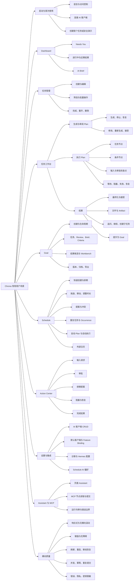

# Chrona 常用用户测试场景树

> 状态：已完成当前可执行场景收敛。本文包含 276 个唯一场景：`245 通过`、`31 部分通过`、`0 阻塞`。`部分通过`表示已有直接证据，但仍存在产品语义、外部基础设施或无界横向矩阵缺口，不表示现有断言失败。当前 5 个 P0 场景已闭合：`RESULT-007`、`CROSS-001`、`CROSS-003`、`CROSS-004`、`CROSS-010`。
>
> 基线：当前分支验证批次；场景证据已通过连续 checkpoint commits 固化。
>
> 执行证据：`outputs/common-user-test-scenarios/results.json`；稳定回归固化于现有 Bun/Vitest/Playwright 测试。`outputs/common-user-test-scenarios/report.md` 是历史快照，不用于当前计数。

## 已记录缺陷

| ID | 严重度 | 关联场景 | 状态 | 现象与证据 |
| --- | --- | --- | --- | --- |
| CUSTEST-BUG-001 | P1 | `RESULT-003`、`CROSS-006`、`CROSS-012`、`CROSS-016` | Fixed | 接受结果后 Header badge 与结果面板同页同步显示 `Result accepted`，旧 `Waiting` / `Execution complete, awaiting review` badge 消失；`e2e/specs/task-lifecycle-execution.spec.ts` 已在 desktop/tablet/mobile 通过。 |
>
> 范围：浏览器主流程、关键 API/运行时分支、桌面/平板/移动端、恢复与安全边界。

## 表示与执行工具

不新增依赖。现有工具已覆盖场景建模、自动执行和证据采集：

| 用途 | 工具 | 选择理由 |
| --- | --- | --- |
| 总览树 | Markdown + Mermaid | 可版本控制、可评审、GitHub/常见编辑器可直接渲染 |
| 可执行回归 | Playwright | 项目已安装并配置 desktop/tablet/mobile 三个项目 |
| 探索式测试 | `agent-browser` | 可按无障碍树操作页面，采集截图、视频、控制台和网络证据 |
| API/状态分支 | Bun Test + Hono `app.request()` | 无需真实服务或真实 provider，适合状态机和错误分支 |
| 组件/交互状态 | Vitest + Testing Library + MSW | 适合空、加载、错误、等待、阻塞、完成状态 |
| 代码领域图 | `understand-domain` | 可生成交互式领域流程图，但偏代码/领域关系，不替代测试场景目录 |

当前 `.understand-anything/knowledge-graph.json` 生成于 2026-07-11，落后于当前 2026-08-13 提交。若使用交互式领域图，需要先重新生成。当前测试场景以最新源码、路由、API 文档和测试目录为准。

## 优先级与标记

- `P0`：核心价值链或阻断性流程；每次完整验证必须执行。
- `P1`：高频分支、恢复流程、管理操作。
- `P2`：边界、并发、兼容性、安全和较低频操作。
- `UI`：浏览器用户流程。
- `API`：API/engine 状态流程。
- `AGENT`：MCP 或外部运行时流程。
- `CROSS`：应套用到多个场景的横向矩阵。

## 总览树

## 1. 启动、访问与首次使用

| ID | 优先级 | 场景链 | 主要分支/预期 |
| --- | --- | --- | --- |
| BOOT-001 | P0 UI | 打开 `/` → 自动跳转默认语言 → 进入首页 | 路由保留 query/hash；无重定向循环 |
| BOOT-002 | P1 UI | 打开 `/:lang` → 切换 `zh/en` | 页面、导航、日期和动作文案同步切换 |
| BOOT-003 | P1 UI | 打开非法语言路径 | 重定向默认语言，不进入空白页 |
| BOOT-004 | P0 UI/API | 无 `API_KEY` → 正常启动 | 本地默认绑定可访问 |
| BOOT-005 | P1 UI/API | 服务启用 `API_KEY` → 无 key/错误 key/正确 key | 显示访问提示；正确 key 后恢复页面 |
| BOOT-006 | P0 UI | 首次使用且无 AI 客户端 → 点击主动作 | 进入 `/settings?panel=ai-clients` |
| BOOT-007 | P0 UI | 已有 AI 客户端且无任务 → 创建首个任务 | 打开任务创建流程 |
| BOOT-008 | P1 UI | 无任务 → 创建安全演示 | 生成确定性演示任务，不调用真实付费 provider |
| BOOT-009 | P0 UI | 已有任务 → 首次引导打开任务 | 进入正确任务工作台 |
| BOOT-010 | P1 UI | 首次引导完成 → 刷新页面 | 引导不重复出现；workspace 偏好持久化 |
| BOOT-011 | P1 UI | 顶部导航依次进入 Dashboard/Schedule/Tasks/Action Center/Goals/Settings | 当前导航高亮正确；浏览器返回正常 |
| BOOT-012 | P1 UI | 打开不存在路径 | 显示 Not Found；可返回有效页面 |
| BOOT-013 | P2 API | 服务进程重启 → 重新打开页面 | SQLite 状态保留；活动流和投影可恢复 |

## 2. Dashboard

| ID | 优先级 | 场景链 | 主要分支/预期 |
| --- | --- | --- | --- |
| DASH-001 | P0 UI | 空 workspace → 打开 Dashboard | 所有区块显示明确空状态；计数为 0 |
| DASH-002 | P0 UI | 存在待输入/待审批/失败任务 → 打开 Needs You | 显示原因、下一步；跳转正确任务或 Action Center |
| DASH-003 | P1 UI | 存在 Running 任务 → 打开 In Progress | 状态、当前节点、更新时间正确 |
| DASH-004 | P1 UI | 存在近期完成任务 → 查看 Recent Completions | 最新优先；结果/Artifact 链接可打开 |
| DASH-005 | P1 UI | 存在今日排期 → 查看 Upcoming Today | 时间、任务链接、排期状态正确 |
| DASH-006 | P1 UI | 存在可见事件 → 查看 Recent Activity | 不展示原始 provider 私密 payload |
| DASH-007 | P1 UI/API | 已配置 AI client → 生成 AI Brief | 显示生成状态、成功内容、更新时间 |
| DASH-008 | P1 UI/API | 已有 AI Brief → 重新生成 | 旧内容在完成前可理解；完成后替换 |
| DASH-009 | P1 UI/API | 无可用 AI client → 生成 AI Brief | 明确说明配置缺失；不静默失败 |
| DASH-010 | P2 UI/API | AI Brief provider 失败/超时 | 错误可见；可重试；Dashboard 其余内容仍可用 |

## 3. 任务创建、列表与 CRUD

### 3.1 创建与编辑

| ID | 优先级 | 场景链 | 主要分支/预期 |
| --- | --- | --- | --- |
| TASK-001 | P0 UI | Schedule 快速创建 → 填写标题 → 保存 → 打开任务 | 任务出现于 Schedule/Tasks；工作台数据一致 |
| TASK-002 | P0 UI | 创建任务 → 设置描述、优先级、截止时间、执行 runtime | 保存后列表和工作台回显一致 |
| TASK-003 | P1 UI | 创建任务 → 开启 `autoPlanGeneration` | 创建后自动生成 Plan；状态有明确反馈 |
| TASK-004 | P1 UI | 创建任务 → 开启 `autoExecute` | 无 accepted Plan 时不得直接执行；说明阻塞原因 |
| TASK-005 | P1 UI | 创建任务 → 同时开启自动 Plan 和自动执行 | 达到确定性门槛后自动走到执行/完成 |
| TASK-006 | P0 UI/API | 标题为空/纯空白 → 保存 | 阻止提交；不创建 Task |
| TASK-007 | P1 UI/API | runtime 配置非法 → 保存 | 显示字段错误；原任务不被部分修改 |
| TASK-008 | P1 UI | 工作台展开编辑 → 修改 → 保存 | Header、Plan brief、列表投影同步刷新 |
| TASK-009 | P1 UI | 工作台编辑 → 取消/关闭 | 未保存内容不污染任务 |
| TASK-010 | P1 UI | AI 提议修改任务 → 查看 diff → 接受 | 仅确认字段被修改；Plan 状态按规则更新 |
| TASK-011 | P1 UI | AI 提议修改任务 → 拒绝/关闭 | 任务保持原值 |
| TASK-012 | P2 UI/API | 连续快速保存同一修改 | 最终状态确定；无重复事件或数据损坏 |

### 3.2 列表、检索与批量操作

| ID | 优先级 | 场景链 | 主要分支/预期 |
| --- | --- | --- | --- |
| TASK-020 | P0 UI | 打开 Tasks → 查看 All | 状态、下一动作、优先级、截止时间正确 |
| TASK-021 | P1 UI | 切换 Needs Attention/In Progress/Results/All | URL 参数与结果集合一致 |
| TASK-022 | P1 UI | 按状态筛选 | 计数与列表一致；空筛选有空状态 |
| TASK-023 | P1 UI | 按标题搜索 → 清除搜索 | 结果、URL、分页正确重置 |
| TASK-024 | P1 UI | 按优先级筛选 | 仅展示目标优先级 |
| TASK-025 | P1 UI | 按更新时间/截止时间/优先级排序并切换升降序 | 顺序稳定；刷新后参数保留 |
| TASK-026 | P1 UI | 切换每页数量 → 前后分页 | 范围、页码、按钮 disabled 状态正确 |
| TASK-027 | P1 UI | Results 按时间和接受状态筛选 | Needs Review 与 Accepted/Done 不混淆 |
| TASK-028 | P1 UI | 勾选单个/全选当前页 → 取消选择 | 选择状态和数量正确 |
| TASK-029 | P1 UI | 批量删除 → 取消 | 任务不变 |
| TASK-030 | P1 UI | 批量删除 → 确认 | 仅删除选择项；失败项有错误反馈 |
| TASK-031 | P2 UI | 外部日历任务出现在列表 | 来源、颜色、只读边界明确 |

### 3.3 生命周期动作

| ID | 优先级 | 场景链 | 主要分支/预期 |
| --- | --- | --- | --- |
| TASK-040 | P0 UI | 可运行任务 → Start | 进入对应 workspace/execution；重复点击不重复启动 |
| TASK-041 | P1 UI | 无 accepted Plan → Start | 动作 disabled 或返回清晰原因 |
| TASK-042 | P1 UI | 最新 Run 完成 → Complete/Mark Done | Task 进入 Done；完成时间来自最新 Run |
| TASK-043 | P1 UI | 无完成 Run → Complete | 动作 disabled；不得伪造完成状态 |
| TASK-044 | P1 UI | Done/Blocked 任务 → Reopen | 进入 Draft/Ready；清除旧完成时间和 block reason |
| TASK-045 | P0 UI | 单任务删除 → 取消 | 数据保留 |
| TASK-046 | P0 UI | 单任务删除 → 查看影响 → 确认 | Task、Plan、Run 关联清理符合删除影响说明 |
| TASK-047 | P2 UI/API | 删除不存在/已删除任务 | 返回明确错误；列表不崩溃 |

## 4. 任务工作台：Plan、执行与结果

### 4.1 打开与基础状态

| ID | 优先级 | 场景链 | 主要分支/预期 |
| --- | --- | --- | --- |
| WORK-001 | P0 UI | 创建任务 → 进入工作台 | Header、Plan、Command Center、Activity 可见 |
| WORK-002 | P1 UI | 无 provider → 打开工作台 | 页面可用；生成/执行缺失原因明确 |
| WORK-003 | P1 UI | 直接打开深链 `/tasks/:taskId` | SSR/loader 数据完整；无闪烁错误状态 |
| WORK-004 | P1 UI | 打开不存在 taskId | 显示 404/可恢复错误 |
| WORK-005 | P1 UI | 查看 Activity → 分页/加载更多 → 节点过滤 | 顺序稳定；不泄露工具原始 payload |
| WORK-006 | P1 UI | 点击 Plan 节点 → 打开/折叠/重开详情抽屉 | 节点、活动、动作对应正确；刷新不串节点 |
| WORK-007 | P1 UI | 切换 compact/full graph | 当前节点、完成节点、等待节点视觉语义一致 |
| WORK-008 | P2 UI | Goal-owned Task 从 Goal inspector 打开 | 保留 Goal 上下文与返回路径 |

### 4.2 Plan 生成

| ID | 优先级 | 场景链 | 主要分支/预期 |
| --- | --- | --- | --- |
| PLAN-001 | P0 UI | 创建任务 → Generate Plan → 查看流式进度 → 生成成功 | `status/tool_call/partial/result/done` 顺序可理解；Draft 持久化 |
| PLAN-002 | P0 UI | 生成完成 → 查看 Plan 摘要和图 | 节点、边、类型、依赖正确展示 |
| PLAN-003 | P1 UI | 生成中 → Stop | 收到 cancelled/done；可重新生成 |
| PLAN-004 | P1 UI | 生成中 → 刷新页面 | 恢复 active generation；不启动第二次生成 |
| PLAN-005 | P1 UI | 生成中 → 离开工作台 → 返回 | 进度/最终结果恢复 |
| PLAN-006 | P1 UI/API | 双击 Generate/并发请求 | 仅一个 active generation；冲突有明确反馈 |
| PLAN-007 | P1 UI | provider 返回错误/超时/畸形结果 | 显示真实可操作原因；任务保持可恢复 |
| PLAN-008 | P1 UI | SSE 中断 → 重连 | 从持久化状态恢复；不丢最终结果 |
| PLAN-009 | P1 UI | 已有未保存任务编辑 → Regenerate | 提示先保存或放弃修改 |
| PLAN-010 | P1 UI | 已有 Plan → Regenerate → 确认 | 新 Draft 取代旧 Draft；已接受 Plan 规则明确 |
| PLAN-011 | P2 API | 停止不存在 active generation | 返回 `stopped:false`；UI 不报致命错误 |
| PLAN-012 | P2 API | Plan 输出含非法图/未知节点/循环 | 拒绝持久化为可执行 Plan；显示校验错误 |

### 4.3 Plan 审阅、修改与接受

| ID | 优先级 | 场景链 | 主要分支/预期 |
| --- | --- | --- | --- |
| PLAN-020 | P0 UI | 生成 Plan → 逐节点查看 → Accept Plan | 状态立即变为 accepted；Start 可用，无需刷新 |
| PLAN-021 | P1 UI/API | Accept 同一 Plan 两次 | 幂等成功；不重复物料化 |
| PLAN-022 | P1 UI/API | 接受旧 Draft，但已有更新 Draft | 拒绝旧 Plan；提示审阅最新版本 |
| PLAN-023 | P1 UI | 修改 Plan 指令/节点 → 保存 patch → 重新查看 | 图和摘要同步更新 |
| PLAN-024 | P1 UI | 修改 Plan → patch 校验失败 | 保留原 Plan；错误定位到变更 |
| PLAN-025 | P1 UI | 已接受 Plan → 生成新 Plan → 接受 | 新 Plan supersede 旧 Plan；历史仍可追踪 |
| PLAN-026 | P2 UI/API | 空 accept body/不存在 planId | 400/404；当前 Plan 状态不变 |
| PLAN-027 | P1 UI | 重复任务选择 occurrence → 生成并接受 Plan | Plan 只属于当前 occurrence，不影响兄弟 occurrence |

### 4.4 执行主链与节点分支

| ID | 优先级 | 场景链 | 主要分支/预期 |
| --- | --- | --- | --- |
| RUN-001 | P0 UI | 创建任务 → 生成 Plan → Accept → Start → 完成 → 查看结果 | 完整黄金链；状态、当前节点、Activity、Result 一致 |
| RUN-002 | P0 UI/API | 单 task 节点执行 | provider 启动一次；输出持久化；节点 Done |
| RUN-003 | P1 API/UI | 依赖 task 节点链执行 | 严格按依赖顺序；后续节点收到前序结果 |
| RUN-004 | P1 API/UI | 多个独立入口节点 | 每个执行一次；无重复 provider run |
| RUN-005 | P1 API/UI | condition 节点选择分支 | 仅选中分支执行；未选分支标记 skipped |
| RUN-006 | P0 UI | input checkpoint → 输入有效值 → Continue | `WaitingForInput` 与审批文案不同；继续正确节点 |
| RUN-007 | P1 UI | input checkpoint → 缺必填字段/非法值 | Continue disabled；显示 disabled reason |
| RUN-008 | P0 UI | approval checkpoint → Approve | `WaitingForApproval` → 继续执行 |
| RUN-009 | P1 UI | approval checkpoint → Reject | 按 Plan 规则结束/阻塞；理由可见 |
| RUN-010 | P1 UI | approval checkpoint → Request changes | 带反馈恢复；Activity 记录用户决策 |
| RUN-011 | P1 API/UI | wait 节点 → 条件未满足/满足 | 未满足保持 Waiting；满足后继续一次 |
| RUN-012 | P1 UI | 执行中 → Pause → Resume | 状态和主动作即时更新；不重跑已完成节点 |
| RUN-013 | P1 UI | 执行中 → Stop/Cancel → 确认 | Session Abandoned/Task Cancelled；可恢复策略明确 |
| RUN-014 | P0 UI | provider 启动失败/节点失败 | Task Failed；真实错误摘要、节点和 Retry 显著 |
| RUN-015 | P0 UI | Failed → Retry | 创建受控重试；已完成节点不重复 |
| RUN-016 | P1 UI | Blocked → 查看原因 → Resume after unblock | 原因保留于历史；从阻塞节点继续 |
| RUN-017 | P1 UI/API | provider 请求审批 → Approve/Reject/Request changes | 决策限定当前 occurrence 和 approval contract |
| RUN-018 | P2 API | provider 审批超时/并发决策 | 最多一次 provider RPC；终态不被覆盖 |
| RUN-019 | P2 UI/API | 执行动作重复提交/浏览器重试 | requestId 幂等；不重复 Run/节点完成 |
| RUN-020 | P1 UI | 执行中刷新/跨页面导航后返回 | 当前节点、状态、Activity、主动作恢复 |
| RUN-021 | P1 API | provider 返回空输出/多 delta/畸形事件 | 空输出不伪造成功；多 delta 合并；畸形事件转失败 |
| RUN-022 | P2 API | 服务在执行中重启 | recovery worker 恢复或给出确定失败状态；无幽灵 Running |

### 4.5 结果、Artifact 与后续工作

| ID | 优先级 | 场景链 | 主要分支/预期 |
| --- | --- | --- | --- |
| RESULT-001 | P0 UI | 所有节点完成 → Result Finalizing → Ready | 最终 Spec 与 Manifest revision 一致 |
| RESULT-002 | P1 UI | Result finalization 失败 → Retry finalization | 不重跑 Plan；成功后进入 Ready |
| RESULT-003 | P0 UI | 查看 Result → Accept Result | 写入 canonical acceptance event；Task 完成状态不被错误改变 |
| RESULT-004 | P1 API/UI | Accept Result 重复点击 | 同一 completed Run 幂等 |
| RESULT-005 | P1 UI | Result 含 markdown/table/comparison/timeline/checklist | json-render 通过 catalog；关键内容可读 |
| RESULT-006 | P1 UI | Result 含 generated-files 文件 | 直接安全预览/下载；显示类型和大小 |
| RESULT-007 | P0 UI | Result 引用 generated-files 外本地路径 | 先显示 metadata → 一次性确认 → 有界预览 |
| RESULT-008 | P1 UI/API | 文件为目录、符号链接逃逸、设备文件、超限文件 | 拒绝读取；不泄露路径内容 |
| RESULT-009 | P1 UI | 结果页提问 → 获得回答 | 绑定 accepted Run；刷新后历史保留 |
| RESULT-010 | P1 UI | 从结果继续同一 provider session | 使用接受结果和可控历史；requestId 幂等 |
| RESULT-011 | P1 UI | 从结果创建 linked child task | 创建 Draft 子任务；handoff context 有界且可追踪 |
| RESULT-012 | P0 UI | 接受结果 → Promote/Create Goal | 选择 Artifact → 原子创建 Goal → Task 关联 Goal |
| RESULT-013 | P1 UI/API | Promote 重复提交/中途失败 | 幂等；失败时无半个 Goal 或残缺关联 |
| RESULT-014 | P1 UI | Tasks → Results → 打开结果 → 返回列表 | 筛选和分页上下文合理保留 |

## 5. Goal 与 Workbench

### 5.1 Goal 创建与生命周期

| ID | 优先级 | 场景链 | 主要分支/预期 |
| --- | --- | --- | --- |
| GOAL-001 | P0 UI | Goals 空列表 → 创建 Goal + 首个 Task | 原子创建；进入 Goal workspace |
| GOAL-002 | P1 UI/API | Goal 标题/成功标准非法 → 创建 | 阻止创建；不留下孤立 Goal/Task |
| GOAL-003 | P2 API | 创建请求并发重试 | idempotency key 合并为一个 Goal 和一个首任务 |
| GOAL-004 | P0 UI | 打开 Active Goal | Primary outcome、focus queue、work、criteria、history 可见 |
| GOAL-005 | P1 UI | Active Goal → Pause → Resume | 生命周期、主动作、任务执行边界正确 |
| GOAL-006 | P1 UI | Active Goal → Stop → 确认 | 进入 Stopped；保留已有结果和 provenance |
| GOAL-007 | P0 UI | Criteria 全满足且有证据 → Achieve → 确认 | 记录 actor/note/evidence；进入 Achieved |
| GOAL-008 | P1 UI/API | 无证据或 criteria 未满足 → Achieve | 阻止动作并说明缺失项 |
| GOAL-009 | P1 UI | 打开 Paused/Achieved/Stopped Goal | 各状态文案和可用动作不同；不把 Stopped 当 Achieved |
| GOAL-010 | P1 UI | Goal 列表按 Active/Paused/Finished 分组 | 卡片主动作、attention、生命周期正确 |

### 5.2 Goal 工作、Review、Brief 与 Criteria

| ID | 优先级 | 场景链 | 主要分支/预期 |
| --- | --- | --- | --- |
| GOAL-020 | P0 UI | Goal → Add Task → 创建普通 bounded task | Task 自动冻结 Goal brief 和 accepted-result catalog |
| GOAL-021 | P1 UI | Goal → Start Review → 创建 review task | review 与普通 task 类型和默认内容可区分 |
| GOAL-022 | P1 UI | Goal primary action 为 Continue/Resolve Attention → 点击 | 打开正确 Goal task inspector |
| GOAL-023 | P1 UI | 编辑 Operational Brief → 保存 | 创建 immutable revision；当前 brief 更新 |
| GOAL-024 | P1 UI | 修改成功标准/next review time | Goal metadata 更新；执行历史不变 |
| GOAL-025 | P1 UI/API | Goal review 生成 → 回答问题 → 继续 → 完成 | progress 可恢复；不暴露 provider payload |
| GOAL-026 | P1 UI | Goal review 失败 → Retry | 复用 proposal scope；终态可回放 |
| GOAL-027 | P1 UI | Review 产生变更建议 → 查看 diff → Apply | 仅显式确认后修改 Goal |
| GOAL-028 | P1 UI | Review 建议过期/Goal 已变化 | 标记 stale；要求重新生成/确认 |
| GOAL-029 | P1 UI | Goal task 使用旧 assets → Rebuild with latest assets → 取消 | 原任务保持 |
| GOAL-030 | P1 UI | Rebuild with latest assets → 确认 | 原任务树原子替换；导航新 taskId；旧执行历史删除警告明确 |

### 5.3 Accepted Result Inbox 与 Asset Workbench

| ID | 优先级 | 场景链 | 主要分支/预期 |
| --- | --- | --- | --- |
| ASSET-001 | P0 UI | Goal task 接受结果 → Goal Workbench Inbox | 自动出现候选；来源 Run/Artifact 可追踪 |
| ASSET-002 | P0 UI | 打开候选 → 接受/formalize | 创建 immutable GoalAssetVersion；候选移出 pending |
| ASSET-003 | P1 UI/API | 同一候选重复处理 | 不创建重复版本；返回明确状态 |
| ASSET-004 | P1 UI | 候选包含 json-render structured result | 保存结构化内容；拒绝 runtime-control/权限控件 |
| ASSET-005 | P1 UI | Library 搜索/排序/类型/状态筛选 | URL 与结果一致；空结果可恢复 |
| ASSET-006 | P1 UI | 打开 Markdown asset → rich text/source/diff | 编辑器内容一致；长内容独立滚动 |
| ASSET-007 | P1 UI | 打开 CSV/table asset → 查看/编辑 | quoted CSV、列、类型和导出正确 |
| ASSET-008 | P1 UI | 打开 spreadsheet asset → 编辑 → 保存 | workbook 与 canonical table 双向转换不丢数据 |
| ASSET-009 | P1 UI | 编辑 asset → 800ms autosave → 切换 asset | 草稿保存；不把旧 asset 草稿写到新 asset |
| ASSET-010 | P1 UI | 存在草稿 → Discard → 取消/确认 | 取消保留；确认恢复正式版本 |
| ASSET-011 | P2 UI | autosave 正在进行 → Discard | 等待保存完成后安全丢弃，无竞态 |
| ASSET-012 | P1 UI/API | Submit draft → 基于旧 version 冲突 | 显示 optimistic conflict；不覆盖新版本 |
| ASSET-013 | P1 UI | 查看版本历史 → Restore 旧版本 | 以新版本恢复；历史保持不可变 |
| ASSET-014 | P1 UI | Rename asset | 列表、详情、引用同步更新 |
| ASSET-015 | P1 UI | Archive asset → Archived → Restore | 默认库隐藏归档项；恢复后可用 |
| ASSET-016 | P1 UI | 从 asset 创建/用于新 Task | 新 Task 获得冻结引用；原 asset 不被执行修改 |
| ASSET-017 | P1 UI | AI modification proposal → 预览 → Apply/Reject | 仅确认后产生新版本；拒绝不修改 |
| ASSET-018 | P1 UI | 查看 freshness/provenance/source | stale 原因、来源 task/run/version 可理解 |
| ASSET-019 | P1 UI/API | Export Markdown/PDF/JSON/CSV | 文件可下载；内容和 MIME 正确 |
| ASSET-020 | P2 UI/API | 生成导出失败 → Retry | 原 asset 不变；job 状态可追踪 |

## 6. Schedule、重复任务与外部日历

### 6.1 日程主流程

| ID | 优先级 | 场景链 | 主要分支/预期 |
| --- | --- | --- | --- |
| SCHED-001 | P0 UI | 打开空 Schedule | 未排期队列、时间轴、快速创建入口清晰 |
| SCHED-002 | P1 UI | 切换日期/日历视图 → 浏览前后周期 → Today | URL、标题、时间轴同步 |
| SCHED-003 | P0 UI | 时间轴选择时段 → 创建任务块 | 起止时间、默认时长、任务和 WorkBlock 一致 |
| SCHED-004 | P0 UI | 未排期任务拖入时间轴 | 创建 Scheduled WorkBlock；队列移除 |
| SCHED-005 | P1 UI | 已排期任务拖到新时间 | 更新同一 WorkBlock；trigger 记录 manual |
| SCHED-006 | P1 UI | 拖动调整时长 | endAt 更新；最小时长和边界限制正确 |
| SCHED-007 | P1 UI | 键盘移动/调整 WorkBlock | 与鼠标行为一致；有 aria-live 反馈 |
| SCHED-008 | P1 UI | 打开 selected block → 编辑任务配置 | 列表、时间轴、workspace 投影同步 |
| SCHED-009 | P1 UI | Clear schedule/Unschedule → 取消/确认 | Scheduled block 删除；已完成历史 block 保留 |
| SCHED-010 | P1 UI/API | 尝试移动 Active/Completed block | 阻止修改；说明状态原因 |
| SCHED-011 | P1 UI | 创建/移动导致时间冲突 | 冲突卡显著；相关任务和时段正确 |
| SCHED-012 | P2 UI/API | optimistic 更新后 API 失败 | 回滚到服务端投影；显示错误 |

### 6.2 排期提案与 AI 辅助

| ID | 优先级 | 场景链 | 主要分支/预期 |
| --- | --- | --- | --- |
| SCHED-020 | P1 UI | 请求 timeslot suggestion → 选择建议 | 预览时段；用户确认后排期 |
| SCHED-021 | P1 UI/API | 无 suggestion provider | 明确配置缺失；手动排期仍可用 |
| SCHED-022 | P0 UI | 收到 schedule proposal → Accept | 创建/更新 WorkBlock；提案从 pending 消失 |
| SCHED-023 | P1 UI | schedule proposal → Reject + note | 不修改排期；提案记录 Rejected |
| SCHED-024 | P1 API/UI | 对已处理 proposal 再次决策 | 阻止第二次决策；现有排期不变 |
| SCHED-025 | P1 UI/API | 多个冲突 proposal → 接受一个 | 其他提案保持 pending，等待显式处理 |
| SCHED-026 | P1 UI | AI command bar 提交自然语言排期请求 | structured suggestion 可选择；错误有反馈 |
| SCHED-027 | P2 UI/API | suggestion/provider 超时或返回畸形结果 | 不污染当前排期；可重试 |

### 6.3 重复任务与 Occurrence

| ID | 优先级 | 场景链 | 主要分支/预期 |
| --- | --- | --- | --- |
| RECUR-001 | P0 UI/API | 创建 daily series → 展开多个 occurrence | 数量、日期、WorkBlock 唯一 |
| RECUR-002 | P1 UI/API | 创建 weekly `COUNT` series | 跳过过去 occurrence；不超过 COUNT |
| RECUR-003 | P1 UI/API | 创建 monthly `UNTIL` series | 不超过上界 |
| RECUR-004 | P1 UI/API | recurrence 缺 anchor/规则非法 | 阻止或安全去除规则；服务不崩溃 |
| RECUR-005 | P0 UI | 工作台切换 occurrence | 不刷新页面即可切换；Header/Plan/Run 同步 |
| RECUR-006 | P0 UI/API | occurrence A 生成/接受 Plan | occurrence B 不继承 A 的 Plan |
| RECUR-007 | P0 UI/API | occurrence A 失败/取消/完成 | occurrence B 状态不受污染 |
| RECUR-008 | P1 API | 修改 trigger version | 保留已开始 occurrence；取消旧版本未开始 occurrence；生成新版本 occurrence |
| RECUR-009 | P2 API | 服务重启后继续展开 series | 不重复生成已有 occurrence |

### 6.4 自动 Plan 与自动执行

| ID | 优先级 | 场景链 | 主要分支/预期 |
| --- | --- | --- | --- |
| AUTO-001 | P0 UI/API | `autoPlanGeneration=true` 到期 → scheduler tick | 自动生成 Plan；事件和 Schedule 原因可见 |
| AUTO-002 | P0 UI/API | `autoExecute=true` + accepted Plan + 到期 → tick | 自动启动一次并完成 |
| AUTO-003 | P0 UI/API | `autoExecute=true` + 无 accepted Plan → tick | 不启动；Schedule 解释需先接受 Plan |
| AUTO-004 | P1 API | 自动生成失败 | Task 进入可恢复状态；不得自动执行 |
| AUTO-005 | P1 API | scheduler lease 并发/续租/重启 | 同一工作只被一个 worker 执行 |
| AUTO-006 | P1 UI | 自动完成后打开 Dashboard/Tasks/Schedule | 三处投影一致；结果可查看 |

### 6.5 外部日历

| ID | 优先级 | 场景链 | 主要分支/预期 |
| --- | --- | --- | --- |
| CAL-001 | P0 UI | Schedule → Connect calendar → 输入有效 feed → Validate → Connect | 显示 redacted URL、预览数量、只读标签 |
| CAL-002 | P0 UI | 输入非法/不支持 URL → Validate | 不保存 source；显示可理解错误 |
| CAL-003 | P1 UI | URL 命中 blocked-network 边界 → Validate/Refresh | 二次确认；取消不请求；确认后受控执行 |
| CAL-004 | P1 UI | 连接空 calendar | 成功创建 source；Schedule 空状态正常 |
| CAL-005 | P0 UI | 导入 event → Schedule 展示 | 只读、来源颜色、时间正确；列表不创建重复 Task |
| CAL-006 | P1 UI | 修改 source 名称/颜色/sync policy/automation policy → Save | 已导入事件投影更新 |
| CAL-007 | P1 UI | Refresh source 成功 | 新事件出现；同步状态和时间更新 |
| CAL-008 | P1 UI/API | Refresh 部分失败 | 保留旧事件；显示 partial/failed 状态 |
| CAL-009 | P1 UI | Disable → Schedule | source 和事件隐藏/不可自动化；数据保留 |
| CAL-010 | P1 UI | Re-enable | source 和有效事件恢复 |
| CAL-011 | P1 UI | Remove → 首次点击提示 → 再次确认 | source 幂等删除；Schedule 清理对应事件 |
| CAL-012 | P1 API | recurring calendar event 导入 | occurrence 有界；不无限展开 |
| CAL-013 | P1 API/UI | 过去 event + auto-complete policy | 按 policy 完成；keep-active 不被误完成 |
| CAL-014 | P2 API | cancelled/disabled source event | 不出现在 requested range |

## 7. Action Center

| ID | 优先级 | 场景链 | 主要分支/预期 |
| --- | --- | --- | --- |
| ACTION-001 | P0 UI | 空 workspace → 打开 Action Center | 明确空状态 |
| ACTION-002 | P0 UI | WaitingForInput item → Open Task → 提交输入 | 返回后 item 消失；状态继续 |
| ACTION-003 | P0 UI | Approval item → Approve | 当前 occurrence 继续；item 消失 |
| ACTION-004 | P1 UI | Approval item → Reject | 决策记录；item 消失；Task 状态正确 |
| ACTION-005 | P1 UI | Approval item → Edit and Approve/Request changes | 反馈提交；工作台 Activity 可见 |
| ACTION-006 | P0 UI | Schedule proposal → Accept | 提案消失；Schedule 更新 |
| ACTION-007 | P1 UI | Schedule proposal → Reject/Open Schedule | 拒绝不改排期；Open Schedule 路径正确 |
| ACTION-008 | P0 UI | Failed recovery item → Recover run | 进入受控重试；item 状态更新 |
| ACTION-009 | P1 UI | Blocked item → Resume | 从阻塞恢复；item 消失 |
| ACTION-010 | P0 UI | Execution completed item → Review results | 打开正确 Task Result |
| ACTION-011 | P1 UI/API | item 动作请求失败 | item 保留；显示错误；可重试 |
| ACTION-012 | P2 UI/API | queue item 已过期但页面仍旧 | canonical state 阻止陈旧动作复活 |
| ACTION-013 | P2 UI | 多 item 中处理一个 | 仅移除目标 item；排序稳定 |

## 8. Settings、AI Client 与 Hermes

| ID | 优先级 | 场景链 | 主要分支/预期 |
| --- | --- | --- | --- |
| AISET-001 | P0 UI | Settings → Manage AI Clients | dialog 居中；移动端可滚动；关闭返回 Settings |
| AISET-002 | P0 UI | Create Hermes client → 保存 | 列表出现；secret 不在响应/UI 中回显 |
| AISET-003 | P1 UI | Create generic LLM client → 保存 | base URL/model/config 持久化 |
| AISET-004 | P2 UI | Debug provider flag 开/关 | 仅显式启用时可创建/显示 debug client |
| AISET-005 | P0 UI | 空名称创建 | 阻止保存；显示字段错误 |
| AISET-006 | P1 UI | Edit client → 修改名称/config/type → 保存 | 列表和 runtime registry 更新 |
| AISET-007 | P1 UI | Duplicate client → 修改名称 → 保存 | 新 ID；原 client 不变 |
| AISET-008 | P1 UI | Disable/Enable client | 被禁用 client 不参与 feature resolution |
| AISET-009 | P0 UI | Make default | 旧 default 自动取消；只有一个默认 client |
| AISET-010 | P1 UI | Delete client → 确认 | client 删除；binding/default 回退明确 |
| AISET-011 | P1 UI/API | 删除被使用/default client | 显示影响或执行安全回退；不得留下悬空 binding |
| AISET-012 | P0 UI | 分配 feature binding | 指定 feature 使用目标 client |
| AISET-013 | P1 UI/API | 将 feature 从 A 转移到 B | A 自动解绑；无重复 binding |
| AISET-014 | P1 UI | 清空 binding | 未显式绑定 feature 回退 default |
| AISET-015 | P0 UI | Test client | 成功/失败/超时状态可见；刷新后合理保留 |
| AISET-016 | P1 UI | View runtime configuration | model/context/config dir/tools/MCP/LSP/subagents 来源正确 |
| AISET-017 | P1 UI/API | API 返回 client 数据 | API key/token 始终脱敏 |
| AISET-018 | P1 UI/API | Hermes Diagnose local/remote | 检查项、自动配置能力、restart requirement 正确 |
| AISET-019 | P2 UI/API | Auto-configure local Hermes | 仅用户确认后写插件/config/env；返回 masked key |
| AISET-020 | P2 UI/API | Restart local Hermes | 明确异步启动；失败可诊断；不假设服务管理方式 |
| AISET-021 | P1 UI | 修改 Schedule AI preferences → 刷新 | 偏好持久化；Schedule 行为使用新设置 |

## 9. Assistant、MCP、Trigger 与外部 Agent

| ID | 优先级 | 场景链 | 主要分支/预期 |
| --- | --- | --- | --- |
| ASSIST-001 | P1 UI | Schedule/Task/Workbench 打开 Assistant surface | 支持时加载正确上下文；不支持时显示明确 unavailable |
| ASSIST-002 | P1 UI/API | Task assistant 发送有效消息 | 消息按 sequence 保存并回显 |
| ASSIST-003 | P1 UI/API | 空消息/非法 history | 阻止提交；不创建消息 |
| ASSIST-004 | P1 UI | Assistant 返回任务修改 proposal → 预览 → Apply | proposal 标记 applied；任务只按确认内容更新 |
| ASSIST-005 | P1 UI | Assistant drawer 不可用 | 主任务流程仍可操作；disabled reason 可见 |
| MCP-001 | P0 AGENT | 外部 agent 读取 execution/plan/current node | 只返回 AI-visible refs，不泄露私有 DB ID |
| MCP-002 | P0 AGENT | task node 一次提交 `chrona_node_complete`（summary、findings、deliverables、evidenceItems） | Public spec 先验证；一次 dispatch；节点只完成一次 |
| MCP-003 | P1 AGENT | condition node → `chrona_condition_select` | branchRef 合法性验证；只执行选中分支 |
| MCP-004 | P1 AGENT | node → `chrona_node_block`/`chrona_node_fail` | UI 显示原因和下一动作 |
| MCP-005 | P1 AGENT | wait node → `chrona_wait_complete` | 仅当前 wait node 可完成 |
| MCP-006 | P0 AGENT/API | 缺失/错误/撤销 run token | 401/拒绝；不改变执行状态 |
| MCP-007 | P1 AGENT/API | agent 重复提交终态动作 | 幂等或明确冲突；终态不被覆盖 |
| MCP-008 | P2 AGENT/API | MCP session 断开/重连 | active execution context 可恢复；不串 task |
| TRIG-001 | P1 API | schedule trigger 到期 | 生成唯一 delivery/occurrence；重复 delivery 幂等 |
| TRIG-002 | P2 API | accepted-result internal event 符合/不符合 filter | 仅符合时激活一次；输入有界 |
| TRIG-003 | P2 API | authenticated email delivery | 验证签名、去重、过滤、限制 payload；错误不创建 occurrence |
| TRIG-004 | P2 API | Goal review due event | 发布 internal event；对应 trigger 激活 review work |

## 10. 横向场景矩阵

以下矩阵不做全笛卡尔积。P0 场景覆盖全部 viewport；其余场景使用 pairwise 组合，避免测试数量失控。

| 维度 | 必测值 |
| --- | --- |
| Viewport | desktop `1440x900`、tablet `1024x768`、mobile `390x844` |
| Locale | `zh`、`en` |
| 数据量 | 空、单项、多项、长标题/长描述、分页边界 |
| Provider | 未配置、可用、启动失败、流中断、畸形结果 |
| 网络 | 正常、慢响应、API 4xx/5xx、SSE 断线重连 |
| 持久化 | 新会话、页面刷新、跨页面导航、服务进程重启 |
| 并发 | 双击、浏览器重试、两个标签页、并发 scheduler/approval |
| 任务状态 | Draft、Ready、Running、WaitingForInput、WaitingForApproval、Blocked、Failed、Cancelled、Completed、Done |
| Plan 状态 | idle、generating、waiting_acceptance、accepted、superseded、error、cancelled |
| Occurrence | 单次、重复任务 A、重复任务 B、已完成兄弟 occurrence |

### 横向检查清单

| ID | 优先级 | 检查 |
| --- | --- | --- |
| CROSS-001 | P0 CROSS | desktop/tablet/mobile 主动作、当前状态、当前节点始终可见 |
| CROSS-002 | P0 CROSS | mobile 无横向滚动；dialog/sheet 可完整操作 |
| CROSS-003 | P0 CROSS | 纯键盘完成创建任务、接受 Plan、开始执行、输入/审批、查看结果 |
| CROSS-004 | P0 CROSS | Dialog 关闭后焦点返回触发器；无 focus trap 泄漏 |
| CROSS-005 | P1 CROSS | axe 扫描关键页面无 serious/critical violations |
| CROSS-006 | P1 CROSS | loading/empty/error/blocked/waiting/completed 状态有用户可见文案 |
| CROSS-007 | P1 CROSS | 浏览器 refresh/back/forward/deep link 不丢 canonical 状态 |
| CROSS-008 | P1 CROSS | SSE 断线后从持久化状态恢复，不重复动作 |
| CROSS-009 | P1 CROSS | 所有 destructive 动作有确认，取消无副作用 |
| CROSS-010 | P0 CROSS | API key、run token、provider 请求体、原始工具 payload、私有路径不出现在 UI/日志/截图 |
| CROSS-011 | P1 CROSS | 错误包含可操作下一步，不只显示通用失败 |
| CROSS-012 | P1 CROSS | 状态文案区分 WaitingForInput、WaitingForApproval、Blocked、Failed、Cancelled、Completed、Done |
| CROSS-013 | P1 CROSS | 两个浏览器标签页并发动作后，以服务端 canonical 状态收敛 |
| CROSS-014 | P2 CROSS | 时间、时区、跨日、夏令时边界不产生负时长或错日 |
| CROSS-015 | P2 CROSS | 超长文本、Markdown、CSV、文件名不破坏布局或注入脚本 |
| CROSS-016 | P2 CROSS | 页面 console 无未处理异常；关键请求无意外 4xx/5xx |

## P0 首轮自动化执行顺序

原首轮不执行所有分支。当前已完成全量台账审计；以下仍保留作为稳定回归优先顺序：

1. `BOOT-006`：无 AI client → Settings。
2. `AISET-002`：创建测试 AI client。
3. `TASK-001`：创建任务并进入工作台。
4. `PLAN-001`：生成 Plan。
5. `PLAN-020`：审阅并接受 Plan。
6. `RUN-001`：执行到完成。
7. `RESULT-003`：查看并接受结果。
8. `RESULT-012`：从结果创建 Goal。
9. `GOAL-020`：从 Goal 创建后续任务。
10. `SCHED-003`：创建排期任务块。
11. `ACTION-003`：处理审批队列项。
12. `CAL-001`：连接 fixture-backed 外部日历。

每条主链随后套用：

1. desktop、tablet、mobile。
2. 正常、刷新恢复、API 失败。
3. 键盘、axe、console/network 检查。
4. 截图；发现交互缺陷时追加逐步截图和 WebM 复现视频。

## 当前已有 E2E 对照

现有 `e2e/specs/` 已覆盖部分场景：

- AI client 创建、编辑、删除、默认切换和空名称校验。
- 新增 `e2e/specs/common-user-route-audit.spec.ts`：根路径/非法 locale 重定向、query/hash 保留、Not Found 恢复、主路由、三 viewport、横向溢出、console/page/server error 检查。
- 新增 `e2e/specs/p0-scenario-gaps.spec.ts`：补充可直接断言的 P0 浏览器证据；未执行实际队列决策、排期放置、重复 occurrence 或自动 Plan 的分支不计为通过，继续保留为 `partial`。
- 全量台账：276 个场景，`outputs/common-user-test-scenarios/results.json`。
- 当前分支验证批次：`245 通过 / 31 部分 / 0 阻塞`。该计数已回写并逐项核对 `outputs/common-user-test-scenarios/results.json`；旧 `report.md` 仍是历史快照，不作为当前分支状态依据。
- 本轮 P0 证据：`RESULT-007` 使用结果文件授权 UI、bounded preview、路径安全 Bun tests；`CROSS-001` 使用三 viewport lifecycle 状态/当前节点断言；`CROSS-003` 使用 keyboard-only lifecycle E2E；`CROSS-004` 使用任务、结果、Goal、AI client、外部日历 dialog focus-trap 断言；`CROSS-010` 使用 API-only network、DOM、console、pageerror、截图 capture audit，并保留 logger/MCP redaction tests。
- 本轮 Result 证据：`RESULT-001` 在完整 lifecycle 中断言 Ready finalization、canonical Manifest 与 finalized Manifest 使用同一 source revision；`RESULT-002` 注入 finalization provider 失败，显示 Retry，切换可用 provider 后只重试 composition，并保持 completed execution 与 Manifest revision 不变；`RESULT-003` 验证 acceptance event 绑定 completed Run 且 Task 保持 Completed；`RESULT-004` 验证重复接受返回同一 receipt 且只写一个 canonical event；`RESULT-005` 覆盖 catalog validation 与 markdown/table/comparison/timeline/checklist 可读渲染；`RESULT-006` 覆盖 generated-file preview/download、可见格式和大小、registered Artifact 完整性；`RESULT-008` 使用 `result-file-access`、`open-task-result-file` 与 task workspace route Bun tests 覆盖目录、符号链接逃逸、设备文件、Unix socket、64 MiB 超限文件，以及 HTTP 下载和本地授权路由拒绝；FileRef UI test 验证拒绝错误可见且不渲染文件内容；`RESULT-014` 验证打开结果再返回时保留 Results 筛选和分页 query。
- 本轮工作台证据：`WORK-007` 验证 compact/full graph 切换时 done、current、waiting 节点共用同一视觉 tone。
- 本轮 Action Center 证据：`ACTION-001` 覆盖空投影与明确空状态；`ACTION-003` 将 persisted plan-run approval 投影到队列，并通过三 viewport lifecycle 直接 Approve、继续当前执行、移除 item；`ACTION-008` 投影 failed node ID，通过 command rail 发出 `retry_node`，移除 item 并恢复 canonical state；`ACTION-010` 从 completed item 打开正确 Task Result；`ACTION-011` 覆盖失败保留、安全错误和成功重试；`ACTION-013` 覆盖只移除目标 item 并保持其余队列顺序。
- 本轮 accessibility 证据：`CROSS-005` 对 Dashboard、Schedule、Tasks、Action Center、Goals、Settings 在 desktop/tablet/mobile 执行 axe；FullCalendar scroller 可聚焦并恢复原生 table semantics，三视口无 serious/critical violation。
- 本轮自动执行证据：`AUTO-006` 在自动完成后逐页验证 Dashboard、Tasks Results、Schedule 与 Task Result 投影一致可见。
- 本轮 Goal 证据：`GOAL-003` 使用 production router 的并发 `app.request` 与同一 idempotency key，验证只创建一个 Goal 和一个首任务。
- 本轮执行门证据：`RUN-006` 覆盖两类有效输入和后续节点推进；`RUN-007` 覆盖缺失必填值时禁用提交、blur 后显示字段级原因、有效值恢复提交；`RUN-008` 覆盖独立 approval copy、Action Center/keyboard 操作和不重跑已接受输出；`RUN-009`/`ACTION-004` 覆盖拒绝、反馈持久化、保持暂停及不重跑输出；`RUN-011` 覆盖 wait 条件未满足时保持等待、输入满足后只继续一次；`RUN-014` 覆盖 provider 连接失败、可读错误、Retry prominence 和恢复；`RUN-020` 覆盖 active checkpoint 跨页面导航和刷新后的当前节点、状态、Activity 与主动作恢复；`RUN-021` 覆盖空输出拒绝成功、多 delta 合并渲染和畸形 provider 事件失败；`CROSS-012` 覆盖 WaitingForInput、WaitingForApproval、Blocked、Failed、Cancelled、Completed 与 Done 的模型和渲染文案区分。

- 任务创建到 accepted result 的完整生命周期。
- Plan 接受后无需刷新即可 Start。
- Plan 跨导航持久化。
- 自动 Plan/自动执行正负路径。
- 重复任务 occurrence 切换与隔离。
- 外部日历新增、管理和 Schedule 展示。
- Schedule proposal 接受。
- 工作台响应式、布局、键盘、axe、抽屉可靠性和无 provider smoke。

缺口重点：Goal/Workbench 主链、Action Center 全决策分支、输入/审批/阻塞恢复、结果文件授权、SSE/重启恢复、移动端 Goal/Settings、MCP 外部 agent 主链。
