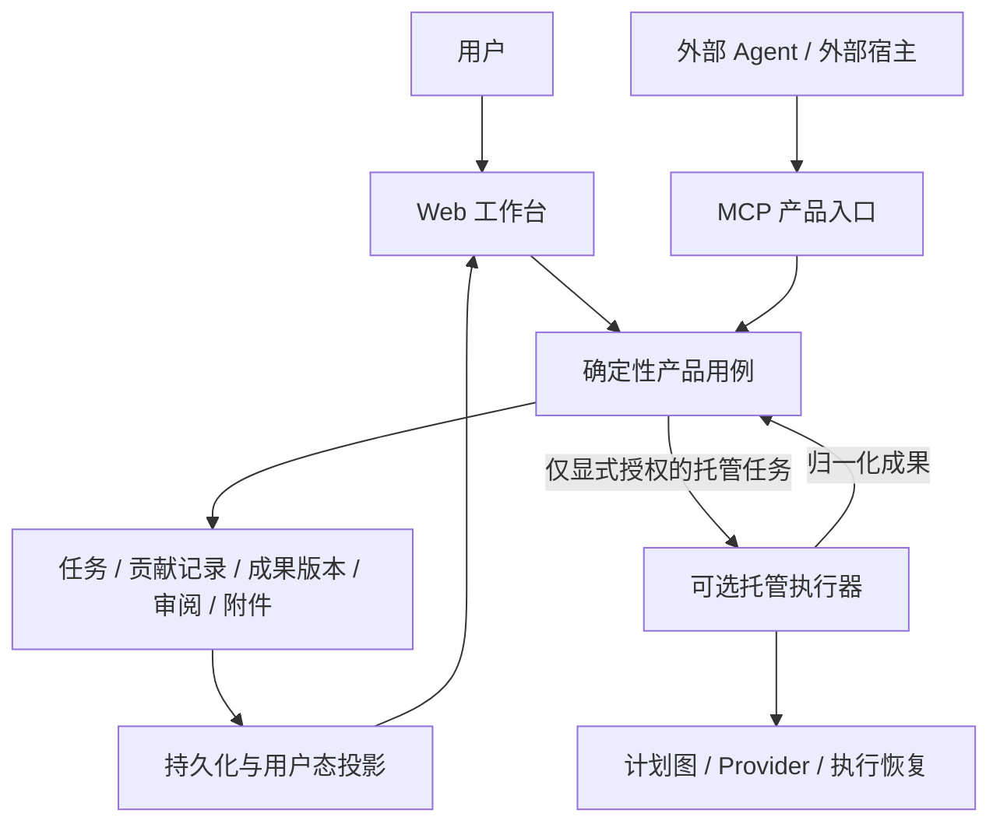

# Chrona 产品架构：独立于执行者的任务与成果工作台

状态：**目标架构基线；B1–B3 已实现，2026-09-17 用户授权实例已部署，并通过真实外部 Pi 成果提交／附件回读联调。人工验收与反馈修订实用验证待用户进行；托管成果收敛与 Goal 接续待阶段 C。非公开发布声明。**
方向更新：2026-09-17。本文确定产品职责与验收约束，不是数据库设计定稿、API 可用性声明，也不授权迁移、改动执行协议或部署。

> 工作可以在人、外部 Agent 或 Chrona 托管执行器中完成；Chrona 负责让任务、进展、证据与成果可以持续保存、审阅、修订和复用。

英文技术文档将此方向称为 **executor-independent work and results workspace**。

## 1. 文档权威与阅读顺序

| 问题 | 权威入口 |
| --- | --- |
| Chrona 要成为什么、不做什么，如何判断新功能是否符合方向？ | 本文 |
| 当前系统如何组织、代码放在哪里？ | [系统架构](../en/architecture.md)、[包边界](../en/package-boundaries.md) |
| 当前数据库、执行状态、HTTP/MCP 契约是什么？ | [数据模型](../en/data-model.md)、[执行流程](../en/backend-execution-flow.md)、[API](../en/api-reference.md)、[管理 MCP](./management-mcp.md)，以及对应源码和测试 |
| 哪些已交付，接下来先做什么？ | [路线图](./roadmap.md)；本方向实施顺序见本文第 11 节 |
| 某项具体功能怎样展开？ | 领域设计文档；不得覆盖本文的产品职责边界 |

本文替代旧路线图中“日程到内部执行是所有工作的主闭环”、旧[个人助理计划](../en/proactive-personal-assistant-plan.md)中“Chrona 必须拥有所有工作的执行”的方向性要求。

以下内容**不被本文自动废弃**：已交付的任务/Goal 生命周期、权限、执行恢复、MCP 身份隔离、Provider 协议、附件安全、迁移兼容性。当前实现与目标有差距时，记录差距并分阶段修改，不能用目标文档证明某能力已存在。

## 2. 产品定位与核心闭环

### Chrona 是什么

- 用户拥有的、local-first 的任务与成果工作台。
- 人与 Agent 之间共享的持久工作记录：目标、必要上下文、贡献、成果版本、待处理事项和审阅决定。
- 外部 Agent 可通过 MCP 使用的产品，不要求把自己的规划、会话或工具执行迁入 Chrona。
- 可选地提供托管执行和成果整理；它们服务于工作，而不是成为所有工作的入口条件。

### Chrona 不是什么

- 不要求用户更换日常聊天工具或 Agent 宿主。
- 不以接管所有 Agent 的规划、调度、暂停与恢复为核心目标。
- 不只是聊天记录、原始日志或附件堆积器；成果必须可定位、可审阅、可修订、可继续使用。
- 不因为接入 MCP 就承诺持续运行、定时唤醒、通知送达或远程进程控制。
- 不为了统一展示，伪造内部 Plan、Run、节点或 Provider session。

目标主闭环：

```text
捕获/关联任务 → 在合适的地方完成工作 → 记录必要进展 → 提交成果
             → 查看与审阅 → 修订/验收 → 复用或继续工作
```

进展上报可选；事后关联任务并提交成果也必须成立。Goal、日程、内部执行图不是每项工作的必填前置。

保留的可选路径：

```text
明确委派给 Chrona → 规划/审查/排期/托管执行 → 提交到同一成果与审阅体系
```

## 3. 三条一等使用路径

| 路径 | 例子 | Chrona 必须提供 | 不应要求 |
| --- | --- | --- | --- |
| 人工工作 | 用户自己完成调研，录入报告 | 任务、成果、附件、审阅和版本记录 | Provider、执行图、AI 整理 |
| 外部 Agent 工作 | Pi 在自己的会话和文件环境中完成研究 | MCP 上下文读取、必要进展、正式成果提交、读取反馈 | Chrona 启动 Pi、持有其会话、重演其工具调用 |
| Chrona 托管工作 | 用户委派一次分析或定时研究 | 现有受控规划、执行、审批、恢复，以及统一成果出口 | 把这条路径设为其他路径的前置 |

“内置 Agent”指 Chrona 发起和管理的执行能力，不要求模型进程与 Chrona 同机。执行位置、执行权与结果归属是不同概念。

执行来源应绑定到具体贡献/工作尝试，而不是把 Task 永久锁为某一种执行者。一个任务可以先由外部 Agent 研究，再由人修改，最后显式委派托管执行器补充验证。首期不因此建设通用多 Agent 编排系统。

## 4. 职责与权限边界

| 事项 | 权威归属 | Chrona 的职责 |
| --- | --- | --- |
| 用户想要什么、验收什么 | 用户及明确授权的产品操作 | 保存目标、标准、变更和审阅决定 |
| 外部 Agent 如何规划、使用工具、运行进程 | 外部宿主及其权限系统 | 接收获准上报的事实与主张，不冒充执行控制器 |
| Chrona 内部记录的身份、权限、版本与一致性 | Chrona 确定性应用逻辑 | 鉴权、校验、幂等、审计、隔离和投影 |
| 成果内容的事实真伪 | 证据与审阅过程 | 展示来源、证据和限制；结构校验不等于事实验证 |
| 正式成果验收、Goal 标准确认 | 用户；代理代办需独立明确授权 | 默认不得让提交者自行验收，提交权不隐含验收权 |
| 托管执行的启动、取消、审批和恢复 | 已授权的 Chrona 执行系统 | 保留既有安全与生命周期规则 |
| 外部执行的停止、重试与副作用授权 | 外部宿主 | 无已实现控制契约时不提供虚假的停止/重试按钮 |
| 到期、自动启动、通知送达 | 各自实际负责的服务 | 分别呈现配置和回执，不用日程代替送达证明 |

**放弃对外部执行的控制，不等于放弃内部记录的治理。**

Chrona 拒绝一份结果，不会撤销外部已经发送的邮件；暂停 Goal，也不能被显示成已停止外部进程。未来若增加远程控制，必须独立定义授权、投递、确认、超时和恢复协议，不是本方向的默认组成。

## 5. 目标逻辑架构



这是一种**逻辑职责拆分**，不是微服务拆分计划。沿用 Vite、Hono、Bun、SQLite 和现有包结构，不为了表达方向新增服务、消息总线或插件框架。

- 核心记录、基础成果展示和审阅路径，不得要求 Provider 可用或执行会话存在。
- 托管执行器依赖产品的成果用例；成果用例不能要求调用方先经过执行器。
- Web、MCP、内部执行适配层复用同一套结果校验、权限、审阅与投影规则。内部调用不必绕 HTTP。
- MCP 是产品入口，不是绕开领域规则的数据库接口，也不是仅供内部 Agent 回调的工具集合。

## 6. 概念模型：成果归属于工作，不归属于执行器

下表是**语义要求，不是要求逐项新建 Prisma model**。优先复用已有 Task、Goal、Artifact、GoalAsset 和审阅概念，具体存储方案另行设计。

| 概念 | 职责与关键约束 |
| --- | --- |
| Goal | 可选的长期目标、标准和正式资产集合；不是 Provider session 容器 |
| Task | 要完成的一项工作及其上下文；可以没有 Goal、计划、日程、Run |
| 工作报告/贡献 | 有归属的进展、发现、阻碍或成果提交；保存来源身份、接收时间与来源声明，不等于已验证事实 |
| 成果及其版本 | 独立可寻址的语义内容：摘要、发现、决定、限制、下一步、证据及附件引用；归属 Task，必要时关联现有任务实例 |
| Artifact | 可控的附件身份、完整性元数据和访问边界；外部路径不是服务器可读文件凭证 |
| 审阅决定 | 绑定确切成果版本的接受、拒绝或要求修改及原因；新版本不继承旧版本的验收 |
| 执行关联 | 可选的来源元数据；托管成果可追溯至真实 Run/节点，外部成果可以只有源工作标识，人工成果可没有执行记录 |

### 来源与版本规则

1. 身份来自认证上下文；用户提供的 Agent 名称或源会话 ID 只是标签，不能冒充其他提交者或内部 Run。
2. 记录来源声明时间与服务器接收时间。外部时间戳不能成为覆盖新记录的唯一排序依据。
3. 已发布成果版本保持不可变；纠正或补充创建新版本/贡献。不得覆盖已接受版本或用户修改。
4. 并发修改有 revision 冲突语义；多个 Agent 的提交不能凭“最后一次写入”静默合并。关联同任务不等于拥有所有贡献的修改权。
5. 结果与审阅引用必须校验工作区、任务、必要的实例和版本归属，防止旧尝试或兄弟实例的迟到消息污染当前成果。
6. 继续工作时读取获授权的目标、最新简报、明确版本的成果和审阅反馈；不默认传递完整聊天或原始运行上下文。
7. 复用现有 Goal Workbench 的候选收件箱和资产版本体系。提交、任务结果验收、形成正式 GoalAsset、Goal 达标分别记录，不能自动串成同一次成功。

### 与当前存储的差距

当前正式结果主要保存在 `TaskPlanRun.planRun.mutableGraph.planOutput` 中，Manifest 来自 NodeResult，附件有 Run 归属，验收事件也绑定 Run。

目标是提取**不依赖执行来源的成果身份和审阅用例**，并为现有托管路径保留真实来源关联；不是复制一套 external-results 系统，也不是创建假的 Run 来满足旧字段。

现有数据库外键、历史附件链接、已接受结果与 GoalAsset 来源关系不能直接删除或重写。具体映射、回填、兼容读取与回滚方案必须在实现前设计并验证。

## 7. 状态模型：分开呈现，不伪造确定性

以下是不同维度，不是要求合并为一个新 status 枚举：

| 维度 | 示例 | 不代表什么 |
| --- | --- | --- |
| 任务产品生命周期 | 开放、关闭、取消及其授权操作 | 外部进程确实已经停止 |
| 来源报告的工作状态 | 来源称进行中、受阻、完成 | Chrona 已验证执行或效果 |
| 可观测性 | 最近上报时间、信息陈旧、当前未知 | 超时就必然失败，或仍在运行 |
| 成果可用性 | 内容已持久化、附件待处理、可查看、呈现增强失败 | 用户已验收 |
| 审阅状态 | 待审、要求修改、接受某一版本 | Goal 已达成、所有后续工作结束 |

约束：

- 不允许外部 Agent 任意 PATCH `task.status`、内部执行状态或验收记录。
- `Completed`、`Done`、`Cancelled` 及 `WaitingForInput`/`WaitingForApproval` 的现有语义保持，直到经过专门设计的兼容变更；不能在 UI 临时折叠。
- 无上报只表示未知/陈旧，不自动创建执行失败、重试或心跳服务。
- 外部报告“完成”可以呈现为“来源报告已完成，待审阅”；由确定性规则生成产品投影，而非把来源字符串直接写入运行状态。
- 内部执行的实时状态继续由其真实运行事实派生；统一展示不意味着谎称三种来源拥有相同控制能力。

## 8. MCP 与成果接入原则

首期需要的产品能力如下，**名称是职责描述，不是已存在或已经定稿的工具/API**：

1. 查找/读取获授权的 Goal、任务、明确版本成果和反馈，返回有界上下文。
2. 创建或关联无需托管执行的工作记录；不因捕获而隐式规划、启动或调用模型。
3. 追加有归属的进展/阻碍；事后直接提交成果，不强制先 start、claim 或上报完整步骤。
4. 提交结构化成果和受控附件，获得持久化回执、成果身份与版本。
5. 读取提交回执和审阅状态；修订时提交新版本。验收走独立授权领域操作。

### 必须保持的协议性质

- Schema-first、有界载荷/分页、认证主体派生、显式能力和权限发现。
- 请求幂等：相同身份作用域内同一请求、相同参数重试返回同一回执；复用请求 ID 提交不同参数必须冲突。
- 版本并发控制与失败恢复；回执区分收到请求、持久化成功、附件就绪、展示增强完成、用户验收。
- 现有管理 MCP 凭据不自动获得新的成果写入、附件读取或验收权限；新权限的精确划分另行评审。
- 现有 `/api/mcp` 的执行 token 与 `/api/mcp/management` 的管理身份隔离不变。不能给外部 Agent 内部 run token 来伪装执行回报。
- 上报内容、附件和工具返回文本都是不可信数据；不得携带运行授权、秘密或产品权限控件。
- 外部 Agent 可以按需读取反馈；MCP 连接不证明有订阅、唤醒或通知能力。首期不承诺后台推送。

### 附件与失败边界

附件通过获授权的有界上传或已有受控 artifact 引用接入。不能凭 Agent 的本地绝对路径读取服务器文件，也不能自动抓取任意 URL；跨机器传输和引用失效必须有明确语义。

实现需定义文件大小/类型限制、完整性校验、任务归属、预览安全、配额及未完成上传的回收策略。附件未就绪时应保留可读文本与明确缺项，但缺少必需交付物不能被显示为完整可验收。重试不能产生重复结果、孤立文件或跨版本错配。

## 9. 界面与 AI 处理原则

任务工作台优先回答：**要完成什么？目前知道什么？有哪些成果？需要我做什么？**

- 默认组织目标/任务上下文、最新成果与历史版本、待审事项、必要进展与来源。
- 没有 Plan/Run 是正常工作形态，不是空状态错误，不弹出必须配置 Provider 的提示。
- 计划图、活跃节点、工具日志、Provider 状态按真实托管执行上下文显示，作为可展开的执行详情，不是所有任务的默认主体。
- 外部任务显示来源与最后上报时间，不伪造实时进度、暂停成功或执行停止。
- 核心操作是查看、比较、批注/反馈、修订、验收、下载和继续工作；“交给 Chrona 执行”是显式可选操作。
- 保存后的合法语义结果必须有确定性、无需模型的基础展示。AI 整理、json-render 排版、摘要和分析是增强能力，失败不应隐藏原始成果或阻断基本审阅。
- AI 处理只能生成有来源的新结果/派生版本，不得静默修改已验收内容或用户编辑。验收、权限、下载和生命周期控件继续由产品代码拥有。

这里规定的是目标 UX，不授权一次性重画全部界面；先在外部成果闭环中验证，再逐步调整默认信息层级。

### 已授权的普通用户入口与组织方式（2026-09-18，本地实现）

用户随后明确批准内容优先页面及有组织的目录：不是聊天全文，也不是仅有标题的日程。
页面呈现可使用的方案、证据、待决定事项，以及可持久保存的笔记／表单；高级执行、
版本审阅和配置按需打开，日程仍为一级入口。受限声明式组件不是任意 HTML 或脚本，
内容呈现权不包含执行、权限或验收控制权。见[页面契约](../en/work-pages.md)。

首页是**全部内容的有组织入口**，不以“我的页面”“最近的事”或少量常用项目代替目录。
分类方式是一组互斥标签，界面表现为文件夹：同一内容在每组至多放一个文件夹，
可以同时属于不同组；各目录打开同一 Task／成果，不复制内容。用户可定义分类规则，
获准 Agent 复用或创建文件夹并报告实际位置和新增项；不能偷偷覆盖手动选择，
不能因为更新成果就自动重新归类。删除文件夹只移除分类，不删除内容或其他组的归属。
实现、独立权限和迁移边界见[内容目录](../en/content-library.md)。

在此基础上，本地实现了**用户反馈 → 明确接续请求 → 作者更新说明**：请求绑定当时
页面、笔记和原版本表单回答；用户复制说明给自己的 Agent，Agent 读取完整快照和
最新内容后发布新版本，逐条报告采用／暂缓／待澄清。后来意见单独提示，普通新版
不自动视为反馈已处理；作者声称采用也不是人工验收。旧笔记、表单、版本和分类
继续保留。见[接续契约](./page-continuation.md)。

上述页面、内容目录和明确接续已于 2026-09-18 经用户另行授权部署到 Chino，日常
Pi 使用独立页面／分类凭据与技能接入；旧凭据不扩权。线上目录与真实连接验证通过，
未替用户建立分类或提交人工反馈／验收。此为单实例部署，不代表阶段 C 的旧成果／
Goal 复用已完成，也不新增后台分类服务、通知或外部 Agent 自动唤醒。

## 10. 代码组织与反模式

沿用[现有包边界](../en/package-boundaries.md)：

| 位置 | 本方向新增职责应放在哪里 |
| --- | --- |
| `packages/contracts` | 来源、语义成果、版本、审阅、附件与 MCP 的 schema/DTO |
| `packages/domain` | 无 IO 的版本/来源/审阅规则与用户态推导 |
| `packages/engine` | 记录、提交、审阅、幂等、附件关联与投影用例；托管执行是可选调用方 |
| `packages/db` + `prisma` | 经过批准的持久化映射、兼容性与迁移 |
| `features/*` | 任务/Goal/成果/审阅界面与产品组合，按现有 feature 所有权演进 |
| `apps/server` | HTTP/MCP 验证和传输适配，不持有独立业务状态机 |
| `packages/graph-runtime`、`packages/providers/*` | 托管执行的图机制与协议适配，不成为外部成果提交的前置 |
| `packages/skills`、`external-plugins/*` | 日常 Agent 的上下文读取和提交工作流，不能代替服务端鉴权 |

拒绝以下实现：

- 为每个外部成果自动生成“一节点计划”或虚假 Provider Run。
- 用手动任务备注长期替代正式成果、版本和审阅模型。
- 新建平行的外部 Goal、任务库或结果验收系统。
- 要求 Agent 交出全部聊天历史、内部思维过程或工具日志才能记账。
- 把 AI finalizer 成功设为基础成果读取的唯一入口。
- 外部 Agent 写入进展，就默认允许其停止任务、验收结果、确认 Goal 达标或执行任意文件读取。
- 为本切片先造通用远程 worker、租约、心跳、调度和消息平台。
- 仅改名/移动 engine 或 providers 目录，就声称完成解耦。

## 11. 实施顺序与退出门槛

这是开发顺序，不是已批准的编码、迁移或发布计划。

实施记录：[契约、兼容设计与 B1–B3 交付记录](./work-results-phase-a.md)。用户已批准的
范围内，发布基线修复、版本／审阅、正式 MCP／HTTP、独立附件和确定性成果页面已实现。
执行关闭／无 Provider 的隔离浏览器闭环与协议测试已通过；其他安装的新写入仍默认关闭。
用户随后授权部署与接入：实际实例迁移、新提交凭据、Pi 技能、真实文字／附件提交、幂等重试与回读已验证。
Web 已展示来源、下载与审阅入口，用户尚未验收；不把技术联调等同于人工反馈／修订全流程已验证。
接入与安全边界见[日常 Agent 接入](../en/work-results-integration.md)。
现有托管管线仍独立运行，后续按 C 收敛，不能宣称三种来源已完全统一。

用户随后批准的[事项／会议闭环切片](./work-records-meetings.md)已完成本地实现与回归：
安全手动登记、复用来源身份、独立进展／操作回执、改期／取消建议审阅、待处理入口及事项优先工作台。
复用既有 Task 和成果界面，不改变托管执行语义。用户另行授权后已部署至 Chino，
新增独立最小权限事项凭据与 Pi 技能，旧凭据未扩权；真实联调复用原验收任务并保留原成果。
其他安装仍默认关闭新写入；不代发邮件、不 RSVP、不写外部日历，不代替用户验收，
也不代表阶段 C 的 Goal／旧 Run 收敛已完成。

| 阶段 | 范围 | 退出门槛 |
| --- | --- | --- |
| A. 契约与兼容设计 | 对照当前源码，确定来源、成果身份、版本、附件、审阅和历史映射；明确权限与存储变更 | 可审阅的契约、迁移/回滚方案、失败用例；不依靠假 Run 或第二套结果模型 |
| B. 最小完整外部闭环 | 一个真实外部 Agent；任务关联、文本及受控附件提交、确定性展示、人工反馈/验收 | 禁用托管执行服务且无 Provider，仍可完成整个闭环；重复提交无重复成果 |
| C. 接续与历史 | 修订、版本绑定审阅、Goal Workbench 复用、跨会话上下文；接入现有托管成果适配 | 三种来源复用同一语义和审阅规则；旧结果/附件/验收仍可读 |
| D. 可选执行体验 | 在已验证需求上提供显式托管补充工作和 AI 呈现增强 | 核心闭环仍不依赖它们，失败不丢已有成果；现有自动执行保持兼容 |

B 必须包含成果可用与审阅，不以“新增几个 MCP 工具”或“成功写入一条备注”作为完成标志。不能等全量 UI 重构、多 Agent 调度或通知服务交付后才测试这条主闭环。

不更改既有托管任务的自动化设置，不重新启动旧任务，不因启用新入口自动转化手动任务或激活 Goal。数据模型、认证、Provider 和执行语义变更按 `AGENTS.md` 单独获得所需批准。

## 12. 验收矩阵与开发自检

实现本方向的 PR 必须覆盖适用场景：

| 场景 | 必须观察到的行为 |
| --- | --- |
| 无 Provider、无执行服务 | 能关联任务、提交、刷新后读取、查看附件并人工审阅；无隐藏模型调用 |
| 只有外部最终成果，无 start/进展记录 | 能接收；不创建假的 Plan/Run/节点 |
| 同请求网络超时后重试 | 同一回执/成果版本；不同 payload 复用 ID 冲突 |
| 两个客户端并发修订 | 冲突可解释，不覆盖用户修改或已接受版本 |
| 外部 Agent 失联 | 最后上报/未知可见，不虚构完成、失败或停止 |
| Agent 声称完成 | 与用户验收、任务关闭、Goal 达标分开 |
| 新版本和迟到旧消息 | 旧验收仍绑定旧版本，不污染兄弟实例/最新已接受成果 |
| 附件未完成、缺失或越权 | 显示缺项并限制验收；无任意路径读取、跨任务引用、危险预览 |
| AI 呈现增强失败 | 基础语义内容仍可见、可审阅；重试增强不重跑工作 |
| 历史托管任务 | 原有执行/取消/审批/恢复、附件和已接受结果不回归 |
| 跨会话继续工作 | 读取任务和指定版本成果/反馈即可继续，不依赖原 Provider 会话 |
| Agent 提交并尝试自行验收 | 无独立验收授权则拒绝；文本文案不充当授权 |

每个设计/PR 回答五个问题：

1. 它改善了捕获、记录、成果处理、审阅、接续，还是明确可选的托管执行？
2. 去掉 Provider 和内部执行图，核心记录/成果路径还成立吗？
3. 展示的是已验证事实、来源声明，还是未知？谁有权改变它？
4. 复用了哪套成果/权限/版本规则？有没有制造第二套系统或假执行记录？
5. 当前实现、待实现目标、部署验证是否分别说明，并有相应测试？

## 13. 已确定与待定

**已确定的产品方向：** 执行者独立；外部/人工成果一等支持；托管执行保留为可选；成果与审阅独立于运行记录；基础展示不依赖 AI；不放松安全、权限和历史兼容。

**已落实的首期决策：** TaskResult 及不可变版本／审阅；独立 results/artifacts scopes；有界、SHA-256 校验的 SQLite 私有附件；外部报告不自动映射为任务关闭或 Goal 达标。具体契约、限额及默认关闭的入口见[当前成果接口](../en/work-results.md)。

**仍待设计／验证：** 旧 Run 结果的统一兼容适配、Goal 显式复用流程、真实人工反馈／外部修订周期及其他环境的发布／恢复演练。旧二进制无法安全假定 Artifact.runId 非空，不能承诺任意直接降级。

**不纳入首期：** 外部 Agent 自动唤醒、远程取消/重试、通用多 Agent 调度、通知基础设施、全量 UI 改版和新的记忆平台。以后若有真实需求，独立设计与授权。
